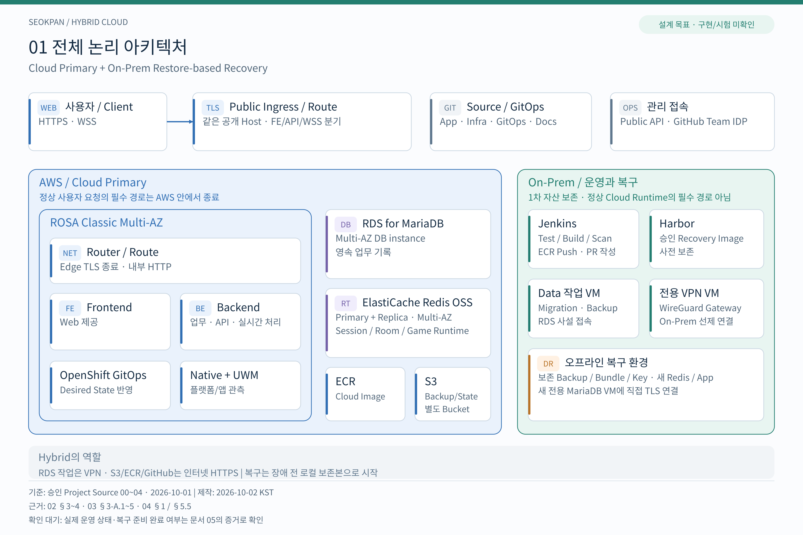
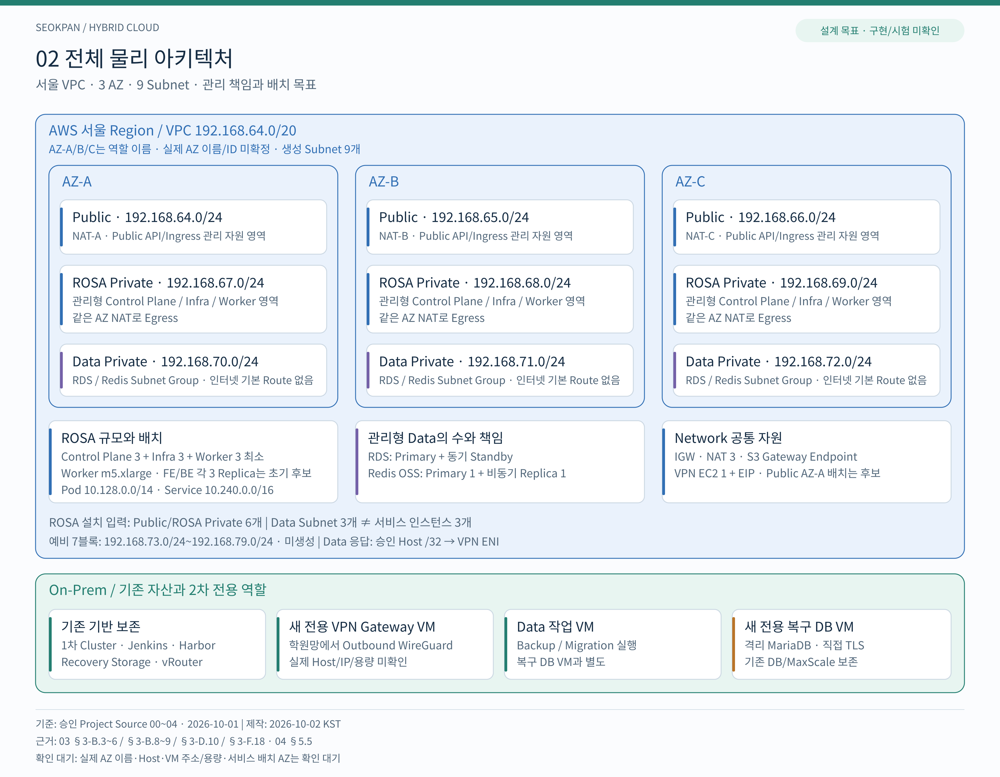

# seokpan-hybrid-docs
Seokpan 2차 - 하이브리드 클라우드 기획·아키텍처·검증 문서

1차 온프레미스 프로젝트를 기반으로 AWS 하이브리드 환경으로 이전하는 2차 프로젝트의 문서 저장소입니다. 승인된 목표는 **Cloud Primary + On-Prem Restore-based Recovery**입니다. 설계 승인과 실제 구축·시험 결과를 구분합니다.

현재 진행 현황:

- [x] 설계 원문 00~04 보존과 출처 확인
- [x] 설계 그림 12장 제작 및 자체 검증
- [x] SVG/PNG·목차·제작 검토 기록 연결
- [ ] 사용자 그림 검토 의견 반영
- [ ] 실제 구현 증거로 구축 결과판 작성

설계·그림 등록과 병합 이력은 [PR #3](https://github.com/seokpan/seokpan-hybrid-docs/pull/3), 실행·Evidence 공유 이력은 [PR #5](https://github.com/seokpan/seokpan-hybrid-docs/pull/5)에서 확인합니다.

## Planning & Design

[설계문서 목차](design/README.md)에서 프로젝트 소스 00~04의 원문과 문서별 역할을 확인합니다.

| 번호 | 문서 | 역할 |
| --- | --- | --- |
| 00 | [Project Starting Point](design/00_PROJECT_STARTING_POINT.md) | 1차 종료 상태와 2차의 역사적 출발점 |
| 01 | [Project Charter](design/01_PROJECT_CHARTER.md) | 목적·범위·기간·비용·성공 기준 |
| 02 | [Target Architecture](design/02_TARGET_ARCHITECTURE.md) | Cloud Primary와 On-Prem Recovery의 목표 구조 |
| 03 | [Detailed Design](design/03_DETAILED_DESIGN.md) | Network·Data·App·IAM·IaC·GitOps·시험·WBS 상세설계 |
| 04 | [Implementation Readiness](design/04_IMPLEMENTATION_READINESS.md) | 운영 결정·담당·실제 입력·실행 Gate·구현 인계 |

03과 04는 문서 단계가 종료됐습니다. 이전 문서의 당시 미확정 표기는 후속 승인·결정과 함께 읽습니다. 실제 지원·주소·용량·비용·Plan 및 Runtime 시험 완료는 별도 증거로 확인합니다.

## Architecture

[아키텍처 목차](architecture/README.md)에 전체 구조 2장과 상세 10장을 연결했습니다. 편집 가능한 SVG 12개와 폭 3600px PNG 12개는 같은 12장의 그림입니다. 모두 승인된 설계 목표이며 실제 구축·시험 결과와 구분합니다.

[논리 SVG 원본](architecture/diagrams/01-logical-architecture.svg) · [논리 PNG](architecture/exports/01-logical-architecture.png)

[물리 SVG 원본](architecture/diagrams/02-physical-architecture.svg) · [물리 PNG](architecture/exports/02-physical-architecture.png)

[제작 계획](architecture/DIAGRAM_PLAN.md), [계획 검토 이력](architecture/REVIEW_RECORD.md), [제작 검토 기록](architecture/PRODUCTION_REVIEW.md)에서 목적·근거·보완·검증 범위를 확인합니다. 관련 구현 증거가 확보되면 실제 전체 논리·물리 구축 결과판을 별도 판본으로 작성합니다.

## Implementation & Validation

[실행 안내](execution/README.md)에서 역할별 시작점과 공동 기록 방법을 확인합니다. [05 구현·검증 문서](execution/05_IMPLEMENTATION_AND_VALIDATION.md)는 실제 입력 확인·코드·통합·Migration·시험·Evidence·정리를 기록합니다.

[공동 진행표](execution/WORK_TRACKER.md)와 [인계 양식](execution/HANDOFF_TEMPLATE.md)으로 담당자의 입력·진행·수신 확인을 연결하고, 실제 시험은 [Evidence 안내](evidence/README.md)에 따라 Run별로 기록합니다. 설계문서 원문은 보존하며 문서 공유·코드 Merge와 실제 시험 PASS를 구분합니다.
