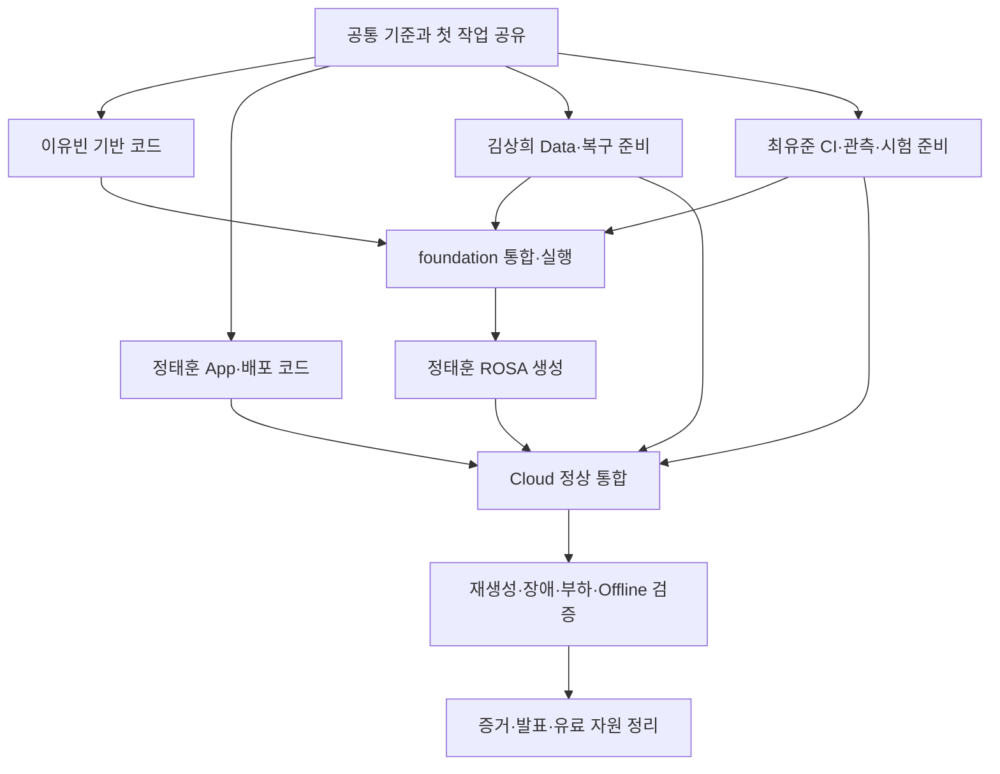

# 石나가는 판단 2차 프로젝트 05 구현·통합·검증 진행 기록

> **현재 단계:** 05 협업 진행본 — 저장소 공유와 현행 작업·입력 인계 연결
> **기준일:** 2026-10-02 KST. 이전 01:27 KST Source 관측은 보존하며 후속 Source/권한 관측과 팀 보고는 공통 진행표에 별도 연결
> **상태:** 사용자 04·개정 지침 등록 완료 확인. 네 저장소 main/Tree/Branch/PR/Issue 읽기 점검과 팀 전체 진행 안내 보강. 앞선 B 로컬 초안은 보존. 팀의 Infra 병합·OCP 보고와 AI의 Source 관측·로컬 검사·미실행 Runtime을 구분
> **기준:** 승인된 01/02/03, 닫힌 `04_IMPLEMENTATION_READINESS.md`, 최종 개정 `PROJECT_INSTRUCTIONS.md`, 사용자 최신 명시적 결정
> **기간/한도:** 2026-09-28~2026-10-26, 10/16 Technical Freeze, $450 계획선+$50 여유=$500 한도
> **공유와 종료:** 공유 반영은 [PR #5](https://github.com/seokpan/seokpan-hybrid-docs/pull/5)의 병합 Metadata로 확인한다. 변경은 Branch/PR에서 검토하고 개인별 읽기/쓰기 접근·실제 팀 도입은 별도 확인한다. 05 최종 종료는 구현·검증·정리 후다.

**팀원이 시작할 위치:** [실행 안내](README.md)에서 읽는 순서를 확인하고, [공통 진행표](WORK_TRACKER.md)에 자기 작업과 입력 인계를 연결한다. [인계 양식](HANDOFF_TEMPLATE.md)은 해당 작업 Issue의 제출/확인 기록으로 사용한다. 실제 실행 결과는 [Evidence 안내](../evidence/README.md)의 Run별 양식으로 남긴다.

2026-10-02 02:32 KST 조회 시 승인00~04의 [설계 등록 PR #3](https://github.com/seokpan/seokpan-hybrid-docs/pull/3)는 main 미병합이었다. 이번 공유 작업에서 그 고정 Commit의 원문5개와 첨부의 Git blob 바이트 동일성을 확인했다. 설계 파일을 이 PR에서 중복 등록하지 않는다. 프로젝트 지침은 사용자 등록본을 따르며 이 PR의 새 사본으로 대체하지 않는다.

현재는 설계 PR #3·실행 PR #5·발표 PR #7 모두 병합돼 main에 있다. 이전 조회는 이력으로 보존하고 현재 계정/Source와 다음 인계는 §0.18·§8·[진행표](WORK_TRACKER.md#next-handover)를 따른다.

**추가 자료와 최신 후속:** [2026-10-02 자료 수용·권한 계약·현재 작업](#supplement-20261002)에서 I03 부분 접수, GitOps #7 종료 범위, App #1·GitOps #5/#6 및 Infra #14/#15를 확인한다. 과거 관측은 유지하고 현재 상태는 진행표에 연결한다.

**복구 목표 피드백 후속:** [§9 복구 예행과 목표 재검토](#recovery-objective-review-20261002)는 현 구조에서 가능한 개선·사용자 영향·팀 부담을 확인하는 실행 준비다. 승인된 RTO 30분·영속 DB RPO 90분·운영 중 1시간 백업은 변경 결정 전까지 유지한다.

**2026-10-03 이번 요청의 우선 작업:** [03 §3-I.14 복구 설계 재검토](../design/03_DETAILED_DESIGN.md#recovery-design-review-20261003)를 중심으로 필요한 02/04 정합 보완과 사용자 영향·구조 대안을 먼저 대조한다. 05는 [§9의 기존 최소 예행](#recovery-objective-review-20261002)으로 부족한 시간·손실·접속·팀 부담/비용 근거를 확보한다. 전체 Cloud/ROSA 구현이나 05 최종 종료는 이 판단의 선행조건이 아니다.

**별도 프로젝트 구현 이력:** [§9.13 Cloud·ROSA 구현과 App 경쟁 결함 후속](#cloud-rosa-app-followup-20261002), [§9.12](#tjung03-latest-source-20261002)의 승인/병합 관측과 [§9.11](#tjung03-registration-rosa-input-20261002)의 TH-01~19·81개 식별자는 보존한다. 기존 유효 코드/검사는 취소하지 않으며 이번 복구 목표 판단의 증거나 우선 완료 조건으로 확대하지 않는다.

현재 진행 현황:

- [x] 03 상세설계와 04 운영 결정·구현 인계 완료
- [x] 두 최종 문서의 프로젝트 소스 등록 완료 사용자 확인
- [x] 01:27 KST 기준 네 저장소 main/전체 Tree·Branch·PR/Issue 읽기 점검
- [x] 팀 전체 05 범위·역할·작업 인계·OCP/ROSA 구분·증거/비용 종료 안내 연결
- [x] 네 사람의 첫 작업·기록 책임·수신자 확인·공유 실행 충돌 처리 보강
- [x] 3회 연쇄 검토·보완 후 재검증 수렴 — 최종 추가 보완 0건
- [x] 공통 문서/진행표 경로와 기존 작업·입력 보고 연결 — 현재 확인 범위는 진행표
- [x] 네 사람의 명시 GitHub 계정 매핑·네 저장소 권한 API 16건 확인 — 모두 admin
- [ ] 개인 본인환경의 실제 사용·현재 미반영 작업과 실행 입력 인계
- [x] 앞선 B App 연결·GitOps 로컬 초안과 수행 가능한 검사 — 해당 범위 24건 PASS
- [ ] 실제 이관 Seed·실습 Overlay·Image/Secret 입력 확정과 저장소 반영
- [ ] AWS 생성·Cloud 통합 — 실제 Plan·비용·담당 실행 조건 확인 후
- [ ] 장애·복구·부하 시험과 결과·시연·정리

**승인된 상세설계와 운영 결정·실행 인계 문서는 04 종료로 완료됐다.** 05는 네 사람의 구현·통합·검증과 발표 준비·자원 정리까지 연결하는 실행 기록이다. 실제 값·코드·시험 결과는 남아 있으며 별도 Gate로 판정한다. 현재 정의된 주 문서 흐름은 05까지다. 이후 번호를 추가하는 필수 계획은 확정되지 않았다.

**팀은 05의 최종 완료를 기다리지 않는다.** 검토한 작업 안내를 먼저 공유하고, 각 담당자는 자기 작업의 입력·범위·완료 증거를 확인해 독립 준비를 진행한다. 결과는 각자가 Issue/PR/Run에 직접 남기며 수신자가 인계를 확인한다. 05는 이를 연결해 진행 중 계속 갱신하고 마지막에 최종 결과를 닫는다. 정태훈이 모든 사람의 일을 일일이 배정·수집·대필하는 운영을 전제로 하지 않는다.

| 작업 순서 | 현재 상태 | 무엇을 하면 끝나는가 |
|---|---|---|
| 1 설계와 운영 책임 | 완료 | 승인된 03·04·지침 등록과 종료 확인 |
| 2 App·GitOps 코드 준비 | 첫 로컬 묶음 완료, 실제 이관·Build/Kustomize·실습은 남음 | 연결 설정·배포 선언 작성, 로컬 검사, 실제 이관/실습 인계 준비 |
| 3 AWS·ROSA 코드와 실행 입력 | 담당별 진행 상태 인계 필요 | foundation 인계·ROSA 코드·실제 도구/계정/Backend·검토된 Plan |
| 4 Cloud 생성과 통합 | 이 기록에서 실행 전 | 비용 확인 후 생성, Image/Secret·Data 연결·로그인/게임/WS·Backup 정상 시험 |
| 5 장애와 복구와 부하 | 최종 시험 전 | 검증 조합으로 장애·재생성·Offline 복구·부하의 실제 결과 확보 |
| 6 결과와 시연과 정리 | 실행 결과 확보 후 | Must 판정, Runbook·기여·시연·잔존 비용과 보존 책임 정리 |

앞선 첫 코드 작업은 **정태훈 담당 App 연결·GitOps base/Overlay**이며 §7에 보존한다. 현재 진입 정리는 네 사람의 진행을 통합하는 범위다. PR #12는 이번 Metadata 조회에서 병합을 확인했으며 과거 읽기 검토를 현재 미해결 작업으로 취급하지 않는다. 당시 이력은 §3.3에 남긴다.

## 0 팀 전체의 05 진입 안내

### 0.1 지금 완료된 것과 앞으로 완료할 것

기존 설계 승인·문서 종료는 당시 이력이다. 새 피드백이나 사용자 재검토 요청에 따른 설계 보완을 금지하지 않는다. 이번 DR 재검토는 03에 판단 근거를 두고 필요한 02/04를 지금 수정하며, 05에는 해당 판단을 지원하는 실제 준비/Run을 연결한다.

01은 목적·범위·성공 기준, 02는 목표 구조, 03은 상세설계·기술 계약·시험·비용 기준, 04는 사람별 운영 결정과 구현 인계다. 00은 역사적 출발점이다. 승인된 구조와 실행 책임은 닫혔고, 05는 그 기준을 실제 Source와 환경에 적용한 결과를 남긴다. 새 06 실시설계를 먼저 완성해야 구현을 시작하는 흐름은 현재 없다.

실제 AZ ID·Endpoint·Host 용량·계정 정책·지원 조합·현재 가격·측정 Resource/Pool처럼 환경에서 확인해야 하는 값은 구현 상세화에 해당한다. 코드/정적 검사, 실제 Plan/실행 준비, 배포 성공, 업무/장애/복구 Acceptance는 서로 다른 완료 상태다. 문서 종료로 다음 상태를 미리 통과시키지 않는다.

| 구분 | 현재 의미 | 완료 판단 |
|---|---|---|
| 설계 기준 문서 | 03·04 승인/등록·종료 | 결정·책임·의존·인계의 문서 검토 수렴 |
| 작업별 준비 | W02 입력과 W03/W04 구현·예행 연결 중 | 해당 작업의 실제 입력·Source·도구·인계 확보 |
| 핵심 구현·통합 | 목표 10/16 Technical Freeze | Cloud 정상 업무·Data·CI/Pull·관리·복구 자료가 연결되고 주요 Must 결함 정리 |
| 최종 검증 | 목표 10/19~21 | 검증 조합으로 재생성·장애·부하·Offline 복구와 정량 결과 확보 |
| 시연·발표 준비 | 10/22 Demo Freeze, 10/23 Presentation Ready 목표 | 실제 결과·제한·영상·보고/발표 근거가 연결 |
| 비용·프로젝트 종료 | 10/26 종료 목표, 보존/청구 확인은 책임 기록 | 불필요 유료 자원 정리·잔존/보존 책임·최종 Must 판정 |

날짜는 승인된 목표다. 네 사람의 실제 가용시간·진행·단가·가동시간을 확보하기 전 완료일을 확약하거나 전체 완료율을 산출하지 않는다.

### 0.2 최신 저장소 관측과 팀 보고

조회 시각은 2026-10-01T16:27:32.695Z, 같은 시각의 KST는 2026-10-02 01:27:32.695+09:00다. main recursive Tree는 네 곳 모두 truncated=false였고, 조회 가능한 Branch는 main 하나씩, 열린 PR은 없었다. 개인 작업 사본·미커밋 변경의 부재를 뜻하지 않는다. 이후 변화는 새 시점/Commit으로 기록한다.

| 저장소 | 조회 main 전체 SHA | 확인한 Source·진행 | 다음 연결 |
|---|---|---|---|
| [Infra](https://github.com/seokpan/seokpan-hybrid-infra) | `c9a3e797a436bef32a5e7d14b9d8fce58e28a574` | bootstrap HCL/Lock/Backend·세션 script 존재, PR #11/#12 병합. foundation/rosa/ansible은 README뿐 | 현 실행 결과·미반영 작업을 담당 인계로 연결하고 foundation/rosa 실제 구현 준비 |
| [App](https://github.com/seokpan/seokpan-hybrid-app) | `6902f3a184b4f1f07ade782536335a88d72612fc` | README·.gitignore. 실제 App 이관은 main에서 미확인 | 최신 검증 1차 Source·Seed/미반영 변경 확인 후 독립 2차 이관 |
| [GitOps](https://github.com/seokpan/seokpan-hybrid-gitops) | `523e9206dd6398adc6776855573890063b837a85` | README·.gitignore. #1 OCP lab 열림, #2~4 UWM/Argo/정책·웹훅 관련 lab 보고 닫힘 | 미커밋 lab Overlay 원본/조건을 확보하고 실제 hybrid base/Overlay를 검증 |
| [Docs](https://github.com/seokpan/seokpan-hybrid-docs) | `eb36bf10499d29b414a9e02c3f2569dde4d9ef1e` | README. 실행 Ledger/Evidence Index의 main 반영은 미확인 | 승인 기준의 위치·개정과 Source/Run/Evidence를 연결할 문서 인계 |

PR #12의 Metadata 병합 시각은 2026-10-01T11:02:14Z이다. 이번 점검은 해당 PR diff/권한의 재심사나 댓글·변경·Merge 작업을 포함하지 않는다. Merge 관측이 실제 Apply/Role 시험 성공을 증명하지 않는다.

팀 OCP Issue의 닫힘은 해당 lab 범위의 종료 보고다. #1의 9항목, #2의 UWM, #3의 공개 Argo 예제, #4의 Ingress 정책/웹훅 결과를 실제 hybrid base·ROSA·실제 메일 수신·전체 Egress 검증으로 확대하지 않는다. 상세 Source/조건과 Runtime 원본은 지정 담당자의 인계에서 확인한다. #1의 옛 짧은 SHA/임시 넓은 DB 권한·미커밋 Overlay와 #3의 lab GitOps 버전·예제 경로는 최종 검증 조합과 구분한다.

이번 main 하위 README에도 foundation/rosa Key가 `foundation/terraform.tfstate`·`rosa/terraform.tfstate`로 남고 상세설계 뒤 CIDR/Sizing/API를 결정한다는 옛 표현이 있다. 루트 README와 승인03/04는 `phase2/foundation/terraform.tfstate`·`phase2/rosa/terraform.tfstate`와 이미 승인된 구조를 따른다. 이는 담당 구현 PR에서 문서/HCL/Backend 예시를 정합화할 Source 항목이며, 실제 State 재이전이나 설계 재선택을 지시하는 것이 아니다. 이전 §3.2 S05-01의 관측이 이번 SHA에서도 남아 있다.

후속 Source 관측은 `2026-10-01T18:07:38Z` / `2026-10-02 03:07:38+09:00`다. Infra/App/GitOps main SHA는 위와 같았고 기존 Bootstrap 실행 보고·OCP lab 보고를 [진행표](WORK_TRACKER.md#current-observation)에 연결했다. Docs에서는 설계 PR #3·실행 PR #5·발표 PR #7이 병렬 진행 중이었다. 현재 역할별 작업·I01~I07 부분 보고·권한 조회와 남은 인계는 [진행표](WORK_TRACKER.md)와 [Issue #8](https://github.com/seokpan/seokpan-hybrid-docs/issues/8)을 정본으로 확인한다. 기존 표를 새 Runtime 판정으로 덮어쓰지 않는다.

### 0.3 네 사람의 작업과 인계

최신 사람 배정은 04 §2.2다. 과거 트랙 표의 미확정 이름 표현보다 우선한다.

| 담당 | 독립적으로 준비할 작업 | 통합 전에 넘길 결과 |
|---|---|---|
| 이유빈 | bootstrap/foundation 전체 통합·Network/Hybrid·Host/최소 Ansible·실제 실행 환경 | 검토된 전체 Root Plan·정본 Backend/Caller·기반 연결 결과·필요한 비밀값 아닌 Output 입력 개정 |
| 정태훈 | rosa Root·App·GitOps base/환경 Overlay·관리 인증·Release/Recovery App | 실제 Source/Seed·검증 Manifest/설정·업무/Pool 계약·ROSA Context/Host·배포 조합 |
| 김상희 | foundation Data 선언·DB TLS/GRANT·이관·Backup·격리 Recovery DB/새 Redis·Restore | Schema/권한/CA 참조·검증 Backup ID/Hash/Data 기준 시각·Restore 결과와 업무 재개 조건 |
| 최유준 | foundation Registry/CI 권한 선언·Jenkins/ECR/Harbor·실제 base의 OCP lab·Native/UWM·Harness·비용/Index | Build/Test/Scan·Image Digest/플랫폼·Push/PR/Pull 결과·관측/측정 준비·비용·증거 연결 |

김상희와 최유준이 foundation의 자기 영역을 작성해도 별도 State나 독립 Apply가 생기지 않는다. 이유빈이 Root 전체를 통합·실행한다. rosa 실행과 App 배포 변경 조율은 정태훈, Data Restore/Cutover는 김상희, 시험 일정·증거 Index 조율은 최유준이다. 영역별 결과와 실패 기록은 각 담당자가 작성하고 관련자가 리뷰한다.

같은 State 쓰기, 공유 Cluster/Root 변경, DB Restore/Cutover, Worker·DB·Redis 장애 주입과 부하는 지정 실행자와 인계 순서대로 수행한다. 코드·Render·로컬 Restore·시험 도구 준비는 병행한다. 사람마다 맡은 작업 수가 같아야 한다는 전제 대신 통합 부담과 실제 가용시간을 확인하며, 특히 이유빈의 foundation 통합과 정태훈의 ROSA/App 동시 부담을 일정에 반영한다.

### 0.4 실제로 진행하는 순서

| 순서 | 수행 내용 | 다음 단계로 넘기는 조건 |
|---|---|---|
| 현행 연결 W02 | main/PR/Issue와 미커밋·Controller/lab 작업·팀 보고의 출처를 연결 | 작업별 담당·전체 SHA·조건·남은 입력·현재 결과가 구분됨 |
| 구현과 예행 W03/W04 | 독립 Root/App/base/CI 코드, 입력 양식, Image Build/Test/Scan·Render·격리 Restore·Harness 준비 | 실제 도구의 해당 검사와 인계 결과 확보. 로컬 합성 검사로 대체하지 않음 |
| 생성 전 비용 W05 | 실제 Plan·지원/Quota·가격/Credit·누적/잔존·Window·재시험/정리 비용 확인 | 전체 계획 ≤$450, $50 여유 포함 총 $500 한도와 실제 실행 조건 충족 |
| 정상 통합 Window A W06/W07 | 기존 bootstrap 정본→foundation→rosa 인계, Data/Secret/Pull/GitOps/대표 E2E·Backup 정상 연결 | 정상 Baseline·복구 자료·통합 결함 조치·검증 Release 확보 |
| 최종 시험 Window B W08 | Clean Recreate→정상 Baseline→분리된 장애 Case→부하, 격리 Offline Recovery | 실제 수치·데이터/업무 확인·실패/재시험·제한과 Must 판정 |
| 결과와 정리 W09/W10 | 비교·Troubleshooting·영상·발표/보고·보존·유료 자원 정리·잔존 비용 | 증거 접근/무결성·검증 조합·실제 기여·최종 판정·정리와 보존 책임 연결 |

Window는 ROSA를 필요한 기간에 생성·사용·삭제하는 가동 구간이다. 최신03의 기본 계획은 정상 통합 A와 최종 검증 B다. 두 Window의 실제 시작/종료·가동시간은 팀 시간과 비용 입력을 받아 채운다. 02의 추가 Demo Window 예시를 필수 C로 늘리지 않는다. 살아 있는 서비스를 보여줘야 하는 요구가 있으면 영상/증거로 충족 가능한지 먼저 확인하고 추가 가동이 필요한 경우 남은 비용·일정에 반영한다.

새 관측마다 01~04 기준과 대조해 이미 정합한 구현, 승인 기준에 맞출 구현 보완, 아직 착수하지 않은 항목, 실제 결과를 기다리는 항목으로 구분한다. 단순 미확인 입력 때문에 모든 작업을 중단하지 않는다. 현재 제약이 승인 구조·범위·권한·성공 기준·기간/비용을 실질적으로 바꾸면 원인·기존/새 상태·직접/후속 영향·대안·결정을 기록하고 필요한 선택을 묶어 사용자에게 제시한다. 평상시 코드/실측 기록은 05에 누적하고 닫힌03/04를 매번 재개하지 않는다. 승인 기준 자체가 변경되면 관련 기준도 결정 후 함께 현행화한다.

### 0.5 OCP 사전 검증과 ROSA 최종 검증

| 영역 | OCP/로컬에서 먼저 확인 | 실제 ROSA/AWS 또는 최종 복구 조합에서 확인 |
|---|---|---|
| App | Image·임의 UID/SCC·Probe/종료·Route/HTTP/WSS·인증/재접속/중복 Case | 실제 3 Replica/AZ 배치·Ingress·RDS/Redis와 대표 업무·Resource/Pool |
| GitOps | 실제 base/Overlay Render·Sync/SelfHeal·Secret/삭제 보호·권한 | 실제 Classic 설치 조합·관리 인계·재생성 후 Context/Host/Secret과 Sync |
| Data | 테스트 DB/Redis의 Driver·CA/Hostname 검증·거부 Case·Migration 예행 | 실제 Endpoint/목적 권한·TLS·RDS/Redis Failover·업무/Data 일관성 |
| CI/Pull | Build/Test/Scan·PAT/Job·Harbor와 lab Pull | 실제 ECR 새 Worker/캐시 없는 Pull·12시간 이상 지속 사용 후 새 Pull·재생성 후 Pull |
| Network/관측 | lab 정책·UWM/Alert 경로·수집기·Harness | AWS Route/SG/WireGuard·정상 Cloud의 On-Prem 비의존·실제 장애/Metric/Alert 상관 |
| Recovery/재현/비용 | 격리 Restore·자료/Key/도구·Bundle 예행 | 실제 검증 Backup/Release로 외부 신규 조회 없는 Offline 복구·RTO/RPO·Terraform Clean Recreate·실제 비용 |

OCP에서 확인 가능한 해당 Case는 먼저 수행해 유료 시간의 문제 발견 비용을 줄인다. 그러나 환경/버전/Source/Digest/조건이 다르면 같은 결과로 판정하지 않는다. 로컬 독립 복구도 실제 최종 조합과 장애 조건으로 수행하면 T18의 본 검증이 될 수 있다. 단순 실습 Restore와 실제 Offline Acceptance를 구분한다.

### 0.6 승인 일정과 현재 미정인 시간

| 목표 창 | 작업 |
|---|---|
| 10/1~10/2 | 설계 기준 종료·Source/실행 입력 연결 |
| 10/5~10/8 | Foundation/핵심 PoC·Window A 후보 |
| 10/12~10/15 | Migration/통합·핵심 결함 해소·복구 자료 |
| 10/16 | Technical Freeze |
| 10/19~10/21 | Window B 후보·재생성/장애/부하/Offline 검증 |
| 10/22 | Demo Freeze |
| 10/23 | Presentation Ready |
| 10/26 | Final Buffer/발표·프로젝트 종료 목표 |

근거는 03 §3-H.4와 04 §9다. 주말·공휴일을 자동 가용시간에 넣지 않는다. 기술 동결 뒤에는 핵심 Must 결함 조치·필요 재시험에 집중하고 구조 확대는 기존 변경 기준을 따른다. 실제 일정이 위 목표를 못 맞추는 제약은 진행표에서 바로 드러내며 뒤로 숨기지 않는다.

### 0.7 발표와 보고에 사용할 측정과 증거

발표 자료를 만들 때부터 값을 찾기 시작하지 않는다. 요구→측정값→비교 기준→목표→실측→원본→해석의 연결을 시험 전에 만든다. Charter의 12개 성공축과 03의 T01~T23 통합 시험을 사용하며 IF/IM/Data 하위 Case를 이어 관리한다. 새로운 번호로 기존 요구를 누락하지 않는다.

| 항목 | 승인된 목표와 측정 경계 |
|---|---|
| 부하 | Smoke 10명/5분, Baseline 30명/15분, Target 60명/30분. 모두 Warm-up 이후이며 실제 Room 인원·행동/HTTP/WS 비율을 기록 |
| 정상 HTTP/WS | 대표 HTTP 업무 p95 ≤1초, Client가 업무 결과를 확인하는 WS p95 ≤1초 |
| 오류/정확성 | 예기치 않은 업무 첫 시도 오류율 <1%. 시험에서 중복 효과·무권한 성공·확정 데이터 불일치 0건, 시도 수/경쟁 조건 보존 |
| WS 재접속 | 정상 의존 서비스 가용 후 상태 수렴 ≤30초. 장애 시작 이후 시간도 별도 기록 |
| Offline RTO | 장애 발생/접속 불가 시작부터 판단·DB/새 Redis/App·Host 안내·대표 업무/Data 확인까지 ≤30분 |
| Offline RPO | 사고 시각−사용한 검증 Backup의 Data 기준 시각 ≤90분. 파일 수정/덤프 종료 시각으로 대체하지 않음 |
| Backup | 운영 중 1시간 기준, 7일 및 최종/마지막 검증본 보호. 실제 전송/무결성/복원·실패를 기록 |
| 비용 | 계획 ≤$450, $50 여유 포함 총 $500. 생성·삭제 대기·실패/재시험·비Window·잔존을 포함 |

수치는 운영 SLA/제품 보장이 아닌 승인된 프로젝트 시험 목표다. Worker 1대 장애를 AZ 전체 장애로, Restore 기반 Recovery를 자동 Failover/Warm DR로, 새 Redis를 진행 게임 상태의 완전 복구로 표현하지 않는다. 1차와 조건이 다르거나 Baseline이 없으면 개선률을 만들지 않는다.

각 Run은 실제 App/Infra/GitOps 전체 SHA·Image Digest/플랫폼·Schema/Config/Secret/도구/Backup 개정·환경·부하/장애 조건·실행자/Reviewer/협업·UTC와 KST 시각을 연결한다. 후보 Release는 실행 결과와 구분하고 후보 자기 Commit SHA를 넣지 않는다. 실제 Run에서 Commit 후 GitOps SHA를 연결한다.

`summary.md`는 결과/원인/해석, `metrics.csv`는 수치/단위/집계, `timeline.csv`는 장애/탐지/조치/재개, `release.json`은 조합, 공유 가능한 `checksums.txt`는 무결성 참조다. 대용량 Raw Log/영상·Credential/State/Plan·SQL/Backup 원본은 보호 경로에서 보관하고 문서에는 논리 참조·보관자·접근/보존 책임을 둔다. 실패 Run도 보존해 수정/재시험과 연결한다. 각자가 자기 증거를 작성하고 최유준이 Index를 연결한다.

판정은 NOT RUN/PASS/PARTIAL/FAIL/N/A다. PASS에는 해당 조건의 증거가 필요하고 N/A에는 이유/제외 범위가 필요하다. Must 실패/누락은 해결하거나 명시적 범위 결정을 받아 최종 판정에 반영한다. Rollback·Warm DR·추가 Scaling/관측 등 Should/Could는 Must와 비용·기간을 침해하지 않는 범위에서 수행한다. 기존 CI Build/Test/Scan의 결과 추적은 유지하며 새 취약점 Severity 0건 기준을 임의 Must로 추가하지 않는다.

**발표 후보 연결:** 공식 Test/Acceptance는 승인 [03 상세설계](../design/03_DETAILED_DESIGN.md)를 따른다. Actual과 원본 증거는 이05와 `evidence/<test-id>/<run-id>/`에 기록한다. 발표 후보 선별·1차 Baseline 비교 여부·기본기능/일반절차 과장 방지 기준은 별도 [Presentation Baseline](../presentation/PRESENTATION_BASELINE.md)을 참조하며 내용을 이05에 복제하지 않는다. 이 발표 문서는 Test 조건·성공기준·실제 결과를 발표에 유리하게 변경하거나 재해석하는 근거가 아니다. [PR #7](https://github.com/seokpan/seokpan-hybrid-docs/pull/7)은 `2026-10-01T18:49:30Z` / `2026-10-02T03:49:30+09:00`에 병합됐으므로 main의 기준 경로를 사용한다. 이전 고정 Head 검토는 §0.17 이력이다.

실제 Run 중 발표 가치가 있는 결과는 [Issue #6](https://github.com/seokpan/seokpan-hybrid-docs/issues/6)에 원본 Run 링크와 간략한 후보 판정·비교 분류·주장 범위/한계를 연결한다. 수치·로그·시간선을 중복 전사하지 않는다. 1차 재측정은 2차 Harness·측정 정의가 충분히 고정된 뒤 동일/대응 조건의 재현 가능성과 비교 가치를 판단해 필요한 항목만 검토하며, 지금05 작업의 선행조건으로 삼지 않는다.

### 0.8 유료 자원 정리와 05 종료

검증·영상·질의 근거를 확보하고 실제 재시험 필요가 없으면 발표일까지 모든 유료 서비스를 유지할 이유는 없다. 최종 삭제 시점은 자료 완결·복구 가능한 보존본·필요한 Live Demo와 비용을 함께 판단한다. Window 사이 ROSA 삭제와 모든 자원의 최종 종료는 범위가 다르다.

1. 남은 Must Case·목표 미달·재시험과 Live Demo 필요를 확인한다.
2. 최종 Release/Source·원본 증거/영상·비용/시간선·Runbook과 비교 기준을 export하고 보관본을 실제 열어 확인한다.
3. 마지막 검증 DB Backup·Harbor Image·Render/도구·필요한 복호화 Key를 독립적으로 보존하고 복원 가능성을 확인한다.
4. 자원별 Owner·삭제/보존 대상·의존 순서·실행 범위·Data/State 보호와 남길 비용을 기록한다. 기본 비용절감 Destroy는 rosa State이며 foundation/bootstrap 전체 Destroy는 기존 별도 명시적 승인 조건을 유지한다.
5. 승인 범위의 정리를 수행하고 삭제 완료·LB/EBS/EIP·DB/Redis·NAT·S3/ECR/Backup 등 잔존을 실제 목록과 비용 대장으로 확인한다. 삭제 요청 접수와 완료를 구분한다.
6. 불필요 Credential/Token·시험 Secret/CA/Key를 정리하고 보존 데이터 해독에 필요한 Key와 구분한다. 남길 자료/자원의 담당·보존 기간·비용·후속 청구 확인을 남긴다.

ROSA 삭제만으로 foundation 비용이 끝났다고 판정하지 않는다. RDS Stop은 Storage/Backup 비용을 없애지 않고 최대 7일 후 자동 재시작 조건이 있다. ElastiCache는 Stop을 전제로 계획하지 않고 유지 비용 또는 승인된 삭제·재생성 계획으로 처리한다. NAT 삭제는 EIP를 계정에서 자동 해제하지 않으며 Route는 blackhole로 남을 수 있다. 실제 구성에 맞춰 확인한다. 2026-10-02 KST 공식 자료 확인: [RDS Stop](https://docs.aws.amazon.com/AmazonRDS/latest/UserGuide/USER_StopInstance.html), [RDS Stop API](https://docs.aws.amazon.com/AmazonRDS/latest/APIReference/API_StopDBInstance.html), [NAT 관리/삭제](https://docs.aws.amazon.com/vpc/latest/userguide/nat-gateway-working-with.html). 이번에 단가/계정 비용/삭제를 실제 조회·실행한 것은 아니다.

05 전체 종료는 코드 작성 완료 하나로 판단하지 않는다. 핵심 Must의 실제 판정·미달/제한 처리, 재생성/복구 가능한 조합과 자료, 발표/보고/시연 준비, 네 사람의 실제 기여, 불필요 유료 자원 정리·잔존/보존·후속 청구 책임이 연결돼야 한다. 삭제 뒤 청구 반영이 늦으면 미확정 관측과 후속 확인 책임을 남기며 당일 0달러를 추정하지 않는다.

### 0.9 문서와 진행표 운영

05에는 **먼저 공유할 작업 안내**와 **작업하면서 채우는 결과 기록**이 함께 있다. 작업 안내의 검토 완료와 05 전체 결과의 최종 종료를 구분한다. 작업 안내를 팀이 함께 보는 위치에서 공유한 뒤 구현·배포·검증을 수행하고, 마지막에 결과·발표·비용/자원 정리를 닫는다. 05의 마지막 완료를 모든 작업의 시작 조건으로 삼지 않는다.

주 문서는 단일 05_IMPLEMENTATION_AND_VALIDATION.md이며 공통 기준·전체 의존·통합 Gate를 연결한다. §0.10의 네 역할별 보기는 각자가 먼저 읽을 작업·입력·인계 안내다. 상세 명령과 영역별 Runbook은 관련 App/Infra/GitOps Repo, 실제 실행 증거는 Docs에 둔다. 사람별 별도 05 최종본이나 새로운 설계 승인을 만들지 않는다. 발표 슬라이드/보고서는 목적별 산출물이며 제출 요구에 맞춘다.

**어느 사실을 판단하는지에 따라 정본을 구분한다.** 지침 §6의 사용자 최신 결정·승인 기준 우선순위와 Runtime Evidence 우선순위를 유지한다. 아래는 그 우선순위 안에서 일상 기록의 중복을 줄이는 협업 규칙이며, Issue의 체크 표시가 실제 Runtime 증거를 대신하지 않는다.

통상 실행 기록을 05에 둔다는 원칙과, 사용자가 요청한 DR 설계 재검토를 00–04에 반영하는 작업은 병행한다. 승인 기준의 실질 변경이 필요하면 기존 승인 이력·영향과 새 선택을 기록한다.

| 기록 위치 | 여기서 직접 갱신할 내용 | 다른 위치와의 연결 |
|---|---|---|
| 승인01~04·결정 기록 | 목표·구조·책임·시험·비용 기준과 실질 변경 결정 | 각 작업은 해당 기준 절을 참조 |
| 관련 Repo의 작업 Issue | 작업 범위·담당/Reviewer·입력·현재 상태·Blocker·인계 제출/확인 | 실제 코드 PR·Run·의존 작업 링크를 연결 |
| Branch/PR와 관련 Repo | 실제 코드·전체 Commit·검사·리뷰·Merge, 영역 Runbook | Merge와 실제 배포/Acceptance를 구분 |
| Docs의 Run·증거 Index | 실제 조합·환경·수행자·결과·수치·시간선·원본 참조 | 각 담당자가 자기 Run 작성, 최유준은 Index 연결 |
| 단일05와 통합 진행표 | 작업/인계 링크·공유 실행 Gate·통합 상태·집계 시각·다음 행동 | Issue/PR/Raw 원문을 반복 복사하지 않음 |

각 담당자는 자기 작업 Issue와 증거를 직접 갱신한다. 인계 수신자는 받은 개정·수락 범위·남은 제약을 기록하고 자기 후속 작업을 연결한다. 이유빈은 foundation, 정태훈은 ROSA/App, 김상희는 Data 전환/Restore, 최유준은 시험/증거 Index의 승인 책임을 유지한다. 최유준을 전체05 대필자나 전체 작업 승인자로 확대하지 않는다. 전체05 취합/Merge 전담자를 새로 임의 지정하지 않으며 관련 부분의 작성/리뷰·실제 Repo Merge 권한은 해당 변경에 기록한다.

05를 함께 편집할 때도 기존 Repo의 Branch/PR·권한 규칙을 따른다. 변경 절과 근거 Issue/Run을 명시하고 Merge 전에 최신 정본의 다른 사람 변경을 반영해 대조한다. 충돌은 근거의 대상·개정·확인 시각으로 조정하며 새 기록을 과거 사본으로 덮어쓰지 않는다. 오래된 Run도 역사적 결과로 보존한다. 독립 코드 작성·증거 기록과 직접 인계는05 문서 Merge를 기다리지 않으며 다음 공유 실행 전에는 관련 통합 Gate의 최신 상태를 확인한다.

작업 시작/차단/리뷰 요청/인계/실행 종료와 Source·입력 변경 때 상태를 갱신한다. 짧은 공동 점검에서는 다음 공유 실행·직접 Blocker·인계·시간/비용을 확인하고 결정은 Issue/진행표에 남긴다. 정태훈에게 구두 보고한 뒤 대필될 때까지 기다리는 방식으로 운영하지 않는다.

**협업 사용본을 실제 공유할 때 확인할 것:** 공통 문서 위치와 개정, 네 사람의 읽기 접근, 각자의 기록/Repo 쓰기 경로, §0.10 첫 작업과 기존 Issue 연결, 공유 실행 대상/담당, 보호 원본 접근 책임을 확인한다. 설계 파일을 프로젝트 소스로 등록하거나 이 파일을 제공한 사실만으로 GitHub 등록·팀 배포·접근 성공을 주장하지 않는다. 이 저장소 공유용 진행본은 execution/ 안내·공통 진행표·인계 양식과 연결한다. main 병합·개인별 접근·실제 팀 도입은 별도 상태다.

쓰기 권한이 없는 사람도 자기 결과와 원본 참조를 지정 기록 경로로 제공할 수 있다. 기록을 반영하는 사람은 실제 작성/수행자와 구분한다. 개인별 권한 입력은 I01/I04 등 해당 Gate에서 확인하며 이 때문에 관계없는 독립 준비를 멈추지 않는다. Credential·State/Plan·SQL/Backup·개인정보와 상세 보호 접속정보는 공개 작업표에 넣지 않는다.

### 0.10 네 사람이 먼저 시작할 작업

다음은 04 §2·§9·§10.1~2와 03 W02~W04를 **첫 작업 단위로 구체화한 협업 안내**다. 실제 착수·완료·실행 READY를 선언하는 표가 아니다. 담당자가 이미 진행한 작업은 그 결과/개정을 연결하고 반복하지 않는다. 기존 Issue가 범위를 담고 있으면 이어 쓰며, 별도 산출물과 완료 조건이 필요할 때만 작업을 나눈다. 여러 Repo를 건드리는 일은 대표 작업 하나에서 관련 Issue/PR를 연결한다.

#### 이유빈

**이유빈의 첫 작업은 기반 입력과 foundation 통합 준비다.** 먼저 04 §2.2~3·I02와 03의 Network/Root/제한 Output 기준, 기존 bootstrap의 실제 인계 결과를 읽는다. 이미 처리한 bootstrap을 재구축하거나 State 이전을 반복하지 않는다.

- 독립 준비: Network/공통 IAM 선언과 C의 Data·D의 Registry/CI 선언을 같은 foundation Root로 통합한다. Output 항목·자료형·Account/Region/출처 개정 검사와 실행/실패 인계 절차를 준비한다. A/C/D가 같은 공통 파일을 바꿔야 하면 수정 범위를 먼저 나누고 Branch/PR에서 통합한다.
- 실제 실행 전 입력: Controller·정확 도구/Lock·Caller/MFA/Role·정본 Backend·실제 Network/지원·Quota, 검토된 전체 Plan과 비용/실행 조건을 확인한다.
- 검토/완료 증거: 정태훈이 ROSA 소비 입력, 김상희가 Data, 최유준이 Registry/CI 영역을 검토한다. 코드/정적 검사와 전체 Root 검토를 연결하고 실제 실행 뒤 생성/접근 결과·제한 Output 개정·잔존 상태를 남긴다.
- 인계 수신자: 정태훈에게 ROSA 기반 입력, 김상희에게 Data 연결, 최유준에게 Registry/비용 자원 목록을 직접 넘긴다. 코드 준비와 실제 자원 생성의 완료를 따로 표시한다.

#### 정태훈

**정태훈의 첫 작업은 App 계약과 base/Overlay, ROSA 입력 소비를 준비하는 것이다.** 먼저 04 §3·I01/I02/I06과 03의 App 계약·Kustomize/Secret·Replica 기준을 읽고 최신 검증 Seed·미반영 변경·원 lab Overlay를 연결한다.

- 독립 준비: Path/Port·환경변수·TLS·Probe/종료·SCC·Session/WS·다중 Pod 계약을 대조하고 App 변경·공통 base·Cloud/Recovery Overlay·시험 Case를 준비한다. 아직 없는 Cloud Endpoint는 필수 입력으로 남긴다. ROSA 코드/입력 Schema 확인은 확보된 범위에서 준비한다.
- 실제 실행 전 입력: 이관은 실제 Seed/이력·미반영 변경·대상 Repo 권한, Build/lab은 전체 Source·Image·Context/Namespace·Secret 공급과 실행 범위, ROSA Plan은 최신 foundation 제한 Output·지원/인증·Backend가 필요하다.
- 검토/완료 증거: 최유준이 Image/Pull/CI·lab, 김상희가 DB/TLS/Migration, 이유빈이 기반 연결을 검토한다. 전체 Commit·실제 Build/Render 결과·설정 차이·Secret 참조·업무 Case·Pool/자원 확인 수준을 남긴다.
- 인계 수신자: 최유준에게 Build/lab 대상 Source와 base, 김상희에게 DB/Recovery 계약, 이유빈에게 ROSA가 필요한 기반 입력을 직접 연결한다. §7의 24건 로컬 PASS는 그 범위의 부분 결과로 보존한다.

#### 김상희

**김상희의 첫 작업은 목적별 Data 계약과 복구 자료·격리 Restore 준비다.** 먼저 04 I03/I05와 03의 Data/TLS/Backup/새 전용 Recovery DB·새 Redis 기준을 읽는다.

- 독립 준비: Runtime/Migration/Backup 권한·CA 공급·이관/Backup/복원 절차, Dump 규모/공간 산정, 완성본 Hash·Data 기준 시각·독립 사본과 부분 파일 실패 처리를 준비한다. foundation Data 코드는 이유빈에게 통합한다.
- 실제 실행 전 입력: Host CPU/RAM/디스크와 격리 Data Directory·보존 공간, 실제 Schema/비민감 GRANT·DB/Client/CA·Backup/복호화 수단·목적 대상과 실행자가 필요하다. Cloud 이관은 실제 RDS/권한과 전환 조건을 확인한다.
- 검토/완료 증거: 정태훈이 App 연결/업무 재개, 이유빈이 Host/기반을 협업 검토한다. TLS/권한 결과·Backup ID/Hash/Data 기준 시각·보호 참조와 격리 import 후 Schema/Row/관계/대표 업무 비교를 남긴다.
- 인계 수신자: 정태훈에게 App/Recovery Data 입력, 최유준에게 Release/관측/RPO·Index 근거, 이유빈에게 foundation Data 변경을 직접 넘긴다. Restore Exit Code만으로 업무/Offline PASS를 기록하지 않는다.

#### 최유준

**최유준의 첫 작업은 CI 후보와 실제 base의 lab·관측·증거 준비다.** 먼저 04 I04/I07·Release/Run 양식과 03 CI/Pull/Native/UWM/시험 기준, 기존 실습 원본을 읽는다.

- 독립 준비: 기존 Jenkins Job/Agent/Binding 영향, ECR Push/Harbor 보존·Build/Test/Scan·Digest Mapping·사람 Merge 흐름, base용 lab Case·관측/부하 Harness·Index·비용 입력표를 준비한다. 실제 Source가 오기 전에도 조건/검사 형식과 원 실습 자료 정리는 가능하다.
- 실제 실행 전 입력: Build는 정태훈의 실제 App Commit·기존 도구/Job/Registry/Secret, base 실습은 실제 Manifest Commit·Context/Namespace와 공급/실행 조건, PAT는 Org 정책/권한·Repo 보호, Cost 판정은 실제 가격/Credit/누적/Plan·Window가 필요하다.
- 검토/완료 증거: 정태훈이 App/Pull/Release를 검토하고 Registry/CI foundation 변경은 이유빈이 Root 전체에 통합한다. Test/Scan과 연결된 Source·Image/플랫폼·ECR/Harbor Digest·Push/PR/Pull 결과, lab Case·수집/측정 원본과 Index를 남긴다.
- 인계 수신자: 정태훈에게 배포 Image/측정·lab 결과, 김상희에게 Recovery Image/Bundle 연결, 이유빈에게 Registry/CI 선언, 전원에게 시험·비용·증거 Index를 직접 연결한다. 예제 Argo/실습 UWM 결과를 실제 base/Cloud PASS로 바꾸지 않는다.

**병렬 준비의 예:** A가 기반 코드를 통합하는 동안 B는 App/base, C는 Backup/격리 Restore, D는 CI/Harness·실습 원본을 준비한다. A의 실제 Endpoint가 없으면 B의 실제 연결·ROSA Plan만 해당 입력 대기로 남는다. C/D의 모든 후속 업무가 끝나야 A/B를 시작하는 조건도 아니다. 아래 흐름의 화살표는 필요한 산출물의 인계이며 각 사람의 전체 업무 종료를 뜻하지 않는다.

foundation/ROSA 실제 생성에는 각 Root 실행·Cost Gate가 필요하다. B와 D의 실제 base OCP 검증, C의 격리 Restore 예행은 Cloud 생성 전 병행한다. Offline 본 검증은 승인된 격리 복구 환경에서 수행한다.

### 0.11 작업 카드와 진행표를 직접 갱신하는 법

각 작업 Issue에는 다음 양식을 사용한다. 값이 없으면 미확인과 확인 담당/시점을 남기며 가짜 ID·시간·완료값을 넣지 않는다. 새 양식 자동화나 GitHub 보드가 구현됐다는 의미는 아니다.

| 항목 | 담당자가 적을 내용 |
|---|---|
| 작업과 범위 | 대표 Issue/관련 PR·Run, 승인 근거 절, 이번 산출물과 실제 실행 포함 여부 |
| 사람과 대상 | 작성 담당·공유 실행 책임자·실제 수행자·Reviewer·결과 수신자, Repo/Root/Context/Namespace의 비민감 참조 |
| 시작 입력 | 필요한 전체 SHA·입력/도구/설정 개정·보호 참조와 제공자, 현재 확인 수준 |
| 지금 가능한 일 | 바로 진행할 독립 준비와 입력을 기다리는 실제 실행을 나눔 |
| 현재 상태 | 작업 진행·코드 반영·인계·실행·최종 판정을 별도 기록 |
| 완료 증거 | 검사/리뷰·실제 실행/업무 결과·원본 참조·실패/제한·측정 시간/비용 |
| Blocker와 다음 행동 | 직접 막는 입력/영향, 해결 담당·다음 확인 시점·계속할 독립 작업 |
| 결과 인계 | 보낸 개정·수신자·필요 시점·수락 범위/보완 요청·다음 의존 작업 |

상태는 한 줄의 완료로 합치지 않는다.

| 상태 축 | 기록 방식 |
|---|---|
| 작업 진행 | 미착수·준비/작업 중·검토 요청·보완 중·해당 산출물 완료. 차단 사유는 Blocker 필드 |
| 코드 반영 | 미반영·PR 검토 중·Merge된 전체 SHA. 문서/입력 작업 등 대상외는 이유 |
| 인계 | 미제출·제출/확인 대기·범위를 명시한 수락·보완 요청·보류 |
| 실행 상태 | 미실행·실행 중·실행 종료, 대상/시각과 현재 잔존 상태 |
| 시험 결과 | 승인된 NOT RUN/PASS/PARTIAL/FAIL/N/A. N/A는 이유, 미실행 차단은 NOT RUN과 Blocker로 표시 |

코드만 작성하는 Issue는 그 완료 조건을 충족하면 닫을 수 있으나 남은 Runtime 시험·인계 Gate는 05/T Matrix와 후속 작업에서 유지한다. Runtime/통합까지 포함한 Issue는 Merge만으로 닫지 않는다. 실패 Run과 부분 자원은 삭제하거나 성공으로 덮어쓰지 않는다. AI Source 조회·팀 보고·독립 Runtime 관측은 근거 유형/시점을 함께 기록한다.

### 0.12 인계 수신자의 확인과 변경 영향

인계는 제공자가 보냈다고 끝나지 않는다. 제공자는 대상·개정·확인 범위·증거/보호 참조·남은 실패/제약·수신자·필요 시점을 남기고, 수신자는 후속 실행 전에 확인한다. 실제 필요 날짜/확인 시각은 팀 가용시간으로 정하며 아직 없는 시각을 임의 확정하지 않는다.

| 수신 판단 | 처리 |
|---|---|
| 수락 | 필요한 대상/개정·접근·범위가 맞음을 기록하고 그 개정으로 후속 작업을 진행. 수락은 후속 시험 PASS와 구분 |
| 범위 일부 수락 | 사용할 부분과 사용할 수 없는 부분·막히는 작업을 명시. 전체 실행 READY로 승격하지 않음 |
| 보완 요청/보류 | 누락·오래된 값·대상/환경 차이·원본 접근 실패·민감값 노출·미정리 상태·Owner 충돌 등의 이유, 해결 담당·재제출 조건을 기록 |

받는 사람은 해당 분야 통합 담당이다. A↔B의 기반/ROSA, B↔C의 App/Data, B↔D의 Source/Image/base/lab, C↔D의 Backup/Image/증거가 직접 이어진다. 모든 인계를 정태훈을 통해 중계하는 조건은 없다. 정태훈의 리뷰가 필요한 경계는 개정 묶음으로 검토하고 모든 독립 명령의 사전 허가로 확대하지 않는다. 지정 Reviewer가 부재하면 해당 리뷰/공유 실행을 기다리고 관계없는 준비를 계속한다.

Endpoint·CA·Schema·Digest·Secret·Pool·도구 버전 등을 바꾸는 사람은 변경 이유·새 개정·받는 사람·직접/후속 영향·시험·시간/비용을 기록한다. 수신자는 자기 소비 입력·Manifest/CI/Backup/Bundle·기존 Plan/Release의 영향 여부를 확인한다. 과거 Run은 원래 조합의 결과로 보존하고 새 조합은 영향받는 시험을 재검증한다. 새 Plan/가격 확인이 필요한 변경은 공유 실행 전에 반영한다.

승인 구조·범위·권한·성공 기준·기간/예산을 실질적으로 바꾸는 제약만 기존 변경 결정 절차로 연결한다. 단순 입력 확인·코드 보완마다 전체 설계 재승인이나 모든 트랙 중단을 요구하지 않는다. Freeze 이후에도 핵심 Must 결함·필요 재시험은 추적하며 범위 확대는 기존 기준을 따른다.

### 0.13 공유 자원의 실행과 인계

코드 작성의 병렬성과 공유 자원 실행을 구분한다. 하나의 공유 작업 기록에 작업 링크·Root/State 또는 Context/Namespace·실행 책임자/실제 수행자·Source/입력 개정·예정 구간·중단 기준·비용/정리·결과 수신자를 남긴다. 일정은 실제 가용시간으로 채운다. 새 예약 서비스·자동 Lock 시스템을 추가하는 것이 아니다.

1. 실행자는 필요한 리뷰·Owner 인계·Caller/Backend·현재 상태·Plan·Cost/범위 조건을 확인하고 같은 대상의 충돌 작업이 없는지 확인한다.
2. 기존 작업의 실행 종료·Lock/부분 변경·자원 상태가 인계되기 전에는 충돌하는 다음 실행을 시작하지 않는다. 다른 Root여도 공유 Network/Data 의존이 있으면 순서를 지킨다.
3. 실행 중 단일 책임자와 조율된 실제 수행자를 유지하고, Reviewer·관측 참여자는 구분해 기록한다. 계정 차용 시 04 §2.4 기록을 따른다.
4. 실패 시 실패 Run·부분 State/자원·잔존 비용·복구/정리 담당·마지막 정상 상태를 남긴다. 다음 실행자가 이 상태를 확인하기 전에는 실행 구간이 끝났다는 이유만으로 넘기지 않는다.
5. 성공/실패 후 정상 Baseline·잔존/Lock·정리 결과와 다음 인계를 확인한다. 검토되지 않은 대안 Apply나 파괴적 정리를 자동으로 수행하지 않는다.

foundation 공유 쓰기는 이유빈, rosa는 정태훈, Data Restore/Cutover는 김상희, 공유 시험 순서는 최유준 조율이며 장애 주입자는 각 Case에 기록한다. App 배포 변경은 정태훈이 조율한다. 다른 팀과 공유하는 OCP Operator/UWM·Cluster 범위 변경은 기존 공지/인계와 허용 대상 범위를 확인한다. 로컬 독립 환경의 예행과 공유 Cluster 장애·부하를 혼동하지 않는다.

ROSA Window 진입/추가·재시험은 최신 전체 비용·남은 시험·정리 시간을 확인한다. 공유 실행을 잡았다는 사실만으로 $450 계획선/$500 한도나 실행 승인이 생기지 않는다. Window 종료/최종 삭제는 §0.8과 승인된 Data/State 보호·삭제 범위를 따른다. 누가 삭제·보존·후속 청구 확인을 맡는지 자원별로 기록한다.

### 0.14 협업 사용과 최종 종료의 현재 상태

| 판단 대상 | 이번 문서 상태 | 실제로 남은 확인 |
|---|---|---|
| 협업 작업 안내 | 공통 기준·네 역할별 첫 작업·기록/인계·공유 실행 방법 보강과 문서 검토 수렴 | 공유 가능한 진행본. 실제 공유/접근은 다음 행 |
| 실제 팀 공유와 기록 연결 | 설계/실행/발표 main 반영, 기존 작업/입력 보고와 네 사람·네 Repo 권한을 진행표에 연결 | 개인 본인환경의 실제 사용·미반영 Source·실제 팀 도입/가용시간·입력 수신 |
| 작업별 실행 준비 | 해당 입력/도구·리뷰 Gate별 판정 | I01~I07과 실제 코드/검사·계정·자산·보호 자료 |
| Full Apply/최종 Acceptance | 실제 준비/검증 완료를 주장하지 않음 | Plan·가격/Credit·Window·실제 Runtime/증거 |
| 05 최종 종료 | 미완료 | 구현·통합·Must 판정·발표/보고·보존·불필요 유료 자원 정리와 잔존 책임 |

AI는 이 협업 기준 안에서 정태훈의 후보 코드·검사·문서 연결을 지원하며 팀원의 실제 실행·인계와 구분한다. 앞선 24건 로컬 PASS는 §7 범위로 유지한다. 이번 보완은 작업 안내와 기록의 정합 검토이며 새 Cloud/lab/DB 실행 결과가 아니다. 이전 협업 검토에서 외부 Repo 변경·팀 메시지 전송·실제 팀 공유는 미실행이었다. 이번 Docs 공유용 변경은 실행 안내/양식의 저장소 반영 범위이며 개인별 접근·도입과 Runtime 결과를 구분한다.

### 0.15 협업 보완의 연쇄 검토 기록

이번 사용자 질문을 기준으로 직전 설명과05를 승인01~04·지침에 연결해 추적했다. 검토 범위는 공유 시점→첫 작업→기록 정본→작성/리뷰→수신자 인계→공유 실행→변경 영향/재시험→Freeze/비용→증거/발표→삭제·보존/종료다. 2026-10-02 01:27 Source 관측과 과거 실습/로컬 검사 범위는 유지하며 실제 Runtime 결과로 확대하지 않는다.

| 회차 | 발견과 보완 | 재검증 상태 |
|---|---|---|
| 1 직전 설명·05 추적 | 협업 사용본/최종본 구분, B 중앙 배정/대필 오해, 정본/직접 갱신, 역할별 첫 작업, 인계 확인, 공유 실행 충돌·변경 개정 연결의 공백을 확인 | §0.9~0.14와 Header/진행/후속 연결 보완 |
| 2 보완 후 전체 대조 | 승인04 역할/I01~I07·03 W/T·Source/Runtime·Secret·비용/Freeze·종료까지 대조. 동시05 편집 시 최신 인계/Run 기록 보존 규칙 1건 추가 확인 | §0.9에 최신 정본·다른 담당 변경·원본 개정/시각 대조와 독립 작업의 지속 반영 |
| 3 동시 편집 보완 후 재검증 | 수정 규칙→직접 인계→공유 실행 Gate→변경/재시험→시간/비용→증거/삭제/최종 종료를 다시 대조. 세 검토 관점과 아래 시나리오에서 기존 승인/미확인 상태를 확인 | 추가 보완 0건으로 문서 검토 수렴. 승인 기준6개와 기존 범위·일정·측정·비용·구현 이력 보존, Markdown 구조 확인 |

| 문서상 시나리오 | 확인한 처리 |
|---|---|
| B가 실제 Endpoint를 받지 못함 | App/base·입력 계약 준비는 진행, 실제 연결·해당 Plan/배포만 대기 |
| C/D가 foundation을 함께 작성 | 독립 Branch/PR와 파일 범위 협업, 이유빈의 단일 Root 통합/실행 |
| 공개 Argo 예제·옛 lab 결과를 실제 base에 사용 | 원 결과/조건 보존, 실제 조합의 별도 검증과 승인 Prune 경계 유지 |
| Backup/예비 보호 자료 접근 실패 | 인계 보완/보류, 실제 접근·복원 전 Recovery 준비 통과로 처리하지 않음 |
| 공유 Apply/시험 실패·Lock/부분 자원 잔존 | 실패·상태·비용 보존, 다음 충돌 실행 전에 복구/상태 인계 |
| 같은05를 서로 다른 사본에서 편집 | 최신 정본·근거 대상/개정/시각 대조, 새 기록 보호·과거 Run 보존 |
| 팀원이 안내/기록 위치에 접근하지 못함 | 실제 공유 미확인 유지, 접근/기록 경로 해결. 관계없는 독립 준비 지속 |
| CA/Schema/Digest 변경 뒤 기존 Run 사용 | 소비 입력·Plan/Release/Backup/Bundle·영향 시험을 확인하고 새 개정 재검증 |
| B 또는 지정 Reviewer가 부재 | 해당 리뷰/공유 실행만 대기, 직접 인계와 독립 준비 지속. 책임/리뷰를 임의 우회하지 않음 |

**최종 판단:** 확인 가능한 승인 문서·기존 Source 관측·협업 안내의 범위에서 연쇄 추적→보완→재검증을 마쳤고 추가 보완 0건으로 재귀 검토를 종료했다. 위 시나리오는 문서 규칙 검토이며 실제 환경 시험 PASS가 아니다. 협업 안내는 공유할 수 있지만 실제 팀 도입/접근·입력·Plan/비용·Runtime·05 최종 결과 종료는 해당 증거를 받아 갱신한다.

새 협업 표현은 기존 역할·서비스·State·권한·시험 목표를 바꾸지 않는다. 세부 작업/시간/접근과 팀 도입은 실제 입력/인계이며 문서 검토만으로 완료시키지 않는다.

### 0.16 저장소 공유본의 검토

공유할 10개 파일을 승인04와 기존05에 대조하고 읽는 순서→역할별 입력→직접 인계→실제 Run→통합 기록을 검토했다. 확인하지 않은 팀 일정의 부재를 단정하던 표현은 이 진행표의 확인 범위로 한정했고, Run 경로 자리표시자는 코드 표기로 보완했다. 보완 후 상대 파일/절 링크20개와 빈 Run 양식을 재확인했으며 추가 정합 보완은 발견하지 못했다. 승인 기준6개는 변경하지 않았다. 이 검토는 문서 공유 준비이며 Cloud/lab 실행·개인별 접근·실제 팀 도입의 성공을 의미하지 않는다.

공유 변경은 `execution/`과 `evidence/`에 한정한다. 조회된 설계 등록 PR #3의 브랜치·원문·다이어그램 계획과 루트 README는 변경하지 않는다. main 반영은 이 공유 변경의 PR 병합 결과로 확인하고 현재 작업 Issue·실제 입력·실행 일정은 각 담당자가 진행표에 연결한다.

### 0.17 발표 참조와 현행 인계의 연결 검토

발표 PR #7의 고정 Head·Issue #6을 승인03/04·기존05에 대조했다. §0.7에 별도 선별 기준의 참조·공식 Test/Actual 우선·조건/결과 재해석 금지·원본 Run 링크/후보 판정·1차 재측정 시점을 연결했고, 실행/Evidence 안내에는 기록 위치만 추가했다. 발표 원문·정량 목표·역할·WBS·Gate·Run 양식은 변경하지 않는다. PR #7 미병합 상태는 고정 Head와 PR 링크로 구분하며 Issue #6은 지속 추적용으로 닫지 않는다.

후속 작업으로 기존 Issue/보고·Source 개정과 Docs 권한 API의 확인 범위를 진행표에 연결했다. I02는 임시 Probe 결과와 실제 서비스 Root를 구분하고 보고에 남은 세션 실패 처리 후속을 보존한다. 다른 세 계정·개인별 실제 접근·새 Source/입력·가격/시간은 미확인으로 남겨 Issue #8에서 이어간다. PR #5 변경은 `execution/`·`evidence/`에만 두고 다른 브랜치나 main을 강제로 덮어쓰지 않는다.

위 §0.17은 PR #5 병합 전의 연결 검토 이력이다. 현재 계정/병합 상태는 다음 갱신을 따른다.

### 0.18 계정·권한 확인과 다음 실무 인계

사용자가 첨부의 위→아래를 최유준·이유빈·김상희로 명시해 계정 매핑을 확인했다. 권한 API 관측은 `2026-10-01T18:52:11.308Z` / `2026-10-02T03:52:11.308+09:00`이며 네 사람 모두 네 저장소에서 admin이었다. 상세 계정/권한은 [진행표](WORK_TRACKER.md#team-access)에 둔다. 개인 비밀번호·PAT 공유 없이 조회했고 Repo 권한 등급과 본인 환경 사용·CI 정책·AWS/Cluster 인증·Runtime 판정은 구분한다.

후속 Source 조회 `2026-10-01T18:52:45.552Z` / `2026-10-02T03:52:45.552+09:00`에서 Infra/App/GitOps main·기존 Issue/보고 상태는 이전과 같았다. 새 세션 실패 처리 PR·실제 검증 Seed 인계는 이번 목록에서 미확인이다. 계정/권한 확인을 더 기다리는 단계는 끝났고 각자는 [첫 입력 인계](WORK_TRACKER.md#next-handover)를 자기 기존 작업 Issue에 기록하면서 독립 준비를 진행한다. 수신자는 받은 개정과 사용할 범위를 확인한다. 본인 사용 확인이나 I01~I07 전체 제출을 모든 작업의 착수 조건으로 삼지 않는다.

권한 API가 실패한 경우에도 공개 Source 대조·로컬 후보/검사·인계 준비는 계속할 수 있다. 실제 쓰기/접속이 막힌 대상은 허용된 기록 경로로 결과를 연결하고 해당 접근을 해결한다. 공유 Apply·배포·Restore·장애/부하는 필요한 입력·리뷰·Caller/Context·Plan·Cost/시간 조건을 확인해 조율한다. [Issue #8](https://github.com/seokpan/seokpan-hybrid-docs/issues/8)은 실제 사용·현재 Source·입력 인계를 위해 계속 유지한다.

## 1 05의 범위와 설계 완료의 의미

03은 Network·Data·App·Platform·CI·IAM/Ownership·시험·Runbook·WBS/Cost의 상세 설계 기준이다. 04는 사람별 책임, 복구 전용 VM·관리 인증 등 운영 결정, 실제 입력의 담당/확인 시점/Gate·실행 인계와 문서 전체 검토를 끝낸 단계다. **기본 구조 설계와 실행 인계는 04 종료까지 완료됐고, 05부터 실제 구현·통합·검증을 진행한다.**

05는 다음 설계 승인 문서를 계속 만드는 단계가 아니다. W02 입력 확보, W03 코드/정적 확인, W04 로컬 예행, W05 첫 Full Apply Cost Gate, W06/W07 통합·수정, W08 검증, W09/W10 Evidence·시연·발표·정리를 실행 기록에 연결한다. 문서 번호 05는 00 §25의 GATE 5(Migration)나 WBS W05(Cost Gate)와 별개다.

병행은 승인된 독립 영역의 입력 확보·코드/정적 확인·로컬 예행을 함께 진행한다는 뜻이다. 모든 사람의 입력을 한꺼번에 기다리지 않는다. 같은 State 쓰기, DB Restore/Cutover, 공유 장애 주입, Cloud 생성/삭제는 Owner·인계·Cost Gate와 의존 순서를 지킨다. 새 실제 제약이 승인 기준을 실질적으로 바꾸면 문제·영향·대안·결정을 기록한다. 설계 종료는 미래의 모든 측정값이나 제약을 이미 안다는 의미가 아니다.

## 2 이미 확정된 구조와 나중에 채우는 값

| 항목 | 승인 기준 | 구현 때 확인할 실제 입력/결과 |
|---|---|---|
| Region/VPC/AZ | 서울 `ap-northeast-2`, VPC 1개, 3 AZ. VPC/Machine `192.168.64.0/20` | 실제 AZ 이름/ID와 역할 A/B/C 매핑, 자원 IDs·Tag·Quota |
| Subnet | 9개: Public 3 + ROSA Private 3 + Data Private 3. Public `.64/.65/.66`, ROSA `.67/.68/.69`, Data `.70/.71/.72`의 /24 | AZ별 생성/연결과 Route·SG·실제 통신. `.73`~`.79`는 예비 주소 블록이며 생성 Subnet이 아님 |
| Network 연결 | AZ별 NAT 3·IGW·S3 Gateway Endpoint, 명시 관리 Route Table 5+별도 Main. ROSA 설치 전달 Subnet은 Public/ROSA Private 6개 | 실제 지원 Schema·Route/SG·Worker Binding·Job Host /32·왕복 원본 IP·가격 |
| Cloud Platform | ROSA Classic Multi-AZ, Public API·non-PrivateLink, Public Ingress/HTTPS Route. CP/Infra/Worker 각 3과 Worker `m5.xlarge` 초기 후보 | 실제 지원 버전/필수 Role·Quota·OCM 인증·Node/관측/App 자원·Plan·가격. CP/Infra 사양을 Worker와 동일하게 계산하지 않음 |
| Cloud Data | RDS MariaDB Multi-AZ DB instance `db.t4g.small`/gp3 20 GiB, Redis OSS `cache.t4g.small` Primary 1+Replica 1 초기 후보 | 실제 엔진/드라이버/Schema/CA·지원/가격·연결/Failover/Backup·부하. Data Subnet 3개는 DB/Redis 3대를 뜻하지 않음 |
| Recovery | Data 작업 VM과 별도의 새 전용 VM MariaDB, 직접 TLS, 새 Redis, 사전 Backup/Image/Render/Secret/도구 | Host 실측·VM 크기/IP/디스크·독립 사본/Key·DB/CA·Offline 복구/업무·RTO/RPO. Data VM 2 vCPU/4 GiB/40 GiB 후보를 DB 사양으로 복제하지 않음 |
| 책임/공급 | 04의 Root 실행·보관자·PAT/Reader·Release/Evidence·비상 인증/초기 회수 결정 | 실제 권한/정책·발급/등록·주/예비 접근/복원·정상/거부/회수 시험·실제 Run 수행자 |

근거는 03 §3-B.3~9·§3-D.10·§3-F.18 및 04 §2·5·10이다. 승인된 초기 크기/버전 후보는 Source와 Runtime 검증을 통과한 확정 조합으로 확대하지 않는다.

## 3 05 첫 Source 점검

### 3.1 조회 범위와 시점

2026-10-01T10:41:29Z(19:41:29 KST) 읽기 점검에서 네 Repo의 main Branch Metadata, 그 전체 SHA의 recursive Tree, 열린 PR 목록을 조회했다. Tree는 모두 truncated=false였다. foundation/rosa/App/GitOps README는 아래 고정 SHA로 읽었다. Code/Branch/PR 존재와 Runtime 검증을 구분하며 열린 PR 목록은 시점 관측이다. 비공개 Branch·미커밋 Controller/개인 작업 사본의 부재까지 주장하지 않는다.

| Repo | 조회 main 전체 SHA | main Tree에서 확인한 범위 | 열린 PR |
|---|---|---|---|
| [App](https://github.com/seokpan/seokpan-hybrid-app) | `6902f3a184b4f1f07ade782536335a88d72612fc` | README·.gitignore만 존재. 실제 App Source/빌드/테스트 이관은 main에서 확인되지 않음 | 없음 |
| [Infra](https://github.com/seokpan/seokpan-hybrid-infra) | `fbc502d3b2de7b6794d7b9d2fd5bbcd376fb9041` | bootstrap main/backend/Lock, foundation/rosa/ansible README. foundation/rosa HCL·Ansible 실행 코드는 main에 없음 | #12, non-draft, main 대상 |
| [GitOps](https://github.com/seokpan/seokpan-hybrid-gitops) | `523e9206dd6398adc6776855573890063b837a85` | README·.gitignore만 존재. 실제 base/Overlay/Release는 main에 없음 | 없음 |
| [Docs](https://github.com/seokpan/seokpan-hybrid-docs) | `eb36bf10499d29b414a9e02c3f2569dde4d9ef1e` | README만 존재. AI 산출물의 Repo 등록/실제 Evidence 구현은 확인되지 않음 | 없음 |

App/Infra/GitOps의 Branch protected marker는 true, Docs는 false로 조회됐다. 이 marker만으로 Review/Required Check·Push/Bypass 제한이 원하는 수준으로 실효 적용됐다고 판정하지 않는다. 실제 Ruleset/권한은 I01/I04에서 확인한다. 메타데이터의 계정/Commit만으로 실제 수행자·전원 기여를 소급 배정하지 않는다.

### 3.2 새로 확인한 Source 차이

| ID | 관측한 차이/진행 | 기준/보완 책임과 Gate |
|---|---|---|
| S05-01 | main의 foundation/rosa 하위 README에는 여전히 `foundation/terraform.tfstate`·`rosa/terraform.tfstate`와 상세설계 후 CIDR/Sizing/API 확정 문구가 있음 | 03 §3-F.4.1의 `phase2/foundation/terraform.tfstate`·`phase2/rosa/terraform.tfstate`, 이미 승인된 §3-B/3-D/3-F 값을 문서/HCL/정책에 정합화. 이유빈 통합·정태훈 rosa, 해당 Root Backend 작성/실제 init/Plan 전 확인. 새로운 State 이전을 지시하지 않음 |
| S05-02 | Infra [PR #12](https://github.com/seokpan/seokpan-hybrid-infra/pull/12) `feat(bootstrap): Root별 TF 실행 Role + State key 접근 제한 (#10)`, Head `b5b154bd751531be320bbbd111c977c06351c4b8`가 열림 | 당시 읽기 관측. 이후 담당자가 작성·처리했다는 사용자 설명을 접수했고 현재 후속 과제/Blocker에서 제외한다(§3.3). 당시 관측을 현재 Merge/Apply 상태로 확대하지 않음 |
| S05-03 | foundation/rosa README는 역할 경계를 설명하나 실제 선언/입력 추출·소비/검사는 아직 main에 없음 | §4 구현 대응표로 연결. 독립 선언/Schema 확인은 실제 계정/가격 전체 확보를 기다리지 않음. 실제 Plan/Apply는 해당 Gate 후 |

S05-01은 Source를 승인 설계에 맞추는 보완이며 VPC/Subnet 구조를 다시 선택하는 문제가 아니다. 04 §8.6의 root README/bootstrap 정합과 당시 제한된 조회는 유지한다. 이번 새 하위 README 관측/열린 PR은 05의 후속 기록으로 다룬다.

### 3.3 이전 PR 12 읽기 이력

**이 절은 이전 시점의 읽기 이력이다.** 사용자가 다른 담당자가 작성·처리했다고 설명했고, AI가 요청 범위를 넓힌 점을 인정했다. 아래 옛 Head 판정은 현재 PR 상태나 미해결 작업 판정으로 사용하지 않는다. 재검토·댓글·변경·병합을 이번 작업에 포함하지 않고, 필요한 Backend·Role·foundation 결과만 지정 담당자의 인계로 연결한다.

PR #12는 지정 Head `b5b154bd751531be320bbbd111c977c06351c4b8`, Base `fbc502d3b2de7b6794d7b9d2fd5bbcd376fb9041`로 본문·전체 diff·변경 파일 4개(README·tf-session.sh·bootstrap iam/main)를 읽기 대조했다. 후속 PR Metadata도 같은 Head/open/merged=false였다. `mergeable=true` 또는 API의 임시 merge SHA는 실제 병합 완료의 증거가 아니다.

**당시 판정은 Source 보완 필요였다. 이 옛 Head 검토를 현재 Merge/Apply 또는 권한 시험의 판정으로 사용하지 않는다.** MFA Trust·자동화 User 제외·세 Role의 bootstrap 소유·비밀값 없는 ARN Output·기존 Backend Key 유지 방향은 승인 기준과 연결된다. 다음 차이는 새 운영 모델을 채택하는 대신 승인 경계에 맞춰 구현을 보완할 항목이다.

| 검토 ID | 지정 Head의 근거와 영향 | 보완 책임/재검증 Gate |
|---|---|---|
| R12-01 목적별 서비스 권한 | `iam.tf` 104~109: foundation/rosa 양쪽에 동일 PowerUserAccess. Source 정책상 ROSA Role도 RDS/Network 등 기반 변경 권한을 얻어 03 §3-C.4/9의 목적 범위·무관 작업 거부와 다름. 이름 접두사 IAM 제한만으로 서비스 권한까지 분리되지 않음 | 이유빈 bootstrap 통합, 정태훈 rosa·C/D 해당 영역 리뷰. 필요한 Action/대상과 ROSA 필수 정책을 대조해 목적별 권한 보완→T03 필요한 작업 성공/무관 작업 거부. 개인 Admin 직접 접근의 승인 예외와 별개 |
| R12-02 State 삭제 보호 | `main.tf` 113~130: 자기 접두사 객체의 Action을 제한하지 않아 광역 Allow와 결합하면 own State DeleteObject/DeleteObjectVersion도 허용. `.tflock` 삭제 권한과 영속 State 삭제 권한이 구분되지 않음 | 이유빈, 정태훈 리뷰. State Get/Put·Lock Get/Put/Delete를 구분하고 일상 State 삭제를 제한. bootstrap 관리/보호 복구·정리 범위는 별도 리뷰. 알려진 State/Version 보존과 Lock 성공/충돌·삭제 거부 T02/T03 |
| R12-03 제한된 목록 | 같은 정책: Bucket ARN을 객체 Deny에서 제외하고 ListBucket/ListBucketVersions 예외에 s3:prefix 조건이 없어 다른 Root Key/Version 목록도 조회 가능. 타 Root GetObject 거부와 목록 제한은 다름 | 이유빈. Backend의 실제 요청 Prefix/Default Workspace 조건을 확인해 제한된 List/Version 범위 구현→자기 Root init/Plan·타 Prefix/무Prefix 조회 거부. Allow만 추가하고 기존 광역 Allow가 남는 우회도 확인 |
| R12-04 세션/예제 실패 처리 | README 77~80: source 실패와 Plan이 조건으로 연결되지 않아 이전 세션/기본 자격증명으로 계속할 수 있고, Root 디렉터리 이동 후 scripts 상대경로 clear가 잘못됨. script 87의 Caller 조회 실패도 echo가 성공 반환을 남김 | 이유빈 구현, 정태훈 리뷰. 저장소 루트의 source 성공→`terraform -chdir=terraform/foundation` 실행을 조건 연결, 해제 경로/Caller 오류 반환·세션 상태 검사. 실제 잘못된/MFA 실패/만료/Caller 불일치 시 Plan 차단, Backend/Provider의 실제 Principal 일치 확인. 예시만으로 인증 강제 PASS 아님 |
| R12-05 IAM/전달 범위 | `iam.tf` 115~149: Role ARN 접두사에 AttachRolePolicy/PutRolePolicy/Trust 변경/PassRole이 있고 연결할 정책 내용/PolicyARN·전달 서비스 제한은 없음. OIDC 관리도 account 내 wildcard여서 필요한 Cluster 범위를 실제 대조해야 함 | 이유빈·정태훈. 필요한 Role/Policy/Cluster OIDC·서비스 경계와 실제 ROSA 지원을 확인. PolicyARN·PassRole 대상/서비스 및 정책/Trust 관리 권한의 실효 범위를 함께 검토→지정 작업/무관 Role·정책·서비스의 T03 결과. 접두사만으로 최소권한 달성을 주장하지 않음 |

공식 근거를 2026-10-01 확인했다: [AWS PowerUserAccess](https://docs.aws.amazon.com/aws-managed-policy/latest/reference/PowerUserAccess.html)는 광역 서비스 권한과 일부 Service-linked Role 관리 예외를 포함하므로 “IAM 전체 제외” 주석도 보완한다. [HashiCorp S3 Backend](https://developer.hashicorp.com/terraform/language/backend/s3)는 기본 State Get/Put와 Lock Get/Put/Delete를 구분하고 State DeleteObject는 요구하지 않는다. [AWS S3 Prefix 조건](https://docs.aws.amazon.com/AmazonS3/latest/userguide/amazon-s3-policy-keys.html)은 List/Version 목록 범위를 조건으로 제한한다. [AWS IAM 정책 연결 제어](https://docs.aws.amazon.com/IAM/latest/UserGuide/access_controlling.html)와 [PassRole](https://docs.aws.amazon.com/IAM/latest/UserGuide/id_roles_use_passrole.html)을 실제 정책/서비스 검토에 연결한다. 위 영향은 Source와 공식 정책 의미의 대조 결과이며 실제 AWS에서 거부/허용을 실행한 관측이 아니다.

PR 본문은 fmt/validate 통과와 personal MFA Plan `9 add/1 change/0 destroy`를 팀 결과로 보고한다. AI가 그 Controller·Plan 보호 원본·Caller/세션을 재실행 확인하지 않았다. PR의 Apply 예정 계정 표기는 실제 수행자와 승인된 bootstrap 책임자를 바꾸는 근거가 아니다. 이유빈의 실행 책임을 유지하며 담당/actual operator/Principal·계정 관리 책임/협업·차용 인계를 04 §2.4대로 기록한다. 해당 권한/Policy 변경 자체의 영향과 현재 main Plan을 리뷰하기 전 실행 READY로 승격하지 않는다.

당시 읽기 검토 이후 PR 코멘트 작성·승인/Merge·Apply는 수행하지 않았다. 이 기록은 현재 후속 검토 요청이나 담당자에게 보내는 지시가 아니다.

## 4 승인 설계→구현 대응표

아래 파일/작업 단위는 승인된 기존 Repo/Root 경계 안에서 구현할 대상으로 정리한 것이다. 이 대응표 자체는 구현 완료 증거가 아니다. 이번 로컬 코드 작성과 검사 결과는 §7에 별도로 기록한다. 세부 파일 분할은 구현 편의이며 Resource/State Owner는 바꾸지 않는다.

| 구현 단위·책임 | 확보된 기준과 지금 가능한 준비 | 실제 입력/증거 Gate |
|---|---|---|
| bootstrap·이유빈, 정태훈 입력 연결 | 지정 담당자가 제공하는 Root/정본/정확 버전·Role/Key·현재 실행 결과를 후속 Root 입력으로 연결 | I02 Caller/MFA/STS·보호 State/이전 기록·Lock·실제 Plan. 현 정본에서 최초 migration 반복 금지 |
| foundation Network·이유빈 | VPC1/3 AZ/Subnet9/NAT3/S3 Endpoint·Route/SG 역할·Hybrid 방향을 선언/변수/검사로 대응. 실제 AZ IDs는 입력으로 분리 | I02 실제 AZ/주소/Host /32/지원·Schema/Lock·Backend/Caller·Plan. SG Binding/경로와 T14/T19 실효 검증 |
| foundation Data·김상희 작성, 이유빈 통합 | 승인 RDS/Redis/Backup S3·수명/목적 인증·암호화 Backup 경계·제한 입력 정의 | I03 엔진/Schema/CA·Dump/Storage, I02 지원/권한, 실제 Backup/Restore·Failover·Plan/Cost |
| foundation Registry/CI·최유준 작성, 이유빈 통합 | 지정 FE/BE ECR·Pull/Push 구분·Backup와 CI 주체 분리·Artifact Mapping/Scan 요구 정리 | I04 실제 Agent/Job·정책/권한·Image/Digest/플랫폼·Push/Pull/거부 시험. Worker Pull의 실제 Role 확인 |
| rosa·정태훈 | Public Classic Multi-AZ·제한 foundation 입력·Cluster/Pool/OIDC/Operator Role 경계·GitOps 최초 인계·삭제/Recreate 순서 | I02 실제 RHCS/ROSA/OCM/Quota/Role/Tool·Plan, I05/06 Secret/정상/비상/초기 인증 회수, I07 Cost Gate |
| App/base/Overlay·정태훈, 최유준 lab·김상희 Data 리뷰 | 1차 최신 Seed/미반영 변경 요구·실제 Client/Probe/인증 계약·공통/환경 설정과 실제 base lab Case 준비 | I01 Source/Seed/원 Overlay·전체 SHA/Digest·Repo/Branch, I03 TLS/Migration, I05 Secret·삭제 보호. 예제 lab PASS를 실제 base로 승계하지 않음 |
| CI/Release/Evidence·최유준, 정태훈 리뷰 | 04 §10.3/4 JSON/Run·CSV 검사 계약, PAT Push/PR와 사람 Merge·별도 Reader·실제 수행자/기여 기록 | I04 정책/발급/Binding/Repo Rule·실제 Pipeline, I05 보호 원본 위치·보관/접근·실제 Run. 빈 양식은 실행 결과가 아님 |
| Hybrid/SG Binding·이유빈 foundation/Host, 정태훈 rosa | foundation의 Gateway EC2/EIP/Route/팀 SG와 Ansible Host 설정을 분리. rosa는 실제 Worker SG→Data SG Binding Rule만 소유하고 Cluster 삭제 전에 해제 | 실제 AMI/인터페이스/Job Host /32·Peer Key 보호 공급·Worker Source SG/공유 범위·Provider Rule Schema. inline Rule 혼용/Owner 중복 금지, T14/IM-03/T19 검증 |
| Root 제한 입력·이유빈 공급/정태훈 소비 | 비밀값 아닌 Output allowlist·자료형·Account/Region·Source/입력 개정/확인 시각·오래된 입력 차단 계약 | 실제 추출/소비/검사 코드·대상 자원 존재·Tool/Lock/Caller 확인. 전체 State/전체 Output 덤프와 광역 terraform_remote_state를 기본 경로로 사용하지 않음 |
| Offline Recovery·김상희, 이유빈 Host·정태훈 App·최유준 시간선 | Data와 별도 VM·직접 TLS·새 Redis·사전 Backup/Image/Render/Key·AWS/GitHub/Cloud IDP/ECR/KMS 신규 조회 비의존 Case | I03 실측/독립 사본/DB·I05 Key/Secret/Harbor·도구, 실제 RTO30분/RPO90분·업무/Data. 로컬 DNS/Harbor까지 차단하는 시험으로 확대하지 않음 |

## 5 실제 입력 인계와 첫 실행 순서

04 §10.1의 원래 담당·확인 시점·Blocker·필요 증거·실패 영향을 유지한다. 여기서는 현재 진행 상태와 다음 인계만 갱신한다. 보호 원본/접속정보/Secret 값은 공개 파일에 넣지 않는다.

| 인계 | 현재 확인과 다음 확인 | 직접 막는 실행 |
|---|---|---|
| I01 정태훈/최유준 lab | 최신 main 고정 Source와 실제 연결·경로 계약 확인. 최종 검증 Seed·미반영 변경·원 lab Overlay·실제 Branch/권한은 인계 필요 | 원격 이력 이관·실제 Build/base lab. 로컬 초안은 고정 Source 기반으로 준비 |
| I02 이유빈/정태훈 rosa | PR #12는 담당자가 처리했다는 사용자 설명 접수. 현재 담당 인계의 Controller/도구/Caller/MFA/Role·Backend·foundation Output·Quota 확인 필요 | 실제 Root init/Plan/Apply. 비의존 선언 준비/Source 검토 가능 |
| I03 김상희/이유빈 | 전용 VM 모델·생성 가능 사용자 확인. Host 실측·DB/CA/GRANT/크기/독립 사본 대기 | VM 생성/Import·TLS·Restore·Data 이전 |
| I04 최유준/정태훈 | PAT 방식/수명 기준·Repo marker 확인. 실제 정책/권한/Bypass·발급자·Agent/Job/Scan 대기 | 발급·등록·Build/Push/PR·Cloud Pull |
| I05 범위별 보관자 | 04 배정 유지. 실제 Key/암호문/독립 오프라인 사본·해제·대용량 원본 위치/읽기/복원 대기 | Secret 공급/회수·Offline 예행 |
| I06 정태훈/이유빈/최유준 lab | 정상/유지 비상/초기 회수 모델 확정. 실제 지원/SSO/권한·기존 Token/세션·demo2 잔존/정리 대기 | 정상 관리 인계·비상 전환·초기 인증 종료 |
| I07 최유준 집계/네 담당자 | 승인 일정/수량·비용 산식 유지. 실제 가격/Credit/누적/시간/Plan/잔존 대기 | 첫 Full Apply Cost Gate/Window 확정 |

다음 공유 실행의 순서는 해당 입력 확보→검토된 코드/Tool/Root 조합→정본/Caller/Lock 확인→실제 Plan 리뷰→해당 Cost/실행 Gate→지정 Owner 실행→제한 Output/결과 인계다. 첫 Full Apply는 NOT READY다. 정상 Cloud Runtime 기준선 전에 결함/장애 시험을 무리하게 먼저 시작하지 않는다.

## 6 이번 실행 기록과 검증 경계

| 작업 ID | 실제 수행/산출 | 상태와 다음 인계 |
|---|---|---|
| ACT05-01 최초 관측 | AI가 지정 네 Repo의 공개 main/Tree·열린 PR·지정 README를 읽어 §3에 고정 SHA/범위를 기록 | 당시 읽기 점검 완료. 최신 관측은 §0.2 |
| ACT05-02 과거 이력 | Infra PR #12 옛 Head를 읽기 검토함 | 사용자 범위 정정으로 현재 과제 제외. 담당자가 처리했다는 설명 접수. 당시 관측을 현재 미해결 과제로 승계하지 않음 |
| ACT05-03 착수 당시 | 승인03/04→구현 단위·입력·시험/Cost Gate 대응표 작성 | 당시 준비 기록 완료. 이후 B 로컬 코드 초안은 §7, 최신 팀 Source는 §0.2 |
| ACT05-04 진입 정리 | 2026-10-02 KST 네 Repo 현행 조회와 §0 팀 전체 진행 방법·역할·검증·증거·비용 종료 연결 | Source 읽기·진행 안내 보강 완료. 팀 Runtime 보고와 AI 관측을 구분하며 외부 변경 없음 |
| ACT05-05 협업 보완 | 사용자 질문에 따라 협업 사용본/최종본·역할별 첫 작업·직접 기록·인계 확인·공유 실행·동시05 편집과 변경 영향을 연결 | 3회 연쇄 검토/보완 후 추가 보완 0건으로 수렴. 실제 팀 공유/Repo 반영·Runtime 완료는 별도 미확인 |
| ACT05-06 저장소 공유 준비 | execution/05·읽기 안내·진행표·인계 양식과 evidence/Run 양식을 공유용 변경으로 연결 | PR에서 검토할 문서 반영 범위. main 병합·개인별 접근/기록·실제 팀 도입은 확인 후 갱신 |
| ACT05-07 발표·현행 인계 연결 | PR #7/Issue #6을 확인해 §0.7 최소 참조를 추가하고 기존 작업/부분 보고·Docs B 권한·남은 입력을 진행표/Issue #8에 연결 | 공식 Test/실제 결과/발표 선별 경계 유지. 공유 반영은 PR #5 Metadata, 개인 접근·입력·Runtime 판정은 별도 |
| ACT05-08 계정/인계 갱신 | 사용자 계정 매핑·네 사람/네 Repo 권한 16건 확인, Source 재조회, main 기준 링크와 첫 입력 인계 연결 | 계정/Repo 권한 확인 완료. 본인 환경 사용·미반영 Source·실제 입력/공유 실행은 해당 근거로 확인 |

새 입력/실행은 `확인 시각·Source/입력 개정·배정 Owner·actual operator·관측 Principal 논리 참조·Reviewer·결과/제한·Evidence·Blocker·다음 인계`를 남긴다. 실패 Run을 보존하고 후속 Run을 연결하며 코드/조건 변경의 영향 시험을 다시 확인한다.

현재 가능한 검증은 문서/Source 범위다. AWS/controller/Host/DB/Cluster 접속, Terraform init/validate/plan/apply/destroy, 실제 Build/Pipeline/PR Push, VM 생성·Backup/Restore·Token 발급/회수는 AI가 실행하지 않았다. 실습 팀 보고와 미커밋 자료는 제공된 범위를 넘겨 PASS 처리하지 않는다.

## 7 등록 완료 후 재개한 구현 작업

### 7.1 이번 Source 확인

2026-10-01 KST 재개 작업에서 아래 main Commit과 recursive Tree를 읽었다. Tree는 모두 truncated=false였다. App/GitOps 중 이번 수정에 필요한 파일만 고정 Commit으로 읽었다. 최신 main이라는 사실만으로 검증 완료 Seed라고 채택하지 않는다. 실제 이관 직전의 검증 근거·미반영 Maintenance 확인은 남아 있다.

| 대상 | 이번 고정 Source | 확인 범위 |
|---|---|---|
| 1차 App | `a75867b7b579de08b14fe93f80b1a7b05cc85890` | 최신 Tree, 설정·DB/Redis Client·Production 구성·HTTP/WS·Health·Image 실행 자산 |
| 1차 GitOps | `8a7ccdbeab24f67978dff8c0763cc8175a86e9a2` | 최신 Tree, FE/BE 배포·Service·PDB·Config·Migration·기존 진입 경로 |
| 2차 App | `6902f3a184b4f1f07ade782536335a88d72612fc` | main은 README/.gitignore. 이 시점 main의 실제 App 이관은 확인되지 않음 |
| 2차 GitOps | `523e9206dd6398adc6776855573890063b837a85` | main은 README/.gitignore. 이 시점 main의 base/Overlay는 확인되지 않음 |

개인 작업 사본·미커밋 Overlay·다른 Branch가 없다는 주장은 하지 않는다. 다른 담당자의 Infra PR는 이번 재개 조회 대상에 포함하지 않았다.

### 7.2 Source에서 확인한 실제 연결 계약

| 확인한 부분 | 실제 Source 계약과 구현 영향 |
|---|---|
| FE와 브라우저 | FE Port 8080, `/health/live`. HTTP는 같은 Origin 상대 경로를 사용해 외부 API 주소를 Build에 넣는 변경은 현재 확인 범위에서 필요하지 않음 |
| HTTP와 WSS | HTTP `/api/v1`, WebSocket `/ws/v1` 아래. FE/API/WS는 승인된 같은 Host Route에 연결. API/WS 오류가 FE HTML로 처리되지 않는지 실습에서 확인 |
| BE 시작과 상태 | Port 8000, `/health/startup`, `/health/live`, `/health/ready`; `SEOKPAN_ENVIRONMENT=production`과 Pod별 `SEOKPAN_INSTANCE_ID` 유지 |
| DB | `mysql+asyncmy` Driver, Runtime identity/game 계정과 Migration 계정 분리, CA·인증서 Host 검증 유지. 기존 고정 Host만 허용하므로 Cloud/Recovery 대상 검사 수정 필요 |
| Redis | 기존 Client가 기존 서비스의 평문·무인증 URL만 허용. Cloud TLS+AUTH를 위해 Endpoint 검사·CA·인증 계약 수정 필요. URL 비밀값은 Secret 참조 |
| OpenShift 배포 | 기존 Manifest의 고정 UID/GID·기존 Pull 참조·Replica2·강제 Host 분산을 그대로 이전하지 않음. 승인된 Cloud/Recovery 차이를 배포 초안에 반영 |
| Cloud 배치 | FE/BE 각 3, PDB minAvailable2, Rolling maxUnavailable0/maxSurge1, AZ soft spread. Requests/Limits·종료 중 Pod 포함 Pool 합계는 실측 인계 필요 |

### 7.3 이번 코드와 검증 결과

로컬 구현 초안과 검사 결과는 이 절에 누적한다. 실제 Seed 이력 이관·저장소 Push·Build/Scan·Cluster 배포·AWS 실행이 완료됐다는 의미가 아니다.

| 이번 산출물 | 완료한 범위 | 확인되지 않은 범위 |
|---|---|---|
| App 수정 초안 | 고정 Source 기준 7개 Python Source와 Helper 시험, FE Nginx 경로 수정. 기본 legacy 보존과 명시적 hybrid 대상/TLS·인증 연결 | 실제 Seed 이력 이관, 전체 기존 테스트·Driver/서버·TLS handshake, Image Build/Scan |
| GitOps 첫 초안 | 공통 Base·Cloud/Recovery·Argo/Kustomize 미완성 템플릿, 비밀값 없는 입력·Manifest 계약 검사 프로토타입 | 실제 값으로 채운 Kustomize Resource/Patch와 Build, Platform/RBAC/NetworkPolicy/UWM 전체, 실제 Sync/배포 |
| Release 후보 | 승인된 후보 JSON과 필수 Commit/Digest·개정/검토 검사 코드 | 실제 Release/Run 조합과 CI 연결. 후보를 실제 배포/Acceptance 기록으로 사용하지 않음 |
| 로컬 시험 | 신규 App Helper 12건, 합성 Manifest 계약 6건, Release 후보 검사 6건: 총 24건 PASS·0 skip. Python 컴파일 PASS | Python 3.12.14에서 실행. Source의 Runtime 3.13.15/전체 Lock 조합 시험과 mypy/ruff/pytest는 미실행 |
| Patch | 변경 9개 파일의 Patch를 고정 원문 사본에 `git apply --check` 후 적용하고 결과 바이트 일치 확인 | 실제 대상 저장소의 이력/Branch/권한·현재 다른 작업과 충돌 확인, 원격 반영 |
| 미확인 입력 차단 | null Cloud/Recovery 입력은 Exit 2로 출력 차단, 빈 Release는 INCOMPLETE | Endpoint/Secret/CA/Image 실제 존재·권한/통신·검토된 Release를 검사한 결과가 아님 |
| 기준 문서 보존 | 이번 첨부 00~04·지침의 SHA-256 불변 확인 | 지침 개정이나 새 구조 선택이 필요하다고 판단한 사항 없음 |

App의 Hybrid DB Runtime/Migration 경로와 Redis에는 공급 CA·Hostname/인증서 검증을 연결했다. Redis 연결 구현은 고정 redis-py 8.1.0의 공식 Source와 대조했고 실제 라이브러리 생성·연결·종료 검증은 남아 있다. FE 오류 경로의 Nginx 설정/실행 검사는 미실행이다. DB/Redis 장애 중 readiness, 다중 Pod 업무·재접속·중복 처리와 Pool/자원 실측도 별도 통합 시험이다.

승인된 배포 Renderer는 **Kustomize**다. Python 도구는 입력·Manifest 계약 확인용 로컬 프로토타입이며 새 CD Renderer/Argo Plugin으로 채택하지 않았다. Kustomize Build나 완성 Overlay를 이번 결과로 주장하지 않는다. `.yaml.in`과 null 입력은 배포 가능한 완성 Manifest가 아니다.

앞선 B 작업은 별도로 제공한 `05_B_FIRST_IMPLEMENTATION_DRAFT.zip`에 코드 초안·Patch·출처/검사 기록으로 묶었다. 이 ZIP과 실제 App/GitOps 이관은 이번 Docs 공유 PR에 포함되지 않는다. 05는 진행본이며 최종 설계 Source 재등록이나 지금 다운로드를 요구하지 않는다. 원격 Git 변경, 계정/Host/Cluster 변경, Terraform 실행, VM 생성, Backup/Restore, Token 발급/회수, Cloud/Recovery 최종 시험은 실행하지 않았다.

검토에서는 승인된 Rolling 값·Kustomize 경계·Pod Instance ID를 대조하고, DB/Redis의 Hybrid TLS 연결과 기록의 검증 범위를 정합화했다. 과거 PR #12 읽기 지시가 현재 과제로 남지 않도록 수정했고, 그 정정 뒤 현재 작업·책임·입력·검증 상태를 다시 확인했다.

### 7.4 바로 다음 실행에 필요한 입력

| 다음 작업 | 필요한 입력 | 담당과 완료 증거 |
|---|---|---|
| App 실제 이관과 코드 반영 | 최신 검증 Seed와 미반영 변경, 대상 Branch·기존 초기 이력의 결합·권한 | 정태훈. 원본 Seed까지 이력 보존과 2차 변경 Commit |
| 실제 base 실습 | 팀원의 원 lab Overlay/Commit·수행자, Build/Scan 결과와 FE/BE Digest, 대상 Namespace/Context·Secret 공급 | 정태훈 통합, 최유준 실습, 김상희 Data 리뷰. 실제 Image/Render와 실습 결과 |
| ROSA Root 작성·Plan | 최신 foundation 제한 Output, 실행 Controller·정확 도구/Lock·ROSA 지원/Quota·Role/Backend | 정태훈, 이유빈 인계. 실제 Schema/정적 확인·Plan 리뷰 |
| Cloud 생성 | 실제 Plan·가격/Credit/누적·Window·정리/재시험 비용 | 각 실행 담당, 최유준 비용 집계. $450 계획선/$500 한도 확인 |

필요 자료는 비밀값 대신 Commit·비민감 설정·논리 참조와 결과로 인계한다. 서로 독립적인 코드 준비는 병행하며, 위 입력이 없는 실제 연결·배포·유료 가동을 완료로 표시하지 않는다.

## 8 2026-10-02 추가 자료 수용과 현재 작업 연결

### 8.1 처리 기준과 자료별 판정

이 절은 사용자가 2026-10-02 제공한 참고 자료에서 실행에 필요한 사실·권한 계약·제약만 추출한 기록이다. 자료 분류는 개정 프로젝트 지침 §29를 따른다. 승인03·04와 공식 Test/Acceptance는 유지한다. 작성자가 보고한 Runtime 관측, AI가 읽은 Source, 구현 권장안, 아직 실행하지 않은 검증을 구분한다. 자료 원문을 새 Project Source나 최종 Run으로 일괄 등록하지 않는다.

| 제공 자료 | 분류·수용 내용 | 제외하거나 제한하는 내용 |
| --- | --- | --- |
| 사용자 제공 세 계정의 `SHOW GRANTS` 출력 | OBSERVED EVIDENCE / PROVIDED CONDITION. §8.2의 비민감 계정·DB·테이블·컬럼 권한 계약으로 I03에 부분 접수 | 비밀번호 해시는 저장·재인용하지 않음. 원본 서버·조회 시각·RDS 검증 결과가 자동 확정되지 않음 |
| 김상희, `RDS_SSL_권한_검토.md`, 2026-10-02 | TEAM DRAFT. TLS 서버 통제와 클라이언트 검증의 구분, Migration 목적별 권한, 실제 Engine/Parameter Group·CA 확인을 §8.3에 연결 | 예제 Engine `mariadb11.8`·Host `%`·SQL을 확정 구현으로 채택하지 않음. 전역 권한의 역사적 추가 사유와 모든 버전에서의 부여 가능 여부는 미확인. 기존 CloudWatch/Native/UWM 기준을 다시 선택할 과제로 만들지 않음 |
| 최유준, `OCP실습_ROSA이전_검토.docx`, 2026-10-02 | TEAM DRAFT. [GitOps #6](https://github.com/seokpan/seokpan-hybrid-gitops/issues/6)·[#7](https://github.com/seokpan/seokpan-hybrid-gitops/issues/7)의 관측과 App/base/CI 수정 의존성을 §8.4에 연결 | lab 우회·예제 설정을 Cloud 설정이나 전체 SCC/UWM 보장으로 승계하지 않음. 1 Replica의 업무 확인을 Multi-Pod·Failover·부하·RDS DDL PASS로 확대하지 않음 |
| `OCP 실습 서버(demo2) 2차 사전 검증 작업 보고 - 2026 10 01 (2).md` | 기존 제공 보고와 바이트 동일한 중복. 기존04 §8.5와 GitOps #1~4 원본 참조 유지 | 새 Run·새 실적·추가 Project Source로 중복 등록하지 않음. 후속 상태는 새 Issue #5~7로 확인 |
| 김상희, `vpn-report.zip`, 2026-09-29 기록 | OBSERVED EVIDENCE와 TEAM DRAFT가 혼재. README·시험 절차·도식에서 WireGuard PoC 관측과 한계만 §8.5에 추출 | 구 On-Prem 정상 DB/Harbor 의존·복제안, Gateway 선택 초안, 예제 주소/규칙/크기, 일괄 중지·영구 EIP 보존 가정 등은 승인03·04와 충돌하거나 대체돼 구현 기준에서 제외. 도식·절차 전체를 Evidence에 복사하지 않음 |

제외는 이 문서의 기준·작업·공개 증거로 채택하지 않는다는 뜻이다. 제공 원본을 물리 삭제한 기록이 아니다. 보호 접속정보·Key·Credential·비밀번호 해시는 Docs/Evidence에 옮기지 않는다. 새 최종 Run은 실제 Source/전체 Digest/환경/측정 조건·원본 참조를 갖춘 뒤 `evidence/<test-id>/<run-id>/`에 기록한다. 이번 자료 접수 자체는 Test PASS가 아니다.

### 8.2 비민감 DB 권한 계약과 I03 부분 접수

아래는 사용자 제공 GRANT의 권한 범위를 추출한 것이다. 세 계정의 원본 Host 패턴은 `%`였으며 이는 관측값이다. 실제 Cloud/Recovery Host 조건·SG·Secret 공급을 대체하지 않는다. `USAGE`는 데이터나 관리 권한 부여를 뜻하지 않는다.

| 계정 | 관측 대상 | 관측 권한 | 2차에서 확인할 목적 |
| --- | --- | --- | --- |
| `db_admin` | `*.*` | `BINLOG MONITOR`, `SLAVE MONITOR` | 1차 관측으로만 보존. RDS Migration에 무조건 복사하지 않음 |
| `db_admin` | `stone_game.*` | SELECT, INSERT, UPDATE, DELETE, CREATE, DROP, REFERENCES, INDEX, ALTER, CREATE VIEW | 별도 Migration 실행과 실제 변경 DDL에 필요한 범위 대조 |
| `identity_svc` | `stone_game.member` | SELECT, INSERT, UPDATE, DELETE | 회원·인증 Runtime의 허용/거부 범위 |
| `game_svc` | `stone_game.game`, `game_result`, `game_participant`, `member_stats`, `move`, `rating_history` | 각 테이블 SELECT, INSERT, UPDATE, DELETE | 게임 Runtime의 허용/거부 범위 |
| `game_svc` | `stone_game.member` | SELECT(`nickname`, `member_id`, `rating`), UPDATE(`rating`) | 허용 컬럼 유지와 로그인 등 다른 컬럼 접근 거부 |

사용자 출력에는 계정별 `REQUIRE SSL`이 표시되지 않았다. 이것을 TLS 미사용으로 판정하지 않는다. 1차 Proxy TLS와 실습 DB 직접 TLS는 다른 경로다. [GitOps #7 실행 보고](https://github.com/seokpan/seokpan-hybrid-gitops/issues/7#issuecomment-5944080811)는 실습 MariaDB 10.5.29의 `REQUIRE SSL`을 유지한 채 C가 제공한 권한으로 교체하고 D가 재검증했다고 보고한다. B의 [검토](https://github.com/seokpan/seokpan-hybrid-gitops/issues/7#issuecomment-5945336163)와 [종료 기록](https://github.com/seokpan/seokpan-hybrid-gitops/issues/7#issuecomment-5945477442)을 연결하며 Issue #7은 종료됐다.

보고의 완료 범위는 GRANT 대조·허용 질의·다른 테이블/컬럼/DB 접근 거부·backend Ready·게임 완료/Rating 저장·관련 오류 30분 관측이다. Migration은 `current`로 이미 적용된 `20260902_0002`를 조회했으므로 **새 DDL 실행 권한을 시험한 결과가 아니다**. 실습 DB 재시작이나 계정 재생성을 요구하는 후속 작업을 이 자료 처리로 만들지 않는다.

I03은 비민감 GRANT 입력과 해당 lab 보고가 부분 접수됐다. 실제 Recovery Host/용량·격리 Storage·Schema/Dump/Import 공간·Cloud Engine/CA·Backup/Restore 목적 계정·독립 사본과 수신 확인은 남아 있다. 세 계정의 GRANT만으로 Backup·Restore 권한까지 완료됐다고 표시하지 않는다.

### 8.3 RDS TLS·목적별 권한의 구현 인계

김상희가 Data 계약을 작성하고 이유빈이 foundation에 통합하며, 정태훈은 App/Migration Client와 GitOps 공급 계약을 맞춘다. 다음은 승인 TLS·최소권한 기준을 구현하는 권장안과 확인 항목이다. 실제 RDS에 적용하거나 성공을 확인한 기록이 아니다.

- 실제 서울 지원 Engine/버전과 Parameter Group family를 먼저 확인한다. AWS 문서상 MariaDB 10.5 이상은 `require_secure_transport`를 지원하며 기본값은 11.4 이하 OFF, 11.8 이상 ON이다. 지원 Engine에서 ON을 명시하는 서버 통제와 계정별 `REQUIRE SSL`을 함께 검토한다. RDS Parameter Group은 Recovery DB에 자동 이관되지 않으므로 그 서버/계정의 TLS 통제도 별도로 확인한다.
- 서버의 평문 접속 거부와 Client의 CA·Hostname 검증은 각각 확인한다. App·Migration·Data VM의 DB/Dump 도구에 실제 대상의 CA와 검증 설정을 공급하고 정상 연결, 평문 거부, 잘못된 CA·Hostname 거부를 기록한다. `Ssl_cipher` 확인만으로 Hostname 검증까지 PASS로 표시하지 않는다. 오류1045만으로 TLS 문제를 단정하지 않는다.
- RDS의 Migration 계정에는 실제 Schema 변경에 필요한 권한만 둔다. 1차 `*.*` 모니터 권한은 복사 기본값에서 제외하는 권장안이다. 읽은 1차 `migration_gate.py`에는 binlog/복제 상태 조회가 없으며 RDS Multi-AZ라는 이유만으로 App Migration에 전역 모니터 권한을 추가하지 않는다. 실제 요구가 발견되면 그 목적과 실행 계정을 별도로 대조한다.
- AWS master 공식 권한 목록에는 `REPLICATION CLIENT`가 있고 `SLAVE MONITOR`는 명시돼 있지 않다. 이 목록만으로 모든 버전의 부여 성공/실패를 확정하지 않는다. 실제 Engine의 비민감 master GRANT·필요 권한 지원을 확인한다. 쓰지 않을 권한의 과거 추가 사유 조사나 시험을 정상 App 구현의 필수 선행 Gate로 두지 않는다.
- Runtime의 테이블·컬럼 경계를 유지하되 실제 Schema와 계정 생성 순서·Host 조건을 검토한다. 격리 DB에서 초기/변경 Migration을 실제로 실행해 필요한 DDL과 Runtime의 DDL/비허용 데이터 거부를 확인한다. 운영·1차 DB에 권한 시험용 DDL을 실행하지 않는다.

공식 근거: [AWS MariaDB TLS 강제](https://docs.aws.amazon.com/AmazonRDS/latest/UserGuide/mariadb-ssl-connections.require-ssl.html), [AWS master 권한](https://docs.aws.amazon.com/AmazonRDS/latest/UserGuide/UsingWithRDS.MasterAccounts.html), [AWS CA 공급/검증](https://docs.aws.amazon.com/AmazonRDS/latest/UserGuide/ssl-certificate-rotation-mariadb.html), [MariaDB GRANT](https://mariadb.com/docs/server/reference/sql-statements/account-management-sql-statements/grant). 예제 SQL/HCL을 실행 완료로 복사하지 않으며 새로운 Test Plan을 만들지 않는다.

### 8.4 OCP 후속 Issue와 실제 Source 의존성

현재 [Hybrid App #1](https://github.com/seokpan/seokpan-hybrid-app/issues/1)은 열려 있고 B·D가 배정돼 있다. 이는 [GitOps #6 재현](https://github.com/seokpan/seokpan-hybrid-gitops/issues/6#issuecomment-5944604370)의 접속 대상 검사 블로커에 대응한다. DB/Redis URL은 이미 환경변수로 받지만 읽은 1차 main `a75867b7b579de08b14fe93f80b1a7b05cc85890`의 DB 검사는 고정 Host/Port/DB만 허용하고 Migration도 이를 재사용한다. Redis 검사는 고정 평문·무인증 대상만 허용한다. **URL 환경변수 추가만으로 해결되는 문제가 아니다.** 이 SHA는 관측 Source이며 최신 검증 Seed 수락을 대신하지 않는다. 실습 이미지의 단축 Commit `6fb8b75`도 전체 SHA/Digest 인계가 필요하다.

| 현재 연결 작업 | 완료/대기 범위 | 다음 행동과 인계 |
| --- | --- | --- |
| B App #1 / C DB·TLS 리뷰 / D Build | Issue 접수, 실제 2차 코드·Build는 이번 관측에서 미확인 | 검증 Seed·미반영 변경 확인 → 이력 보존 이관 → 환경별 정확한 허용 대상과 Redis TLS·별도 AUTH Secret·CA 검증 구현 → 단위/Build 검증 |
| D GitOps #6 | 고정 대상 블로커 재현 보고 접수, 수정 이미지 후속은 대기 | 전체 Commit/Digest와 원 Manifest를 고정하고 `hostAliases` 없이 대상 Service DNS·CA/Hostname·Ready·Migration/대표 업무를 재검증. 대역 TLS Redis 시험도 실제 ElastiCache 판정과 구분 |
| B base/Overlay → D [GitOps #5](https://github.com/seokpan/seokpan-hybrid-gitops/issues/5) | 실제 hybrid base Branch/PR 인계 대기 | 완성 Kustomize Build와 환경별 Registry/Secret·SCC·Probe·Resource·Replica/PDB/AZ 계약을 인계하고 실제 base의 Argo Sync/Health·정리를 검증 |
| C Data / A foundation / D CI·Harness | 서로 독립적인 준비는 병행 | Engine/CA/Schema/Backup·Host, Network/제한 Output, CI/Registry·측정 정의 준비. 최종 공유 실행은 각각 해당 입력·리뷰·비용 Gate 준수 |

`runAsUser` 제거의 해당 lab SCC 통과, 해당 UWM의 ServiceMonitor/Label 관측은 유용한 참고다. 모든 환경에서 같은 삭제만으로 성공한다고 일반화하지 않는다. 실제 Operator·Namespace Selector와 승인 Security Context를 대조한다. CA SAN과 선택한 DNS 이름도 맞춰야 한다. lab 인증서의 보고된 만료일은 2026-10-31이며, 이를 Cloud CA나 장기 Recovery 신뢰 재료로 승계하지 않는다.

ROSA 진입은 05 §0.5와 [팀 작업 안내](TEAM_WORK_AND_HANDOFF_GUIDE.md)의 환경 전환 Gate를 따른다. 이번 lab 결과는 Multi-Pod WS/세션·재접속·중복 처리, RDS/Redis Failover, ECR 최초/장시간 후/재생성 Pull, 목표 부하·지연, 실제 새 DDL을 보장하지 않는다. 준비 작업과 비용 확인은 병행하지만 이 한계를 최종 Acceptance에서 생략하지 않는다.

### 8.5 WireGuard PoC 기록의 활용과 배제

ZIP의 2026-09-29 기록은 승인00 §30.1/03 §3-B의 기존 PoC를 설명하는 근거로만 접수한다. 기존 vRouter 한 대와 임시 Default VPC EC2의 실측은 최종 전용 Gateway·프로젝트 VPC·ROSA/RDS 구성의 시험과 다르다.

| 보고된 관측 | 사용할 수 있는 범위와 한계 |
| --- | --- |
| Outbound WireGuard handshake·양방향 Ping/TCP3306·한 경로의 원본 IP 보존 | 해당 PoC 경로 성립. TCP3306 통과는 DB 인증·TLS·이관·복제·Restore 성공이 아님 |
| 네 vRouter의 UDP51820 통과, 한 Gateway에서 네 Source Port 전환 시 249 Ping 중 누락0, 한 번의 출구 IP 변경 시 누락0 | 해당 조건의 포트/로밍 관측. 네 Gateway의 전체 WireGuard·장애 복구·모든 출구 변화 검증으로 확대하지 않음 |
| 약1시간50분/~6400 Ping 누락0, TCP Idle 50분24초 유지 | 제공된 관측 시간/연결만 사용. 영구 안정성이나 모든 NAT Idle 정책 보장 아님 |
| 터널 MTU1420 설정에서1420 통과·1421 로컬 거부 | 해당 설정 검증. 최종 경로 최대 MTU나 MSS/ROSA 패킷 시험을 대체하지 않음 |
| 15초 iperf receiver: 업443Mbps·다운388Mbps | 절차 원시 출력 기준. README 요약의 다운389Mbps와 차이는 SOURCE CONFLICT로 남김. 반올림 원인이나 최종 처리량/용량을 추정하지 않음 |
| 임시 EC2·SG·Key Pair 정리 보고 | 그 자원의 정리 보고. 일부 목록의 빈 출력은 AWS 전체 자원/잔존 비용0 증거가 아님 |

구 정상 서비스의 On-Prem DB/Harbor 의존, MariaDB 복제안, 기존 Router와 전용 VM 사이의 미결정 비교, 폭넓은 Forward/주소 예제는 재채택하지 않는다. 승인된 Cloud Primary·RDS/Redis·ECR, 새 전용 On-Prem Gateway·최소 Host `/32`/왕복 Route/NAT 예외, SOPS+age와 A/B Window·자원 삭제/보존 기준을 유지한다. 최종 MTU/MSS·허용/거부 경로·Gateway 복구·VPN 중단 시 Cloud 정상 비의존은 A/B/D의 실제 실행으로 검증한다. 이 자료에서 새 비용·고정 IP·Instance 크기를 확정하지 않는다.

### 8.6 최신 진행표와 검토 결과

2026-10-02 후속 Source/Issue 확인은 [진행표](WORK_TRACKER.md#current-observation)에 기록한다. Infra [PR #14](https://github.com/seokpan/seokpan-hybrid-infra/pull/14)는 새 유효 모드의 세션 발급 전 이전 세션 해제와 실패 시 Caller 표시를 반영했고 [PR #15](https://github.com/seokpan/seokpan-hybrid-infra/pull/15)는 MFA/처음 설정/실행자 안내를 보완해 병합됐다. 인자 오타는 이전 세션을 유지하므로 모든 실패가 같은 동작이라고 요약하지 않는다. 이 Source 수정을 전원 실제 세션·Caller/Backend/Provider 일치나 오류 시 Plan/Apply 차단 완료로 확대하지 않는다. A/B의 실제 실행 확인은 I02에 남긴다. Bootstrap 재구축이나 State 이전 반복은 요구하지 않는다.

검토에서는 자료→승인03/04→계정/TLS/Client→Source/Build→base lab→ROSA→Evidence/발표→비용/정리의 영향을 대조했다. 중복 보고의 새 Run 오인, lab 권한 교체 재요구, 미시험 DDL의 PASS 오인, 예제 Engine/Host 고정, 전역 모니터 권한 복사, 전체팀 직렬 대기, 최신 Infra 수정 누락을 보완하고 그 영향을 다시 대조했다. 이번 문서 반영 범위에서 추가 보완은 없다. 실제 Runtime/Acceptance가 완료됐다는 뜻은 아니다.

공식 Test/Acceptance는03, Actual과 원본 참조는05/`evidence/`, 발표 후보·비교·과장 방지는 [Presentation Baseline](../presentation/PRESENTATION_BASELINE.md)을 따른다. 발표 가치가 있는 실제 Run은 원본 링크와 간략한 후보 판정만 [Docs Issue #6](https://github.com/seokpan/seokpan-hybrid-docs/issues/6)에 연결한다. 자료 접수·과거 PoC만으로 새 발표 후보 PASS를 만들거나1차 재측정을 먼저 실행하지 않는다. Source/입력의 수신과 미반영 작업은 [Docs Issue #8](https://github.com/seokpan/seokpan-hybrid-docs/issues/8)과 진행표로 이어간다.

### 8.7 1차 MariaDB 사전 점검과 데이터 이관 범위

김상희가 2026-10-02 12:02~12:12 KST(03:02~03:12Z)에 1차 MariaDB를 읽기 전용으로 점검했다. 대상은 `read_only = 1`인 Replica 노드이고, 세션도 읽기 전용으로 고정해 `SELECT`·`SHOW`만 실행했다. 1차 DB 변경·덤프·이관은 하지 않았다. 상세 결과와 행 수 기준값은 [Infra #17](https://github.com/seokpan/seokpan-hybrid-infra/issues/17)에 있다.

| 항목 | 확인 결과 | 2차에 주는 영향 |
| --- | --- | --- |
| 버전 | MariaDB 11.8.9 | AWS 공식 버전 문서에서 RDS for MariaDB 11.8.9 제공을 확인했다(2026-10-02). 이 문서 8.3절(RDS TLS·목적별 권한의 구현 인계)에서 남겨 둔 Engine 확인 중 1차 원본 쪽은 끝났다. 서울 리전에서 실제로 만들 수 있는지는 Plan 때 확인한다 |
| 대상 DB | `stone_game` 1개, 테이블 8개, 약 0.36MB | 작은 데이터 규모의 사전 점검 보고. 실제 Dump·전송·Import·전체 업무 재개 시간과 비용은 미측정이며 크기만으로 복구 목표 달성을 판정하지 않음 |
| 문자셋 | DB·테이블 모두 utf8mb4 / utf8mb4_unicode_ci, 예외 컬럼 없음 | 덤프에 그대로 담겨 옮겨진다 |
| 시간대 | 1차 서버 KST, 날짜 컬럼 8개 전부 `DATETIME` | 아래 "시간대" 참고 |
| 객체 | View·Routine·Trigger·Event 없음, PK 없는 테이블 없음, 외래 키 7개 | DEFINER 문제가 없다. 외래 키는 복원 후 관계 검증 기준으로 쓴다 |
| 스키마 관리 | Alembic, 현재 리비전 `20260902_0002` | 이 문서 8.2절(비민감 DB 권한 계약과 I03 부분 접수)의 lab 보고에 나온 Migration 리비전과 같다 |
| 권한 | 점검 계정 `db_admin`의 GRANT가 8.2절의 표와 일치. `mysql.user` 조회는 거부됨 | 1차 최소권한 설계대로 동작한 것이며 실패가 아니다 |
| 민감 컬럼 | `member.login_id`, `member.password_hash`. **실사용자 계정 포함** | 아래 "결정" 참고 |

**결정.** 1차 실제 데이터를 논리 덤프로 RDS에 옮긴다(Schema + 데이터). 03 상세설계 문서 3-D.6절에 적힌 논리 덤프 우선 방식과 같다. 팀은 사전 점검의 작은 데이터 규모를 근거로 이관 부담이 작다고 판단해, 비용을 이유로 "실제 데이터는 옮기지 않는다"고 했던 이전 방향을 변경했다. 이관 → 백업 → 온프렘 복원을 같은 데이터로 이어서 검증할 수 있다는 점이 이유다. 이는 팀의 선택 근거이며 실제 Dump·전송 비용이나 프로젝트 전체 비용이 0임을 측정한 결과는 아니다.

실사용자 계정이 있으므로 덤프 파일과 행 내용은 저장소·Issue·PR·Evidence에 넣지 않고, 기록에는 행 수·관계·SHA-256만 남긴다. 덤프는 만들자마자 age로 암호화하고, 프로젝트가 끝나면 RDS·백업 S3·복구 VM의 이관 데이터를 지운다. 실사용자에게 안내나 동의가 필요한지는 팀과 강사님께 확인한다. 확인 결과 반출이 어렵다면 `member.login_id`를 가명으로 바꿔 옮기는 대안으로 전환한다. 대안의 방법과 전환 기준은 Infra #17에 적어 두었다.

**시간대 — 2026-10-03 Source 대조 정정.** #17의 서버 KST·날짜 컬럼 8개 `DATETIME` 보고는 유지하지만, 그 보고만으로 모든 기존 행이 KST라고 단정할 수 없다. 고정 Seed `7fce757f963ba59cc81c03028c043be5b45719b2`와 최종 App Source `c837120c25c34b88bf6c6ee8e122ff50cbff062d`의 정상 게임 경로는 UTC epoch·명시적 UTC datetime을 생성한다. `game_adapter.py`의 `_to_db_datetime`은 UTC-naive를 저장하고 `_from_db_datetime`은 UTC로 읽는다. 이 변환은 Seed부터 같으며 Pod `TZ` 변경으로 달라지지 않는다. 기존 문구의 “UTC 컨테이너로 바꾸면 게임 시각이 새로 UTC가 된다”는 설명을 정정한다.

| 작성 경로 / 컬럼 | 확인한 Source / 유지·확인할 내용 | 담당 |
| --- | --- | --- |
| DB 기본값: `member.created_at/updated_at`, `member_stats.updated_at`, `rating_history.recorded_at` | `CURRENT_TIMESTAMP(3)` 계열은 실제 DB 세션 시간대를 따름. 기존 Data의 `time_zone = Asia/Seoul` 후보·복구 DB 조건은 변경하지 않으며 연결 세션·새 행 동작 확인은 남음 | 김상희 작성, 이유빈 foundation 통합; B 소비 |
| App 게임 시각: `game.started_at/ended_at`, `move.confirmed_at`, `game_result.ended_at` | 정상 Source의 UTC 생성·저장/읽기 계약 확인. Pod `TZ`를 KST로 맞추는 것을 이 시각의 변환 수단으로 쓰지 않음 | 정태훈 Source 확인; 김상희·최유준 실제 행/쓰기 경로 대조 |

`DATETIME` 값에는 시간대 식별정보가 없으며 DB 시간대 설정이나 Dump의 `--tz-utc`가 이미 저장된 이 컬럼을 KST↔UTC로 자동 변환한다는 뜻은 아니다. 공식 [DATETIME](https://mariadb.com/docs/server/reference/data-types/date-and-time-data-types/datetime)·[NOW/CURRENT_TIMESTAMP](https://mariadb.com/docs/server/reference/sql-functions/date-time-functions/now)·[Dump 옵션](https://mariadb.com/docs/server/clients-and-utilities/backup-restore-and-import-clients/mariadb-dump)과 대조했다(2026-10-03). 실제 과거 행의 작성 Image·수동 입력·세션·로그 시각은 미확인이다. `_to_db_datetime`의 naive 입력은 그대로 통과하므로 모든 기존 행을 UTC로 확정하지도 않는다. 열별 근거 확인 없이 전역 ±9시간 치환하거나 데이터/Schema/시간대 정책을 바꾸지 않는다. 좁은 Source 확인과 RPO 해석의 연결은 [§9.14](#recovery-timezone-handoff-20261003)에 기록한다.

**아직 하지 않은 것.** 덤프 실행 계정과 위치, Backup·Restore 목적 계정, 복구 VM Host 실측이 남아 있다. 실사용자 데이터는 2026-10-02에 그대로 이관하기로 결정했고(가명화 대안 사용 안 함, 취급 조건 유지), 근거는 Infra #17 결정 코멘트에 있다. 이번 점검은 이관 준비를 위한 조회이며 이관·백업·복원 시험의 결과가 아니다.

### 8.8 foundation Data 코드 초안과 Data 권한 요청

김상희가 2026-10-02 foundation Data 영역 코드를 [Infra #19](https://github.com/seokpan/seokpan-hybrid-infra/issues/19)의 브랜치 `infra/19-foundation-data`에 작성했다. 04 문서 2.2절(작성과 실행과 리뷰 배정)대로 코드 작성은 김상희, foundation 통합과 apply는 이유빈이다. 아직 main에 반영하지 않았고, AWS에 만든 자원도 없다.

**코드 배치.** Network 코드가 아직 없어 Data 코드를 `terraform/modules/data/` 모듈로 먼저 만들고 단독으로 검증했다. Network 코드가 합쳐지면 **첫 plan·apply 전에** foundation Root에 직접 두는 구조로 바꾸고 PR을 한 번만 올린다(이유빈 합의). apply 뒤에 바꾸면 Terraform이 리소스 주소가 바뀐 것을 삭제 후 재생성으로 판단하기 때문이다. 03 문서 3-F.3절(저장소와 디렉터리 대응)은 모듈을 나누는 기준만 두고 Data 배치는 정하지 않았다.

| 대상 | 초안 내용 | 근거 |
| --- | --- | --- |
| Data SG | RDS·Redis SG 분리. 규칙은 모두 별도 Rule 리소스, ROSA Worker → Data SG 규칙은 rosa State가 추가. 온프렘 → RDS는 Data VM `/32` 확정 전 규칙 없음 | 03 3-B.9.6~9.7절 |
| RDS | MariaDB 11.8.9 Multi-AZ, db.t4g.small, gp3 20GiB(자동 확장 끔). 파라미터 그룹 `time_zone = Asia/Seoul`·`sql_mode` 1차 동일·`require_secure_transport = 1`·utf8mb4_unicode_ci | 03 3-D.10.3절, 이 문서 8.7절 |
| Redis | Redis OSS 7.1, cache.t4g.small 2개(Primary+Replica, Multi-AZ), `noeviction`, TLS + AUTH | 03 3-D.9.7절, 3-D.10.4절 |
| Backup S3 | `hourly/` 7일 후 삭제, `protected/` 자동 삭제 없음, 버전 관리·HTTPS 강제 | 03 3-D.9.5~9.6절 |
| Backup User | 업로드·다운로드·목록만, 삭제 권한 없음. Access Key는 Terraform 밖에서 발급 | 03 3-C.13절 |

**비밀값과 State.** RDS 마스터 비밀번호는 RDS가 만들어 Secrets Manager에 보관하는 방식, Redis Token은 State에 저장되지 않는 write-only 인자를 쓴다. Backup User Access Key는 Terraform으로 만들지 않는다. 세 가지 모두 비밀값이 Terraform State에 남지 않게 하려는 선택이며, RDS 방식은 이유빈 확인을 기다린다.

**확인한 것.** 저장소 밖 검증용 Root(AWS provider 6.67.0 고정)에서 모듈 8개 파일의 `terraform validate`가 통과했고, 입력 검사 2개(서브넷 3개, 온프렘 주소 `/32`)가 잘못된 값을 막는 것을 확인했다. 서울 리전 조회로 RDS 11.8.9 + db.t4g.small + Multi-AZ + gp3, Redis 7.1 조합이 생성 가능함을 확인했다.

**권한 요청.** foundation 실행 Role에 붙일 Data 권한을 [#19 코멘트](https://github.com/seokpan/seokpan-hybrid-infra/issues/19#issuecomment-5947207348)로 이유빈에게 전달했다. 리소스 이름을 `seokpan-` 접두사로 제한했고, 백업 객체 읽기·쓰기, 마스터 비밀번호 열람, Access Key 발급, 복구·장애 시험 권한은 일부러 뺐다.

**아직 하지 않은 것.** 구조 전환과 PR, bootstrap 권한 반영, 실제 plan·apply, Redis 7.1과 App Driver 호환 확인(정태훈)이 남아 있다. validate와 조회는 코드와 생성 가능 조합의 확인이며, 권한·생성·접속 시험의 결과가 아니다.

## 9 복구 예행과 목표 재검토 — 2026-10-02

**2026-10-03 설계 우선순위 정정:** 이번 피드백의 목적과 대안 비교·수정 범위는 [03 §3-I.14](../design/03_DETAILED_DESIGN.md#recovery-design-review-20261003)를 기준으로 읽는다. 이 절은 최소 예행의 기존 입력·측정·부담 비교를 지원한다. 02의 기존 1차 Redis 재사용 설명과 03의 좁게 읽힐 수 있는 RTO 경계는 설계 문서에서 바로잡는다. 아래 코드·검사·Cloud/ROSA 후속은 각 시점/범위의 기록이며 설계 재검토보다 우선하는 전체 구현 요구가 아니다.

### 9.1 피드백·후속 범위와 유지하는 기준

정태훈이 전달한 강사 피드백은 `architecture/exports/10-backup-offline-recovery.png`의 RTO 30분·RPO 90분이 사용자 관점에서 넓으며, RTO 5~10분 정도를 검토할 수 있다는 의견이다. RPO 수치나 일반 인터넷 사용자 전체의 복구를 필수로 확대한다는 결정은 전달되지 않았다. 분류는 **외부 피드백 / 목표 재검토 입력**이며 실제 성능 Evidence가 아니다.

직전 AI 제안의 RTO 10분·RPO 15분·5분 백업은 검증 전 후보였고, 특정 수치를 먼저 정해 설계를 맞추는 우선 권고는 철회했다. 사용자는 실현 가능성·편의성·구현/학습/운영 부담·기간·비용·설계 정합성·멘토 설명 근거를 함께 고려하고 후속 작업을 진행하도록 지시했다. 이번 절은 그에 따른 기존 작업의 구체화이며 새 수치·구조·역할·상시 서비스 운영을 확정하지 않는다.

| 구분 | 현재 기준 / 처리 |
| --- | --- |
| 공식 목표 | 03 §3-G.7의 Offline RTO 30분 이내·영속 DB RPO 90분 이내, 3-D.9.6의 운영 중 1시간 백업·일반 사본 7일 및 보호 사본 유지 |
| 우선 후속 | 03 중심으로 복구 대상·사용자 접속·허용 중단/손실·구조/제약을 대조하고 필요한 02/04를 보완. 부족한 값만 현 구조의 기존 W04 예행에서 확인 |
| 미확정 | 새 목표·백업 주기, 사용자 접속/처리 규모의 확대, 지속 복제·Warm Standby |
| 지킬 경계 | 1차 보호, 격리 복원·새 Redis, Terraform/GitOps/Secret Ownership, 사전 로컬 자료, 전체 복구 시간선과 데이터/업무 검증 |
| 일정·비용 | 10/16 Technical Freeze·10/22 Demo Freeze·10/23 Presentation Ready·10/26 종료, $450 계획선/$500 한도 유지. 실제 가용시간·추가 비용은 I07에서 확인 |
| 현재 실측 | Infra #17의 원본 점검·행 수 보고를 활용하되 이번 조회에서 전체 Backup/Restore·RTO/RPO Run의 연결 근거는 미확인. AI는 Runtime을 실행하지 않음 |

목표는 업무 영향과 기술·자원 제약을 함께 고려한다. 근거 없이 느슨하거나 엄격한 목표를 정하지 않는다는 공식 참고는 [AWS REL13-BP01](https://docs.aws.amazon.com/wellarchitected/latest/reliability-pillar/rel_planning_for_recovery_objective_defined_recovery.html)이다(2026-10-02 확인). 특정 분 단위 값은 AWS가 이 프로젝트에 지정한 기준이 아니다.

### 9.2 예행 전 입력과 계속할 독립 준비

| 담당 / 기존 연결 | 예행에 필요한 입력·산출물 | 막히는 실행 / 계속할 준비 |
| --- | --- | --- |
| 김상희 — [Infra #17](https://github.com/seokpan/seokpan-hybrid-infra/issues/17), [#19](https://github.com/seokpan/seokpan-hybrid-infra/issues/19), I03/I05 | 목적별 Dump/Restore 계정·도구/CA·Schema, 보호 Backup ID·Data 기준 시각/확인 수준, S3/로컬 완성본·무결성, 격리 DB·복원 공간 | 실제 자산·계정이 없으면 해당 Dump/Import 대기. Backup/Restore 코드·도구 계약·크기 산정은 병행. #19는 Data 인프라 코드이며 Backup/Restore Run 자체가 아님 |
| 정태훈 — [App #1](https://github.com/seokpan/seokpan-hybrid-app/issues/1), [GitOps #5](https://github.com/seokpan/seokpan-hybrid-gitops/issues/5)·[#6](https://github.com/seokpan/seokpan-hybrid-gitops/issues/6), I01/I05 | 검증 Image·Recovery Manifest/Secret·CA, DB/새 Redis 연결, 상태 정리·로그인·완료 기록 조회·새 게임 계약, 지정 클라이언트의 접속 경로 | 미인계 Image/base로 업무 복구 완료 주장 금지. Source/Render·App 접속/복구 계약 준비는 병행 |
| 이유빈 — [Infra #23](https://github.com/seokpan/seokpan-hybrid-infra/issues/23), [#16](https://github.com/seokpan/seokpan-hybrid-infra/issues/16), I03 자산 협업 | 실제 복구 Host/플랫폼·Storage 여유·로컬 DNS/Harbor·도구 가용성, Data VM과 복구 DB의 배치·장애 영역 | #23 foundation·#16 VPN 진행을 유지. 새 전용 VM의 실제 CPU/RAM/디스크 확보는 별도 확인. 전용 VPN VM 준비가 복구 DB/독립 Storage 준비 완료를 뜻하지 않음 |
| 최유준 — 기존 시험/CI/lab 작업, I04/I07 | 단계별 시간선·측정 절차·Release/Backup 연결, 실제 가용시간·추가 작업/재시험/비용 집계, 조건과 실패 결과의 Index | 기존 Run 양식을 사용. 모든 담당 입력을 기다리지 않고 계측/조건·CI/Harbor 인계를 준비. 공유 시험은 각 실행자·리뷰·대상/Context·시간/비용을 확인해 조율 |

새 Issue나 별도 계획서를 일괄 추가하지 않는다. 기존 담당 작업에서 코드·입력을 준비하고, 독립적인 완료 조건이 필요한 실제 Backup/Restore 작업이 생길 때만 담당자가 Issue 분리 여부를 정한다. 담당과 실제 수행자·Reviewer는 실행 기록에서 구분한다.

### 9.3 W04 예행의 순서와 측정 범위

1. **조건 고정:** 실제 Source/Release·Image·Schema·도구·Backup과 격리 대상을 식별한다. 로컬 자산의 전원/준비 수준, 담당자 대응 조건, 클라이언트 위치·접속 주소·HTTPS/WSS, 복구할 기능·처리 규모를 Run에 기록한다. 장애 후 VM 설치가 필요한 조건이면 그 시간도 포함한다. 모든 인터넷 사용자나 정상 Cloud 부하 전체를 복구했다고 자동 해석하지 않는다.
2. **Backup 경로 확인:** DB Data 기준 시각/확인 수준, Dump 시작/종료, 압축·암호화, S3 보관, 로컬 다운로드·완성본 확인 시각을 구분한다. 완성본의 Hash/해독 확인과 실제 DB/App 복원 검증은 별도 상태다. 백업마다 전체 복원 시험을 새 상시 작업으로 추가하지 않는다.
3. **Offline 복구 예행:** 장애 시작 t0 → 탐지 → 복구 판단/조치 시작 → 사용 사본 선택·검증/해독 → 격리 DB Import/계정/TLS·필수 Data 확인 → 새 Redis/App 적용·상태 정리 → 접속 안내/재로그인·대표 업무/영속 Data 확인 완료 t1을 기록한다. 먼저 정한 2/3/3/2분 배분에 맞추지 않고 실제 소요·대기를 기록한다.
4. **경계·실패 영향 확인:** 기존 T17/T18의 지연·부분 실패·이전 사본 선택 Case에 연결해 백업 간격 끝부분의 최신성, 사본 실패 후 실제 사용 Data 시점의 변화를 확인한다. 격리 사본/시험 경로에서 수행하며 1차·공유 VPN·Cloud 자원을 임의 중지하지 않는다. 예정 장애 직전에 성공 백업을 한 결과만으로 운영 RPO를 판정하지 않는다.
5. **병목 개선·필요 재예행:** 오래 걸린 단계와 수작업 원인을 확인해 기존 스크립트·Bundle·사전 확인/인계부터 보완한다. 변경·실패·조건 차이에 필요한 재시험만 수행하고, 모든 백업 주기/DR 구조의 비교 구현을 요구하지 않는다. 한 번의 가장 빠른 결과로 새 목표를 확정하지 않는다.

AWS·S3·GitHub·Cloud IDP·ECR·AWS KMS 신규 조회가 필요한 단계는 Offline 성공으로 처리하지 않는다. 로컬 DNS·Harbor·복구 플랫폼은 승인된 가용 조건을 유지한다. OCP/대역 DB·로컬 예행은 가능한 준비를 먼저 검증하되 실제 RDS에서 만든 Backup/승인 Release를 사용한 최종 T18과 조건 차이를 남긴다. 최종 Offline 검증을 위해 ROSA를 불필요하게 계속 켜두는 조건은 추가하지 않는다.

VPN 단절이나 한 운영자의 AWS 접속 실패만으로 Cloud 전체 장애를 판정하지 않는다. 이번 범위는 격리 복원·지정 클라이언트의 업무 검증이다. 실제 사용자 트래픽을 로컬 쓰기 서비스로 전환하는 범위를 추가하면 Cloud/로컬 동시 쓰기 방지·사용자 진입·복귀 절차와 작업량을 먼저 검토하고 변경 결정으로 연결한다.

### 9.4 계산과 결과 해석

| 항목 | 계산 / 기록 기준 |
| --- | --- |
| RTO | `t1 - t0`. Import·Pod Ready 시간만 대입하지 않음. 탐지/판단·기동·접속 안내·업무/Data 확인 포함 |
| 영속 DB RPO | `t0 - 실제 사용 Backup의 Data 기준 시각`. 마지막 로컬 파일의 수정 시각이나 Dump 종료 시각을 사용하지 않음 |
| 백업 지연 | Data 기준 시각에서 사용 가능한 로컬 완성본 확보까지. Snapshot 시각 불확실성·스케줄 지연·중복 실행 생략·재전송·이전 사본 선택을 구분 |
| 정상 경로의 후보 검토 | 성공이 매번 이어지고 지연이 제한된다는 조건에서 성공 사본 Data 기준 시각 사이의 최대 간격＋그 기준 시각부터 로컬 완성본 확보까지의 최대 지연을 검토. 스케줄 지연을 중복 합산하지 않으며 실패·장기 중단·복원 실패로 이전 사본을 사용할 때는 이 계산으로 RPO 상한을 보장하지 않음 |
| 상태 손실 | 백업 이후 회원/완료 게임/Rating 등 영속 쓰기의 유실 범위, 새 Redis의 세션/진행 게임 중단을 별도로 기록. 임의 정상 완료/승패·Rating 생성 금지 |
| 운영 조건 | 준비된 학원 환경·담당자 대응·지정 클라이언트 결과를 24시간 복구 보장이나 전체 Public 서비스의 전환 성공으로 확대하지 않음 |

정확한 Data 시각을 알 수 없으면 Dump 시작 시각 등 보수적 경계와 비민감 시험 Marker/쓰기 시각·복원 후 존재 여부를 대조한다. 시점 범위·시계 불확실성을 기록하고 목표 충족을 판정할 수 없으면 수치 PASS를 주지 않는다. 지연·실패로 목표를 넘기면 실제 값과 미달을 그대로 남긴다.

### 9.5 부담 비교와 변경 결정 조건

**먼저 볼 대안은 현 구조의 사전 준비·필수 스크립트·인계 개선이다.** RTO 개선과 백업 주기 단축은 따로 평가한다. 백업 주기를 줄이는 후보는 기존 Timer·중복 실행 방지·완성본/최신성 관측에서 감당 가능한 간격을 비교하고, 이미 이름에 `hourly/`를 쓰는 S3 Prefix의 의미·보관/정리·코드/대장 영향도 함께 확인한다. Prefix 이름 때문에 실제 실행 주기를 고정하거나 이름만 바꿔 주기 변경 완료로 기록하지 않는다.

| 판단 항목 | 필요한 근거 / 선택 제한 |
| --- | --- |
| 사용자 영향 | 허용할 업무 중단, 백업 이후 신규 회원·완료 결과·Rating 손실, 재로그인/진행 게임 중단, 접속/처리 규모. 강사 피드백과 이 범위를 대조하고 AI가 허용 손실을 임의 확정하지 않음 |
| 가능한 개선 | 단계별 실측·수작업·필수 의존. 적은 변경으로 줄일 수 있는 구간과 남는 불확실성을 설명 |
| 팀 부담·편의성 | 네 사람의 실제 가용시간 안에서 구현·학습·사용/유지·실패 처리·인계·재시험·문서/그림 반영·발표 준비까지 산정. 반복 사용과 예비 담당자의 실행 가능성을 확인 |
| 추가 비용 | 실제 암호문 크기·운영 시간·주기별 건수·7일/보호/버전 사본·작업 임시/복원 공간·S3 요청/전송·DB 부하·Cloud 추가 가동/재시험·삭제 지연을 I07 전체 산식에 합산. DB 크기만으로 추가 비용 0 판정 금지 |
| 범위 확대 | 지속 복제·Warm Standby·새 Public 전환은 현재 추가하지 않음. 필수 요구와 현 구조의 실측 부족이 확인되면 대안·효과·부담·시험/복귀까지 비교한 뒤 결정 |
| 일정 보호 | 목표 재검토는 Window A/W04 결과와 함께 10/16 Freeze 전 판단에 연결. 입력이 늦으면 미확인·담당·막는 작업을 드러내며 전체 독립 구현을 중지하거나 Freeze를 임의 연장하지 않음 |

예행 결과만 보고 통과하기 쉬운 목표를 만들지 않는다. 업무 영향과 실현 가능 범위를 함께 비교하고, **새 Acceptance 적용 전** 사용자 변경 결정과 영향 기록을 남긴다. 최종시험 실패 뒤 같은 Run의 목표를 낮춰 PASS로 바꾸지 않는다. 기준 변경이 필요하면 이전 목표/Run을 보존하고 새 개정·후속 시험을 분리한다.

기존 30분/90분 유지가 필요한 경우에도 이유·검증 조건·한계를 설명한다. 강화 목표를 감당할 수 없으면 범위/대안을 재논의하며 미달을 완료로 처리하지 않는다. 검토는 필요한 입력과 대표 병목에 한정하고, 추가 개선의 효과가 작거나 핵심 Migration/검증/발표 시간을 침해하면 확장을 보류할 수 있다.

### 9.6 기록 위치와 변경 영향

| 기록 | 정본 / 연결 |
| --- | --- |
| 이번 피드백·설계 판단·변경 근거 | [03 §3-I.14](../design/03_DETAILED_DESIGN.md#recovery-design-review-20261003). 상위 Recovery 경계는 02 §9.2, 운영 인계는 04 §5.1/§10.2. 이 절은 최소 예행 입력/측정·실행 지원이며 새 목표 결정 기록은 아직 없음 |
| 코드·자산·입력·Blocker·인계 수신 | 해당 Infra/App/GitOps 작업 Issue·PR. 현재 원문 링크와 필요한 입력만 WORK_TRACKER·Docs Issue #8에 연결 |
| 실제 시험 | `evidence/<test-id>/<run-id>/`의 기존 다섯 양식. Source/Release·조건·실제 수행자와 단계 시각을 기록; 새 시험 ID나 가짜 Actual을 만들지 않음 |
| 시간선 | 기존 `timeline.csv` 열을 유지하고 `event_id`로 장애/탐지/판단/사본/Import/Redis/App/접속/업무 완료를 식별. `event`와 `evidence_ref`에 단계 의미·근거 연결; Backup 생성·사전 확보는 장애 전 시각 |
| 수치와 해석 | `metrics.csv`의 `metric_id`로 RTO/RPO·Backup 로컬 확보 지연·단계 소요를 구분하고 unit/aggregation/condition_ref 기록. 미측정은 Actual 빈 값, `summary.md`에 계산·시점 범위·실패·제한. 기존 `release.json`에 실제 Backup/Release 조합 연결 |
| 발표 후보 | 실제 Run 확보 후 Docs Issue #6에 원본 링크·후보 판단·주장 범위만 연결. 이번 문서 검토나 목표 후보를 달성 Evidence로 등록하지 않음 |
| 변경 채택 후 | 03의 Data/시험/WBS·Cost/결정, 04의 Runbook/입력·판정, 05/Tracker·관련 코드/Issue, 그림 생성 원본과 영향 SVG/PNG를 함께 대조. 상위01/02·지침·발표 참조는 실제 영향이 있는 내용만 갱신 |

역사적 승인/Run은 덮어쓰지 않는다. 숫자만 바꾸는 전역 치환 대신 현재 기준과 과거 이력을 구분한다. 목표·범위 변경 전에는 `build_diagrams.py`와 설계 SVG/PNG를 새 값으로 재생성하지 않는다. 원문 SQL/Backup·행 내용·Password/Key·State/Plan은 공개 기록에 넣지 않는다.

### 9.7 문서 검토와 남은 실행

피드백 → 승인 목표/복원 범위 → Backup·자산·App/접속·Owner → 계측/판정 → 작업량/비용·Freeze → 변경 기록·그림/발표의 영향을 대조했다. 첫 검토에서 특정 수치 우선 권고와 DB 크기 기반의 복원/비용 단정을 보완했다. 후속 대조에서 예행/최종시험·백업 완성본/실제 복원·운영 조건·양쪽 쓰기·Prefix/보관·기준 변경 시점을 구분하고, 정상 경로의 최신성 계산에서 스케줄 지연 중복 합산을 방지했다. 최종 문서/링크/차이 대조 범위에서 추가 보완을 발견하지 못해 이번 준비 기록의 검토를 종료했다. 실제 Runtime PASS와 구분한다.

- [x] 피드백 분류·기존 승인 기준/구조 유지·특정 수치 우선 권고 수정
- [x] 기존 W04/T17/T18의 담당 입력·예행·계측·기록 위치·변경 판단 준비
- [ ] I03/I05/I07·App/Image/Bundle/접속의 실제 입력과 실행 시간 확보
- [ ] 실제 예행·필요 재시험·실행 Run/단계별 병목·백업 최신성·팀 부담 확인
- [ ] 업무 영향과 실현 가능성 대조, 변경이 필요하면 새 Acceptance 적용 전 사용자 결정
- [ ] 채택 변경의 코드·문서·SVG/PNG·발표 참조 반영과 최종시험

### 9.8 후속 구현 — Run 시각 계산 보조

PR #18 병합 후 [현재 Source 관측](WORK_TRACKER.md#follow-up-observation-20261002)의 변경과 원 lab 인계를 읽고, 실제 복구 입력을 기다리지 않아도 진행할 수 있는 계측 준비를 구현했다. 도구는 [tools/recovery_metrics.py](../tools/recovery_metrics.py), 사용법·출력 의미는 [Evidence 안내](../evidence/README.md#recovery-time-calculation)에 둔다. 기존 Run의 release.json을 읽기만 하며 양식·원본·목표·판정은 바꾸지 않는다.

변경 원인은 수동 시간 계산에서 일부 단계만 RTO로 쓰거나 불확실한 Data 시각을 정확한 RPO로 옮길 위험이다. 전체 RTO와 Dump/Import를 나눠 계산하고, Data 시각 확인 전에는 시간 차이만 표시하며 RPO는 null로 둔다. Reviewer가 실제 시각·확인 수준·Backup/Marker 근거를 확인한 경우에만 명시 옵션을 쓴다. 도구가 근거를 자동 검증하거나 PASS를 내리는 것은 아니다. 누락·시간대 없는 시각·단계 역전·중복 JSON 키·기록 수치 불일치를 구분한다.

추가 설치·Cloud 자원·서비스 호출 없이 Python 3.9 이상 표준 라이브러리로 실행한다. C의 Backup/Restore·B의 App/Recovery·D의 실제 계측 책임은 유지하고 새 상시 파이프라인은 추가하지 않는다. timeline.csv·Raw·무결성·시계 오차·업무/손실 검증과 실제 작업량/비용은 각 Run·I07에서 별도 확인한다.

로컬 코드 검사: `python3 -m unittest discover -s tools -p 'test_recovery_metrics.py' -v` — 합성 입력 11개 테스트 통과. 빈 양식은 UNMEASURED/null이며 CLI의 원본 미변경·신규 파일 미생성도 확인했다. 재검토에서 중간 시각 누락 시 단계 역전 탐지와 비정상 수치·중복 키 처리를 보완하고 다시 검사했다. 실제 Run이나 T17/T18 PASS·새 목표 달성의 Evidence가 아니며 Run Index에 추가하지 않는다.

- [x] 기존 양식으로 선택 사용 가능한 계산 코드·사용 안내·합성 입력 검사
- [x] PR #19 사용자 승인·병합·브랜치 삭제 확인 — 2026-10-02
- [ ] 담당자의 실제 Run 적용·근거 확인
- [ ] §9.7의 실제 예행·병목/백업 최신성·부담 검토와 필요 변경 결정

### 9.9 App 연결 구현·GitOps 선언과 실제 예행의 인계

아래 §9.9는 최초 인계 시점 기록이다. 최신 수정 Source와 재검증은 [§9.10](#recursive-source-review-20261002)에 이어 기록한다.

PR #19 병합 이후 목적을 다시 대조했다. 결과물은 실제 예행의 시간선·영속 데이터 손실/Backup 최신성·접속 범위·팀 부담과 그에 따른 변경 판단이다. 계측 도구 준비만 늘리지 않고 T17/T18을 막는 App/Image/Manifest 입력을 구현한다. 작업 Owner는 정태훈, Source 작성·로컬 검사 지원은 Codex이며 실제 서버·Image·Restore 수행과 구분한다.

| 산출물 | 현재 Source / 완료 범위 | 남은 직접 의존 |
| --- | --- | --- |
| App #1 | [원본 인계 기록](https://github.com/seokpan/seokpan-hybrid-app/issues/1#issuecomment-5950971722). 고정 Seed `7fce757f963ba59cc81c03028c043be5b45719b2`와 기존 hybrid-app main `cef46c4e7b0cbd0cf6ebab487ee92c32d800ccdc`를 두 부모로 보존한 로컬 Commit `c7a452d514742f77abd2c49c5836566df7386550`. 76개 전체 이력 Bundle·새 clone/두 부모/Tree/16개 변경 파일 동일성 확인 | 인증된 개인 작업환경의 Branch Push·별도 PR/리뷰/사람 Merge, 개인 PC/Controller 미커밋 변경 대조. 원격 main에는 아직 코드 없음 |
| 연결 계약 | legacy 기본 동작 유지. cloud/lab/recovery의 정확한 DB/Redis 대상, Runtime·Migration·Alembic 동일 검증, rediss·별도 AUTH·명시적 CA/Hostname, 안전한 구성 오류/repr·Client/Pool 정리. Dependency/Lock·Schema·Lifecycle·FE Source는 변경 없음 | C/D의 실제 대상/CA/AUTH·Schema/계정과 새로운 TLS Redis 시험. 현재 원 lab 평문 Redis는 새 비legacy 계약과 맞지 않음 |
| GitOps #5/#6 | [Draft PR #9](https://github.com/seokpan/seokpan-hybrid-gitops/pull/9), HEAD `113d24597fbe2f699d48d4e20c731ccb28b2cddb`. 실제 Kustomize base/lab/Recovery Source 후보. [B의 원 lab 참고 범위 수신·인계](https://github.com/seokpan/seokpan-hybrid-gitops/issues/5#issuecomment-5950971514). 원 lab `259e73b0fac1af40f7bb7b43bd1982410d1df150`은 참고 Branch 보존 | D 새 Image/Registry Digest·Pull·실제 Sync/Health·업무, C/A 격리 Recovery 플랫폼/Namespace·직접 DB·새 Redis·접속, 자원·임의 UID 파일 권한 |
| 실행 보류 | 미해결 INPUT_REQUIRED/.invalid와 replicas0 후보. Kustomize 출력의 입력 검사는 보류 값이 있으면 Release 파일 생성 거부, 통과해도 기존 파일/Symlink 덮어쓰기 거부 | 완전한 배포 준비 검사나 Runtime PASS 아님. 실제 입력 개정·검증 조합을 검토한 별도 변경 전 Apply/Sync 금지 |

App Source 선택 시 동일 Seed의 GitHub Jenkins Image Pipeline #39 상태가 success였고 별도 Check Run은 0건이었다. 원본 성공 Image를 수정 Source의 새 Image로 간주하지 않는다. 개인 미반영 작업과 실제 Build/Scan/Digest 원문·서버 검증은 별도 입력이다. 처음 사용한 B ZIP의 URL 인증·`.yaml.in` 프로토타입은 현재 완료본으로 승격하지 않는다.

App 검사는 정확한 Python3.13.15/uv0.12.5/frozen lock에서 전체 pytest1724개·신규 hybrid54개를 통과했다. 독립 검토에서 DB CA 경로 repr 노출을 보완한 뒤 관련132개를 다시 확인했고 전체 ruff check/format·mypy119 Source·diff 검사를 통과했다. 실제 redis-py8.1.0의 loopback TLS/합성 RESP peer로 AUTH/PING 정상·잘못된 AUTH/CA/Hostname 거부를 확인했으며 MemoryBIO·종료/취소 검사도 연결했다. 이는 로컬 Driver/회귀 검사이고 실제 RDS/ElastiCache·lab·Recovery Runtime/업무 PASS가 아니다.

GitOps는 공식 고정 Kustomize v5.7.1 바이너리 공개 Checksum을 대조하고 base/lab/Recovery Build와 선언·출력 보존 검사10개를 통과했다. CA/AUTH/환경변수는 App Source와 대조했다. 공통 base에 고정 UID/GID·lab Host/CA/hostAliases·Registry 자격·기존 Redis를 넣지 않는다. Secret 값/Object는 별도 공급 Owner, Migration은 별도 승인 단일 실행이다. 새 Recovery Redis의 실제 배치·공급은 C 입력/작업으로 남는다. Cloud Overlay·Policy/UWM·관리 인증·실제 자원 조정은 이번 부분 구현에 포함되지 않는다. timeout/Probe/종료 유예는 실제 환경 실측 전 후보다.

Git 읽기는 가능하지만 Git Push 인증이 없어 App 전체 이력을 현재 연결로 전송하지 못했다. 파일 Snapshot만 API로 올려 승인된 이력 보존 방식을 바꾸지 않았다. `seokpan-hybrid-app-connection-20261002.zip` 안의 검토용 Bundle·Source/Hash·정확한 Branch 전송 절차를 준비했다. Bundle SHA256은 `49d46ca94856647d3d8f9df816768a11a20fa44e4162528eb7ea945da3fa4539`이다. 현재 코드의 원격 공개·팀 수신 완료로 기록하지 않는다. 기존 1차 Image Pipeline 원문은 reference에 보존하고 이관본 Image 진입점은 CI #2 전환 전 즉시 중단하도록 했으며 기존 1차 Job·공유 Template은 변경하지 않았다.

[App #2의 B 리뷰](https://github.com/seokpan/seokpan-hybrid-app/issues/2#issuecomment-5950294428)와 [D의 반영 수락](https://github.com/seokpan/seokpan-hybrid-app/issues/2#issuecomment-5950470901)을 읽었으므로 A~F를 다시 승인 대기로 돌리지 않는다. F 수명 문구는 사용자 채택04의 무기한 허용 시 우선/제한 시 허용 최대 수명·Org 정책 유지 기준으로 정합한다. Registry별 Digest/Platform/Release Mapping·Lifecycle Preview·승인 Harbor 보존·Worker Pull foundation Owner·실제 AUTH 공급 Gate는 기존 승인 경계의 구현 확인이다.

연쇄 재대조에서 실제 Code→App/Secret/CA→GitOps→Image/lab→Recovery 자산/예행→기록/목표 판단을 추적했다. CA repr 불일치와 성공 출력의 기존 파일 덮어쓰기 문제를 보완하고 관련 검사·Source/전송본 동일성을 확인했다. 현재 검토 범위에서 남은 중대한 Code/계약 충돌을 발견하지 않았다. 준비·Source 검토를 Runtime PASS로 확대하지 않고 빈 Run/가짜 Actual을 만들지 않았다. RTO30분/RPO90분/1시간 Backup·복원 구조·예산/Freeze·설계 그림은 유지한다.

- [x] PR #19 병합 후 Source/인계·목적·직접 의존 재확인
- [x] App 연결 코드·로컬 실제 Driver/전체 회귀 및 최종 관련 재검증, 이력 보존 이관 묶음
- [x] Kustomize 실제 Source 후보·입력/출력 보존 검사·Draft PR #9와 원본 Issue 기록
- [ ] 인증된 App Branch 전송·PR, GitOps Source 리뷰와 C/D 실제 입력 수신
- [ ] 새 Build/Scan/Digest·lab #6/#5, 격리 DB/Backup/새 Redis·Bundle/접속과 담당 실행 시간
- [ ] 기존 실제 Run의 복구 예행·Backup Data 시각/로컬 최신성·손실/팀 부담 측정
- [ ] 업무 영향/실현 가능성 대조와 필요한 변경 결정·실제 최종 Acceptance/발표 연결

### 9.10 직전 구현·인계 전체의 재귀 검토와 수정

사용자 요청에 따라 직전 답변의 완료 표현부터 Source·실제 Driver·GitOps·이관 명령·계측·원본 Issue·PR·기록까지 연쇄 검토했다. §9.9의 추가 보완 없음 판단 뒤 이번 독립 재현에서 아래 결함/문구 불일치가 확인되어 수정했다. 검토는 코드·선언·전송본·기록 범위이며 실제 배포·복구 성공을 뜻하지 않는다.

| 발견 / 후속 영향 | 수정과 최종 확인 |
| --- | --- |
| DB 빈 Fragment가 URL 검사를 통과하지만 Driver에는 `charset=utf8mb4#`로 전달됨 | DB/hybrid Redis의 raw Fragment를 거부. 정상 인코딩 비밀번호 `%23` 유지. 전체 pytest 1,728개·hybrid 58개·관련 155개, 전체 ruff/format·mypy 119 Source 통과 |
| SAN 필수 문구가 현재 Python 기본 Hostname 검증(CN fallback 포함)의 강제 범위보다 강함 | 승인 Host 유효성 검증과 lab/Recovery 인증서의 SAN·CA 수명 공급/실제 검증을 구분. TLS/Hostname 검증 정책을 새로 바꾸지 않음 |
| 초기 2차 main 대비 `diff --check`가 원본 Seed의 공백 9건으로 정상 이관을 중단함 | 고정 Seed 대비 새 변경 검사로 수정. Seed 대비 17개 수정과 초기 hybrid main 대비 전체 이관 386개 파일을 각각 기록. 최종 ZIP 명령은 인증 Push 직전까지 새 Clone에서 확인 |
| App 이관 Tree에서 초기 hybrid main의 `.gitignore` 보호 규칙이 없어짐 | 초기 main의 Terraform State/tfvars/override/CLI 설정 제외 규칙을 기존 App 규칙과 보존. 대표 보호 경로의 `git check-ignore` 확인 |
| `runtime.env` 변경 후 ConfigMap만 바뀌고 기존 Backend PodTemplate은 같음 | base/Overlay를 내용 Hash Generator로 연결해 실제 Kustomize의 이름·envFrom 참조가 함께 변경됨. 세 환경 Build·11개 검사, lab 변경의 환경 격리와 공통 값 전파 확인 |
| 외부 Secret/CA 값 변경만으로 재기동/연결 갱신이 완료된 것으로 오인할 수 있음 | 값/Object 공급 Owner가 새 개정·검증 조합을 인계하고 승인 Backend 재기동·재접속/업무·회수 검증을 수행하도록 명시. 자동 Prune/실제 실행은 추가하지 않음 |
| UTC 경계 입력의 정규화가 traceback/exit 1 발생 | 안전한 입력 오류/exit 2, 표준 출력/원본 보존을 실제 CLI로 검증 |
| 선택 Dump 완성 전 Import/업무 완료를 허용하고 중간 시각 누락이 역순을 숨김 | 기존 순서의 존재하는 시각 쌍 18개를 검사. 정상 사전 Backup과 미측정값은 유지. 최종 도구 16 unittest와 독립 역순 18개·정상/동일/누락 72개 입력 검사 통과 |

App 최종 Commit은 `8828ed22295c27c6f3b419e762b865d17eb50b8c`, Tree `751e18a7154f7fbedfad4b50a5aae736e60991bd`다. 초기 두 부모 이관 Commit `c7a452d514742f77abd2c49c5836566df7386550`을 부모로 이어 원본 Seed와 초기 2차 main을 포함한 77개 이력을 보존했다. 수정 묶음 `seokpan-hybrid-app-connection-reviewed-20261002.zip`의 Bundle SHA256은 `a25ab40d6e784d8861dcc5fba6866b03443befdafa427a33f018de932914530c`이다. 이전 ZIP은 최초 기록으로 보존하고 새 묶음을 사용한다. App 원격 Branch/PR/새 Build는 아직 없다.

[GitOps Draft PR #9](https://github.com/seokpan/seokpan-hybrid-gitops/pull/9)의 최신 HEAD는 `f1e959d2f3ec5207cc42f0523cbd391930b247d7`이다. 고정 Kustomize v5.7.1 실제 Source 17개 파일을 대조하며 일반 ConfigMap 원문은 Generator로 교체해 삭제했다. replicas0·미해결 입력·Release 파일 생성 거부를 유지한다. Hash/PodTemplate 변화는 Source 검사 결과이며 실제 Rolling Update나 업무 성공은 아니다.

Merged PR #19의 도구 보완은 이 Docs PR #20의 후속 Commit으로 제공한다. 기존 설계·Run 양식·Evidence Index·공식 RTO30분/RPO90분/1시간 Backup·예산/Freeze는 유지한다. 도구는 여전히 읽기 전용 시각 계산이며 Acceptance/Backup 무결성·실제 Data 손실을 판정하지 않는다.

CI #2는 B 최신 리뷰·D 수락의 A~F 구현 방향을 유지한다. 다만 현재 D 작성 본문에는 옛 N30/비용 단정, Scan용 `GetDownloadUrlForLayer` 확정 표현, 선택형 `BatchDeleteImage`, F 유한 만료 문구가 남아 있다. 원래 [B 후속 정합 기록](https://github.com/seokpan/seokpan-hybrid-app/issues/2#issuecomment-5951015819)에 최신 Infra #18·승인04와의 차이를 연결하며, D 구현 명세/실제 E2E 후속으로 남긴다. 새 CI 진입점과 `promote_gitops.py`의 hybrid 대상/Job·Folder·권한은 구현 전환 범위이고, 상속된 1차 Helper를 직접 실행하지 않는다. Issue 전체 본문 정합/CI 구현을 완료로 표시하지 않는다.

최초 독립 검토 → 재현·수정 → 작성자가 아닌 검토자의 교차 검토에서 계측 중간값 누락 경로를 추가 보완 → 최종 Code/계약·묶음 명령·원격 Tree/기록 대조 순서로 진행했다. 마지막 대조에서 현재 확인 가능한 Source/인계 범위의 추가 필수 보완을 발견하지 않아 재귀를 종료한다. 새 Runtime 입력·리뷰·실제 실패가 생기면 해당 범위를 다시 검토한다.

- [x] 직전 답변의 완료 범위·최신 원격 Source/리뷰·후속 영향 대조
- [x] 재현한 결함/문구 보완·관련/전체 검사·독립 교차 검증
- [x] 수정 묶음·열린 PR·원본 Issue/진행 기록 연결
- [ ] App Branch Push/PR·Source 리뷰/사람 Merge, Docs/GitOps PR 검토·병합
- [ ] D CI 본문/구현·새 Image/Registry별 Digest·lab 실제 검증
- [ ] Foundation/Data/ROSA 실제 입력·Plan/Cost Gate·각 Owner 통합 실행
- [ ] 격리 DB·Backup/새 Redis·접속·Offline Bundle 수신/실제 Run
- [ ] 실제 시간/손실/최신성/팀 부담 판단·필요 변경·최종 Acceptance·발표/정리

### 9.11 정태훈 전체 작업 등록과 ROSA 입력 준비

사용자의 연결 구조 확정·등록·후속 독립 준비 지시에 따라 전체 관리 Issue 1개와 별도 완료 조건을 가진 실행 Issue 3개를 등록했다. 등록 결과 기록 시각은 `2026-10-02T11:53:47.771Z` / `2026-10-02T20:53:47.771+09:00`이다. **기존 개인계획 TH-01~19·81개 세부 식별자를 유지**하고 실제 결과는 원래 작업 Issue·PR·Run에 남긴다. 개인 계획·승인03/04·지침을 새 설계로 대체하거나 공식 T01~T23·목표/Freeze/예산을 바꾸는 작업이 아니다.

| 실제 기록 위치 | 담당 범위와 기존 연결 |
| --- | --- |
| [Docs #21 상위](https://github.com/seokpan/seokpan-hybrid-docs/issues/21) | 전체 TH·완료 기준·현재/다음/Blocker·학습/발표·최종 종료의 원본 링크. 팀원 상세 결과를 대필하거나 모든 TH 완료로 표시하지 않음 |
| [App #4 실행](https://github.com/seokpan/seokpan-hybrid-app/issues/4) | TH-02·06·07·14의 이력 보존 이관·사용자 경로/생명주기·검사/Release 인계·다중 Pod 안전. 기존 [App #1](https://github.com/seokpan/seokpan-hybrid-app/issues/1) Client/시간대·[App #2](https://github.com/seokpan/seokpan-hybrid-app/issues/2) CI·D [GitOps #6](https://github.com/seokpan/seokpan-hybrid-gitops/issues/6) 검증 유지 |
| [GitOps #10 실행](https://github.com/seokpan/seokpan-hybrid-gitops/issues/10) | TH-08·09·15의 base/lab·Cloud/Recovery 선언·App 복구 인계. [Draft PR #9](https://github.com/seokpan/seokpan-hybrid-gitops/pull/9) 후속 작성과 D의 [#5](https://github.com/seokpan/seokpan-hybrid-gitops/issues/5)·[#6](https://github.com/seokpan/seokpan-hybrid-gitops/issues/6) 실제 검증을 구분 |
| [Infra #25 실행](https://github.com/seokpan/seokpan-hybrid-infra/issues/25) | TH-10~13·16·19의 ROSA 입력/Root·관리/Secret·Plan/Cost·통합·재생성·최종 보존/정리. A [#23](https://github.com/seokpan/seokpan-hybrid-infra/issues/23)·D [#18](https://github.com/seokpan/seokpan-hybrid-infra/issues/18)·C [#19](https://github.com/seokpan/seokpan-hybrid-infra/issues/19)의 Owner/인계는 유지 |

#### Source와 실제 접수 범위

네 Repo Source 조회 기준은 `2026-10-02T11:39:14.141Z` / `2026-10-02T20:39:14.141+09:00`이고, 이후 새 Infra PR #24 HEAD와 등록 객체를 추가 연결했다. 이번 후속 관측 종료는 `2026-10-02T12:12:44.366Z` / `2026-10-02T21:12:44.366+09:00`이며 해당 PR·댓글·중복 Issue만 다시 읽은 범위다. Docs 기록 기반은 열려 있는 [PR #20](https://github.com/seokpan/seokpan-hybrid-docs/pull/20) HEAD `006d374b08d8c19fa1f047c8658a9c479dfe64f4`다. main 병합·실제 Runtime 재실행을 뜻하지 않으며, 모든 객체가 같은 순간에 조회된 Snapshot도 아니다. 과거 관측·다른 담당자의 행·§9.9/9.10은 그대로 보존한다.

- **I01:** §9.10의 고정 Seed와 App 최종 `8828ed22295c27c6f3b419e762b865d17eb50b8c`·77개 이력 Bundle/로컬 검사 보고, [B 원 lab 참고 범위 수신](https://github.com/seokpan/seokpan-hybrid-gitops/issues/5#issuecomment-5950971514), GitOps PR #9 HEAD `f1e959d2f3ec5207cc42f0523cbd391930b247d7`의 Kustomize 후보를 연결했다. App 인증 Push/PR·개인 미반영 코드 대조, D 새 Build/Scan/Registry별 Digest·실제 lab, C/D 새로운 대상/CA/AUTH·Recovery Bundle 수신은 별도다. PR #9의 입력 대기·replicas0를 실행 준비 완료로 바꾸지 않는다.
- **I02:** [A의 #23 답변](https://github.com/seokpan/seokpan-hybrid-infra/issues/23#issuecomment-5951505800)을 Source로 접수했다. A는 공통 Backend/Provider/변수/출력·foundation 전체 통합/Plan/Apply, D는 Registry/CI 전용 파일을 같은 Root에 작성한다. 네 사람 personal/Bootstrap 완료 보고는 보존하며 rosa 서비스 Role 권한·실제 입력/지원·Plan 증거로 확대하지 않는다. 필요한 제한 출력의 실제 개정·공급/수신 합의와 A 리뷰는 대기한다.
- **I04:** [B CI A~F 리뷰](https://github.com/seokpan/seokpan-hybrid-app/issues/2#issuecomment-5950294428)·[D 방향 수신](https://github.com/seokpan/seokpan-hybrid-app/issues/2#issuecomment-5950470901)은 완료한 범위로 유지한다. [후속 정합 기록](https://github.com/seokpan/seokpan-hybrid-app/issues/2#issuecomment-5951015819)과 당시 Infra PR #24의 코드/설명 차이는 과거 준비 수신 조건으로 보존한다. 새 HEAD의 Source 정합은 아래 후속 관측에 연결하며 옛 코드 지적을 다시 요구하지 않는다. 실제 Job/PAT 정책·재현 등록·Push/Scan/Preview/Pull·A 통합 Plan을 완료로 표기하지 않는다.

#### ROSA 독립 문서 준비와 실제 Gate

[ROSA 문서 준비 PR #27](https://github.com/seokpan/seokpan-hybrid-infra/pull/27), Commit `cfcf10d8c64a1eac6bdd4ade335569c2d7d00a55`는 `terraform/rosa/README.md`·`INPUT_CONTRACT.md` 두 문서를 준비한다. Public Classic Multi-AZ, 정본 Key `phase2/rosa/terraform.tfstate`, 설치 Subnet Public3+ROSA Private3, 제한된 출력의 필드 의미·Account/Region·출처/개정/실재 자원 대조·오류 차단·A 리뷰·T19·최종 보존/정리 조건을 연결한다. 정확한 공급 필드명/형태·소비 HCL Schema·실제 수신 개정은 **후속 HCL 수신계약**으로 대조한다. HCL/Root Lock·Cloud 객체·Role 정책·Secret·Plan/Apply를 구현/실행한 PR이나 전체 TH-10 완료가 아니다. PR의 준비 Commit 게시와 리뷰·병합·A의 수신 결과는 각각 구분한다.

Data SG 본체/기반 Rule은 foundation, Worker→Data의 종속 Binding은 rosa, ECR Worker Pull Policy/실제 Classic Worker Role Attachment는 foundation Owner를 유지한다. [A #23](https://github.com/seokpan/seokpan-hybrid-infra/issues/23#issuecomment-5951505800)과 새 PR #24 모두 Worker Pull을 미완료로 남겼다. 실제 Role/공유 범위·지원 연결과 서비스/기반 조회 권한은 A/B 후속 PR·검증으로 확인한다. Bootstrap의 Backend 권한 또는 ECR/CI 권한 Apply 보고를 ROSA 서비스/Runtime Pull 성공으로 바꾸지 않는다.

실제 Plan은 해당 Root Code/Lock·입력·Caller/MFA/목적 Role·Backend/Lock·지원/Quota·보호 Plan 경로를 확인한 뒤 수행한다. Apply는 Root 전체 실제 Plan/A 리뷰, 최신 기반 인계·Secret/Pull·Cost/Window·단일 지정 실행자를 확인한다. 전체 누적+잔여 기반/Data+ROSA Window+전송/관측+재시험/정리 지연 비용에서 **$450 계획선 초과 시 신규 가동 보류·조정, $500 전체 한도**를 유지한다. 실제 단가/시간/입력 없이 Cost PASS·Window 개시를 확정하지 않는다.

T19는 삭제 전 기존 Binding의 foundation 재실행 중 유지, Binding 해제 뒤 기반 Rule/Data/Network와 bootstrap Backend 보존, 새 Worker SG·Host/Context 연결·양쪽 정상 Plan·GitOps/Secret/Pull/업무 재현을 구분해 검증한다. 최종 삭제는 T19와 별도이며 App 쓰기/진행 상태·최신 로컬 Backup·Image/Render/도구/독립 사본/복호화 수단 접근·복원 가능성을 확인한다. 기본 Destroy는 rosa, foundation/bootstrap 전체 Destroy는 별도 명시적 승인 조건을 유지한다. 실제 삭제·잔존/후속 비용·보관 책임과 불필요 인증 폐기/보존 Key 유지는 해당 Owner의 결과로 기록한다.

#### 새 Registry/CI PR의 수신 조건

[Infra PR #24](https://github.com/seokpan/seokpan-hybrid-infra/pull/24) HEAD `33432eecc6cae81f7725c9d39f8a7730ca9ce815`는 당시 담당 4파일 Source 제출이며 미승인·실제 통합 Plan/Apply 전이었던 관측이다. [B의 후속 리뷰](https://github.com/seokpan/seokpan-hybrid-infra/pull/24#issuecomment-5951869578)에 부분 Source 수신과 최종 Preview/E2E Gate를 분리해 연결했다. `registry.tf`의 N50·untagged7일을 당시 확정 입력으로 수락하지 않았다. [Infra #18](https://github.com/seokpan/seokpan-hybrid-infra/issues/18)/[App #2 방향 수신](https://github.com/seokpan/seokpan-hybrid-app/issues/2#issuecomment-5950470901)의 **Preview 전 untagged 만료 제외·N 보류**와 코드 정합이 필요했던 조건이다. A1의 Harbor 사본 Scan/Smoke와 PR 본문의 ECR Pull 설명, `GetDownloadUrlForLayer`의 실제 E2E 필요 범위도 당시 후속 정합 대상으로 남겼다.

후속 단일 조회의 관측 종료는 `2026-10-02T12:12:44.366Z` / `2026-10-02T21:12:44.366+09:00`다. [Infra PR #24](https://github.com/seokpan/seokpan-hybrid-infra/pull/24)는 HEAD `4fcbab4acc3e851f9a20a9affc4e4f4c29526add`, open·미병합이며 담당 4파일과 최신 본문에서 untagged 만료 규칙/변수 및 `GetDownloadUrlForLayer` 실제 Action 제외, N=50 임시 후보·Preview 후 최종 확정, Harbor A1 Scan/Smoke 경계를 확인했다. [D의 최신 본문·검사 갱신](https://github.com/seokpan/seokpan-hybrid-infra/pull/24#issuecomment-5951983854)의 같은 HEAD init/fmt/validate 성공은 담당자 보고로 접수하며 이번에 재실행한 결과가 아니다. 옛 HEAD의 수정 지적을 현재 코드에 다시 요구하지 않는다. A의 사람 재리뷰/Merge·공통 Provider/Lock·실제 Boundary/통합 Plan/Cost·Lifecycle Preview/E2E·Worker Pull은 별도 Gate로 남긴다. 최종 N과 제외 Action의 실제 필요 여부도 실행 근거로 판단한다.

[Infra #25 Source 준비 기록](https://github.com/seokpan/seokpan-hybrid-infra/issues/25#issuecomment-5951857787)는 HCL·Schema의 정적 준비 착수를 보고한다. [Infra #26](https://github.com/seokpan/seokpan-hybrid-infra/issues/26)는 중복으로 닫혔으며 rosa 코드/입력·Plan/Cost·Runtime 정본은 [Infra #25](https://github.com/seokpan/seokpan-hybrid-infra/issues/25)다. 이 보고가 HCL 게시·정적 검사 완료·Cloud 호출/Plan/Apply를 입증하지 않는다. 보고의 AWS 6.66.0 표기는 해당 시점 기록으로 보존하고, 실제 소비 Schema·Root Lock은 승인 04와 현재 채택 AWS 6.67.0에 대조한다.

현재 읽은 수정 코드/본문의 정합 범위는 준비 Source로 부분 접수한다. A의 승인·Merge·실행 수신과는 구분한다. 최종 N·Lifecycle/CI 권한·Worker Pull의 확정/PASS는 실제 Preview/E2E·Role 검증에 연결하며, A~F 방향 전체를 다시 승인 대기로 돌리지 않는다. 입력 대기는 해당 실행에만 적용하고 ROSA 입력계약/HCL·App/base·학습/기록의 독립 준비는 계속한다.

#### 다음 작업과 기록

등록과 문서 준비는 실제 실행 결과가 아니므로 **새 Run 디렉터리·빈 Run·Run Index·Shared Execution 실제 행을 추가하지 않았다.** 본인 작업·코드·인계·실행·시험의 다섯 축을 분리한다. 상세 원본은 해당 Issue/PR에, 실제 시험/재시험은 새 Run에, 05/WORK_TRACKER와 상위 Issue에는 링크·상태·영향을 연결한다. 수신 개정/범위·보완·Reviewer와 배정 담당/실제 수행자·Caller를 구분하고 보호 원본 경로/접근/보존 책임은 보호 운영 대장에 기록한다.

다음은 개인 미반영 변경/인증 Push와 실제 입력 확인, D 새 Image/검증 인계, PR #9/문서 준비 PR의 리뷰·수신, PR #24 정합 Source의 A 재리뷰·통합 Plan/Preview/E2E, A 제한 출력/Worker Role 소비 리뷰다. 다중 Pod 위험 조사는 TH-04/06부터 앞당기며 실제 Runtime 시험은 환경/정상 Baseline을 확보한 뒤 진행한다. Docs PR 반영 대기 때문에 직접 인계·독립 준비를 멈추지 않는다. 현재 연결은 [WORK_TRACKER 등록 후속](WORK_TRACKER.md#tjung03-registered-work-20261002)을 따른다.

### 9.12 최신 Source 후속과 남은 실행 Gate

후속 Repo 목록 Snapshot은 `2026-10-02T12:23:42.653Z` / `2026-10-02T21:23:42.653+09:00`, 특정 PR·리뷰·댓글의 관측 종료는 `2026-10-02T12:24:34.213Z` / `2026-10-02T21:24:34.213+09:00`다. **아래 최신 상태를 현재 안내에 우선 적용**한다. §9.11의 11:39·12:12 관측 당시 A 재리뷰/병합 대기·Cloud 선언/HCL 미게시 상태는 그 시점의 이력으로 유지한다. 이번 후속은 Source·검사 보고와 Repo 승인/병합 확인이며, 전체 객체의 동일 순간 Snapshot이나 Cloud/Runtime 재실행 결과가 아니다.

| 원본 / 개정 | 최신 확인 범위 | 별도로 남은 조건 |
| --- | --- | --- |
| [Infra PR #24](https://github.com/seokpan/seokpan-hybrid-infra/pull/24), HEAD `4fcbab4acc3e851f9a20a9affc4e4f4c29526add` | [A APPROVED 리뷰](https://github.com/seokpan/seokpan-hybrid-infra/pull/24#pullrequestreview-5391630107) `2026-10-02T12:19:02Z`, closed·merged 확인. Infra main `b3e6572ff3ddf7e068258102c2a7fa079acb4a7e`에 연결. untagged 만료/변수·GetDownloadUrlForLayer Action 제외, N 임시·Harbor A1 설명 및 같은 HEAD fmt/validate 성공 보고의 Source 정합은 유지 | A 승인·Merge는 완료한 Repo 행위다. 공통 Provider/Lock·실제 Boundary/통합 foundation Plan/Cost·Lifecycle Preview/E2E·최종 N·실제 CI/Pull 성공까지 완료한 뜻은 아님 |
| [GitOps PR #11](https://github.com/seokpan/seokpan-hybrid-gitops/pull/11), HEAD `ce0ce5af9866428d7734db0bb8cce1d425ec20a2` | open·non-draft, 13파일 Cloud 선언 후보. 기본 FE/BE 각 0으로 기동 보류, 별도 `activation-target`은 각 3·PDB minAvailable 2·soft AZ spread/Host preferred Preview. 고정 Kustomize 5.7.1의 기존 11+Cloud 8=19 Source 검사와 독립 재실행 성공 보고 접수 | base는 PR #9 branch `implementation/app-lab-recovery-20261002`. #9 사람 Merge 후 main으로 retarget. 실제 Cloud Apply/Sync·Image Pull/TLS·1/3 Pod·업무 안전은 미실시. 정적 Preview를 자동 활성화하거나 목표 변경으로 판정하지 않음 |
| [Infra Draft PR #28](https://github.com/seokpan/seokpan-hybrid-infra/pull/28), HEAD `9a8410ab92e8a3283a41b90f913773d85ef30963` | 14파일 ROSA HCL/입력·삭제 단계 후보. Core 1.16.4 / AWS 6.67.0 / RHCS 1.7.7 정확 제약·설치된 Provider Lock, Core checksum/Provider 설치·서명·fmt·diff/예시 JSON·정적 공식 Source Schema 대조 보고 접수 | base는 PR #27 branch `feature/25-rosa-input-contract`, 최신 계약 HEAD `5eaef969723e29becbb1e0611d04660ddcbdb28d`를 이력으로 소비. #27 사람 Merge 후 main으로 retarget. `terraform validate`/`providers schema` 실행은 Provider RPC Unix socket 생성 `operation not permitted`로 **BLOCKED**, 실행된 Schema/validate PASS가 아님 |

Cloud Source 원본은 [GitOps #10 후속](https://github.com/seokpan/seokpan-hybrid-gitops/issues/10#issuecomment-5952044630), ROSA Source 원본은 [Infra #25 후속](https://github.com/seokpan/seokpan-hybrid-infra/issues/25#issuecomment-5952123857)에 연결한다. #26 중복 종료와 #25 정본 유지도 보존한다. PR #27의 두 계약 문서는 자체의 과거 관측 시각을 유지하며, 최신 HCL/검사 상태는 PR #28과 이 후속에서 확인한다. PR #11/#28의 main 병합·실제 Cloud API 조회/Plan/Apply·유료 작업은 확인한 완료 범위에 없다.

#### Source Review 진입과 실행 조건

PR #28의 직접 Draft 해소 조건은 **Controller에서 같은 Source/Lock의 fmt·validate·실행 Provider Schema 재검증, 실제 제한 foundation Output/Account·Role/서비스 권한/지원 조합 대조와 첫 Plan 준비 리뷰**다. A/C/D와 공급/소비 개정·실재 자원·Caller/정본 Backend를 확인하고 Source Review 단계로 전환한다. 전체 업무·Offline·T19 완료를 Source Draft 해제 조건으로 추가하지 않는다. PR #9 역시 원격 App Source/새 Image·Registry Mapping, lab·Recovery 목적 대상/CA·Secret·Schema/진입 조합과 D #5/#6의 같은 개정 실제 검증이 직접 조건이며, Cloud 전체 구축/최종 Offline T18 완료를 더 붙이지 않는다.

PR #24 A 승인·Merge를 다시 대기로 돌리거나 당시 코드 지적을 재요구하지 않는다. 실제 권한/Boundary·통합 Plan·Preview/E2E·Worker Pull은 해당 실행의 남은 Gate다. ROSA HCL의 정적 입력 검사는 실제 Output 최신성·Account/서비스 Role 적합성·Worker SG/ENI 소속·GA patch/Quota·IAM/OIDC 전파를 증명하지 않는다. Worker ECR Pull Policy/실제 Worker Role Attachment·Account-wide Role/정책·Data SG 본체/기반 Rule은 **foundation Owner**, Cluster 종속 OIDC/Operator Role·Worker→Data Binding은 **rosa State/Owner**를 유지한다. Worker Pull 구현/실측은 아직 완료로 올리지 않는다.

실제 Plan/Apply는 기존 Root 전체 보호 Plan·A 리뷰·지원/권한·Backend/Lock·최신 입력·단일 실행자·Cost/Window 조건을 따른다. 누적+잔여 기반/Data+ROSA Window+전송/관측+재시험/정리 지연을 포함해 **$450 계획선 초과 시 신규 가동 보류·조정, $500 전체 한도**를 유지한다. 실제 단가·입력·시간 없이 Cost PASS/Cloud 가동을 확정하지 않는다.

#### 삭제 후보와 T19/최종 종료

PR #28은 RHCS 1.7.7 Delete Source의 timeout 뒤 State 제거 가능성을 보고했다. 후보 순서는 **Binding 해제 → `cluster_enabled=false`로 Cluster만 삭제하고 IAM/OIDC 유지 → 실제 서비스 삭제 확인 → 별도 전체 rosa cleanup**이다. Terraform State에서 사라졌다는 사실만으로 서비스 삭제/안전을 판정하지 않는다. 전체 Destroy graph와 부분 Replace는 구분하고, 실제 Worker SG/ENI·Provider timeout·부분 실패·고아 자원·Plan/잔존 비용을 후속 검증한다. 이 Source 관측은 안전한 삭제 PASS·T19 완료가 아니다.

기존 T19 선행 조건을 유지한다. 삭제 전 foundation 재실행에서 기존 Binding 유지·덮어쓰기/영구 Diff 없음, App 쓰기 제한·진행 상태/최신 로컬 Backup·Data/Network 보호를 확인한다. Binding 해제 뒤 **foundation의 기반 Rule/Data/Network와 bootstrap 소유 Backend 보존**을 확인하며 새 Worker SG·Role/OIDC/Host/Context·이전 SG 참조 제거·양쪽 정상 Plan과 GitOps/Secret/Pull/업무 재현을 검증한다. 선택적 RDS Stop/Start는 C의 실행·인계와 재개 조건을 따른다.

최종 삭제는 재생성 시험과 별도이며 App/Data 보호, Image/Render/도구·독립 사본·복호화 수단/보존 Key의 마지막 접근·복원 가능성, 주/예비 보관자·실제 삭제/잔존 비용·불필요 인증 폐기까지 원래 TH-19 조건을 유지한다. 기본 삭제 범위는 rosa이며 foundation/bootstrap 전체 Destroy는 별도 명시적 승인 조건이다. 발표/팀 Must 판정·보존/정리 결과와 연결된 상위 Issue 종료 조건을 Source 제출/PR 병합만으로 충족시키지 않는다.

이후 개인 미반영 변경·인증된 App Push/새 Build, PR #9/#11 및 #27/#28의 사람 리뷰/수신·retarget, Controller 재검증·A 실제 제한 출력/Worker Role·Plan 준비를 병행한다. 실제 입력·정상 Baseline 뒤 Runtime/재생성/복구 시험을 수행하고 해당 Run에 결과를 남긴다. **이번 Source 후속으로 체크·새 Run/Run Index·Shared Execution 실제 행을 변경하지 않았다.** 현재 담당/Blocker는 [WORK_TRACKER 최신 후속](WORK_TRACKER.md#tjung03-latest-source-20261002)에 연결한다.

### 9.13 Cloud·ROSA 구현과 App 경쟁 결함 후속

**범위 정정 — 2026-10-03:** 이 절은 전체 프로젝트 구현의 Source/전달 이력이다. 해당 구현 전체를 먼저 끝내야 이번 DR 설계 판단이나 작은 W04 예행을 시작할 수 있다는 뜻으로 적용하지 않는다. 이번 우선 작업은 03 §3-I.14이며 이 절의 유효 코드·SHA·검사와 남은 실행은 보존한다.

PR #19 이후 계측 준비를 실제 App·배포·복구 입력으로 연결하는 후속을 진행했다. 목표는 Cloud Primary와 복구 가능한 Offline 환경에서 탐지부터 업무 재개까지의 시각, Backup Data 최신성·손실, 사용자 접근과 팀 부담을 실제 Run으로 확인할 준비를 갖추는 것이다. §9.9~9.12는 각 관측 시점의 이력으로 보존하며 아래 Source·검사 후속을 현재 안내에 연결한다. Owner는 정태훈, Source 작성·로컬 검사 지원은 Codex이고 팀원의 실제 수행·수신 결과와 구분한다. TH-01~19·81개 식별자, 공식 T01~T23과 승인 목표·구조·예산·Freeze는 유지한다.

| 원본 / Source | 이번 완료 범위 | 남은 직접 의존과 실행 조건 |
| --- | --- | --- |
| [GitOps PR #11](https://github.com/seokpan/seokpan-hybrid-gitops/pull/11) / `ce0ce5af9866428d7734db0bb8cce1d425ec20a2` | Cloud Profile·DB/Redis 허용 대상·TLS/AUTH/CA·동일 Host FE/API/WSS Overlay. 기본 FE/BE 각 0과 별도 각 3/PDB2/Rolling0·1/AZ soft/Host preferred Preview. Kustomize 5.7.1 Build·19검사, 독립 재실행·원격 13 Blob 대조 완료 | PR #9 위의 별도 Stack이며 #9 사람 Merge 뒤 main retarget. 실제 대상·Image·Secret·CA/Worker Pull, 1 Replica 자원·Pool 실측과 업무 안전 확인 뒤 별도 변경으로 3 목표 연결. Root/NP/UWM/Namespace·Migration/Secret/Data는 이 PR에서 생성하지 않음 |
| [ROSA Draft PR #28](https://github.com/seokpan/seokpan-hybrid-infra/pull/28) / `9a8410ab92e8a3283a41b90f913773d85ef30963` | Core 1.16.4/AWS 6.67.0/RHCS 1.7.7 정확 제약·설치 Lock, 승인 Backend·Public Classic 3AZ·설치 6 Subnet/초기 Worker 총 3·제한 입력·managed OIDC/Operator Role·같은 rosa State의 Binding. PR #27 최신 `5eaef969723e29becbb1e0611d04660ddcbdb28d` 계약 원문·이력을 소비한 14파일. fmt·JSON·공식 Source 대조·독립 검토·원격 Blob 대조 완료 | **validate/schema 실행은 Provider Unix socket 생성 거부로 BLOCKED**. Controller 동일 Source/Lock 재검증·A/C/D 입력/서비스 권한·첫 Plan 준비 리뷰가 Source Draft 직접 조건. 실제 Caller/Backend·지원/Quota·전파·전체 Plan/Cost/Window·Worker SG/ENI/Pull·생성/삭제·관리/업무·T19/정리는 별도 |
| [Registry PR #24 B 후속 COMMENT](https://github.com/seokpan/seokpan-hybrid-infra/pull/24#pullrequestreview-5391575120) / `4fcbab4acc3e851f9a20a9affc4e4f4c29526add` | 두 코드 지적과 본문·N 주석·최신 검사 기록 정합 수신. Source 추가 요구 0건. [A 승인](https://github.com/seokpan/seokpan-hybrid-infra/pull/24#pullrequestreview-5391630107)·사람 Merge와 Infra main `b3e6572ff3ddf7e068258102c2a7fa079acb4a7e` 연결은 완료. 최신 fmt/validate는 작성자 보고이며 B 독립 실행이나 GitHub CI PASS가 아님 | 공통 Provider/Lock·실제 Boundary/통합 Plan/Cost·Lifecycle Preview/최종 N·허용/거부 E2E·Worker Pull. 완료된 A 승인/Merge와 옛 untagged/DownloadURL 지적을 재요구하지 않음 |
| [App #4 결함 원본](https://github.com/seokpan/seokpan-hybrid-app/issues/4#issuecomment-5952269420) / `c837120c25c34b88bf6c6ee8e122ff50cbff062d` | 정상 승리 착수와 팀 퇴장의 공유 Turn fence·불변 terminal intent·lease 재획득/폐쇄 수렴·관전자 버전 경쟁/원자적 close·Game row 잠금/expected Move Guard 보완. 최종 기본 전체 1,752 PASS·JUnit fail/error/skip 0·strict report PASS, 독립 관련 193·별도 실제 Lua 3 PASS | App 원격 전체 이력 Push/별도 PR·개인 미반영 변경 대조, D 새 Build/Scan/Registry별 Digest·플랫폼·C/D 실제 대상/TLS/AUTH/CA·업무/종료/부분 실패·1/3 Pod 검증 |

ROSA 삭제 후보는 **Binding 제거 → `cluster_enabled=false`로 Cluster만 삭제하고 IAM/OIDC 유지 → 실제 서비스 삭제 확인 → 별도 전체 rosa cleanup**이다. Provider Delete timeout 뒤 State 제거 가능성 때문에 State 부재를 서비스 삭제/안전 PASS로 판정하지 않는다. 전체 Destroy와 부분 Replace, Worker SG/ENI 소속·입력 최신성·전파는 실제 후속 검증에 남긴다. foundation의 Data/기반 SG/Account Role·Worker ECR Pull 정책/Attachment Owner는 유지한다. #28은 #27 위의 Stack이며 #27 사람 Merge 뒤 main으로 retarget한다. 상세 T19/최종 보호·잔존 비용 조건은 §9.12를 따른다.

#### GitOps PR #9 Draft의 직접 조건

[PR #9](https://github.com/seokpan/seokpan-hybrid-gitops/pull/9) HEAD `f1e959d2f3ec5207cc42f0523cbd391930b247d7`의 Draft는 입력·검증 대기다. 이 PR 범위의 원격 App Source·새 Image/Registry Mapping, lab/Recovery 목적 대상·CA/Secret·Schema/진입 조합, D #6/#5의 같은 개정 UID/TLS/대표 업무·Sync/Health 검증을 받으면 Ready로 전환한다. Cloud 전체 구축·최종 Offline T18/RTO·프로젝트 종료를 추가 Draft 조건으로 붙이지 않는다. 현재 직접 입력이 남아 Draft를 유지하며 Ready/Merge도 실제 Recovery Run/Acceptance 완료와 구분한다.

#### App Source 경쟁 재현·보완과 검사

직전 연결 검토에서 다루지 않았던 TH-14 Turn/퇴장 경쟁을 앞당겨 검사했다. 로컬 `8828ed2`에서 정상 winning Move 9 E1을 저장한 뒤 Result 전에 멈추고 마지막 BLACK 둘이 퇴장하면 WHITE FORFEIT가 먼저 확정되고 정상 Resolver가 GAME_RESULT_CONFLICT, Redis Move 8/DB Move 9가 됐다. 실제 leave API/disconnect expiry 경로에 연결되는 application harness를 독립 재실행해 재현했다. §9.10의 기존 1,728검사 성공은 이 경쟁의 검증 결과로 확대하지 않는다.

정상 Resolver와 팀 퇴장 처리는 같은 Turn fence를 사용한다. RESOLVING 중 퇴장은 재시도하고 정상 Move를 먼저 수렴한다. VOTING 중 퇴장은 Redis의 Room/Game/버전/실제 참가자 확인과 5초 lease를 거쳐 최초 terminal intent의 이유·승자·Move 번호·Redis 시각을 고정한다. 새 owner의 재획득도 기존 결정을 유지하며 pending intent에는 물리 TTL을 붙이지 않는다. 관전자 입장 등 상태 변화가 겹치면 퇴장 사실/intent를 다시 읽고 재시도하며, 실제 Lua의 Turn 닫기도 남은 팀을 원자적으로 확인한다. MariaDB Move append와 Game finalize는 같은 Game row를 FOR UPDATE로 잠그고 expected Move 번호를 Rating 변경 전에 대조한다. 정상 완료 후 새 Move는 거부하되 같은 Move의 정확한 재시도는 허용한다. 새 Schema·Dependency/Lock·Frontend 변경은 없다.

최종 고정 Python 3.13.15/uv 0.12.5와 frozen Lock에서 기본 전체 **1,752 PASS / 47.16초**이며 JUnit failures/errors/skipped 0·기존 strict report 검사 PASS다. 독립 관련 193검사, 신규 순수 퇴장 경쟁 21개·SQL adapter Guard 3개와 별도 실제 Redis OSS 7.2.4 Lua 3개도 통과했다. 일반 pytest는 외부 binary를 지정하지 않은 실제 Lua 파일을 수집에서 제외하고, 명시 opt-in 때만 수집한다. 기본 수집 1,752/Lua 0, opt-in 수집 1,755/Lua 3이며 선택 JUnit 기본 21/opt-in 24 PASS·skip 0·strict report PASS를 확인했다. 기존 연결 회귀 58개를 유지했고 Ruff check/format 250파일·mypy 119 Source도 통과했다. Source/Test Python 218파일의 저장소 상대 경로·내용 SHA256은 `17fb580353e465429356a8465c2a3e64a95c5da541ca656bb9f3688972bdcd60`이다. 정렬된 각 경로·내용 사이에 NUL을 넣어 계산했다.

앞선 opt-in 전체 실행은 **1,754 PASS / 기존 `test_timeout_stops_only_the_owned_process_tree` 1 FAIL**이었다. 같은 환경에서 가상 PID와 `/proc` 프로세스 identity가 다른 것을 실측했다. 최종 기본 전체는 해당 검사를 포함해 통과했으나 종료 반복 판별은 실제 Controller에서 재확인한다. 기존 helper/test를 수정하거나 skip하지 않았고 전체 opt-in 1,755 PASS를 주장하지 않는다. 실제 Lua 3개는 빈 합성 데이터·loopback 서버에서 확인한 범위이며 TLS·ElastiCache/Redis 7.1·MariaDB InnoDB 잠금/경쟁·Cloud 3 Pod 수락은 아니다.

Lua Source는 기존 v8에서 v9로 바뀌므로 같은 환경에 구/신 Image를 섞지 않는다. 초기 활성화는 동일 Image로 구성하고 기존 환경 교체는 진행 Game을 정리하고 worker를 멈춘 뒤 인계한다. 이 Source 수정으로 무중단 다중 Pod 교체나 실제 Cloud 3 Pod 안전성을 확인한 것으로 기록하지 않는다.

최종 App Commit은 `c837120c25c34b88bf6c6ee8e122ff50cbff062d`, Tree `43ab0a7415a6df3b4825e61cac91fa70bc4252b2`이며 `8828ed22295c27c6f3b419e762b865d17eb50b8c`를 부모로 잇는다. 초기 이관 `c7a452d514742f77abd2c49c5836566df7386550`의 두 부모인 hybrid 초기 main `cef46c4e7b0cbd0cf6ebab487ee92c32d800ccdc`와 고정 Seed `7fce757f963ba59cc81c03028c043be5b45719b2`를 포함한 **78개 Commit 이력**을 보존했다. 고정 Seed 대비 수정 39파일, 초기 hybrid main 대비 전체 이관 390파일이다. 새 `seokpan-hybrid-app-source-final-20261002.zip`은 `source.json`·인증 환경용 `IMPORT_APP.md`·strict JUnit 근거를 포함하며 Bundle verify·ZIP CRC·체크섬을 통과했다. 새 Bundle clone에서 최종 Commit/Tree·부모 관계·78개 이력·39/390파일·218 Python 파일의 hash와 clean Tree를 재검증했다. Frontend·Dependency/Schema·보존한 1차 CI 원문과 앞선 연결 계약의 바이트 보존도 확인했다. Bundle SHA256은 `ade0d119cf00945e5ec76acebe5406df759f905dafc658e01151ed0ad3869155`, ZIP SHA256은 `4c9b5bec26130afffc6b10373dc4c7d1b1c61dab249c186df7eb10bc06695b7f`다. 이전 `8828ed2` 묶음은 이력으로 보존하고 새 묶음을 사용한다. 원본/후속 연결은 [App #1 인계](https://github.com/seokpan/seokpan-hybrid-app/issues/1#issuecomment-5950971722)와 [App #4 결함·최종 경과](https://github.com/seokpan/seokpan-hybrid-app/issues/4#issuecomment-5952269420)다.

현재 연결은 전체 Git 이력 Push 인증을 제공하지 않아 원격 App main은 `cef46c4e7b0cbd0cf6ebab487ee92c32d800ccdc`이며 새 Branch/PR 반영은 미완료다. 승인된 이력을 잃는 Snapshot 등록으로 대체하지 않는다. 인증된 개인 작업환경에서 기존 미반영 코드와 대조하고 Bundle의 기존 main ancestry를 확인한 뒤 작업 Branch를 Push/별도 PR로 인계한다. 1차 저장소와 2차 main의 직접 Push·사람 Merge는 수행하지 않았다.

Source·테스트·문서와 기존 기록의 연결을 다시 검토해 **현재 확인한 Source 범위의 필수 추가 보완 0건**에서 재귀 검토를 멈췄다. 실제 Cloud/lab/Recovery 생성·Apply/Sync·3 Pod·영속 DB 경합·Backup/Offline Acceptance는 미실시다. Source 후보·로컬 회귀로 새 실제 Run·빈 Evidence·Run Index·Shared Execution 행이나 TH 전체 완료를 만들지 않았다. 다음은 인증된 App Source → D 새 Image와 정확한 환경 입력 → lab/Recovery 자산·Bundle 수신 → 기존 Run 양식의 탐지~업무 재개/Backup Data 최신성·손실/팀 부담 → 필요 변경·최종 검증이다. 현재 연결은 [WORK_TRACKER 후속](WORK_TRACKER.md#cloud-rosa-app-progress-20261002)을 따른다.

### 9.14 최소 Recovery 예행의 App 시각 확인·기록 인계 — 2026-10-03

원래 목표 재검토의 직접 입력을 다시 읽었으며 #17/#19·GitOps #5/#6에서 새 전체 Dump/Restore·로컬 완성 지연·업무 재개 Run은 확인하지 못했다. 외부 비공개 시험 부재를 단정하지 않는다. 입력 없이 처리 가능한 B의 App 시간대 요청부터 확인해 §8.7의 근거 없는 기존 행 KST 단정을 정정했다. 이는 새 목표/주기/구조 선택이 아니라 DB 이관·Backup Data 시각 해석의 독립 준비다.

검토 Source는 기존 최종 Bundle의 `c837120c25c34b88bf6c6ee8e122ff50cbff062d`와 동결 Seed `7fce757f963ba59cc81c03028c043be5b45719b2`다. `backend/src/seokpan/clock.py`·`game/application/service.py`·`persistence/mariadb/models.py`는 두 Commit에서 동일하고 `game_adapter.py`의 세 시간 변환 함수도 동일하다. Seed의 [게임 시각 변환 Source](https://github.com/seokpan/seokpan-app/blob/7fce757f963ba59cc81c03028c043be5b45719b2/backend/src/seokpan/persistence/mariadb/game_adapter.py)와 최종 Bundle의 clean Tree를 대조했다. 실제 적용 Image와 과거 행의 작성 경로는 별도 입력이다.

검증은 실제 함수 두 개를 Source에서 추출해 표준 라이브러리로 실행한 보조 확인이다(Python 3.12.14). 합성 시각 `2026-10-03T17:00:00.123456+09:00`은 OS `TZ=UTC`와 `Asia/Seoul` 모두 DB 값 `08:00:00.123`으로 정규화되고 `08:00:00.123Z`로 해석됐다. 각 조건 4개 assertion 통과와 독립 Source 대조를 확인했다. 기존 UTC 계약을 바꾸는 App 코드·Dependency 수정은 없으며 전체 Backend 회귀·실제 DB/Pod 연결·행 검증·Recovery Run을 새로 실행한 결과가 아니다.

Backup의 `data_reference_time_utc`는 확인한 일관된 Data 시점/경계와 비민감 Marker·쓰기 시각/복원 존재 여부에 연결한다. 게임/회원 컬럼의 naive 최댓값·파일 수정 시각·Dump 종료를 Data 시점으로 대신하지 않는다. 실제 작성 경로/시계·시점 불확실성이 남으면 정확 RPO를 만들지 않고 기존 계산 규칙의 null/범위·제한을 유지한다. [h-app Issue #1](https://github.com/seokpan/seokpan-hybrid-app/issues/1)의 B 확인은 Source 범위의 제출이며 C/D 실제 수신·행 판정 완료가 아니다.

[Evidence 안내](../evidence/README.md#recovery-design-review-inputs)는 기존 CSV에 성공 사본 Data 시각·로컬 완성 시각/지연·사본 간격을 기록하는 연결을 보강한다. 팀 부담·가용시간·예상/실측/미측정 비용은 기존 HANDOFF·I07/담당 원본을 사용한다. 새 Run 양식·시험 ID·자동 비교기나 모든 후보 구현은 추가하지 않는다.

- [x] 서버 시간대 보고·실제 Source 작성/읽기 경로 구분과 §8.7 정정
- [x] UTC/KST OS 조건의 함수 보조 확인·기존 CSV/HANDOFF 연결 준비
- [ ] C/D의 실제 작성 Image·열별 시각/쓰기 경로·Backup Data 근거 수신
- [ ] §9.2의 직접 자산/입력으로 기존 최소 예행, 전체 시간·손실·접속·부담 비교
- [ ] 03 §3-I.14의 목표/주기/구조 선택과 채택 변경 반영

## 남은 작업과 다음 단계

- [x] 최종 04·지침 등록 확인과 전체 설계 완료 상태 유지
- [x] 01:27 KST 기준 팀 전체 main/Tree·Branch·PR/Issue 관측과 05 진입 안내 연결
- [x] 역할별 첫 작업·직접 기록·인계 수신 확인·공유 실행·동시 문서 편집 보강
- [x] 연쇄 추적과 보완 후 재검증에서 추가 보완 0건으로 수렴
- [x] 협업 사용본의 저장소 경로·기존 Issue/부분 보고·별도 발표 참조 연결
- [x] 네 사람 계정 매핑·네 저장소 권한 API 조회 완료 — 16건 모두 admin
- [ ] 개인 본인환경의 실제 사용·현재 미반영 Source·실제 입력 인계 — Issue #8
- [x] 앞선 B 고정 Source의 Path/Port/Client 계약과 App 연결·GitOps 로컬 초안 검사 — 실제 배포 준비 완료와 구분
- [x] 2026-10-02 추가 자료 분류·비민감 GRANT/I03 부분 접수·최신 Issue/Source 연결 — §8
- [x] 1차 MariaDB 읽기 전용 사전 점검과 데이터 이관 범위 결정(실제 데이터 논리 덤프) — 8.7절(1차 MariaDB 사전 점검과 데이터 이관 범위), Infra #17
- [x] 실사용자 데이터 이관 여부 결정 — 그대로 이관, `login_id` 가명화 대안 사용 안 함, 취급 조건 유지 — Infra #17
- [x] foundation Data 코드 초안·정적 검증과 foundation Role Data 권한 요청 — 8.8절(foundation Data 코드 초안과 Data 권한 요청), Infra #19
- [x] 복구 목표 피드백·특정 수치 우선 권고 수정과 기존 W04/T17/T18 예행/부담 판단 준비 — §9
- [x] Run 시각 계산 보조 구현·합성 입력 검사 — §9.8, 실제 시험과 구분
- [ ] 실제 복구 예행·백업 최신성·팀 부담 확인과 필요 목표 변경 결정 — §9, I03/I05/I07
- [ ] Data 코드의 foundation Root 직접 배치 전환·PR과 첫 plan 확인 — Infra #19, 이유빈 Network 코드 merge 후
- [ ] I01~I07의 현 Source·실제 입력/결과·미반영 작업·담당별 가용시간/비용 인계
- [x] 고정 Seed Source·원 lab 참고 범위 수신, App 연결 코드·이력 보존 묶음·실제 Kustomize 후보 구현 — §9.9
- [ ] 인증된 App 원격 이관/PR·새 Build/Scan·실제 lab/완성 Bundle — §9.9
- [ ] 병행하는 foundation/Data/CI 구현과 B의 ROSA 코드 연결·실제 Plan 준비
- [ ] 비용 확인 후 Cloud 생성·App/Data/Secret·GitOps 통합
- [ ] 장애·재생성·복구·부하 시험과 Must 결과 판정
- [ ] 결과·시연·발표·자원 정리와 보존 책임 완료

**이번 요청의 다음 작업은 [03 §3-I.14](../design/03_DETAILED_DESIGN.md#recovery-design-review-20261003)의 설계 보완과 최소 Recovery 입력 확인을 기준으로, 부족한 실제 시간·Backup 최신성/손실·접속·팀 부담/비용 근거를 기존 예행에서 확보하고 목표/변경 범위를 비교하는 것이다.** 전체 프로젝트의 Source 이관·Build·Cloud/ROSA 구현과 인계는 별도 작업으로 보존하며 필요한 독립 준비는 병행한다. 기존 03·04 승인/종료 이력을 유지하되 이번 설계 보완을 막는 조건으로 사용하지 않는다. 05 전체와 이번 목표 선택은 모두 실제 결과를 확보하기 전 완료로 표시하지 않는다.
