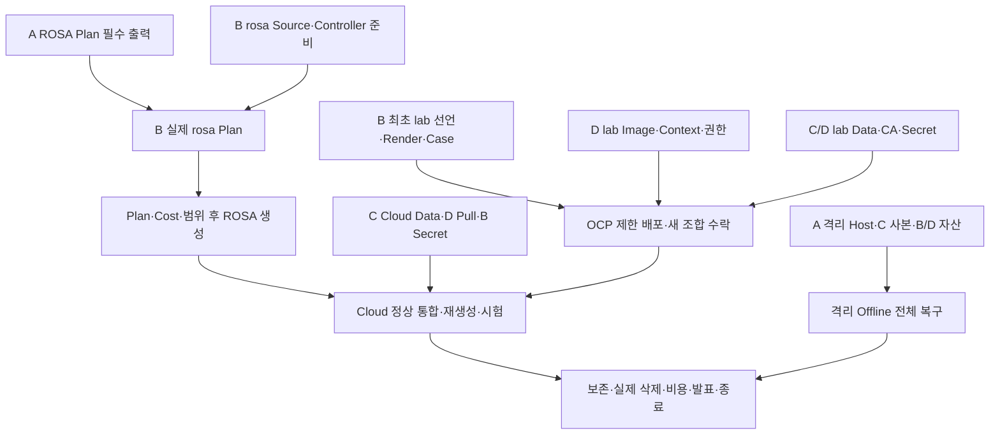

# 石나가는 판단 2차 — 저장소·담당별 전체 실행 순서와 현행화 점검

> 기준: 승인 01~04·현재 프로젝트 지침·개인 계획, 네 저장소 Source/Issue/PR/댓글/리뷰/Branch/검사 조회. 관측은 저장소별 조회 시각이며 동일 순간의 Runtime Snapshot이 아니다. 문서 담당 정태훈. 작성 기준 2026-10-05 14:27 KST.

**최신 실행 해석 — 2026-10-05 15:40 KST:** [h-docs PR #33](https://github.com/seokpan/seokpan-hybrid-docs/pull/33) main b45ea2d 병합·작업 Branch 삭제를 확인했다. [정태훈 실행판](TJUNG03_EXECUTION_BOARD.md)에서 지금할일·직접입력대기·OCP사전검증/정리·ROSA준비/생성/중간/최종종료·승인목표일을 작은 실행별로 확인한다. 아래 담당별 큰 묶음은 A전체→B전체의 선행관계가 아니다.

## 1 현재 전체 작업 진행 현황

- [x] 00 역사 원본·승인 설계 01~04 및 03/04 종료·현재 역할/Root 책임 확정 유지
- [x] DR 설계10분/30분/15분·Backup/Restore 유지와 관련 설계·그림·출처 정합 반영
- [x] [h-docs PR #32](https://github.com/seokpan/seokpan-hybrid-docs/pull/32) 승인 보고·main 병합/제출 Tree 동일·작업 Branch 삭제 확인
- [x] 첨부 00~04 Git Blob5개와 현재 h-docs main 일치
- [x] [h-docs PR #33](https://github.com/seokpan/seokpan-hybrid-docs/pull/33) 팀 실행순서 main 병합·작업 Branch 삭제 확인
- [x] App 원본 이력 보존·2차 Source 이관/수정 main 병합, ROSA/GitOps Source 검사 근거 확보
- [x] 두 독립 합성 부분 예행·Run 기록과 승인된 도구 [h-infra PR #29](https://github.com/seokpan/seokpan-hybrid-infra/pull/29) squash 병합
- [x] 네 저장소 Issue/관련 PR의 현재 상태·기록 연결·담당/선행/병행 경계 점검
- [ ] 남은 Source·실제 입력·승인 Image·인계 수락·Plan/전체 비용/실행 창
- [ ] Cloud 통합·백업 최신성·최종 T01~T23 판정·발표·자료 보존/삭제/잔존 비용·팀 종료

**이번 설계 변경 반영은 완료된 기준으로 사용한다.** 현재 구조나 목표를 다시 후보로 돌리지 않는다. 실제 미달/새 제약이 확인되면 근거·영향을 기록하고 필요한 변경을 검토한다. 설계 완료는 실제 전체 운영 T18 PASS가 아니다. RTO10분/DB RPO30분/DB 운영 중 Backup15분은 요구사항이며 전체 Actual은 null/미판정이다. 15분 Timer만으로 RPO를 보장하지 않는다.

TH-01~19·81개 세부 체크는 **정태훈 개인 관리 범위**다. 아래 팀 전체 표는 승인 W01~W10/T01~T23과 A/B/C/D를 연결하며 TH를 재번호화하거나 팀 전체 일을 B의 책임으로 바꾸지 않는다. 상위 개인 원본은 [h-docs Issue #21](https://github.com/seokpan/seokpan-hybrid-docs/issues/21), 팀 전체 입력/작업 연결은 [h-docs Issue #8](https://github.com/seokpan/seokpan-hybrid-docs/issues/8)·WORK_TRACKER·05, 발표 후보는 [h-docs Issue #6](https://github.com/seokpan/seokpan-hybrid-docs/issues/6)다.

## 2 저장소별 원본·현재 상태·남은 범위

| 저장소 | 담당/실행 책임 | 현재 근거 | 남은 작업의 원본 |
| --- | --- | --- | --- |
| h-app | B 정태훈 App 작성, D 최유준 CI/Image, C 김상희 Client/DB 리뷰 | [h-app PR #5](https://github.com/seokpan/seokpan-hybrid-app/pull/5) main c12b3d15 병합; c837 reference78이력 보존. Source 검사와 승인 Image/Runtime 구분 | [h-app Issue #1](https://github.com/seokpan/seokpan-hybrid-app/issues/1) Client/TLS/시간대, [h-app Issue #2](https://github.com/seokpan/seokpan-hybrid-app/issues/2) CI/PAT/Build/Scan/Digest/Platform, [h-app Issue #4](https://github.com/seokpan/seokpan-hybrid-app/issues/4) App/1·3Pod/업무 안전/Release |
| h-infra | A 이유빈 bootstrap/foundation 통합·실행, B rosa, C Data/Backup/Restore 작성, D Registry/CI 작성 | bootstrap/역할 코드·팀 실행 보고, Registry PR21/24·rosa 계약 PR27 병합. PR28 Source CI PASS/Draft. PR29 예행 도구 병합 | [h-infra Issue #10](https://github.com/seokpan/seokpan-hybrid-infra/issues/10) Bootstrap 잔여(10-06 Close), [h-infra Issue #23](https://github.com/seokpan/seokpan-hybrid-infra/issues/23) 공통 틀/Network/통합, [h-infra Issue #16](https://github.com/seokpan/seokpan-hybrid-infra/issues/16) VPN/Host, [h-infra Issue #19](https://github.com/seokpan/seokpan-hybrid-infra/issues/19) Data Root 전환, [h-infra Issue #17](https://github.com/seokpan/seokpan-hybrid-infra/issues/17) 이전/Backup/Restore, [h-infra Issue #18](https://github.com/seokpan/seokpan-hybrid-infra/issues/18) Registry/Worker Pull, [h-infra Issue #20](https://github.com/seokpan/seokpan-hybrid-infra/issues/20) 권한/통합 Plan, [h-infra Issue #25](https://github.com/seokpan/seokpan-hybrid-infra/issues/25) ROSA/인증/재생성/정리 |
| h-gitops | B 선언/배포 조율, D 실제 lab/Image/관측, C Data/Recovery 리뷰 | main은 초기 안내; [h-gitops PR #9](https://github.com/seokpan/seokpan-hybrid-gitops/pull/9)·[h-gitops PR #11](https://github.com/seokpan/seokpan-hybrid-gitops/pull/11) Source 후보18/26 CI PASS·Draft. Desired State/검사와 Runtime 분리 | [h-gitops Issue #10](https://github.com/seokpan/seokpan-hybrid-gitops/issues/10) base/Cloud/Recovery·Root/AppProject/NP/UWM/Migration/Bundle, [h-gitops Issue #5](https://github.com/seokpan/seokpan-hybrid-gitops/issues/5) 새 조합 base lab 수락, [h-gitops Issue #6](https://github.com/seokpan/seokpan-hybrid-gitops/issues/6) 새 Image Client/Migration/업무 검증 |
| h-docs | 전원 원본 기록, D 시험 조율·Index/비용, B 본인 연결·발표 | 설계·그림·실행/Run 체계와 소스 갱신 반영 완료, 전체05 진행 중 | [h-docs Issue #8](https://github.com/seokpan/seokpan-hybrid-docs/issues/8) 팀 입력/현행화, [h-docs Issue #21](https://github.com/seokpan/seokpan-hybrid-docs/issues/21) TH 개인 상위, [h-docs Issue #6](https://github.com/seokpan/seokpan-hybrid-docs/issues/6) 발표·T22/T23·최종 판정·보존/종료 연결 |

bootstrap Backend/실행 Role은 bootstrap, Data/Network/Registry는 foundation, Cluster·종속 OIDC/Role·Worker→Data Binding은 rosa, Root/AppProject/App 선언은 GitOps, Image는 CI/Registry, Secret 값은 목적별 공급 체계가 소유한다. C/D의 코드 작성은 별도 foundation State/단독 Apply를 허용하지 않는다.

## 3 담당별 지금 병행할 작업과 직접 인계

| 담당 | 지금 진행할 묶음 | 다음 수신자와 최소 인계 | 해당 입력이 없을 때 보류할 실행 |
| --- | --- | --- | --- |
| A 이유빈 | foundation 공통 틀/Network·VPN/Host·제한 Output/권한 리뷰 | B 실제 rosa Plan에 필요한 Account/Region·VPC/6Subnet·Data SG2·공통Classic Role/Policy·전체SHA/개정·Caller/Backend 참조. 실제 Worker SG/Cluster-specific Binding은 rosa 단계; C에 격리 Host/공간·접근/도구 | 보호 State/Plan·실제 기반 생성/변경. C/D Source와 리뷰는 병행 |
| B 정태훈 | 병합 App 계약/Case·Root/AppProject/NP/UWM/Migration/Overlay·Recovery Bundle·rosa/관리/Secret 준비 | D에 main c12b3d15와 검사/빌드 범위·Overlay/업무 Case; C에 DB/Redis/TLS/시간대·복구 업무 계약; A에 Output/Worker Pull/Binding 요구 | 승인 Image/실제 DB·CA/Secret·Host가 필요한 lab/Cloud/Recovery 및 실제 rosa Plan. 입력에 독립인 Source 준비는 진행 |
| C 김상희 | Data module→Root 전환 준비·목적 GRANT/TLS·이전/반출 조건·15분 Backup/Restore·부분 Run 리뷰 | A에 Data 권한·Root 파일/Output/전체 Plan 범위; B에 DB/Redis/CA/Schema·Backup/Key 논리 참조; D에 Data 시각/Hash·실제 Run | 첫 Apply 전 Root 전환·실제 지원/계정/보호 입력·Host가 필요한 이전/복원. 단계별 독립 Data 측정은 전체 ROSA/D Image를 기다리지 않음 |
| D 최유준 | CI/Writer/PAT·Job/Agent/Plugin·새 Image/Scan/Digest·lab·Harness/UWM/Index·Cost | B에 Registry별 Digest/Platform/Scan·동일 Source lab 결과; 전원에 시험 순서·Index 수신/비용 산식 | 실제 Credential/Job/Org 정책·Registry/배포 환경을 요구하는 실행. CI Source/Case/비용 입력 준비는 병행 |

Cloud Secret 주 B/예비 A, CI Secret 주 D/예비 B, Data/Backup 해독 수단은 C의 승인 보관 범위를 유지한다. 인계 제출·수신·실제 수행자/Principal을 구분하고 팀원 수신을 대신 체크하지 않는다. 공유 State 쓰기·Restore/Cutover·배포/장애·부하는 지정 단일 실행자와 Shared Execution에서 조율한다.

## 4 순차·병행 흐름

다음 그림은 산출물 의존성을 표시한다. 미래 업무를 이미 완료한 뜻이나 새 승인 Gate가 아니다. lab/복구 준비와 실제 Cloud 준비는 병행할 수 있다.

OCP Source/최소 lab 실행·ROSA Source 준비·격리 복구 준비는 병행한다. A의 필수출력은 **실제 rosa Plan**에만 연결한다. OCP 수락은 Cloud 조합의 관련 위험/차이를 인계하는 단계이고 ROSA 생성의 새 일괄 Gate나 전체 OCP 철거 조건이 아니다. Cloud 생성 뒤 Data Binding/Pull/Secret/Schema를 확인해 App을 통합한다. [실행판 §3~6](TJUNG03_EXECUTION_BOARD.md)에서 행동별 최소입력/플랫폼 수명을 확인한다.

| 작업 구간 | 순서·담당 | 완료/다음 단계의 직접 조건 |
| --- | --- | --- |
| W01 설계 | 완료 기준 사용 | PR30/31/32 main과 갱신 소스·역할 확정. 신규 제약이 없으면 다시 설계 승인 단계로 돌아가지 않음 |
| W02~W03 독립 준비 | A/B/C/D 병행 | Source/도구·각 작업의 필요한 I01~I07·Owner/Case/인계. W02 팀 전체 종료를 모든 코드 착수의 일괄 조건으로 삼지 않음 |
| W04 lab/부분 예행 | B 선언·C 격리 Data·D 새 Image/lab·A Host | 같은 Commit/Digest/Platform/Config/CA/Secret/Namespace/Context 조합 수락. 입력 대기0Replica 후보를 그대로 Sync해 성공으로 판정하지 않음 |
| W05 실제 Cost Gate | D 집계·A 기반·C Data·B ROSA | 현재 누적+잔여 기반/Data/ROSA/전송/관측/재시험/정리 지연·잔존, 실제 Plan·시간/가격/Credit. $450 계획선/$500 한도와 해당 유료 실행 범위/기간/삭제 책임 확인 |
| 실제 Infra Root | A bootstrap 정본 확인→A foundation 통합/Plan/실행→B 제한 Output 수신→B rosa Plan/실행 | 완료한 State 이전 반복 없음. Data module은 첫 Plan/Apply 전에 승인 Root 주소로 전환. 실제 지원/Quota·Caller/MFA/Role/Backend/Lock·Output 최신성/동일 Account/Region/VPC·A/C/D 리뷰 |
| W06 Window A | A 기반+C Data+D 승인 Image/Pull+B Root/Secret/선언 통합 | Operator 최소 최초 설치→Root/Platform 수동 Sync→App 보류→Secret/Schema/Image 준비→App 최초 수동 Sync→대표 업무/Backup/Release. 이후 승인 자동 Sync/SelfHeal; 자동 Prune 보류 유지 |
| W07 Must 결함 | 해당 Owner 수정·새 Run/영향 재시험 | 실패 기록 보존·코드 수정/리뷰·동일 조합 인계. 실제 결함 확인을 최종 시험 창까지 미루지 않음 |
| W08 Window B | T19 재생성→정상 Baseline→T10~14 각각 분리→T16 부하 | 먼저 검증 Release/Bundle·Cost·실행자/보호 확인. foundation 재실행 전후 Binding 유지→App/Data 보호→rosa Binding 해제/삭제→새 SG/Host/Role/Pull/Secret/GitOps/E2E·이전 SG 참조 제거·양쪽 정상 Plan |
| T17/T18 Backup/Offline | 단계별 C 측정 병행, 전체는 A Host+B App+C Data+D 시간선 | 사전 검증 Backup/Release·독립 사본/해독·새 DB 직접TLS/새 Redis·FE/HTTPS/WSS 지정 클라이언트. 로컬 DNS/Harbor 허용, AWS/GitHub/Cloud IDP/ECR/KMS 신규 조회 비의존. 준비 완료 시 ROSA 가동 창 밖에서도 본시험 가능 |
| W09~W10 결과/종료 | 전원 자기 결과·D Index/비용 | 증거/영상/Runbook/Bundle/Key 접근·복원 확인→승인 rosa 범위 정리→실제 삭제/잔존/후속청구→불필요 Credential/실데이터 정리·필요 해독 수단 보존→발표·Must 최종 판정·후속 책임 수신·팀 종료 |

## 5 PR 순서와 계속할 Source 준비

- [h-infra PR #29](https://github.com/seokpan/seokpan-hybrid-infra/pull/29)는 exact HEAD29b4a1f 승인1건·충돌/미해결 리뷰 없음 확인 후 main054d4fc에 squash 병합했다. 기존15Blob을 보존하고 예행 도구7개만 추가했으며 #28 HCL을 소비하지 않는다. C 검토/D Index 수신·운영 Acceptance는 별도다. 리뷰의 비차단6건은 향후 도구개정/새 Run 후속이며 원 Run을 덮어쓰지 않는다.
- [h-infra PR #28](https://github.com/seokpan/seokpan-hybrid-infra/pull/28)는 Draft, Source validate/schema PASS와 실제 Controller/제한 입력/권한/첫 Plan 준비 대기를 구분한다. #27 병합/검사 반복을 요구하지 않는다. PR29 병합 후 새 main과 비교한15개 변경은 ROSA/Source CI만이며 예행 도구7개와 겹치지 않는다. 기존 PASS는 현재 HEAD의 검사이고 새 main 조합의 재검사 성공으로 확대하지 않는다. 새 Source 제출·Ready 전 최신 base/diff·승인/검사를 다시 확인한다.
- [h-gitops PR #9](https://github.com/seokpan/seokpan-hybrid-gitops/pull/9) 직접 조건은 필요한 B 선언/Source 리뷰와 D 승인 Image·C/D 실제 lab/Recovery 입력의 같은 조합 검증/수신이다. 전체 ROSA/최종T18/05 종료를 Source 병합의 추가 일괄 선행조건으로 붙이지 않는다.
- [h-gitops PR #11](https://github.com/seokpan/seokpan-hybrid-gitops/pull/11)는 #9 Branch/공통 base를 소비한다. **#9 병합→#11 main retarget→Cloud 차이/기동 보류·Source 검사/리뷰 재확인**. #11 retarget/diff 확인 전 #9 Branch는 보존한다.
- [h-infra PR #30](https://github.com/seokpan/seokpan-hybrid-infra/pull/30)는 foundation/rosa 권한의 오래된 설명을 고친 README 표/주석만의 Source PR이다. 실행 IAM 코드/정책/권한을 바꾸지 않는다. 기존 승인 서비스/실행 권한 부족은 별도 실제 입력/Plan 후속이다.
- B는 Root/Application/AppProject·NP/UWM 소비·Migration 단일 Job·완성 Recovery Bundle의 실제 미완성 범위를 [h-gitops Issue #10](https://github.com/seokpan/seokpan-hybrid-gitops/issues/10)에서 계속한다. D는 중단 Guard가 있는 과거 CI Pipeline/옛1차 Promotion Helper를 실행하지 않고 [h-app Issue #2](https://github.com/seokpan/seokpan-hybrid-app/issues/2)의 2차 대상/Job/Writer/Secret 경계부터 구현·검토한다.

PR29 승인 리뷰의 비차단 후속은 [h-infra Issue #25](https://github.com/seokpan/seokpan-hybrid-infra/issues/25)·[h-infra Issue #17](https://github.com/seokpan/seokpan-hybrid-infra/issues/17)에서 다음 도구 개정/새 Run에 연결한다. 담당 역할과 실제 수행자는 개정 시작 때 기록하고 원 Run을 보존한다.

| 후속 | 다음 개정의 확인 기준 |
| --- | --- |
| Backup 식별/Hash | release.json의 backup_id/encrypted_backup_sha256과 실제 사용 사본·측정 결과 일치 |
| App checkout 검증 | tracked Blob 검증과 untracked 파일/.venv 확인 범위를 구분·기록 |
| DB 접속 이식성 | 127.0.0.1 계정과 localhost의 IPv4/IPv6 차이를 확인하고 TLS hostname 검증 유지 |
| Redis 인증 설명 | 현재 tls-auth-clients no는 Server TLS+AUTH임을 명시; Client 인증서 mTLS로 주장하지 않음 |
| Rating 기대값 | 1016/984가 고정 App SHA/Elo 상수 조건임을 기록 |
| 오류/코드 정리 | 미사용 import·sys.version·예외의 경로/민감정보 노출을 개정 후 확인 |

## 6 전체 공식 시험 연결과 판정

시험 ID·Must/성공 조건은 03 §3-G·세부 IF/IM/NET 기준을 유지한다. 아래 묶음은 진행 순서/Owner 연결이며 T 판정을 새로 만든 표가 아니다. 현재 확보된 Source/lab/Bootstrap 보고와 부분 Fixture를 전체 T PASS로 승계하지 않는다.

| 공식 시험 | 핵심 참여/원본 | 현재 남은 최종 확인 |
| --- | --- | --- |
| T01~T04 Source/Root/권한/Network·TLS | A/B/C/D, h-infra·h-app·h-gitops/Run | Seed/Owner·실제 Root별 Caller/Backend·실효 권한/Secret/관리 회수·정확 DNS/SAN/TLS/AUTH 양성/음성. Bootstrap 보고를 다른 Root 전체 PASS로 확대하지 않음 |
| T05~T09 이전/E2E/인증/경합/WS | C 이전+B App+D Harness, h-app·h-gitops/Run | 실제 Schema/행/시각·반출 조건·대표 업무·다른 Pod/동시 요청·Commit 불명/Generation/Snapshot·재접속 |
| T10~T16 Rolling/Worker/RDS/Redis/Hybrid·CI/관측/부하 | 해당 Owner+D 시험조율, 모든 Code Repo/Run | 정상 Baseline 뒤 장애별 분리, Native/UWM/Log/Alert 연결, 승인 Smoke/Baseline/Target 부하와 정확성/병목/Pool. Managed CP 직접 파괴는 기본 시험에서 제외 |
| T17~T18 Backup/Offline | C Backup/Restore+A Host+B App+D 시간선, h-infra·h-gitops·h-app/Run | 실제15분 Timer/성공간격G·로컬확보지연D·시각여유U, 사고 사용 사본 Data-age. 두 합성 부분 Run PASS·전체RTO/RPO null. 실제 전체 업무/DB 보존·RTO10/RPO30·실패/미판정 기록 |
| T19~T21 재생성/비용·정리/CI·Pull | B rosa+A 기반+C Data+D Image/비용, h-infra·h-app·h-gitops/Run | Binding/기반 보존·새 Worker Pull/12시간 사용 후 새 Pull·재생성 Pull·승인 Image/Scan/Harbor 보존·실제 부속/잔존 비용 |
| T22~T23 비교/문서·시연 | 전원 자기 기여+D 비교/Index, h-docs/원 Run | 1차/2차 조건 비교 DIRECT/CONDITIONAL/DESCRIPTIVE/N/A, 주장/해석/한계·실패·개인 기여·영상/시연·Must 종료 판정 |

## 7 이슈·관련 기록 현행화 결과와 남은 확인

조회 시작 기준 진짜 Issue33개(h-docs8/h-infra14/h-app3/h-gitops8)와 PR44개의 목록을 분리하고, 관련 본문/댓글/리뷰·Branch/Commit/Tree·체크·인계를 추적했다. PR과 Issue 번호를 섞어 완료 수를 만들지 않는다. 이번 신규 Source PR은 이 원래 목록 이후에 추가되며, 기존 실행 Issue를 재사용한다.

| 대상 | 발견·반영/후속 |
| --- | --- |
| h-docs21/h-app4/h-gitops10/h-infra25 | PR32 미병합 안내를 병합main d17891b/Branch 삭제로 갱신. TH19/81·기존checked2개·전체 Runtime 미완료 유지 |
| h-docs8/6 | 오래된 DR 선택 대기/발표 기준을 현재 설계와 두 부분 Run·전체T18미실행으로 현행화. 제출·수신·시험 판정을 구분 |
| h-app2/h-gitops5/6 | App main c12b3d15/PR5병합 소비, 새 Image/같은조합 lab 대기. App 요구사항 placeholder→h-app1 실제링크. cross-Repo bare번호를 명시링크로 정정. 과거 cascade/Finalizer 예제와 현행 삭제 보호를 구분 |
| h-infra16/18/20/23 | 이미 생성된 공통틀23·Registry PR24 합의/병합·권한PR21 적용보고 소비. 실제 Network/Plan/Worker Pull은 별도. State-only 옛 설명은 PR30 표/주석으로 정정 |
| h-infra10 | 구조/버전/가이드·Role/State 정책 코드와 이전/Apply 보고를 소비해 완료한 Source/보고 항목 현행화. 직접 Lock 충돌은 10-06 probe Root 시험으로 확인·Close(실제 김상희, 05 8.9절). State Lineage·Serial 이후 판단은 bootstrap 실행 담당 이유빈 범위 |
| h-infra19/17·팀 CI/실행 | C Data 모듈은 첫 Plan/Apply 전에 foundation 직접 배치·PR/리뷰, 실제15분 Backup/전송·최신성·Key/Host·반출 조건은 해당 Owner 원본. 부족 입력으로 독립 준비 전체를 중지하지 않음 |
| 닫힌 Issue/Reference | 중복 h-infra26→25와 종료한 Source/사전 이슈는 유지. 닫힘을 Runtime PASS로 읽지 않고, 이력을 다시 열거나 원본 reference를 삭제하지 않음 |
| 네 Repo milestone1 | 현재 기한 metadata는10/18이며 승인 Technical Freeze10/16과 불일치. 일정 변경으로 해석하지 않는다. 이번 연결에는 milestone 기한 수정 기능이 없어 repo 관리자가10/16으로 정정할 후속을 h-docs8에 연결한다. 문서 일정은10/16 유지 |

매 작업 묶음 전후·새 인계·공유 실행 직전에는 Source/Issue/PR/댓글/리뷰/Branch/Commit/checks·수신을 확인한다. 바뀐 원본만 갱신하고 Tracker/05/#8에는 링크·상태·영향·시각을 연결한다. 실제 시험/재시험은 새 Run+Index(D 수신), 민감 원본/접근경로는 보호 대장, 충돌 실행은 Shared Execution에서 관리한다. 이름/번호·Repo Link·Owner·선행/병행·완료근거·현재/다음/Blocker·Cost/보존/종료를 함께 대조하고 Merge/보고/수신/Runtime를 분리한다.

## 8 전체 남은 작업 현황

다음은 W/담당별 요약이다. 실제 착수/대기는 [실행판 §2~4](TJUNG03_EXECUTION_BOARD.md), OCP/ROSA 종료와 목표 창은 §5~7, 작은 팀 의존과 전체잔여는 §8~10을 우선 확인한다. A의 이 요약 전체 완료를 B 착수의 조건으로 읽지 않는다.

- [ ] W02~W03 / A: foundation 공통 틀·Network/Data/Registry/VPN 통합, 실제 서비스 권한·제한 Output/Host·Plan/Cost·인계
- [ ] W02~W03 / B: 개인 환경/계약 후속, 남은 Root/AppProject/NP/UWM/Migration/Bundle, rosa/관리/Secret·실제 Controller/입력·리뷰
- [ ] W02~W04 / C: Data Root 전환/리뷰, DB/Redis/TLS/GRANT/시각·반출·Key/사본, 15분 Backup/실패/최신성/Restore와 수신
- [ ] W02~W04 / D: 2차 CI/PAT/Job/Plugin·새 Build/Scan/Digest/Platform, 같은조합 lab·UWM/알림/Harness·Index수신/비용
- [ ] W05: 실제 지원/권한/Caller/Backend/Plan/비용·가동/삭제/재시험/잔존·팀 가용시간/실행 창
- [ ] W06~W07: 정상 Cloud/App/Data/Secret/GitOps 통합·대표 업무/Backup/Release, Must 결함 수정/새 Run
- [ ] W08: 재생성→정상 Baseline→분리 장애/부하, 실제 Backup 최신성·격리 Offline 전체 업무/DB·T01~T23 최종 판정
- [ ] W09~W10: 비교/해석·실제Troubleshooting·시연/영상/발표·자료/Key보존, 승인rosa삭제·부속/잔존/후속청구·Credential/실데이터·보관책임/종료
- [ ] 원본 기록/제출·수신/Index/Shared Execution/보호대장·일정/비용 현행화와 새 Source PR 리뷰/병합 지속

정태훈 개인 잔여: TH01~04 환경/계약·인계, TH05~07 실제App/Image/업무, TH08~09 선언/동일조합 수락, TH10~12 실제rosa/권한/Plan/비용, TH13~17 통합/업무안전/복구/재생성/장애·부하, TH18~19 발표/보존/최종삭제/잔존/인계/종료. 이미 완료한 Source 이관·검사를 다시 수행할 조건으로 만들지 않는다.

목표 일정은10/16 Technical Freeze·10/19~21 Window B 후보·10/22 Demo Freeze·10/23 Presentation Ready·10/26 종료다. 가용시간 없이 하루 단위 완료 약속을 만들지 않는다. 최종 ROSA 삭제는 필요한 영상/자료 보존·접근/복원 확인 후 발표 전에 가능하다. foundation/bootstrap 전체 Destroy는 별도 명시승인 조건을 유지한다. Data/Network/Backend·NAT/IP/Storage/RDS/Redis 등 실제 잔존 비용과 보존/정리 Owner를 기록하고, 불필요 자격증명/실데이터 삭제와 필요한 해독 Key 보존을 구분한다. 필수 미완료는 해결 또는 승인된 범위 재결정·수신된 후속 책임 확인 후 종료한다.

근거: 03 §3-A/3-F/3-G/3-H/3-I.14.5, 04 §2.2/3/4/6/9/10, 개인계획 §4~7/9/11/12/18, 프로젝트 지침 §15.1/16/19/22/36/37. 상세 결과/실제 값은 원래 Issue/PR/Run을 따른다.
