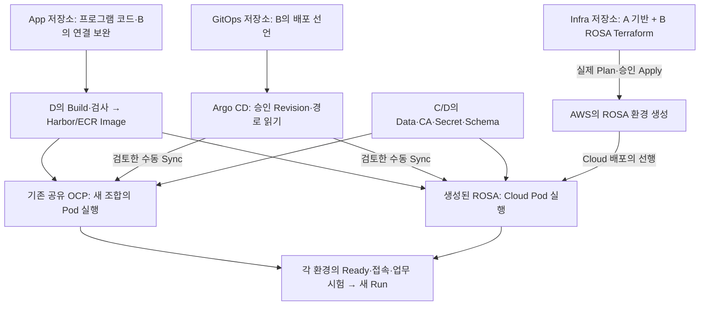

# 정태훈 작업·흐름·학습 안내

### 조사 중 추가된 실행 보고·수정 PR — 2026-10-07 후속 조회

[D 등록·선택 Sync 보고](https://github.com/seokpan/seokpan-hybrid-gitops/issues/5#issuecomment-6034601393)는 SHA A의 Valkey 4객체 `Succeeded`·FE/BE 미생성을, [Pod 확인](https://github.com/seokpan/seokpan-hybrid-gitops/issues/6#issuecomment-6034590906)은 검토 Digest의 amd64 하위 ImageID·허용 UID만 보고했다. 등록/Sync를 다시 미실행으로 되돌리지 않는다. 실제 TLS/AUTH/Hostname·Ready 전체 Run과 Prune/Delete 차단은 아직 근거가 없으며 공유 Owner 재확인·등록 Commit·B 공유 시각의 빈칸 및 사전 합의되지 않은 `oc patch operation.sync.resources` 경로는 원 #5에서 보완·수락한다. #21의 완료 체크만으로 이 잔여를 완료 처리하지 않는다. 이 조사자는 클러스터를 직접 재조회하지 않았다.

[GitOps #27](https://github.com/seokpan/seokpan-hybrid-gitops/pull/27)로 checker 정책이 main에 반영됐다. [#25](https://github.com/seokpan/seokpan-hybrid-gitops/pull/25)의 현재 변경은 회귀 테스트·등록 안내2파일이며 HEAD `53314d33fcc061e5de4da2f8d3570edd6d5a7273`의 [Linux CI37706970618](https://github.com/seokpan/seokpan-hybrid-gitops/actions/runs/37706970618)에서69PASS를 확인했다. 현재 등록 Source는 Workload SHA B=`bfee2669e62bf823969ce224e5599eccace5d024`를 참조한다. SHA B 비교는 선언 구조 PASS/Runtime NOT VERIFIED, SHA A=`244b48b885d7ac645c402e561a032ae65a8f3461` 입력은 불일치 BLOCKED다. 기존 #24 이후 checker 실패·3파일 변경·옛 HEAD 검증은 당시 이력이다. 최신 검증/범위의 PR 제목·본문과 안내를 정정해 A 재리뷰를 요청했다. Controller/Workload YAML·실제 등록/Sync·전체 release Gate·공유 충돌/Prune/Delete 보호는 유지한다.

[Infra Draft #43](https://github.com/seokpan/seokpan-hybrid-infra/pull/43)은 ROSA `workspace_key_prefix=phase2/rosa/env`와 목적 Role의 List 범위를 맞춘다. default State Key는 유지한다. 기존 harness/보존 검사 PASS, 보조 로컬 fmt/validate는 NOT RUN 이력이다. [정확 PR HEADd5aeddd의 CI37598580155](https://github.com/seokpan/seokpan-hybrid-infra/actions/runs/37598580155)는 Core1.16.4/AWS6.67.0/RHCS1.7.7의 fmt·backend=false/readonly init·validate(errors0/warnings0)·Schema13종·OIDC mock2·Source/Lock 불변 PASS다. 실제 Backend 인증·Workspace 조회·Cloud Plan/Apply는 NOT RUN이다. 누락만으로 기존 init 실패를 단정하지 않는다. 검토·병합 후 본인 clone/Workspace와 실제 Caller/Backend를 확인한다.

[GitOps #26](https://github.com/seokpan/seokpan-hybrid-gitops/issues/26)은 후속 조회에서 Stage2의 실제 추적 Issue로 확인됐다. [D의 backend-db-runtime 공급 보고](https://github.com/seokpan/seokpan-hybrid-gitops/issues/6#issuecomment-6034843156)는 두 URL 키·계약 Host/DB 이름과 기존 lab 계정 비밀번호 공유를 명시한다. Secret 미공급으로 되돌리지 않되 실제 새 URL 접속·C 형식/GRANT·데이터 출처 수락은 대기다. Route/Origin·새 Backend Image·Stage2 활성화/전체 Gate도 미완료다.

첫 읽기·작업 위치·실행 조건은 [실행 인계](EXECUTION_ENTRYPOINT_20261007.md)를 따른다. 원 보고와 이 Source 수정의 수신/검토·실행은 별개다.


## 현재 실행 기준 — 2026-10-07 원격 변경 대조·구현 인계

| 경로 | 완료·수신 범위 | 직접 남은 조건 |
|---|---|---|
| App #17/#18/#19 | 최신 D 재승인 후 모두 squash 병합·작업 브랜치 삭제. 결합 main `a2afffb8605dafff1cb5b9af215aa0cf93aadcdb`의 기존 정식 CI에서 Backend1762·부분집합runner47·별도Lua9 PASS, dirty=false | [App2 Build 인계](https://github.com/seokpan/seokpan-hybrid-app/issues/2#issuecomment-6033610765) → D의 같은 Source Build/Scan·새 Backend Digest/플랫폼·Registry/Pull → B의 App/별도 held Migration 소비 검토. 기존 승인 Digest가 세 수정을 포함한다고 승계하지 않음 |
| GitOps #20 | 검토 HEAD `b13ae9575206a335a9e6f87efc34dd4c198884f7`의 metadata allowlist·58PASS 후 재승인 수신, `5dc2bd546de1acbbeb47a380c85103ce2b31017f` 병합·작업 브랜치 삭제 | 재리뷰/병합 대기는 해소. Controller 등록 checker와 Stage-1 Gate·실제 등록/보호 동작은 별도 |
| GitOps #22/#24 | Stage-1 Source SHA A=`244b48b885d7ac645c402e561a032ae65a8f3461`, 등록 Source=`a25172c7453b9d7999cb1f3cbeb1ef35774e3b63` 병합. #24의 `targetRevision`은 SHA A를 고정 | D의 실제 등록·Valkey 4객체 선택 Sync 성공 보고 수신. Owner 재확인/등록 Commit/공유 시각·Gate/live Diff 근거 보완, TLS/AUTH/Hostname·삭제 보호·Ready 전체 Run과 B 수락은 별도 |
| Infra #40/#42 | #40=`a0da58c345f877659e522a5b4ab5392b1d0626d3`, #42=`36dc2403aa77e2896cc4ec3c545b92e0afb49205` 병합. #42는 일반 사본 `periodic/`와 `backup_periodic_retention_days`로 정합화 | A의 기존 tfvars/변수 소비·Root Plan, C의 Job/권한/Lifecycle·대장 개정 수락과 실제 Backup은 별도. 운영 Data/Valkey/전체 T18 완료 아님 |
| Docs #69/#72/#77 | #69 보존 브랜치는 후속 작업에 사용하지 않음. #72는 기존 HEAD `376afcb03849e2325c5a10e80a363081bb0cd2de` 이후의현재 상태를 보완하는 리뷰 PR. [#77](https://github.com/seokpan/seokpan-hybrid-docs/pull/77)의 C Data 공급 보고는 `a9b0207b563aa25be17d4a635f6cc903fbe0e74a`에 병합 | #72 최신 main 정상 결합·재리뷰/병합. #77의 공급·확인 보고를 새 Runtime 재조회나 Foundation Apply·SQL 계정 생성으로 확대하지 않음. C의 05 §8.15·Tracker 기록 보존 |
| Cloud 금고 | [C Valkey 해독/형식/암호문 해시 보고](https://github.com/seokpan/seokpan-hybrid-infra/issues/19#issuecomment-6028766924)·[B 수신](https://github.com/seokpan/seokpan-hybrid-infra/issues/19#issuecomment-6028919355), [B SQL 금고 jth 확인](https://github.com/seokpan/seokpan-hybrid-infra/issues/19#issuecomment-6033157659)·[C의 세 계정 확인](https://github.com/seokpan/seokpan-hybrid-infra/issues/19#issuecomment-6033174437) 완료 보고 | Controller 밖 독립 키/암호문 사본·복원한 identity로 해독 확인만 별도. 이 문서 작성 환경의 직접 복호화 결과가 아님. 완료한 공개키 전달·본체 해독을 반복하지 않음 |
| 개인 clone·ROSA·Cost | clone의 경로/필수파일 검사 중단 이력, CP3/Infrastructure3/Worker3와 원장(3)의 PARTIAL·미완19·입력오류0·기타미확인4 유지 | [직접 실행 안내](TJUNG03_WORKFLOW_AND_LEARNING_GUIDE.md#b-direct-actions-20261007)의 현재 첨부/실파일 구분과 Infra 정본 LOCAL_PREPARATION의 읽기 중심 준비 → 본인 도구/Caller/Backend·지원·실제 사양/시간·A 제한 출력/prerequisite·C SG2. disk300 등 임의 입력 금지, $450/$500 유지 |

Stage-1 작성/리뷰는 끝난 Source를 재사용한다. SHA A의 lab 선언은 Valkey만 replicas1/`source-reviewed-runtime-unverified`, FE/BE는0/`input-required`, Migration은 suspend/current/300초·단일 실행이다. base/Recovery hold와 기존 전체 `release-manifest`를 보존하고, 별도 Valkey Stage-1 Preflight Gate가 지정한 리소스/입력·보호 범위를 확인한 뒤 선택 수동 Sync한다. #20의 등록 checker를 Stage-1 Gate로 대신하지 않는다.

#24의 등록 Source는 기존 `openshift-gitops` Controller와 제한 AppProject/Application 각1개, destination=`seokpan-argotest`, path=`apps/overlays/lab`, targetRevision=SHA A다. D의 등록·Valkey 선택 Sync 보고 이후 남은 범위는 상단 추가 보고의 근거 보완·실제 Service/Ready/TLS/AUTH/Hostname·삭제 보호 판정이다. DB/Secret/CA/Route와 새 Backend Image를 수락한 Stage2는 별도 FE/BE 활성화 SHA B → 등록 targetRevision 갱신/검토·지정 apply → 기존 전체 Gate 정상 통과 → 필요한 단일 Migration·FE/BE 수동 Sync → 같은 조합 업무 Run으로 이어진다. Source 병합·등록·Synced·Valkey Ready·전체 lab/ROSA/Cost PASS를 분리한다.

[Docs #74](https://github.com/seokpan/seokpan-hybrid-docs/pull/74)/#75의 `periodic/` 결정·과거 `hourly/` 구분과 C의 05/Tracker 기록은 보존한다. Infra #42의 Source 병합 대기는 해소됐지만 실제 tfvars·Plan/Apply·백업 수락은 [work W09](WORK_HANDOFF_20261007.md)에서 확인한다. 03·04 설계 종료, DR10분/영속 DB RPO30분/DB 운영 중15분 계획 주기를 유지한다.

[원 GitOps5 결정](https://github.com/seokpan/seokpan-hybrid-gitops/issues/5#issuecomment-6032629690)·[Cost43 대조](https://github.com/seokpan/seokpan-hybrid-docs/issues/43#issuecomment-6033030041)·[Source 현재 대조](SOURCE_REVIEW_20261007.md#b-work-current-delta-20261007)·[대장 현재 대조](REPOSITORY_CONSISTENCY_AUDIT.md#b-work-current-delta-audit-20261007)·[work 인계](WORK_HANDOFF_20261007.md)를 따른다. 아래 과거 관측·실패·Run·리뷰는 해당 시점의 이력이다. TH81/실제 완료2·기존 Q 체크는 변경하지 않으며 Q02/03/04/05/10과 실제 개인/공유 실행·전체 목표 판정은 별도다.

## 1. 지금 무엇을 만드는가

2차 목표는 **정상 서비스는 AWS 안에서 실행하고, Cloud 장애 때는 보존한 자료로 온프레미스에서 복구하는 것**이다. 온프레미스는 CI·이미지·백업 보관도 맡는다. B 정태훈은 App 연결·GitOps 배포 선언·ROSA 구성과 통합을 맡으며 A 이유빈의 기반, C 김상희의 Data/복구, D 최유준의 Image/시험을 연결한다.

- **OCP(OpenShift Container Platform):** 컨테이너를 실행·관리하는 Kubernetes 플랫폼. 현재 공유 실습 환경은 ROSA 이전 사전검증용이다.
- **ROSA:** AWS에서 제공되는 관리형 OpenShift. 정상 서비스의 최종 대상이다.
- **코드 병합:** 팀이 사용할 파일을 Git `main`에 합치는 일. 실제 서버 생성·프로그램 실행은 별도의 실행이다.

공유 OCP의 기존 배포는 [D의 GitOps #5](https://github.com/seokpan/seokpan-hybrid-gitops/issues/5)에 있다. **현재 API 조회는 하지 않았다.** 과거 보고·오늘의 서버 상태·새 hybrid Source/Image 성공은 구분한다. ROSA 코드 병합도 생성 완료가 아니다.

## 2. 저장소의 코드가 실제 프로그램으로 실행되는 경로



그림은 실행 경로이며 오늘 실제 실행을 완료했다는 표시가 아니다. OCP에는 기존 공유 환경을 사용하고, ROSA에는 별도의 생성 단계가 있다.

**Image**는 실행 프로그램/파일 묶음이다. **Manifest**는 Image·실행 수·설정을 적은 YAML, **Render**는 최종 YAML을 만드는 일이다. **Argo CD Sync**가 선언을 클러스터에 적용한다. **Pod**는 컨테이너 실행 단위, **Ready**는 요청을 받을 준비 상태다. 업무 성공은 추가 시험한다.

**Terraform Plan**은 AWS/ROSA 변경 내용을 확인하고 **Apply**는 실제 자원을 변경한다. App Sync와 ROSA 생성은 별개다. Render/PR 작성만으로 서버에 추가되지 않는다.

**Owner**는 관리 책임자, **Secret**은 비밀 설정을 담은 객체, **CA**는 서버 인증서를 검증하는 자료다. **Schema**는 DB 구조, **Migration**은 필요한 구조 변경 절차다. 현재 구조를 확인한 성공만으로 실제 구조 변경까지 검증했다고 판단하지 않는다.

## 3. 실제 Source로 현재 보류 이유 읽기

[GitOps main](https://github.com/seokpan/seokpan-hybrid-gitops/tree/3dc624d4dc9a774a6207708bfd68248101890401)의 다음 구문을 대조했다. 여러 파일의 관련 부분을 발췌한 것이며 그대로 실행하는 명령이 아니다.

```yaml
# apps/base/backend.yaml — frontend.yaml도 같은 보류
replicas: 0
image: seokpan-backend:INPUT_REQUIRED

# clusters/ocp-lab/reuse/application.yaml의 spec.source
targetRevision: GITOPS_REVISION_INPUT_REQUIRED
path: apps/overlays/lab
```

`replicas: 0`은 파일에 적은 원하는 실행 수 0개, `INPUT_REQUIRED`는 승인 입력 미반영이라는 뜻이다. 현재 클러스터의 실제 Pod 수를 조회한 결과는 아니다. `reuse`는 기존 승인 Application 대조용이며 중복 등록하지 않는다. 실제 Owner·Image Digest·Secret/CA·Schema 수락 → 활성화 변경 검토 → 수동 Sync로 진행한다. **파일 존재·Synced·Ready·업무 PASS는 각각 다르다.**

## 4. B의 이전 작업·당시 실행 상태 — 현재는 상단 기준 적용

아래는 지난 Source 작업과 당시 검사 범위의 개요다. 실제 실행 환경·수행자·리뷰·수신은 연결된 원 PR·Run에서 확인한다. 이후 공급·병합 상태는 상단 현재 기준을 따른다.

| 영역·변경 위치 | 이미 준비·검사한 것 | 연결 담당·아직 남은 것 |
|---|---|---|
| **App** `backend/src/seokpan/connection_settings.py` | DB/Redis·TLS/CA·별도 AUTH 계약, Migration 분리·병합 | C 실제 대상/권한·D Image → 양성/음성·업무 시험 |
| **App** `backend/docs/turn-departure-finalization.md`, [App #4](https://github.com/seokpan/seokpan-hybrid-app/issues/4) | 동시 착수/퇴장·종료·부분 실패 보완과 회귀 검사 | B/C/D 실제 DB/Redis·1→2→3 Pod 전환·업무 수락 |
| **GitOps** `apps/base`, `apps/overlays/{lab,cloud,recovery}`, `clusters/ocp-lab` | 공통/환경별 선언, 입력 보류·수동 배포·Owner/삭제/Migration 경계. #9/#11 병합 | D/C 최소 입력 → OCP 실제 실행. Cloud·Recovery는 각 환경에서 별도 시험 |
| **Infra** `terraform/rosa/{cluster,oidc,bindings}.tf` | ROSA 구성·OIDC issuer 정규화/Trust 조건·단계별 Worker SG 연결, #28 병합 | A/C 실제 출력 → B 실제 Plan·비용·승인 생성 → STS/Pull/Data 통합 |
| **Docs** `tools/recovery_metrics.py`, `evidence/T18` | 시간 계산 도구와 합성 Data/Backend 두 부분 예행 | 실제 운영 Backup·FE/browser/WSS·승인 Image·전체 T18은 미실행. 전체 RTO/RPO 미판정 |
| **Docs** 실행판·Tracker·05·원 이슈 | 역할/인계·TH81·종료 경로·리뷰를 연결 | 원 결과를 먼저 기록하고 최신 연결 유지. Source 병합만으로 미완료 체크를 완료하지 않음 |

근거는 [05 §9](05_IMPLEMENTATION_AND_VALIDATION.md)와 원 이슈/PR에 있다. 과거 SHA·목표·Draft는 당시 이력으로 읽고 현재 실행판을 우선한다.

## 5. 단계별 작업·학습 이력 — 당시 대기와 현재 조건 구분

| 목적·원본 | B가 지금 준비하는 것 | 누구의 무엇을 기다리며 어디가 막히는가 | 다음 가지 |
|---|---|---|---|
| **OCP 인계** [GitOps #10](https://github.com/seokpan/seokpan-hybrid-gitops/issues/10), `handoff/OCP_FIRST_DEPLOYMENT.md` | D Image 제공/B 수락 완료·held Digest 개정, Source/Render/Case·단일 Owner 대조 | Source 리뷰/병합·D Namespace Secret/권한/공유 사용·C/D Data/CA/Schema 준비 → 활성화/Sync | 해당 Workload Pull/Ready·D #6/B/C 업무 시험 → ROSA 조합/차이 인계 |
| **ROSA 병행** [Infra #25](https://github.com/seokpan/seokpan-hybrid-infra/issues/25), `terraform/rosa/INPUT_CONTRACT.md` | 입력 요구·Caller/Backend/목적 권한/지원·Plan/비용/창 준비 | **Plan**: A 필수 기반 출력·C Data SG 2개·B 목적 Caller/Backend/지원·권한 수락. **생성**: 실제 전체 Plan/비용/실행 승인 | 생성 → 실제 Worker SG Binding → Pull/Data/Secret → Window A |

**A 전체 업무·OCP 삭제·완성 Recovery Bundle을 기다리지 않는다.** 두 갈래를 병행하며 입력 수락·실행·결과 수신을 구분한다. 수신 미확인은 자원이 없다고 실측한 뜻이 아니다.

**현재 기준 — 2026-10-06 KST:** [D Run#3](https://github.com/seokpan/seokpan-hybrid-app/pull/10#issuecomment-6009053898) SUCCESS·Harbor-only·`linux/amd64` 보고와 FE/BE Final Index Digest를 [B 수락 답변](https://github.com/seokpan/seokpan-hybrid-app/pull/10#issuecomment-6009213599)에서 제공 개정으로 수락했다. App Source는 `46e21a74dd608b41f2c12a0a57d76bddfcf25949`, Final tag는 `git-46e21a74dd60`다. 초기 frontend Alpine 경고는 최신 D 스캔 정정으로 공급 대기에서 해소했다. Private Harbor 원본 metadata/bytes를 독립 조회로 검증한 것은 아니며 cp-03 Podman Pull/Smoke 보고도 OCP Workload Pull/Ready 판정과 구분한다. [GitOps PR #13](https://github.com/seokpan/seokpan-hybrid-gitops/pull/13)은 검토 HEAD `c798ed28d516533d5ffb984ad58332e3a5e5829d`의 [D 최신 승인](https://github.com/seokpan/seokpan-hybrid-gitops/pull/13#pullrequestreview-5424398322) 후 main `fc175a7002ad567e9d5206b6e4b6642e8416eea2`로 병합됐고 작업 브랜치 삭제를 확인했다. [Source CI #40](https://github.com/seokpan/seokpan-hybrid-gitops/actions/runs/37420661610)의 39개 검사 통과(skip0)는 기존 검증 결과이며 이번에 새 검사/실행을 추가하지 않았다. 이전 e757 승인 `DISMISSED`·c798 `blocked`/재검토 요청은 [보완 답변](https://github.com/seokpan/seokpan-hybrid-gitops/pull/13#issuecomment-6010256873) 당시 이력이고 현재 Source 승인·병합 대기는 해소됐다. [Docs #53](https://github.com/seokpan/seokpan-hybrid-docs/pull/53)도 main `17b601b1e4dc2db82efaf8e82df78a39ae9c1376`로 병합·브랜치 삭제됐다. Source 준비 완료와 실제 입력 공급·활성화·실행 수락은 별개다. 현재 변경의 원리는 §5.8·[05 §9.36](05_IMPLEMENTATION_AND_VALIDATION.md#b-image-receipt-held-source-pullsecret-20261006)에서 본다. 이전 Source/Run 대기·학습은 당시 이력이며 C 기록/체크는 보존한다.

병합 main [Run 37330480298](https://github.com/seokpan/seokpan-hybrid-gitops/actions/runs/37330480298)의 39개 검사와 실제 Render8 다운로드/Hash·목록 대조를 확인했다. 현재 artifact는 main6ea 개정이며 **10/13 00:09:31 KST**에 만료된다. D Run3 Image 제공/B 개정 수락은 확인됐고 D/C의 파일 수신/별도 보존·실제 Namespace Secret/lab/Data/Migration 준비와 활성화 후 Pull/Ready/업무 수락은 후속이다. 실제 클러스터/API를 조회한 자원 부재 판정은 아니다.

<details>
<summary>이전 PR HEAD의 인계·승인·파일 대조 이력</summary>

당시 OCP Source/Render·입력·Case 인계는 [GitOps PR #12](https://github.com/seokpan/seokpan-hybrid-gitops/pull/12)의 [인계 카드](https://github.com/seokpan/seokpan-hybrid-gitops/blob/60bda5a697957506c4b47126ed7c1202b6755470/handoff/OCP_SOURCE_HANDOFF_20261005.md)에 모았다. Source 검사는 승인 Image나 실제 서버 입력을 대신하지 않는다. D/C가 사용할 개정을 읽고 수락했는지는 원 이슈에서 따로 기록한다.

당시 [실제 CI Run](https://github.com/seokpan/seokpan-hybrid-gitops/actions/runs/37326125711)은 정확 HEAD의 39개 검사를 통과했고, 생성된 8개 진단 Render 파일을 내려받아 SHA256·목록·Source 개정을 확인했다. [제출·리뷰 요청 기록](https://github.com/seokpan/seokpan-hybrid-gitops/pull/12#issuecomment-5996770603)의 사람 수신·Image/Data 입력·실제 OCP 실행은 별도 대기다. Run의 Artifacts에서 로그인 후 받을 수 있으며 만료는 **10/12 23:37:14 KST**다.

[D의 당시 승인](https://github.com/seokpan/seokpan-hybrid-gitops/pull/12#pullrequestreview-5416426726)은 인계 문서·CI 보존 범위다. D는 ZIP 직접 다운로드/대조를 하지 않았으며 C 검토·파일 수신/보존·실입력·Runtime 수락은 별도 대기다. [제안 처리](https://github.com/seokpan/seokpan-hybrid-gitops/pull/12#issuecomment-5996985679)에 따라 lab 활성화와 해당 검사 변경은 같은 활성화 PR에서 진행하며, 다른 환경의 보류 검사는 유지한다. 인계서 명령은 별도 Bash 스크립트로 저장해 실행한다. Node 경고는 CI 유지보수에서 공식 요구와 재검증을 확인한다.

</details>

### 5.1 본인 환경에서 지금 확인할 것

**지금 기기는 본인 작업 PC의 Bash 터미널(Git Bash/WSL 등), 위치는 `seokpan-hybrid-gitops` clone이다.** 먼저 상태를 읽고 개인 변경과 사용할 SHA를 기록한다. OCP 관리 명령은 D가 확인한 Context/권한이 있는 관리 기기에서, ROSA Terraform은 승인된 Controller의 Infra clone에서 실행한다. 각 기기가 같을 수도 있지만 Source clone이 있다는 사실만으로 클러스터 접근 권한이 생기지는 않는다.

아래에서 경로를 실제 clone 경로로 바꾼다. `fetch`는 원격 참조를 갱신한다. 기존 작업 파일에 새 main을 반영하는 방식은 개인 변경을 확인한 뒤 정한다.

```bash
B_GITOPS_DIR='/absolute/path/to/seokpan-hybrid-gitops'
git -C "$B_GITOPS_DIR" status --short --branch
git -C "$B_GITOPS_DIR" fetch origin main
git -C "$B_GITOPS_DIR" rev-parse HEAD origin/main
git -C "$B_GITOPS_DIR" diff --stat HEAD origin/main
git -C "$B_GITOPS_DIR" diff --stat
git -C "$B_GITOPS_DIR" diff --cached --stat
```

`rev-parse`의 첫 줄은 본인 HEAD, 둘째 줄은 받아온 main이다. 이번 병합 기준 GitOps main은 `6ea2d9a90ab7c58803767220abf956d3c1b54a5f`다. 두 SHA가 다르면 위 차이와 원 이슈의 최신 개정을 대조한다. 개인 변경은 자동으로 버리거나 덮어쓰지 않고 보존/반영할 것을 나눈다. **Source 환경 확인 결과는 Docs #21의 TH01과 GitOps #10에 `본인 HEAD / main SHA / 개인 변경 유무·보존 방식 / 다음 행동`으로 기록한다.** 실제 상태를 확인하기 전 TH01 전체를 완료 체크하지 않는다.

그다음 `handoff/OCP_SOURCE_HANDOFF_20261005.md`의 입력표를 읽고 D/C 회신에서 **공급 개정·보호 참조·수락/보완**을 연결한다. 단순 승인 댓글과 실제 값 공급은 다르다.

### 5.2 받은 입력은 어디로 들어가는가

아래 경로는 GitOps 기준이며 Infra만 별도 표기한다. **아직 입력이 없는 칸은 그대로 보류한다.** 한 필드를 채웠다는 이유만으로 관련 실행 전체를 허용하지 않는다.

| 받은 입력 | 들어갈 파일·필드 또는 별도 공급 | 관련자·다음 확인 |
|---|---|---|
| FE/BE 승인 Image·Final Index Digest/Platform | `apps/overlays/lab/kustomization.yaml`의 `images[].newName`/`digest`, Recovery Image와 held Migration BE Digest | D Run3 제공/B 수락 완료 → held Source 리뷰/병합. Lab/Recovery replicas0·Job suspend/current와 기타 base/Cloud 보류 유지. 나머지 실제 입력 수락 뒤 별도 활성화/Sync에서 Pull·Ready 확인 |
| 기존 Controller·Project/Application·Namespace·Owner | **선택한** Application의 `metadata.namespace`, `spec.project`, `source.targetRevision/path`, `destination.namespace`. `clusters/ocp-lab/reuse/application.yaml`은 기존 객체 대조용 | D/공유 Owner 확인 → B 원본/권한 대조. 같은 App를 관리하는 후보를 중복 등록하지 않음 |
| DB/Redis 대상·Port·DB와 실제 Route Host | `apps/overlays/lab/runtime.env`의 `SEOKPAN_DATABASE_EXPECTED_*`, Redis URL/EXPECTED 값·`SEOKPAN_ALLOWED_ORIGINS`; `routes.yaml`의 같은 Host FE/API/WSS | C 계약 + D 경로 + B 소비. Secret 속 목적 URL·인증서 Host/CA와 일치 확인 |
| Runtime 비밀번호/AUTH·CA | 별도 Owner가 공급하는 `backend-db-runtime`·`backend-redis-runtime` Secret, `backend-database-ca`·`backend-redis-ca` ConfigMap. `apps/base/backend.yaml`은 이 이름/키를 참조 | C/D 보호 공급 → B/D 개정·참조 수락. 비밀값을 YAML/Issue/Render에 넣지 않음 |
| 필요한 Migration action/deadline·목적 자격·Schema 수락 | 별도 `operations/ocp-lab/migration/job.yaml`의 같은 BE Digest·Action·deadline·ConfigMap hash 이름; `backend-db-migration`의 별도 자격 | C 판단/수락 + 지정 실행자. `current=head`는 DDL 성공이 아니며 필요한 단일 실행 결과를 수락한 뒤 App Sync |
| A 기반 출력·C Data SG2·B 지원/비용/창 | **Infra** `terraform/rosa/inputs.tfvars.json.example`을 기준으로 승인 보호 작업 사본의 `foundation.*`, `execution_review.*`, 실제 OpenShift 버전/Worker disk를 채움. Backend도 승인 작업 사본에서 연결 | A 공급 + C 검토 + B 수락 → 실제 Plan. 공개 예제에 실제 입력/자격을 올리지 않음. `worker_sg_binding=null`은 생성 후 실제 Worker SG를 확인해 연결하는 별도 단계 |

**첫 행동은 PC의 Source 상태 확인, 다음은 D/C 입력 개정 수락이다.** 실제 입력이 모이면 활성화 PR/검사를 만들고, 대상·Owner·필요 Schema 수락 후 수동 Sync와 새 Run을 진행한다. ROSA 실제 첫 Plan 입력 준비는 동시에 계속한다.

### 5.3 기존 도구로 실행 승인본을 점검하는 시점

지금 받을 수 있는 진단 파일은 [병합 main Run 37330480298](https://github.com/seokpan/seokpan-hybrid-gitops/actions/runs/37330480298)의 Artifacts에 있다. 별도 폴더에서 `sha256sum -c SHA256SUMS`로 받은 파일을 확인한다. 진단 파일의 0 Replica/미확정 입력/보류 Job은 실행 승인본이 아니다. **현재 점검은 Render8의 Hash/목록 일치와 기존 Migration CLI의 미확정 입력 거부(exit2)이며 Runtime은 미실행이다.**

실제 Image·대상·Data 입력 수락과 활성화 개정 후에는 GitOps Root에서 기존 `make release-manifest ENVIRONMENT=lab`으로 새 별도 출력파일을 만든다. 필요한 Migration이 별도 수락된 경우에만 `make migration-source-check`로 같은 Backend Digest·최종 ConfigMap 이름·DB 대상/CA·목적 자격·C의 action/deadline을 대조한다. 호출 인자와 경계는 [기존 Makefile](https://github.com/seokpan/seokpan-hybrid-gitops/blob/6ea2d9a90ab7c58803767220abf956d3c1b54a5f/Makefile)·[인계 카드](https://github.com/seokpan/seokpan-hybrid-gitops/blob/6ea2d9a90ab7c58803767220abf956d3c1b54a5f/handoff/OCP_SOURCE_HANDOFF_20261005.md)를 따른다. 검사 성공은 실제 Pull/권한·TLS/업무 성공과 다르다.

**이번 공부:** `runtime.env` 내용이 바뀌면 Kustomize가 `backend-config-<hash>`와 Backend의 `envFrom` 참조를 함께 바꾼다. 현재 진단 Render의 이름은 `backend-config-mb7mk6mgt2`다. 활성 상태에서 이 PodTemplate 변경을 승인 Sync하면 새 Pod 실행으로 연결된다. 고정 이름의 외부 Secret/CA를 교체했다고 기존 환경변수·TLS 연결까지 자동 갱신됐다고 판단하지 않고 별도 확인한다. 동작 근거는 [Kustomize의 생성 이름/참조](https://kubernetes.io/docs/tasks/manage-kubernetes-objects/kustomization/)·[ConfigMap 환경변수 갱신](https://kubernetes.io/docs/concepts/configuration/configmap/)을 함께 읽는다.

ROSA의 본인 Source/도구·Lock·보호 입력·Caller/Backend 준비는 [Infra PR #31](https://github.com/seokpan/seokpan-hybrid-infra/pull/31)의 [실행 절차](https://github.com/seokpan/seokpan-hybrid-infra/blob/4f4f02f729dadacba6d1a808f08a8671a4bff265/terraform/rosa/LOCAL_PREPARATION.md)를 따른다. 지금은 실제 AWS 인증/Plan을 수행한 상태가 아니며 이 준비를 OCP와 병행한다.

### 5.4 이번 변경이 실행을 여는 지점

| 현재 변화·파일 | 동작 원리·B가 소비할 결과 | 직접 다음 행동 |
| --- | --- | --- |
| D [App6](https://github.com/seokpan/seokpan-hybrid-app/pull/6) `Jenkinsfile.image-pipeline`, `scripts/image_registry.py` | 고정 App Commit을 검사·Build해 실행 Image를 Registry에 올리는 절차. 기본 `ENABLE_ECR=false`는 Harbor 경로 | 당시 App6 stub 차단은 해소. 이후 D 첫 Run의 P1 npm audit 실패 보고→App8 lock패치 기존B승인/병합. helper23/Linter와 lock검토는 Source 범위이며 D 새 main 실제 npm12/Build·Digest/Scan/Smoke/Pull 인계는 후속 |
| A [Infra32](https://github.com/seokpan/seokpan-hybrid-infra/pull/32) `terraform/foundation/`의 공통 Provider/Backend/Lock | 같은 foundation 폴더/State에서 Network/Data/Registry를 계산할 실행 기준. `phase2/foundation/terraform.tfstate`와 rosa State는 구분 | 공통 틀 병합과 실제 Backend/Plan/Apply/Output 인계는 별개. A/C 실제 VPC/Subnet/Role/Data SG2를 받아 B 첫 ROSA Plan. C Infra10 probe는 해당 격리 범위 성공 |
| D [Docs43](https://github.com/seokpan/seokpan-hybrid-docs/issues/43) ← B Infra25 | 전체 비용 집계에 ROSA 수량·가동/삭제/재시험 시간과 잔존 범위가 입력됨 | B가 설계 기준 예비 입력 제출 → 실제 Plan/지원·가격/누적 확인 뒤 개정. 이슈 생성·입력 제출·전체 Cost PASS를 구분 |

**새 Network Source:** A [Infra #33](https://github.com/seokpan/seokpan-hybrid-infra/pull/33)은 HEAD `2a5b05bb4b8e8903cfd359f1133c0d7df993d3f4`의 Draft다. `terraform/foundation/outputs.tf`의 `vpc_id`와 `network_subnets.az_a/b/c.{availability_zone,public_id,rosa_private_id}`를 B 보호 사본의 `foundation.vpc_id`/`foundation.subnets` 해당 필드로 제한 소비한다. 필드 이름과 Public3+ROSA Private3 구조가 맞는다는 Source 확인이며 실제 ID·완전한 Account/Role/Policy/Data SG2 인계 수락은 아니다. 추가 Data Subnet ID/AZ ID를 ROSA 설치 입력으로 통째로 넘기지 않는다. C Data 참조/B 소비/D NAT·EIP 비용의 Source 검토와 A의 Ready 전환 후속은 원 PR, B 매핑·입력 대기는 Infra25에 연결했다. A 보고 fmt/validate·AZ/EC2 조회를 B의 실제 Plan/ROSA 서비스 지원/통신 PASS로 승계하지 않는다.

**Image Digest(이미지 내용 식별값):** 실제 Run의 `commit_sha_full`, `jenkins_build_url`, `components.<frontend/backend>.harbor.final_digest`와 `release_json_images.<frontend/backend>.harbor_digest`를 받으면 정확 Source·Image·검사 개정을 대조한다. Harbor-only에서 ECR Digest `null`은 Cloud Image 승인이 아니다. Health Smoke의 `/health/live`는 기동 확인 범위이고 DB/Redis·TLS/AUTH·Migration·FE/API/WSS 대표 업무는 별도 OCP 시험이다. Pipeline의 `gitops_change: "NONE"`인 동안 Image가 생겨도 GitOps/OCP 선언이 자동으로 바뀌지 않는다.

```yaml
# apps/overlays/lab/kustomization.yaml — 실제 승인 입력을 받은 뒤 연결
images:
  - name: seokpan-backend
    newName: <승인된 Harbor Backend Repository>
    digest: sha256:<승인된 전체 Digest>
```

FE도 같은 방식으로 연결한다. 실제 입력 수락 후 lab 최초 Replica·설정/CA/Secret 참조·필요 Migration 선언과 lab 검사를 같은 활성화 PR에서 맞춘다. 필요한 Migration에는 같은 승인 Backend Digest·최종 ConfigMap Hash·C가 수락한 Action/Deadline·별도 목적 자격을 사용한다. 이 구문은 입력 경로 설명이며 승인 값이 들어간 실행 YAML은 아니다. Cloud/Recovery 보류를 함께 풀지 않는다.

**지금 행동:** Image 제공·개정 수락과 Source 승인·병합 대기는 해소됐다. B는 이제 D와 대상 Namespace의 실제 Pull Secret 공급·Context·권한·단일 Owner, C/D Data·CA/TLS/AUTH·Schema/필요 Migration 준비를 수락한다. 그 뒤 별도 활성화 개정·필요 단일 Migration·수동 Sync를 수행하며 해당 Job/Pod의 Workload Pull·Ready/FE/API/WSS/대표 업무 Case를 같은 조합으로 확인한다. 선언의 Digest/Secret 이름만으로 실제 실행을 완료 처리하지 않는다. ROSA는 A/C 실제 기반/SG2·본인 목적 Role/Caller/Backend·지원/비용 준비를 병행하며 OCP 종료를 기다리지 않는다.

### 5.5 이번 학습 — Network 출력과 비용 기간의 소비

**Network Subnet/AZ 매핑:** foundation의 `network_subnets[az_a/az_b/az_c]`에서 B는 같은 슬롯의 `availability_zone`, `public_id`, `rosa_private_id`를 rosa 입력에 연결한다. 설치 배열은 Public3 → ROSA Private3의6개이고 Data Private3은 추가하지 않는다. `availability_zone_id`는 실제 AZ 이름/ID 대응 근거로 보존한다. [B 답변](https://github.com/seokpan/seokpan-hybrid-infra/pull/33#issuecomment-6008053282)의 필수 Source 수정0은 이 표현을 소비할 수 있다는 뜻이며 실제 VPC/Subnet·권한/지원·Plan/Apply 성공이 아니다. [A 답변](https://github.com/seokpan/seokpan-hybrid-infra/pull/33#issuecomment-6008091169)으로 이 소비 범위는 수신됐지만 실제 값 공급/수락은 후속이다. A33은 Draft이고 공통 JobHost/VPN 반환 Route 후속은 Data 접근/이전 단계에 연결한다.

**Cost Ledger(비용 입력/집계표):** B는16~21행의 서비스 수량/사양과 기간을 공급하고 D가 전체 비용을 집계한다. 실제 비용은 수량×단가×그 서비스의 과금 기간으로 연결되므로 기간 공란이 수식에서0으로 처리돼도 기간0이 확인된 것이 아니다. 현재 후보/미확인·PARTIAL을 유지하며, 기간 L/M/N을 확인하지 않는 P 완결식은 D가 최종 판정 전 보완/검토할 부분이다. 원본 워크북을 대신 수정하지 않았다.

Window A10/12~15·B10/19~21은 목표 날짜이며8시간 예시/날짜 전체 상시 가동이 아니다. 서비스별 준비/초기화·시험·실패/재시험·삭제 완료/과금 종료를 계획하고 본인/팀 가용 시각과 횟수·지연을 확인해 기간을 채운다. 생성/Destroy timeout60분은 실제 과금시간이나 성공 보장이 아니다. 현재 실제 사양/Disk/LB·기간은TBD이며 [Infra25](https://github.com/seokpan/seokpan-hybrid-infra/issues/25)→[D Docs43](https://github.com/seokpan/seokpan-hybrid-docs/issues/43)에서 입력/수신/집계 상태를 구분한다. 첫 Plan 전 예비 비용 참조와 실제 전체 Plan 후 총비용/창 수락을 혼동하지 않는다.

### 5.6 이번 학습 — Source 확인과 실제 실행을 나누는 이유

| 배우는 것 | 실제 파일·이번 확인 | 다음 실제 확인·나누는 이유 |
| --- | --- | --- |
| **Lockfile:** 설치할 외부 패키지의 정확한 버전을 고정하는 파일. Consumer는 그 패키지를 사용하는 다른 패키지 | App의 [frontend/package-lock.json](https://github.com/seokpan/seokpan-hybrid-app/blob/e862a0f9e384f2e5539e69c31fbf0b4678c87a25/frontend/package-lock.json): source-map-js의 version/resolved/integrity 3필드를1.2.2로 변경. 직접 사용하는 패키지3개의 `^1.2.1` 요구와 호환 확인 | D가 프로젝트 npm12로 `npm ci` → verify/build → 새 Image/검사를 실행한다. 버전 범위가 맞아도 실제 설치 자료·integrity·bundle/browser 동작은 추가 확인해야 한다. devDependency(개발/Build용 패키지)도 최종 bundle에 영향을 줄 수 있다 |
| **State 접근과 서비스 권한:** 작업 상태 파일을 저장하는 권한과 AWS 자원을 읽고 바꾸는 권한은 다름. Tag는 자원에 붙이는 이름·값 표시 | Infra의 [terraform/rosa/REVIEW_AND_EXECUTION_GATES.md](https://github.com/seokpan/seokpan-hybrid-infra/blob/ba11c9f7f6c205748b37e1376b60ec86b00169a3/terraform/rosa/REVIEW_AND_EXECUTION_GATES.md): 단계별 호출을 구분하고 A 리뷰 뒤 조건부 Tag 조회를 같은 PR35에서 보완. 정상 Get은 Tag 출력이 있으면 별도 ListTags 조회를 건너뜀 | Update에서 식별자가 있고 예정 `tags_all`이 아직 완전히 정해지지 않았으면 Tag 갱신 성공 뒤 다시 조회한다. 이 경로의 두 ListTags Action만 현재 OIDC·Role6 ARN에 연결했다. 모든 Refresh의 필수 호출로 넓히지 않는다. 같은 HEAD Source CI 통과 뒤 A 승인·PR35 병합을 확인했다. 이후 좁은 정책 구현/리뷰/적용과 B 실효 Caller/단계 결과·해당 단계의 조건부 호출/미발생 기록을 확인한다. 수요표 제출은 실제 권한 부여/PASS가 아니다 |
| **예상 비용과 실제 비용:** 생성 전 계획과 생성 후 관측값의 시점을 구분 | [Docs43 B 비용 응답](https://github.com/seokpan/seokpan-hybrid-docs/issues/43)·[D 수신/수정 보고](https://github.com/seokpan/seokpan-hybrid-docs/issues/43#issuecomment-6008406025): 비용1~5 유지, CP/Infra/LB 지원 예상구성·Worker disk·Window/삭제/재시험 입력과 본인 가용성 구분 | 생성 전 지원 구성/예상목록·예상시간으로 검토하고 생성 후 실제목록/기간으로 갱신한다. 가용 시각은 팀 실행창 자료이며 Cloud 과금기간과 같지 않다. 새 xlsx를 받기 전에는 수식 독립 재검증/Cost PASS로 표현하지 않는다 |

이 표는 이번 변경의 동작 원리만 설명한다. Source 승인·수요표 제출·보고 수신과 실제 npm12/Cloud 실행을 구분하며 본인 가용 시간은 실제 응답 전 미확인으로 둔다.

### 5.7 이번 학습 — 첫 Image Push와 Jenkins의 상태 판정

| 배우는 것 | 실제 변경·파일 | 다음 실제 확인 |
| --- | --- | --- |
| **Harbor Project·Repository·Image:** Project는 저장 경계, Repository는 Image 버전 묶음이며 첫 Push에서 생성될 수 있음 | [scripts/image_registry.py](https://github.com/seokpan/seokpan-hybrid-app/blob/46e21a74dd608b41f2c12a0a57d76bddfcf25949/scripts/image_registry.py)·[scripts/test_image_registry.py](https://github.com/seokpan/seokpan-hybrid-app/blob/46e21a74dd608b41f2c12a0a57d76bddfcf25949/scripts/test_image_registry.py): Harbor 404의 `NOT_FOUND`/`NAME_UNKNOWN`을 부재로 처리해 첫 Push로 진행. ECR의 Repository 부재 오류와 그 밖의 오류는 유지 | 이번 독립 Registry helper 25개 검사는 통과했으며 Jenkins/Harbor 실제 Run 성공은 아니다. 잘못된 Harbor Project도 부재처럼 보일 수 있으므로 실제 Push와 후속 Scan/Smoke/Promote/Digest 결과까지 수락한다. Guard 통과만으로 Image 성공은 아님 |
| **Jenkins CPS:** Pipeline을 중단·재개할 때 실행 중 값도 저장함([공식 설명](https://www.jenkins.io/blog/2017/02/01/pipeline-scalability-best-practice/)) | [Jenkinsfile.image-pipeline](https://github.com/seokpan/seokpan-hybrid-app/blob/46e21a74dd608b41f2c12a0a57d76bddfcf25949/Jenkinsfile.image-pipeline): 저장할 수 없는 정규식 Matcher를 남기지 않고 문자열로 `OK`/`ALREADY_ABSENT` 상태를 판정 | D 새 Run의 실제 Cleanup·결과 파일/Evidence 확인이 필요하다. helper 검사·문법 검사는 Jenkins 재개/정리 성공과 다름 |

App10은 기존 B 승인 뒤 병합됐으며 이번에 새 APPROVE를 올린 것이 아니다. App9의 Source 이슈 종료와 새 Run의 실제 전체 성공을 구분한다.

### 5.8 이번 학습 — 제공된 Image를 선언에 넣은 뒤 실제 Pod가 쓰는 과정

| 핵심 원리 | 이번 실제 파일·변경 | 남은 실제 확인 |
| --- | --- | --- |
| **Digest:** Image 내용의 식별값. Index는 플랫폼별 Manifest 목록을 가리키고 child는 한 플랫폼의 Manifest임 | [apps/overlays/lab/kustomization.yaml](https://github.com/seokpan/seokpan-hybrid-gitops/blob/c798ed28d516533d5ffb984ad58332e3a5e5829d/apps/overlays/lab/kustomization.yaml)·[apps/overlays/recovery/kustomization.yaml](https://github.com/seokpan/seokpan-hybrid-gitops/blob/c798ed28d516533d5ffb984ad58332e3a5e5829d/apps/overlays/recovery/kustomization.yaml)·[operations/ocp-lab/migration/job.yaml](https://github.com/seokpan/seokpan-hybrid-gitops/blob/c798ed28d516533d5ffb984ad58332e3a5e5829d/operations/ocp-lab/migration/job.yaml): FE/BE와 보류 Migration에 제공 Final Index Digest를 사용 | `linux/amd64` 결과의 child Digest나 local image ID로 바꾸지 않는다. Source는 승인·병합됐다. 실제 입력 수락 뒤 별도 활성화·수동 Sync하면 Controller가 선언을 읽고 Pod 기동/Pull을 시도한다. 실제 Ready/Data/업무 Case는 별도 확인 |
| **imagePullSecrets:** Pod가 Private Registry에 인증할 때 참조하는 Kubernetes Secret 이름. 같은 Namespace에 실제 Secret이 있어야 함 | [apps/overlays/lab/registry-pull.yaml](https://github.com/seokpan/seokpan-hybrid-gitops/blob/c798ed28d516533d5ffb984ad58332e3a5e5829d/apps/overlays/lab/registry-pull.yaml): Lab `lab-harbor-pull` 참조 추가. Recovery 기존 `recovery-harbor-pull` 유지. `kubernetes.io/dockerconfigjson`/`.dockerconfigjson`·필요 project의 Pull Repository 권한으로 공급. 비밀값은 Git에 넣지 않음 | 인증 Secret과 Registry TLS 신뢰는 다르다. 추가 Trust 변경이 실제 필요하면 공유 Owner와 합의한다. 이름/형식 선언은 실제 공급/인증 성공이 아니다. D가 대상 Namespace/Owner·보호 공급 참조와 목적별 Workload Pull을 인계한다. cp-03의 Podman Pull 보고를 OCP Pod Pull로 승계하지 않는다 |

순서는 **D Image 개정 제공/B 수락 → B held Source 개정 → PR 리뷰/병합 → 실제 Secret/Data·Owner 수락 → 별도 활성화/필요 Migration·수동 Sync → 해당 Workload Pull/Ready/업무 시험**이다. §5.7의 새 Run/Cleanup 대기는 당시 이력이며 D Run3 성공 보고는 이번에 수락했다. 현재 replicas0·Job suspend/current를 유지하므로 이번 Image 선언만으로 App이 가동되는 것은 아니다. OCP Image 공급 대기는 해소됐고 Source 리뷰와 나머지 실제 최소 입력은 계속 대기한다.

### 5.9 이번 학습 — 입력 완료와 비용 판정은 따로 확인한다

| 배우는 원리 | 실제 이번 확인 | 왜 필요한가 |
| --- | --- | --- |
| **수량 × 단가 × 과금기간** | 개정 원장의 기간 공란은 비용 빈칸·미완. 합성 입력의 IPv4 4개×$0.005×24시간은$0.48 | 빈칸은 아직 모르는 값이다. 기간0을 확인한 것과 다름. 예시는 서울 견적 확정값이 아님 |
| **숫자 검증** | 판정 B7/B11/B12에 `미확인`을 넣으면 빈칸 검사에서 빠져 합성 PASS가 나올 수 있음 | 글자가 들어있어도 비용 계산에 쓸 숫자가 없을 수 있다. 숫자·비음수와 완결 상태를 함께 확인 |
| **최대시간 = 남은 예산 ÷ 시간당비** | 계획선$450·비시간 비용$150·시간당$2이면150시간. 현 B20은 비시간 비용을 빼지 않아225시간 표시 | EBS/GB·전송·보관·Buffer처럼 시간당비에 없는 비용을 먼저 포함해야 실제 남은 예산을 알 수 있음 |
| **예상과 실제** | B 입력은 개정 원장19~24행. 생성 전 지원 구성/예상 목록·기간, 생성 후 실제 목록·기간을 따로 기록 | 본인 가용 시각은 팀 실행 창이고 Cloud가 과금되는 시간과 같지 않음 |

검증은 원본을 바꾸지 않고 LibreOfficeDev26.8로 복사본60수식을 재계산해18시나리오·56개 기대값을 대조했다. 기간/Credit 보완은 확인됐고 현재 **미완19·미확인5·PARTIAL**이다. 남은 수식 보완과 B 입력1~6은 [05 §9.37](05_IMPLEMENTATION_AND_VALIDATION.md#b-cost-ledger-independent-audit-20261006)·[D 비용 원본 Docs #43](https://github.com/seokpan/seokpan-hybrid-docs/issues/43)를 따른다. 이전 §5.6의 새xlsx 미수신은 당시 이력이다.

### 5.10 이번 학습 — Git 선언 적용과 Image Pull은 서로 다른 경로다

**목적·위치:** [D Registry 원 보고](https://github.com/seokpan/seokpan-hybrid-gitops/issues/14#issuecomment-6011344271)와 GitOps `clusters/ocp-lab/{bootstrap,root}/`, `apps/overlays/lab/`, `tools/render_release.py`를 대조했다. 코드가 클러스터에 영향을 주는 경로와 Image를 받는 경로는 다르다.

| 경로·핵심 개념 | 실제 동작 | 이번 상태·조건 |
| --- | --- | --- |
| GitHub → Argo CD → Kubernetes API | Argo가 지정 SHA/Path의 YAML을 읽고 요청하면 API가 Deployment/Service/Route 등 선언을 적용 | 제한 Project/Root 등록·Repo/Render/Diff를 먼저 준비할 수 있음. 공유 Owner·수행자/B권한·사용창·Git 접근 수락 필요. Root Sync로 Child를 등록해도 자동 Sync 없는 Child App은 바로 적용되지 않음 |
| Worker Node → Registry → Image → Pod | Worker가 Registry에 연결하고 TLS 확인·인증 후 Image를 받아 컨테이너를 실행 | 현재 직접 Harbor 경로 미확보. DNS=주소 찾기, TCP=요청/응답 길, CA=서버 신뢰, Secret=로그인 권한. Secret/CA만으로 망은 연결되지 않음 |
| `replicas: 0` | Deployment가 원하는 Pod 수를0으로 요청 | 새 Pod Image Pull은 필요하지 않지만 Service2/Route3/ConfigMap1/Deployment2 적용은 실제 변경. 기존 동명 App을0으로 줄일 수 있어 live Owner/Diff 없이 Full Lab Sync하지 않음 |
| Image Index와 child | Index가 플랫폼별 Manifest를 가리킴 | 기존 승인 index를 유지하는 복사와 한 amd64 child 복사를 구분. `--all`과 `--preserve-digests`는 별개이고 대상 실제 digest를 확인하며 내용/identity mapping을 수락 |

**진행 판단:** lab은 **기존 OCP 내부 Registry**를 선택한다. [D의 4조 Owner 보고](https://github.com/seokpan/seokpan-hybrid-gitops/issues/14#issuecomment-6013827433)로 10/6 사용·Argo/내부 Registry/노드 자원 사용 동의를 수신했다. 이후 사용창·연락/중단 담당은 미확정이다. D가 승인 Backend/Frontend Image의 index와 children/amd64를 보존해 복사하고 target Digest·Pull/Trust·ServiceAccount를 확인한 뒤 B가 lab mapping을 연결한다. copy/Pull 성공은 아직 아니다. 직접 Harbor 경로 차단은 기존 관측으로 유지하며 Cloud ECR·Recovery Harbor 역할과 기동 보류/현 guard를 유지한다.

**이번 결과·한계:** exact GitOps main `fc175a7002ad567e9d5206b6e4b6642e8416eea2`의 8경로/22객체를 독립 Render했고 Lab은8객체다. 별도 suspended Migration/선택 Namespace는 Root/App 일괄 적용 대상이 아니다. 현 Release helper는 `INPUT_REQUIRED`·`.invalid`·draft marker·0Replica 보류를 exit2로 거부하고 출력하지 않아 실행 guard를 유지한다. 신규 validator/Namespace나 강제 우회를 만들지 않았다. D 임시 route 원복 보고를 유지하며 노드 직접 접근·B 권한·실제 등록/Sync/Pull·공지 수락은 미확인이다.

**병합된 후속 Source:** [GitOps PR #15](https://github.com/seokpan/seokpan-hybrid-gitops/pull/15)은 문서 2파일 PR이며 C의 최신 HEAD 승인 후 18:42:19 KST에 main `57c73bea3c01609a90143f7cf7e51d86035e0fc9`로 병합·브랜치 삭제됐다. D의 [02215c8 승인](https://github.com/seokpan/seokpan-hybrid-gitops/pull/15#pullrequestreview-5426097223)은 문서 정확성 범위이며 실제 입력/Runtime 수락이 아니다. 동일 Podman 계정·모드와 실패 결과 기록, 실제 Redis protocol 기록과 중복 설명을 같은 PR에서 보완해 최신 HEAD `cdb77dc3abd99d7321f905d53dfd431d2ea554ef`의 C 리뷰를 수락해 병합했다. [같은 HEAD Native CI](https://github.com/seokpan/seokpan-hybrid-gitops/actions/runs/37441602354)의 Source 검사 39개 PASS·진단 Render 8경로/22객체 생성을 확인했고 최신 C 문서 승인을 확인했다. Pool/Redis 판단의 기준은 [최초 배포 안내](https://github.com/seokpan/seokpan-hybrid-gitops/blob/57c73bea3c01609a90143f7cf7e51d86035e0fc9/handoff/OCP_FIRST_DEPLOYMENT.md)이며 실제 설정 선택·Registry 이동/IDMS 적용은 별도다. 승인 YAML·Image·Guard·Namespace·기동 보류는 그대로다. CI artifact ZIP을 이번에 독립 다운로드·Hash 대조한 것은 아니다.

**앞선 검토/CI 이력:** `02215c823bbbe7e74cabccf54e9a61b81b34f401`의 [Native CI](https://github.com/seokpan/seokpan-hybrid-gitops/actions/runs/37436964045)는 39검사 PASS·8경로/22객체 Render 생성이다. 이전 `db0251baf7283de5529c0bfd43cad82950e8f3b1`의 [Native CI](https://github.com/seokpan/seokpan-hybrid-gitops/actions/runs/37435158422)39검사 PASS·8경로/22객체 Render 생성과6d626c5/Run37434254592·54952bf/Run37433341860은 구 HEAD 이력이다. 당시 main은 fc175a70이며 실제 OCP/AWS/Registry/Image 명령·호환 Run은 미실행이다.

**C v2 전체 파일 수신·B §6 대응:** 제공된 `data-contract-v2-20261006.md`의 §0~7 전체를 읽었다. SHA256은 `8679c46b80b1fe93b2083aea584a47e65cf4882d0c976a7cd9218159fe8f4616`다. [Infra19 v2 원 기록](https://github.com/seokpan/seokpan-hybrid-infra/issues/19#issuecomment-6011904645)·[§6 수락 요청](https://github.com/seokpan/seokpan-hybrid-infra/issues/19#issuecomment-6011914737)·[GitOps6 연결](https://github.com/seokpan/seokpan-hybrid-gitops/issues/6#issuecomment-6011931355)과 연결한다. C는 원 댓글도2026-10-06 17:14:34 KST에 §0~7 전체로 갱신했다. 최초 공개 조회의 소개/§0 관측은 당시 이력이며 파일/원 댓글 전체 수신·공유는 완료다. 실제 공급값·Run 수락은 별도다.

| C §6의 B 요청 | B 수신·Source 판단 | 내 일 또는 팀 공급으로 남는 실제 확인 |
| --- | --- | --- |
| App Image Alembic head=`20260902_0002` | 승인 Image Source46와 App2003의 Migration2개가 같은 Blob이며 Source head=`20260902_0002` 확인. Cloud import 후 `current` 전제 조건부 수락 | 실제 Run3 Image 자산/명령 확인·C 실제 import/DB `current` 출력은 별도. Source head 확인을 실제 Schema PASS로 쓰지 않음 |
| Valkey7.2 팀 선택·실제 호환 | [C v2.2](https://github.com/seokpan/seokpan-hybrid-infra/issues/19#issuecomment-6014028826)의 Cloud/lab/Recovery Valkey7.2 계열 선택을 수락. 기존 bd08 Redis7.1/초기 af8c 요청변경은 이전 이력이다. [Infra PR #37](https://github.com/seokpan/seokpan-hybrid-infra/pull/37) Source 병합 HEAD `4cec3988afaeb8766836b8e589f05b4047e98f76`의 Data Root·Valkey7.2·필수 Token 검사는 정확 HEAD의 [B의 최신 HEAD Source 승인](https://github.com/seokpan/seokpan-hybrid-infra/pull/37#pullrequestreview-5427701443)과 [A 승인](https://github.com/seokpan/seokpan-hybrid-infra/pull/37#pullrequestreview-5427740684) 뒤 20:38:47 KST main `2af2d61f6985ca15dbe8415c84712575f0e92aeb`에 통합됐다. B가 요청한 AUTH 문자/IPv4 검사 2건은 해소됐다. C Branch `infra/19-foundation-data`는 남아 있으며 임의 삭제하지 않는다. 실제 Plan/Apply·Endpoint/SG2 수락은 별도다 | B: redis-py8.1·Lua10모듈/명령29종·RESP3/전체 업무 실제 시험. 기존 redis_version7.2.4 검사를 보존하고 INFO 원문 server_name/valkey_version·AWS 실제 engine/version을 기록. 팀 선택/지원표만으로 호환 PASS 아님 |
| native Endpoint/no CNAME·세션 시간대 미지정 | Source에 `SET time_zone` 없고 게임 UTC-naive/회원 CURRENT_TIMESTAMP 사용을 확인해 조건 수락. RDS `time_zone=Asia/Seoul`·DATETIME±9h 일괄 변환 금지 유지 | A가 Asia/Seoul 통합 방향을 수락. C Root 연결·실제 DB 전역/세션 값은 후속. B: 실제 Client/업무 시각 확인. Endpoint/CA/Secret 실값은 Apply 후 |
| backend Pod/process·Pool/rolling | C v2.2 Engine당 pool3+overflow2는 제안 후보. Engine2·process1이면10/Pod, (활성4+종료1)×10+예약10=60인 시나리오 | B/C: 실제 max_connections·process·종료 중 연결 상한/시간·예약 예산 확정. 현재 Pool 환경변수 소비 없음. 합의→B App Source→D 새Build/Digest→활성화. 60은 전체 최대 보장 아님 |
| Runtime Host=VPC `/20` | Source machineCIDR192.168.64.0/20·podCIDR10.128.0.0/14를 구분하고 VPC SQL Host를 조건부 수락. Worker→Data SG 제한 유지 | 생성 후 B/A/C가 실제 CNI/Egress·DB SQL 출처/Host·SG를 확인. 기본 OVN Node SNAT 가능성을 실제 환경의 성공으로 쓰지 않음. [A 답변](https://github.com/seokpan/seokpan-hybrid-infra/issues/19#issuecomment-6013894166)으로 Data VM192.168.52.50/32 확정. 실제 Route/왕복·계정 접속은 후속이며 `%`로 넓히지 않음. |

**이미 받은 공급 계약:** §2.9의 논리 자원6개는 `backend-config`, `backend-db-runtime`, `backend-db-migration`, `backend-redis-runtime`, `backend-database-ca`, `backend-redis-ca`로 명시돼 있다. 현재 Source는 비민감 `backend-config` ConfigMap·목적 Secret3개·공개 CA ConfigMap2개를 소비한다. C v2.2가 CA 공급을 ConfigMap으로 정정해 kind 불일치는 해소됐다. 실제 CA bytes/Hash·대상 kind 대조는 공급 때 확인하며 중복 Secret을 만들지 않는다. RDS 서울 CA Bundle 조건을 수락하되 실제 bytes/Hash는 별도 수신, Redis CA는 생성 후 실제 체인 인계 대기다. 실제 자격/값은 보호 공급하고 공개 댓글에 복사하지 않는다.

**Migration/lab 수락과 직접 대기:** deadline300초·suspended 기본·단일 Job·`db_admin` 전용·기대 Revision 출력 판정을 계약으로 수락했다. Cloud/Recovery는 Image head와 import revision이 맞으면 `current`; lab은 D가 Schema 상태를 확인해 `current` 또는 빈 DB의 `upgrade head`1회를 정한다. Job Complete만으로 Schema PASS/DDL 권한 수락으로 쓰지 않는다. D는 lab DB Service DNS·인증서 SAN/10월26일 이후 유효기간·Schema, 새 TLS+AUTH Redis의 구성/시각·목적 자격·음성 Case5개를 공급/실행한다. 기존 PVC 없는 lab DB의 재시작/삭제 금지는 유지한다. 전체 계약 수신과 실제 CA/Secret/Endpoint·Job/Redis7.1/업무 Run은 별도다. 이미 보고된 Data bootstrap IAM Apply를 다시 대기조건으로 만들지 않는다.

**v2 시점 DB 연결 예산·RollingUpdate 검토 이력 — 최신 후보는 v2.2:** App main `2003fe9d0b27a9b443da26f9fb15cd829aaf8fed`의 `backend/src/seokpan/persistence/mariadb/connection.py`는 Identity/Game Runtime Engine2개를 만들며 `pool_size`/`max_overflow`를 명시하지 않는다. SQLAlchemy2.0의 QueuePool 기본5+10으로 **uvicorn1process Source 기준 상한 후보30연결/Pod**다([공식 Pool 문서](https://docs.sqlalchemy.org/en/20/core/pooling.html)). 2Pod 정상60/2+surge1은90, Cloud3은90/3+surge1은120이다. 여기에 C가 지정한 App 외10개 예약과 종료 중 Pod/Migration 사용을 함께 반영해야 한다. 실제 실행 결과가 아니다. C의 max_connections<85/Backend2를2Pod rollout 안전으로 수락할 수 없다. GitOps `apps/overlays/cloud/activation-target/kustomization.yaml` Backend3와 base `maxSurge: 1`/`maxUnavailable: 0`를 대조했다([공식 Deployment 문서](https://kubernetes.io/docs/concepts/workloads/controllers/deployment/)). overflow10→5만 줄이면20/Pod가 되어도4×20+예약10=90으로85미만에 맞지 않는다. maxSurge0만 고르면 기존 maxUnavailable0과 둘 다0이 되어 유효한 rolling 조합이 아니며 정상3×30부터 예산 초과다. 종료 중 연결도 별도 여유가 필요하다. 따라서 제시된 둘 중 하나를 단독으로 고르거나3→2만 바꾸지 않고 B/C가 실측 max_connections−예약10·Process/Engine/Pool cap·활성/종료/Migration 예산과 rolling 정책을 합의한다. 현0보류와 승인3HA Preview를 유지하며 실제 연결/rolling 시험은 별도다. Pool 소비/수정 정본은 [App #1](https://github.com/seokpan/seokpan-hybrid-app/issues/1), 실제 연결/업무 결과는 GitOps6에 남긴다.

**v2 시점 Redis 지원 범위 검토 이력 — 현재 선택은 v2.2 Valkey7.2:** [AWS engine versions](https://docs.aws.amazon.com/AmazonElastiCache/latest/dg/engine-versions.html)는 ElastiCache7.1을 RedisOSS7.0 호환으로 설명하고, [locked redis-py8.1.0 지원표](https://github.com/redis/redis-py/blob/v8.1.0/README.md)는6.0이상 클라이언트의 Redis7.2이상 지원 범위를 적는다. 실행 불가능이 증명된 것은 아니지만 현재 선택을 문서상 지원 조합/호환 PASS로 수락할 수 없다. B/C가 engine/client 지원 전략을 먼저 합의하고 전체 실제 시험을 수행한다. driver 임의 다운그레이드·Valkey 전환·RESP2 강제 변경은 지금 적용하지 않으며 기존8.1 RESP3/응답 동작도 시험 범위에 포함한다. 이 판단은 Cloud App 연결/업무 수락에 해당하며 첫 ROSA Plan·제한 등록·offline Image 검사와 독립이다.

**D lab 부분 공급 수신·B 판단 — 2026-10-06 KST:** [D §6 최신 답변](https://github.com/seokpan/seokpan-hybrid-infra/issues/19#issuecomment-6012181426)(17:17:02 KST 개정)을 읽었다. DB Service DNS `mariadb.seokpan-app.svc`, DB 서버 인증서의 같은 SAN·발급자 `seokpan-lab-ca`·서버 인증서2026-10-31 만료 보고를 수신해10/26 이후 조건을 수락한다. CA 인증서의 만료·실제 CA bytes/Hash·Runtime/Migration 목적 Secret·Schema/DB 노드 경로는 별도 공급·실행 대기다. D도 Migration300초를 수락했고 실제 `current`/`upgrade`는 아직 실행하지 않았다.

| 직접 입력/진행 | 지금 수신·결정 | 다음 담당·실제 조건 |
| --- | --- | --- |
| lab MariaDB | DNS/SAN/만료·300초 범위 수신. PVC 없는 기존 DB 재시작/삭제 금지 유지 | D: CA bytes/Hash·목적 자격·합성 데이터 출처·실제 Schema/current·노드 연결. Schema가 비었을 때만 수락한 단일 upgrade1회 |
| lab TLS+AUTH Redis | 현재 사용 가능한 새 TLS/AUTH Redis 없음. 기존 seokpan-app/redis8.10.1은 평문/noAUTH·PVC5Gi이며 demo2 보존. Argo 내부 Redis도 제외 | **D가 lab 구성/실행·공급과 일정을 맡고, B는 선언/restricted UID·읽기전용/쓰기 경로·TLS/AUTH Probe를 리뷰, C는 Data CA/AUTH 계약 확인.** 정확 DNS·CA 발급 주체/기간·ImageDigest/noeviction·Probe·공유 사용 수락은 D 실제 개정 대기 |
| db_admin Runtime 음성 Case | Migration 실제 자격을 Backend Deployment에 공급하지 않음. 승인 Image의 순수 URL 검사 함수에 가짜 db_admin URL을 주고 계정 거부만 확인 | D 기존 cp-03에서 `--network=none --pull=never`·Secret/DB/CA/Settings 없이 실행. 별도 Pod/진짜 자격 공급 없음. 실제 수행/결과는 GitOps6 Run에 기록 |
| 실제 Image Alembic head | 승인 Source head20260902_0002 확인과 Image 내부 자산 확인을 분리 | D cp-03의 승인 Digest Image에서 ScriptDirectory offline `get_heads`로 확인 가능. DB/env.py·lab Registry 연결을 기다리지 않음. 검사안 제공이며 실제 실행은 NOT RUN |

**영향/계속할 일:** D는 lab Redis 구성 주체/일정과 실제 선언·입력, B는 그 개정과 제한 등록 입력을 리뷰하고 Source를 연결한다. 지금 신규 Redis 선언·Namespace·검사 Gate를 만들지 않았으며 기존 demo2/Argo Redis·DB를 수정하지 않았다. 순수 User 거부 Case는 TLS/Ready/GRANT 시험의 PASS가 아니고 offline Image head는 실제 DB revision 확인이 아니다. 자세한 실행안은 GitOps PR15 인계 문서에서 확인한다. 이 수신은 OCP Registry 차단·실제 Secret/Data/Owner 수락을 해소한 전체 배포 완료가 아니다.

**17:27~17:30 KST 추가 수신 이력 — 현재는 위 v2.2/lab v1.1 기준 우선:** [C v2.1 후속](https://github.com/seokpan/seokpan-hybrid-infra/issues/19#issuecomment-6012401242)에서 lab Redis 설정 원칙을 받았다. C는 complete `redis.conf`·인증서 조건·Probe 실행 기준을 **10/7 오전 제공 예정**이며, D가 인증서 발급/Kubernetes 구성·배포·시험을 맡고 B는 소비 선언·임의 UID/쓰기 경로·TLS/AUTH Probe를 리뷰한다. C의 `port0`, server TLS+별도AUTH, noeviction·저장off/emptyDir·Key0440·AUTH 환경변수/TLS execProbe 원칙은 수신했고 완성 공급/실행은 아직 아니다. D가 Service 이름을 정해 SAN에 `.svc`/`.svc.cluster.local` 두이름을 넣고 소비 Host를 하나와 정확히 맞춘다. Redis7.x 권장은 정확 version/digest 공급이 아니며 Cloud7.1/client8.1 지원 전략·실제 호환 대기는 유지한다. 같은 Recovery 설정 원칙도 환경별 CA/Token/DNS를 섞지 않고 적용한다.

**D의17:30 읽기 보고:** [GitOps6 현재 카드](https://github.com/seokpan/seokpan-hybrid-gitops/issues/6)에서 대상 Namespace의 기본 SA/CA 외 객체 없음, Quota/LimitRange/NetworkPolicy 없음·default Project의 넓은 허용·Applications0·Controller 정상 보고를 수신했다. D Caller system:admin과 B 권한은 별도이며 실제 적용 직전 Owner/권한/사용창·선택 범위/live Diff 수락을 유지한다. D는 CA CN seokpan-lab-ca의 만료도2026-10-31 05:54:12 GMT로 보고했다. 이는 추가 CA metadata 보고이고 CA bytes/Hash·TLS 독립검증 완료가 아니다. DB서버 인증서와 CA 만료를 같은 관측으로 합치지 않는다. 기존 demo2/DB/평문Redis/PVC·Argo 내부Redis를 변경하지 않는다.

**기록·전달·수신 구분:** Registry 판단은 [GitOps14](https://github.com/seokpan/seokpan-hybrid-gitops/issues/14)·[10](https://github.com/seokpan/seokpan-hybrid-gitops/issues/10)에 작성했다. 18:44:47 KST 전달 확인으로 Registry·Data·최신 비용 답장 3건의 전달·수신은 완료됐다. 이번 전달 확인에 따라 C·D 메시지 2건은 전달 완료, 두 메시지의 수신·응답은 미확인이다. 앞선 18:44:47 KST의 3건 전달·수신 완료와 구분한다. 4조의10/6 사용 수락 보고는 받았고 이후 사용창·연락/중단 담당·노드 재시작 수반 변경 재안내는 별도다. C 계약 B5 응답은 [Infra19](https://github.com/seokpan/seokpan-hybrid-infra/issues/19)에 기록한 부분 수락/보완이며 Runtime 수락이 아니다. [Docs43](https://github.com/seokpan/seokpan-hybrid-docs/issues/43)의 개정 원장 독립 감사 피드백은 D 수신 확인까지 완료됐으며 수식 보완·Cost Gate PASS는 남았다. [A Network IAM 적용 보고](https://github.com/seokpan/seokpan-hybrid-infra/pull/36#issuecomment-6013414243)의 복구 Apply2 add/0 change/0 destroy·정책/Role 연결·재Plan No changes를 수신했다. 실제 Network/Full foundation 출력·SG2·ROSA 권한 수락은 남았다.

**B 설명 연습:** “Git에 배포 선언을 넣어도 Argo가 수락한 범위로 API에 적용해야 클러스터가 바뀝니다. Pod를 실행하려면 Worker가 Registry와 Data에 실제로 접근해야 하므로, 지금은 등록 준비와 업무 시험의 대기를 나누고 있습니다.”

관련자/직접 입력과 사본 수락은 [실행판](TJUNG03_EXECUTION_BOARD.md)·[05 §9.38](05_IMPLEMENTATION_AND_VALIDATION.md#b-lab-registry-path-and-sync-scope-20261006)·GitOps14/10/5/6 원 기록에 연결한다. Cloud ECR·Recovery Harbor 설계와 Cost PARTIAL/유료 실행 조건은 유지한다.

### 5.11 이번 학습 — 팀 결정이 Source와 실제 실행으로 이어지는 조건

● **이번에 바뀐 판단:** [C v2.2](https://github.com/seokpan/seokpan-hybrid-infra/issues/19#issuecomment-6014028826) 전체를 읽고 Valkey7.2 계열 선택·CA ConfigMap 공급을 수락했다. 파일 `data-contract-v2_2-20261006.md` SHA256은 `40f4480d3d6d40d932e0ca7c336c129985010429c6f4cab95de90a688954f509`다. [Docs #62](https://github.com/seokpan/seokpan-hybrid-docs/pull/62) main `3dc4f8d637c026a9d86157f5691b7046b85139f1` 19:55:03 KST 병합·해당 브랜치 삭제 확인 및 이전 Docs59 병합 이력과 별개로 기존 bd08 Redis7.1/초기 af8c 요청변경은 이전 이력이다. [Infra PR #37](https://github.com/seokpan/seokpan-hybrid-infra/pull/37) Source 병합 HEAD `4cec3988afaeb8766836b8e589f05b4047e98f76`의 Data Root·Valkey7.2·필수 Token 검사는 정확 HEAD의 [B의 최신 HEAD Source 승인](https://github.com/seokpan/seokpan-hybrid-infra/pull/37#pullrequestreview-5427701443)과 [A 승인](https://github.com/seokpan/seokpan-hybrid-infra/pull/37#pullrequestreview-5427740684) 뒤 20:38:47 KST main `2af2d61f6985ca15dbe8415c84712575f0e92aeb`에 통합됐다. B가 요청한 AUTH 문자/IPv4 검사 2건은 해소됐다. C Branch `infra/19-foundation-data`는 남아 있으며 임의 삭제하지 않는다. 실제 Plan/Apply·Endpoint/SG2 수락은 별도다. 02/03/04와 도식 표기 정합은 문서 범위이고 자원 생성/호환 PASS가 아니다. Redis 환경변수·논리 이름은 유지한다.

| 공부할 연결 | 현재 확인 | 다음 담당·실제 조건 |
| --- | --- | --- |
| DB Pool은 Engine마다 연결을 연다 | 현재 Runtime Engine2·uvicorn1 process, Pool 환경변수 소비 없음. C의 Engine당3+2 후보면10/Pod. `(활성4+종료1)×10+예약10=60`은 종료1개 시나리오 | B/C가 실제 max_connections·process/종료 연결 상한과 시간·예약 예산을 결정 → B `backend/src/seokpan/persistence/mariadb/connection.py` Source → D 새 Build/Scan/Digest → 활성화. 60을 보장 상한/현재 설정으로 쓰지 않음 |
| 엔진 선택과 호환 판정 | Valkey7.2 팀 선택 수락. 기존 Redis7.2.4 통합 기준과 Lua10모듈/명령29종은 보존 | B 실제 Session/Room/Vote/채팅/Presence/게임/PubSub·RESP3 시험. INFO 원문의 server_name/valkey_version/redis_version·AWS engine/version을 기록. 기존7.2.4 검사를 무조건 없애거나 값을 바꿔 PASS 처리하지 않음 |
| 이미지 주소와 내용 | lab은 기존 OCP 내부 Registry 선택, 승인 Run3 BE/FE Image 내용은 유지 | D가 index+children/amd64를 보존해 복사·target Digest 검증, 전용 nonoverwrite ImageStream tag/pruner·NFS 실제 여유·Pull/Trust/SA 공급 → B `apps/overlays/lab/kustomization.yaml` mapping. PVC100Gi−6.1Gi는 실제 여유가 아님 |
| Pod 자원과 초기 시험 | lab requests/limits를 명시하되 숫자는 D의 노드별 allocatable/기존 requests/usage·Quota/LimitRange·기존 FE/BE 관측으로 정함 | D 자원 보고/B 초기 후보 수신 → PR16 lab-only held Source 병합·브랜치 삭제 → 실제 Registry/Data 입력 수락 → 준비된 새 Redis1 → Schema 확인 후 필요한 Job 완료·종료 → BE1 → FE1. 새 시험 peak는 준비의 선행으로 요구하지 않음. Cloud3HA와 분리하며 OOM/Pending/pressure·Owner 중단 시 우리 workload 확대를 멈춤 |

● **0 Sync는 별도 시험:** D가 오늘 수락된 범위/대상·삭제 보호·권한/live Diff를 확인하면 replicas0·Migration 미실행의 Argo 선언/Sync 검증은 Registry 복사·신규 Data Pod·requests/limits 숫자를 기다리지 않고 병행한다. 승인 실행 선언을 쓰며 진단 artifact/helper guard를 우회하지 않는다. API 선언/Sync 결과와 실제 Pod/TLS/업무 결과는 별도 기록이다.

● **C lab v1.1 §5/6 수신·B 판단:** [C lab 기준 v1.1](https://github.com/seokpan/seokpan-hybrid-infra/issues/19#issuecomment-6014685336)을 읽고 기준 제공 대기는 해소했다. 임의 UID·readOnlyRootFilesystem/쓰기 data·tmp 분리, 0440의 실제 SCC/fsGroup 읽기 확인, startup TCP/readiness TLS+AUTH exact `PONG`/liveness 없음의 선언 원칙은 조건부 수락을 유지한다. 선택 Image의 서버 실행 파일·Probe CLI·AUTH 변수는 같은 계열로 함께 정한다. Valkey 계열이면 동일 Secret Token을 `REDISCLI_AUTH`/`VALKEYCLI_AUTH` 모두에 공급하며 NOAUTH 시험 때 둘 다 제거한다. CA kind 불일치는 해소됐고 실제 인증서/CA bytes·Hash·Service 이름/SAN 두이름/소비Host·정확 Digest/binary/실제 Run은 D 공급 대기다. C의 requests50m/128Mi·memory limit256Mi·maxmemory192mb·data/tmp 각각 emptyDir sizeLimit256Mi는 첫 lab 후보이며 D 노드별 요청 합/실측 후 결정하고 OOM 안전을 보증하지 않는다. Backend/Frontend 수치는 기존 관측을 소비하며 추측하지 않는다.

● **정확한 수명·공급:** emptyDir는 컨테이너 재시작에 남고 Pod 교체 때 없어지며, persistence off Redis의 메모리 데이터는 프로세스 재시작으로도 사라진다. C v1.1은 Token 값을 argv에 넣던 예시를 `--from-file`로 정정했고, 서버 Secret과 App Secret에 같은 Token 하나를 공급하는 원칙을 제시했다. 서버는 `redis-auth.conf`만 파일로 마운트하고 Probe는 같은 Secret의 Token을 환경변수로 받는다. 보호 임시파일/stdin·실패 처리·같은 값 검증·정리 절차는 별도 검사/실제 수행 대상으로 남기며 지금 Token을 생성하거나 Secret을 적용하지 않았다. CA 개인 Key 주 보관은 D, B 예비 보관은 합의 요청을 검토 중이며 보호 Host/사본 수신은 없다. readiness PONG은 서버 TLS/AUTH 상태이고 App의 기대Host/이름 검증은 별도 시험이다.

**AUTH 공급 후속:** [B의 lab v1.1 후속 검토](https://github.com/seokpan/seokpan-hybrid-infra/issues/19#issuecomment-6015027863)에서 초기 생성과 회전을 나누고 난수 생성/create/get 실패·빈값/불일치·실제 requirepass를 별도로 확인하는 보완을 요청했다. 초기 공급 검토 후보는 합성 CLI 12조건 중 정상1만 PASS·실패/중단11은 nonzero/임시 파일 정리 확인이며 실제 oc/Secret/TLS 시험은 아니다. 댓글 게시·readback과 C/D 메시지 수신/채택은 구분한다. 이 보완은 해당 AUTH 실제 공급에만 적용하며 Registry Image 복사나 승인된 replicas0 Sync를 막지 않는다.

● **A/C와 연결:** [A 19:01 답변](https://github.com/seokpan/seokpan-hybrid-infra/issues/19#issuecomment-6013894166)으로 VM `192.168.52.50/32`, Data Root의 공통 변수1회 선언, 동일 승인 SOPS Token의 Plan/Apply 임시 공급·ephemeral/write-only, `manage_master_user_password=true`·별도 C 초기SQL 권한, Asia/Seoul 통합 방향을 수락했다. 실제 Root chain/누락 Token fail-fast·정책/출력SG2·Route/왕복·SQL/업무 시각·Secrets Manager 비용은 아직 확인 대상이다. 공개 댓글에 비밀값을 쓰지 않는다.

● **이번 학습 — 생성된 Data Role과 B 실행 권한:** [C 서비스 연결 Role 보고](https://github.com/seokpan/seokpan-hybrid-infra/pull/37#issuecomment-6015927016)를 수신했다. 배정 A·실제 C가 `ksh_data` personal MFA로 없던 ElastiCache/RDS Role을 21:02:29/31 KST에 생성했고 Terraform/bootstrap Source는 그대로다. 이 보고는 실제 RDS/Valkey 생성이나 B의 실행 권한 확인이 아니다.

| 역할 종류 | 누가 사용하며 무엇을 확인하는가 |
| --- | --- |
| Data 서비스 연결 Role | AWS ElastiCache/RDS 서비스가 계정 자원을 관리할 때 사용. 두 Role 생성 보고로 기존 부재 조건만 해소 |
| ROSA 실행/공통·Worker Pull 역할 | B 실행 주체·ROSA 구성요소·Worker의 해당 작업 권한. Data Role 생성과 별도로 실제 Caller/Backend·지원·권한, 출력/SG2·Endpoint·Plan/Apply 확인이 남음 |

**Plan과 Apply의 구분:** [B 수락 답변](https://github.com/seokpan/seokpan-hybrid-infra/pull/37#issuecomment-6016211581)처럼 Plan은 조회·설정·변경안을 만들며 그때 발생한 권한 오류를 확인한다. 실제 RDS/Valkey 생성과 그 작업의 Create 권한은 전체 Plan·비용·실행 창을 수락한 Apply에서 검증한다. Plan 성공을 실제 생성이나 모든 Create 권한 PASS로 쓰지 않는다.

● **Owner와 보호 범위:** [D의 4조 보고](https://github.com/seokpan/seokpan-hybrid-gitops/issues/14#issuecomment-6013827433)는 10/6 Argo/Registry/노드 사용 수락이고 이후 창·연락/중단 담당은 미확정이다. D 노드별 admitted requests+신규 요청이 맞으면 기존 FE/BE를 유지하고, 부족할 때만 D와 시험 종료·결과 보존 뒤 자신의 FE/BE 축소 또는 다른 승인창을 정해 재측정한다.  DB/기존 Redis/PVC·4조 hello/neuroplan-*/pvc-test-2·nfs-provisioner는 보존한다. 노드 재시작 수반 Trust 변경은 직전 재안내하며 이번에 실행하지 않았다. 실제 적용 직전 B 권한/수행자·live Diff/현 guard 확인은 유지한다.

● **Recovery·음성 시험·비용:** Recovery 판단3건은 조건부다. (1) 선택 이미지의 binary/cli·alias 확인 뒤 redis-server 유지 또는 valkey-server 선택, (2) 새 빈 Redis의 emptyDir 원칙은 동의하되 B/A 실제 Storage/UID 결정 뒤 Source/guard 변경, (3) TLS+AUTH readiness는 lab에서 검증한 뒤 Source 반영한다. 전용CA/Token/새 Digest도 실제 공급 대기다. Case5는 C의 설명용 호출 대신 GitOps15의 엄격한 exit-code 검사 명령을 사용한다(가짜 URL·네트워크 차단·진짜 db_admin 자격 미공급); 계정 거부와 TLS/GRANT/업무 PASS는 별개다. Valkey20%는 노드 단가 후보이며 전체 비용20% 절감/Cost PASS가 아니다. D가 해당 노드 행을 재계산하며 PARTIAL·Credit 미차감·앞선 수식 감사는 유지한다.

● **자동화의 선행조건은 단계마다 다르다:** [App #13 ECR](https://github.com/seokpan/seokpan-hybrid-app/issues/13)은 Cloud ECR 실입력 뒤 E2E이고 OCP 내부 Registry 시험의 일괄 선행조건이 아니다. [App #15 Promotion](https://github.com/seokpan/seokpan-hybrid-app/issues/15)의 [B 범위 확인·구현 인계](https://github.com/seokpan/seokpan-hybrid-app/issues/15#issuecomment-6015110466)에서 실제 Image 키·held Migration·기존 04 §5.4/§10.3 Release 형식과 최초 Source46e21 추적 범위를 확인했다. D는 지금 순수 변경계획·단위/mock·기본 비활성 Source PR을 준비할 수 있다. annotation 파일명/구현은 그 PR에서 B가 확인하며 D 수신·Source 패치·실 Writer Run 완료는 아니다. 현재 `scripts/promote_gitops.py`는 1차 저장소/경로를 사용하며 기존 dry-run도 PAT/API/clone 뒤라 그대로 offline 검사로 실행하지 않는다. [App #14 Writer](https://github.com/seokpan/seokpan-hybrid-app/issues/14)의 조직 승인·실 Writer 등록/scope 확인은 실제 Push·PR 생성의 직접 조건이다. #14 완료를 #15 전체 완료까지 기다리고 #15를 #14 전체 완료까지 기다리면 순환 대기가 된다. Source/mock은 병행하고 같은 실 Push·PR Run을 두 Issue에 연결해 각 범위를 수락한다. GitOps 선언은 PR 리뷰/병합 뒤에도 승인된 Argo 적용·Image Pull·Data 연결을 거쳐야 실제 Pod/업무가 바뀐다. 전체 지도·공식 시험/종료 연결은 [05 §9.40](05_IMPLEMENTATION_AND_VALIDATION.md#b-current-map-source-parallel-receipt-20261006)를 본다.

**lab 자동화 경계:** 실제 lab Promotion은 D 내부 Registry의 승인 원본↔target Index/amd64 mapping 수신 전 Writer 변경하지 않으며 현재 Harbor 자리는 이력/fixture 범위다.

- **사용 코드와 운영 권한:** [C17에 게시한 B 답변](https://github.com/seokpan/seokpan-hybrid-infra/issues/17#issuecomment-6015153704)에서 현 회원 흐름은 identity_svc의 SELECT/INSERT이고 정보 수정·탈퇴가 없음을 확인했다. `DELETE /api/v1/session`은 로그아웃이며 Rating UPDATE는 별도 game_svc다. 이 Source 확인으로 운영 권한을 줄이지 않고 05 §8.2의 승인 CRUD를 유지한다. 실제 MariaDB11.8/승인 계정·복원 데이터 Run은 후속이다.
- **빈 Redis와 기록 보존:** 개별 결과 API는 있으나 현재 Room/참가·현재/직전 Game 연결을 요구해 빈 Redis에서 이전 GameID만으로 조회하는 UI 흐름은 없다. DB 영속 기록 손실이라는 뜻은 아니며 복원 DB 비교와 새 로그인 뒤 누적 전적/Rating/랭킹을 별도로 실제 시험한다. 이번에 새 과거 경기 UI·권한 정책을 추가하지 않았다.

**D 자원 입력 부분 수신:** [D 자원 입력 정정·공급](https://github.com/seokpan/seokpan-hybrid-gitops/issues/14#issuecomment-6015356358)의 노드별 메모리 예약 여유 worker-1 430Mi/worker-2 145Mi, CPU 4986m/5716m·대상 두 Namespace의 Quota/LimitRange 없음, Registry NFS197G 중 여유191G 보고를 받았다. 기존 5일 최대 working set BE107Mi/FE9.2Mi는 기동 Peak·부하 조건을 보장하지 않고 Migration은 미측정이다. BE Harbor 원본 Index 일치만 확인됐으며 FE·복사/target Digest·노드 Pull은 진행/대기다. [B lab 최초 자원 후보](https://github.com/seokpan/seokpan-hybrid-gitops/issues/14#issuecomment-6015449085)에 초기 수치/단계별 시험을 게시했다. [GitOps PR #16](https://github.com/seokpan/seokpan-hybrid-gitops/pull/16)의 lab-only 자원 Source HEAD `2dc0cabde223fde79c6883169842cbbfed959385`는 21:08:58 KST main `43860c37c7a60b7723f373021d49af08a67c1bc7`에 병합됐고 해당 브랜치 삭제를 확인했다. 기존 로컬 Source39 PASS와 [같은 HEAD Source CI](https://github.com/seokpan/seokpan-hybrid-gitops/actions/runs/37458708031) success/진단 Render 보존은 Source 범위다. replicas0/Job held·300초는 유지하며 Source 병합 이후의 실제 활성화/Run은 대기다. 기존 관측을 새 workload의 안전/기동 PASS로 쓰지 않는다.

● **requests와 limits:** [B lab 최초 자원 후보](https://github.com/seokpan/seokpan-hybrid-gitops/issues/14#issuecomment-6015449085)의 requests는 스케줄러가 **노드별로** 배치할 때 합산하는 요청량, limits는 해당 컨테이너의 실행 상한이다. 430/145Mi를 합친575Mi를 큰 Pod 하나의 여유로 쓰지 않는다. 필요한 Job 완료·종료 뒤 BE1→FE1을 기동하며 maxmemory192mb도 Redis 전체 프로세스 RSS 상한을 보장하지 않는다. 실제 admitted requests/사용량·Owner 범위는 실행 직전 다시 확인한다.

● **이번 학습 — public recipient와 복호화 권한:** [Cloud Valkey AUTH의 B 응답](https://github.com/seokpan/seokpan-hybrid-infra/issues/19#issuecomment-6015974607)은 AUTH 한 파일에 C+A+B를 수신자로 넣는 범위다. C는 세 public recipient로 같은 파일을 암호화하며 각자는 자신의 private identity로 독립 복호화한다. 공개 recipient는 전달할 수 있고 private identity는 본인 보호 보관 대상이다.

| 확인 단계 | 이번 기준·남은 확인 |
| --- | --- |
| B의 첫 입력 | 본인 Controller의 기존 표준 age(X25519) identity를 우선 확인·재사용. 없으면 본인 환경에서 준비한 public recipient만 C에게 전달. 실제 B public key·별도 private identity 보관 확인·복호화는 미완 |
| public 형식 확인 | 합의한 소비 형식은 `age1`로 시작하는 62자 표준 recipient다. `age1pq1`은 이번 소비 계약과 다르며 보편적인 안전성 판정이 아니다. 접두사·길이는 예비 형식 확인이며 실제 SOPS 암호화와 C/A/B 각자 복호화까지 확인해야 수락 |
| 제공 그림과 범위 | C+A 두 recipient를 그린 첨부는 이전 범위다. 현재 Cloud AUTH 한 파일은 C+A+B 세 recipient이며 Backup 데이터·lab CA Key·전체 Cloud Bundle의 보관 역할은 그대로 유지 |

**지금 B가 독립적으로 할 일:** 먼저 Cloud AUTH public recipient 입력을 준비하고 본인 clone/변경·도구·실제 Caller/Backend/지원·가용시각/비용 입력을 확인하고 현재 Source와 계약을 대조한다. 본인 환경 Run을 대신 수행했다고 쓰지 않는다. ROSA 첫 Plan·자료 보존·종료는 기존 직접 입력과 목표 창을 유지한다.

## 6. 작업하며 공부하는 고정 형식

이후 작업마다 짧은 카드로 설명한다. 첫 안내의 전체 역사/기본 용어는 반복하지 않는다. 용어는 공식 명칭/한국어 → 실제 동작 원리 → 현재 저장소의 파일/단계로 연결한다. 그림을 쓰면 목적·구성요소·화살표의 주체/행위·동작 순서·선택 이유·프로젝트 위치를 바로 설명한다. 전체 AWS 진도는 별도 학습 공간에서 이어가고 이 안내는 현재 실행을 이해하는 개념만 다룬다. 새 첨부의 10/7·10/8 제안을 새 공식 Gate/마감으로 고정하지 않는다.

| 항목 | 반드시 보여줄 내용 |
|---|---|
| **목적·위치** | 무엇을 풀었는지, 저장소/파일/객체·원 Issue/PR |
| **변경·원리** | 실제 달라진 구문이나 동작, 필요한 용어만 한 문장 정의 |
| **연결·영향** | 관련 A/B/C/D·공유 Owner, 입력 → 내 결과 → 다음 소비 작업 |
| **결과·한계** | Source/Render/로컬 부분/실제 환경을 구분한 근거와 미실행 범위 |
| **대기·다음 행동** | 막힌 실행·최소 입력·공급자·수신 여부, 지금 가능한 일·리뷰 요청 |
| **설명 연습** | “이번 변경은 무엇을 보장하고, 무엇은 실제 환경에서 확인해야 하는가?”에 두 문장으로 답하기 |

작업 카드에는 **실제 수행 기기·Repo/HEAD → 입력 개정 → 바뀌는 파일·필드 → 관련 담당 수락 → 검사/실행 결과·한계 → 다음 행동**도 함께 적는다.

직접 읽을 순서는 **lab Overlay → 기존 Application 대조 → Backend Secret/CA 참조 → Migration 별도 실행 → 수동 Sync → 업무 시험**이다. 비밀값은 Git에 적지 않으며 실행은 D/C/공유 Owner와 조율한다.

## 7. 플랫폼을 끝내는 기준

- **OCP:** 새 조합의 결과·Cloud 차이를 수락하면 사전검증 업무 완료. 자료·인계와 공유 사용 종료 뒤 해당 실습 자원을 정리한다. 공유 클러스터 전체 종료는 별도다.
- **ROSA:** 준비는 지금 병행. 생성은 실행 조건 충족 뒤. Window A 정상 통합 → 중간 보존/정리 → Window B 재생성·정상 Baseline·장애/부하 → 영상/증거 확보 → 최종 삭제·잔존 비용 확인 순서다.
- **Recovery·전체 종료:** A Host·C Backup/Key/새 DB·Redis·D Image·B 복구 선언/업무로 전체 T18(업무 복구 시험)을 별도 검증한다. ROSA 삭제만으로 Recovery·발표·보관 책임까지 끝나지 않는다.

기존 목표는 Window A **10/12~15** → Technical Freeze **10/16** → Window B **10/19~21** → Demo Freeze **10/22** → 발표 준비 **10/23** → 전체 종료 **10/26**이다. 실제 생성/삭제 시각은 미확정이다. 최신 남은 작업·대기는 실행판/Docs #21을 따른다.

동작 원리 확인: [Kubernetes Deployment](https://kubernetes.io/docs/concepts/workloads/controllers/deployment/)는 선언한 Pod 상태를 관리하고, [Argo CD Sync 정책](https://argo-cd.readthedocs.io/en/stable/user-guide/auto_sync/)은 Git의 선언과 클러스터 상태를 맞추는 실행을 설명한다. 이번 프로젝트는 입력 대기 Source의 최초 배포를 수동으로 검토·실행한다.


### 5.12 이번 학습 — 같은 Image의 주소 전환과 Secret 공급·Pod 생성의 차이

**목적:** lab은 Harbor에 닿지 않으므로 접근 가능한 OCP 내부 Registry에서 승인 Image를 받는다. Digest는 Image 내용의 식별자이고 Registry 주소는 받는 위치다. D가 보존 복사/워커 Pull을 확인했고 B가 Git 선언에 주소를 연결한다.

| 실제 파일/위치 | 이번 B 변경 | 아직 증명하지 않는 것 |
| --- | --- | --- |
| GitOps `apps/overlays/lab/kustomization.yaml` images/patches | FE/BE newName 내부 Registry·같은 Digest, lab Harbor Pull 패치 제거 | Pod Ready·서비스 업무 성공 |
| `operations/ocp-lab/migration/job.yaml` Pod image | 같은 내부 Backend 주소·Digest와 인증 경로 연결, Job 보류 유지 | DB 상태/revision·DDL 수행 성공 |
| `apps/overlays/lab/runtime.env` | rediss://lab-redis.seokpan-argotest.svc:6379/0 + 기대 Host | Service/DNS·서버 Pod 존재·TLS/AUTH 성공 |
| `clusters/ocp-lab/root/app-project.yaml` | 이번 변경 없음. 현재 StatefulSet 미허용 | D lab Valkey 초안이 같은 App을 쓰면 목적 Kind 허용 검토 필요 |

**동작:** Secret/CA/이미지가 공급돼도 Pod는 저절로 만들어지지 않는다. StatefulSet/Service/config 선언과 검토된 적용이 있어야 서버가 만들어진다. Git 병합도 자동 Sync가 보류돼 있으므로 실제 클러스터 반영과 다르다. D는 초안/실행 입력, C는 Data 계약, B는 Source·권한/환경 연결과 활성화를 맡는다. 2안은 역할 유지 제안이며 D 작성 수락을 기록해야 한다.

**Cloud 금고 확인:** public recipient 전달과 암호문 공급 안내는 수신 완료, B 실복호화는10/7 직접 확인이다. shell tracing을 끄고 파이프 실패를 보존한다. 아래는 본인 Controller의 bash에서 실행할 확인 절차다. 명령 예시는 실제 확인 결과와 구분한다. 해시는 암호문 파일의 해시이고 Token 해시가 아니다.

```bash
(
  set +x
  set -euo pipefail
  vault_file="$HOME/secrets/seokpan/foundation-data.sops.yaml"
  cipher_sha=$(sha256sum -- "$vault_file")
  cipher_sha=${cipher_sha%% *}
  test "${cipher_sha:0:12}" = 9a86f90e6ba6
  sops decrypt --extract '["redis_auth_token"]' "$vault_file" |
    grep -Ex '[0-9a-f]{64}' >/dev/null
  echo "열림 OK"
  echo "${cipher_sha:0:12}"
)
```

실패하면 성공으로 회신하지 않고 C에게 단계/오류만 전달하며 Token/개인키·명령 출력 전체를 복사하지 않는다. 개인키의 독립 사본/복구 확인, 나중에 같은 승인 Token을 Cloud backend-redis-runtime Secret에 무노출 공급하는 것은 각각 후속이다. lab의 별도 Token을 이 파일로 덮어쓰지 않는다. `ansible` 계정 전용 여부는 A가 답한다.

**판정 범위:** GitOps #17의 기존 Source39/진단Render8 검사와 Source 병합은 완료다. 활성 Release·실제 Sync/Pod/DB/TLS/업무는 남은 입력과 별도 시험이 필요하다. 이 인계만으로 00–04·그림 전체의 정합성 검토를 완료 처리하지 않는다. Cloud 금고의 공급자 확인 보고와 본인 확인은 상단 현재 기준으로 대조한다.

<details>
<summary>이전 시점의 관측·검토 이력 — 현재 실행 지시와 구분</summary>

<a id="gitops17-merged-checkpoint-20261007"></a>
## 2026-10-07 현재 작업 기준 — GitOps #17 병합

[GitOps #17](https://github.com/seokpan/seokpan-hybrid-gitops/pull/17)은 2026-10-06 23:45:46 KST에 main `fa3cea313e2cb1533d9703082619b085a3de25cc`로 병합됐고 작업 브랜치가 삭제됐다. 검토 HEAD `adacf6fffd9d179eef4715e92a3fed721759db55`와 병합 SHA, 승인 Image Source `46e21a74dd608b41f2c12a0a57d76bddfcf25949`와 현재 App main은 각각 구분한다.

| 구분 | 현재 결과와 다음 조건 |
|---|---|
| Source | FE/BE·별도 Migration Job의 내부 Registry 주소·기존 Digest·lab Redis URL/기대 Host 연결이 병합됐다. lab Harbor Pull 참조 제거는 실제 Secret 삭제가 아니다. Cloud ECR·Recovery Harbor는 유지한다 |
| 실제 실행 | FE/BE replicas 0·Migration suspend/current/300초·단일 실행을 유지한다. 검토된 Valkey 선언과 Service/Ready 확인, DB/Schema·CA/목적 Secret·Route·권한·공유 사용창·live Diff 수락 뒤 필요한 단일 Migration → Backend → Frontend → 동일 조합 시험으로 진행한다 |
| Cloud 금고 | B 공개키 전달·C 암호문 공급 안내 수신은 완료다. Docs #66의 C 계정별 해독 확인 보고와 B 본인 확인·수신·독립 사본 검증은 구분해 대조한다. 비밀값을 기록하지 않는다 |
| 조사 범위 | 이번 Source 병합 반영은 네 저장소 전수조사 완료가 아니다. 설계·주석·그림·등록본의 발견과 남은 검토는 [정합성 조사 대장](REPOSITORY_CONSISTENCY_AUDIT.md) Q01~Q12를 따른다 |

아래 날짜별 기록은 해당 시점의 이력이다. 과거 대기 표시를 현재의 새 선행조건으로 되살리지 않는다. 기존 TH 81개·실제 완료 표시, C의 05 §8.13과 담당별 기록, 비용·Run 원본은 보존한다. Docs #64의 실제 병합 여부는 다음 작업 시작 시 GitHub에서 확인한다.

**읽는 순서:** [개인 상위 Docs #21](https://github.com/seokpan/seokpan-hybrid-docs/issues/21) → [현재 실행판](TJUNG03_EXECUTION_BOARD.md) → 원 이슈. 첫 안내만 지난 전체 작업을 소개하며 이후에는 **이번 변경·영향·대기·다음 행동**을 설명한다. 완료 체크는 원 이슈를 따른다.

</details>


## 이번 Source 검토에서 확인할 두 경계

`asyncio.create_task` 이후 첫 await도 취소될 수 있다. 만든 Task의 정리 책임을 그 await 뒤에서 잡으면 provider가 먼저 닫힐 수 있으므로 실제 생성/종료 순서를 검사한다. [App #17](https://github.com/seokpan/seokpan-hybrid-app/pull/17)은 정상/취소 두 경우를 같은 lifespan으로 확인했다.

Lua 실행 중 다른 명령이 끼어들지 않는 것과 거부한 연산이 이미 수행한 쓰기를 되돌리는 것은 다르다. [App #18](https://github.com/seokpan/seokpan-hybrid-app/pull/18)은 잘못된 다음 기한을 board HSET보다 앞에서 검사하고, 거부 후 상태 불변·정상 재시도를 확인했다. 회귀용 Redis7.2.4에서의 결과와 실제 Valkey/클러스터 업무 수락을 구분한다.

기존 전체 검사 통과→새 경계 검사에서 실패→최소 수정→같은 검사와 기존 검사 재실행의 근거는 [S1–S4 검토 기록](SOURCE_REVIEW_20261007.md)에 연결한다. 이 두 결함의 수정 완료와 모든 Source/과거 이력의 전수 검토 종료는 별개다.


<a id="b-direct-actions-20261007"></a>
## 본인 직접 실행 — 복원 파일 준비와 clone 진단 (재개 개정)

**이번 인계의 파일 구분:** 현재 첨부에는 `check-restored-cloud-vault.sh`만 있으며 SHA256은 `a2bca07f132c15e6545c5783264423ae96c16eb88bbac602a2c27a0214dfc7f9`다. 이 도구는 복원한 본인 Identity와 Valkey 암호문의 **읽을 수 있는 절대경로 두 개**를 인자로 받는다. 아래 과거 v4 절차의 `verify-restored-vault-v4.sh`·`rosa-local-check-v4.sh` 파일은 이번 첨부에 없다. 같은 이름/내용이라고 임의 대응시키지 않으며 본인 보호 작업 공간에 실제 파일이 존재·내용 일치하는 경우에만 기존 v4 실행 안내를 사용한다. 아래 Bash 원문과 실패 이력은 보존한다.

독립 사본은 Controller 밖 보호 매체에서 복원한 사실부터 확인한다. 현재 첨부 helper의 고정 recipient/암호문 개정과 실제 복원본을 대조한 뒤 `bash /absolute/check-restored-cloud-vault.sh /absolute/restored/keys.txt /absolute/restored/foundation-data.sops.yaml` 형식으로 실행한다. 두 경로에는 파일 경로만 넣고 개인키/Token 내용은 넣지 않는다. 이 도구는 Valkey 필드 검사이며 SQL 금고 필드 검사를 대신하지 않는다. 단축 암호문 해시·파일 mode 검사만으로 물리적 독립 사본/ACL/서비스 동작을 증명하지 않는다.

ROSA 사전 준비는 별도 v4 파일이 없어도 [Infra 정본 LOCAL_PREPARATION.md](https://github.com/seokpan/seokpan-hybrid-infra/blob/main/terraform/rosa/LOCAL_PREPARATION.md)의 본인 clone 상태/차이·Lock·도구 확인부터 진행할 수 있다. 기존 작업 폴더·개인 변경·Branch를 덮어쓰지 않고, 현재 clone이 없으면 그 사실/정확 경로를 먼저 확인한다. 로컬 준비를 실제 MFA/Caller/Backend·Plan/Apply 성공으로 처리하지 않는다.


### A. 금고 오류가 의미하는 것

제공된 로그는 `restore-check.M14I3E` 폴더 생성 뒤 필요한 두 파일을 검사하다 중단됐다. 아직 SOPS 복호화 단계에 도달하지 않았으므로 키 불량·Token 불량으로 판정하지 않는다. 파일 부재/이름/소유자 중 어느 조건인지는 그 로그만으로 확정할 수 없다. `mktemp -d`는 빈 폴더만 만들며 독립 매체의 파일을 복원하지 않는다. 복붙 로그의 `)rintf`도 정상 코드는 아니므로 중간에 잘린 명령을 재사용하지 않는다.

**작업 장소 1 — Controller, jth SSH 세션.** 이미 만든 폴더를 사용한다. 없으면 새 임시 폴더를 만들고 그때 출력된 경로를 사용한다. 아래는 새 키를 만들거나 기존 키를 덮어쓰는 명령이 아니다.

```bash
id -un
ls -ld "$HOME/secrets/seokpan/restore-check.M14I3E"
ls -l "$HOME/secrets/seokpan/restore-check.M14I3E/restored-age-key.txt" \
  "$HOME/secrets/seokpan/restore-check.M14I3E/foundation-data.sops.yaml"
```

**작업 장소 2 — Controller 밖의 본인 PC/독립 매체.** 기존 개인키의 독립 사본과 해당 암호문이 먼저 있어야 한다. 없는 경우 본인 SSH/SFTP 경로로 Controller의 기존 `~/.config/sops/age/keys.txt`와 `~/secrets/seokpan/foundation-data.sops.yaml`을 본인이 통제하는 암호화된 별도 디스크/매체에 보관한다. 기존 키를 `age-keygen`으로 새로 생성하지 않는다. 다른 사람의 키/계정을 받지 않으며 채팅·메일·Git·공용/동기화 폴더로 보내지 않는다. 같은 Controller의 다른 폴더는 독립 사본이 아니다.

그 **독립 매체에 보관한 사본에서** Controller로 다시 전송한다. SFTP를 쓰면 원격 폴더는 위 `restore-check.M14I3E`, 파일 이름은 아래와 정확히 맞춘다. 원본 개인키를 화면에서 열거나 복사/붙여넣기할 필요가 없다.

| 독립 매체에서 읽을 파일 | Controller 복원 폴더 안 이름 |
|---|---|
| 기존 본인 age 개인키 사본(예: keys.txt) | restored-age-key.txt |
| C가 공급한 암호문 사본 | foundation-data.sops.yaml |

Windows PowerShell의 SCP를 사용한다면 아래 입력에 **현재 실제 SSH 주소/포트와 독립 매체의 파일 경로**를 지정한다. 터미널 프롬프트의 `ansible` 이름을 Windows에서 해석 가능한 주소라고 가정하지 않는다. 전송은 본인 PC와 본인 Controller 사이에 한정한다.

```powershell
$Controller = Read-Host '현재 SSH 접속에 쓰는 Controller 주소'
$Port = Read-Host 'SSH 포트 (기본이면 22)'
$KeyCopy = Read-Host '독립 매체의 기존 개인키 파일 절대경로'
$CipherCopy = Read-Host '독립 매체의 foundation-data.sops.yaml 절대경로'
if (!(Test-Path -LiteralPath $KeyCopy -PathType Leaf) -or !(Test-Path -LiteralPath $CipherCopy -PathType Leaf)) { throw '독립 사본 파일부터 확인하세요.' }
$Restore = '/home/jth/secrets/seokpan/restore-check.M14I3E'
scp -P $Port $KeyCopy "jth@${Controller}:$Restore/restored-age-key.txt"
if ($LASTEXITCODE -ne 0) { throw '개인키 사본 전송 실패' }
scp -P $Port $CipherCopy "jth@${Controller}:$Restore/foundation-data.sops.yaml"
if ($LASTEXITCODE -ne 0) { throw '암호문 사본 전송 실패' }
```

새 폴더를 만들었다면 `$Restore`만 실제 출력 경로로 바꾼다. SSH 서버 신원 경고가 나오면 기존 접속 정보와 확인하고 무시하는 옵션을 추가하지 않는다. 전송 후 다시 Controller jth 세션에서 위 `ls -l`로 두 파일·소유자를 확인한 뒤 다음 검사를 실행한다.

### A.1 Controller에서 복원 키만 사용해 검사

전체 블록을 실행하거나 동일 내용의 `verify-restored-vault-v4.sh`를 Controller의 `~/work/seokpan-checks/`에 저장해 `bash ~/work/seokpan-checks/verify-restored-vault-v4.sh /home/jth/secrets/seokpan/restore-check.M14I3E`로 실행한다. 기존 기본 키로 우연히 성공하지 않도록 빈 HOME·격리 환경과 지정 복원 키만 사용한다. Token은 파이프로 형식 검사하고 출력/평문 파일/명령 인자로 남기지 않는다.

```bash
(
set +x
set -euo pipefail
umask 077
[[ $(id -un) == jth ]] || { echo 'BLOCKED: jth 계정에서 실행하세요.'; exit 1; }
DIR=${1:-}
if [[ -z $DIR ]]; then
  read -r -p '파일 2개를 복원한 폴더의 절대경로: ' DIR || { echo 'BLOCKED: 입력 없음'; exit 1; }
fi
[[ $DIR == /* && -d $DIR && ! -L $DIR && -O $DIR ]] || { echo 'BLOCKED: 폴더 절대경로·존재·jth 소유자를 확인하세요.'; exit 1; }
chmod 700 -- "$DIR"
KEY="$DIR/restored-age-key.txt"
CIPHER="$DIR/foundation-data.sops.yaml"
for tool in sops age-keygen sha256sum python3; do
  command -v "$tool" >/dev/null || { echo "BLOCKED: $tool 없음"; exit 1; }
done
for file in "$KEY" "$CIPHER"; do
  [[ -f $file && ! -L $file && -O $file ]] || { printf 'BLOCKED: 파일 없음/일반파일 아님/링크/소유자 불일치: %s\n' "$file"; exit 1; }
  chmod 600 -- "$file"
done
PUBLIC=$(age-keygen -y "$KEY" 2>/dev/null) || { echo 'BLOCKED: 복원 개인키 형식 확인 실패'; exit 1; }
[[ $PUBLIC == age159cw58jmknv4qmpsq8dx7k3jqu0gt7dggk6ltthmgjc65csfdyas6w8ark ]] || { echo 'BLOCKED: 본인 키와 다릅니다.'; exit 1; }
HASH=$(sha256sum -- "$CIPHER"); HASH=${HASH%% *}
[[ ${HASH:0:12} == 9a86f90e6ba6 ]] || { echo 'BLOCKED: C의 현재 암호문 개정을 확인하세요.'; exit 1; }
SOPS_BIN=$(command -v sops)
[[ $SOPS_BIN == /* && -x $SOPS_BIN ]] || { echo 'BLOCKED: sops 실행파일 경로 확인 필요'; exit 1; }
ISOLATED=$(mktemp -d)
trap 'rm -rf -- "$ISOLATED"' EXIT
if ! env -i PATH="$PATH" HOME="$ISOLATED" XDG_CONFIG_HOME="$ISOLATED/.config" \
  GNUPGHOME="$ISOLATED/.gnupg" AWS_EC2_METADATA_DISABLED=true \
  SOPS_AGE_KEY_FILE="$KEY" "$SOPS_BIN" decrypt \
  --extract '["redis_auth_token"]' "$CIPHER" 2>/dev/null |
  python3 -c 'import re,sys; v=sys.stdin.read(); raise SystemExit(0 if re.fullmatch(r"[0-9a-f]{64}\n?", v) else 1)'; then
  echo 'BLOCKED: 복원 키 복호화 또는 Token 형식 검사 실패. 값은 보내지 마세요.'
  exit 1
fi
printf '본인 복원 키·해독·형식: OK\n암호문 확인값: %s\n' "${HASH:0:12}"
)
```

성공 회신은 `본인 복원 키·해독·형식: OK`, `암호문 확인값: 9a86f90e6ba6`, 그리고 본인이 확인한 `Controller 밖 독립 매체에서 복원함`이다. 12자리 확인값은 기존 암호문 개정 비교용 단축값이며 완전한 SHA256 일치 증명이 아니다. 실패하면 BLOCKED 단계만 보내고 개인키/Token은 보내지 않는다. 검사기는 파일의 독립 매체 출처 자체를 증명하지 못한다. 성공 뒤 검사용 복원 사본은 필요한 사용을 마치고 두 지정 파일/빈 폴더만 정리하되 원본 키·독립 보관본은 보존한다.

### B. ROSA clone — 같은 Controller의 jth에서 실행

제공된 로그만으로 `/home/jth/work/seokpan-hybrid-infra`가 없었는지, 내부 필수 파일이 없었는지 확정할 수 없다. 이전 명령은 이 검사 실패에 메시지가 없었다. 아래 개정은 해당 원인을 출력하고, **최초 clone이 없을 때만 명시적 옵션으로 새 clone**을 만든다. 이미 있는 디렉터리/개인 변경은 덮어쓰지 않는다.

아래 블록을 `rosa-local-check-v4.sh`에 저장한 뒤 처음에는 `bash ~/work/seokpan-checks/rosa-local-check-v4.sh --create-if-missing /home/jth/work/seokpan-hybrid-infra`로 실행한다. 기존 clone이 다른 곳에 있으면 마지막 경로만 실제 최상위로 바꾼다. 현재 셸에 긴 코드를 붙여 넣는 대신 파일로 저장해 실행하면 코드 중간 잘림을 피할 수 있다.

```bash
(
set +x
set -euo pipefail
[[ $(id -un) == jth ]] || { echo 'BLOCKED: jth 계정에서 실행하세요.'; exit 1; }
command -v git >/dev/null || { echo 'BLOCKED: git 도구 없음'; exit 1; }
CREATE=no
if [[ ${1:-} == --create-if-missing ]]; then CREATE=yes; shift; fi
REPO=${1:-"$HOME/work/seokpan-hybrid-infra"}
[[ $REPO == /* ]] || { echo 'BLOCKED: clone의 절대경로를 지정하세요.'; exit 1; }
if [[ ! -e $REPO ]]; then
  [[ $CREATE == yes ]] || { printf 'BLOCKED: 폴더 없음: %s. 최초 clone은 --create-if-missing 옵션 사용\n' "$REPO"; exit 1; }
  mkdir -p -- "$(dirname -- "$REPO")"
  git clone https://github.com/seokpan/seokpan-hybrid-infra.git "$REPO" || { echo 'BLOCKED: clone 실패·네트워크 확인'; exit 1; }
fi
[[ -d $REPO && ! -L $REPO && -O $REPO ]] || { echo 'BLOCKED: clone 폴더·jth 소유자·심볼릭 링크 확인'; exit 1; }
cd -- "$REPO"
TOP=$(git rev-parse --show-toplevel 2>/dev/null) || { echo 'BLOCKED: Git clone이 아닌 폴더'; exit 1; }
[[ $TOP == "$(pwd -P)" ]] || { echo 'BLOCKED: clone 최상위 경로를 지정하세요.'; exit 1; }
REMOTE=$(git remote get-url origin 2>/dev/null) || { echo 'BLOCKED: origin 없음'; exit 1; }
case "$REMOTE" in
  https://github.com/seokpan/seokpan-hybrid-infra|https://github.com/seokpan/seokpan-hybrid-infra.git|git@github.com:seokpan/seokpan-hybrid-infra.git) ;;
  *) echo 'BLOCKED: origin이 예상 Infra 저장소와 다름. URL의 인증정보는 공유하지 마세요.'; exit 1 ;;
esac
for file in terraform/rosa/LOCAL_PREPARATION.md scripts/tf-session.sh terraform/rosa/.terraform.lock.hcl; do
  [[ -f $file ]] || { printf 'BLOCKED: 필수 파일 없음: %s. 오래된 checkout/경로 확인. 개인 변경을 버리지 마세요.\n' "$file"; exit 1; }
done
git status --short --branch
git fetch origin main || { echo 'BLOCKED: fetch 실패·네트워크/접근 확인'; exit 1; }
git rev-parse HEAD origin/main
git diff --stat HEAD origin/main -- terraform/rosa scripts/tf-session.sh
git diff --name-status -- terraform/rosa scripts/tf-session.sh
git diff --cached --name-status -- terraform/rosa scripts/tf-session.sh
printf '\nLocal Lock / origin-main Lock\n'
git hash-object terraform/rosa/.terraform.lock.hcl
git rev-parse origin/main:terraform/rosa/.terraform.lock.hcl
for tool in python3 bash git terraform aws rosa oc jq; do
  if command -v "$tool" >/dev/null 2>&1; then
    printf '%s: PRESENT\n' "$tool"
  else
    printf '%s: MISSING\n' "$tool"
  fi
done
if command -v terraform >/dev/null 2>&1; then CHECKPOINT_DISABLE=1 terraform version -json; fi
if command -v aws >/dev/null 2>&1; then aws --version; fi
bash -n scripts/tf-session.sh
printf '\n로컬 Source/도구 확인 종료. Caller/Backend/Plan/Apply는 실행하지 않았습니다.\n'
)
```

코드·Lock 차이가 있어도 reset/stash/upgrade/자동 pull을 하지 않는다. 도구 PRESENT는 지원/버전/권한 검증이 아니며 MISSING은 해당 준비의 남은 입력이다. 필요한 설치는 기존 고정 버전과 공유 Controller 영향을 확인한 뒤 별도 처리한다. 기준은 Infra `terraform/rosa/LOCAL_PREPARATION.md`의 Core1.16.4·AWS6.67.0·RHCS1.7.7이다. 본인 실제 clone·도구·Caller·Backend가 확인되기 전 ROSA Plan 준비 완료로 표시하지 않는다.

**회신:** HEAD/origin-main, 개인 변경 유무, Local/Origin Lock 식별값, 도구 MISSING 목록과 TF/AWS 버전, 작업 가능한 일시. 자격증명·환경변수 전체·State·tfvars 내용은 보내지 않는다. 이 단계에는 tf-session source/init/plan/apply·oc apply·AWS/RHCS 서비스 호출을 추가하지 않는다.
