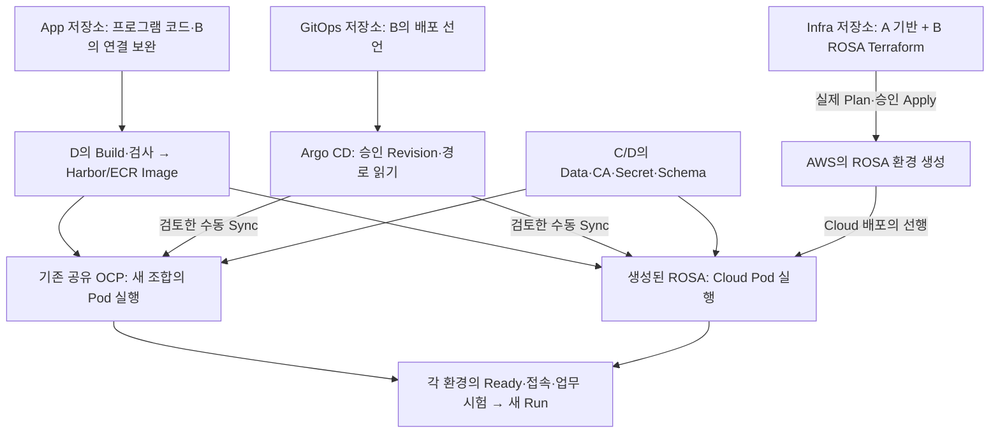

# 정태훈 작업·흐름·학습 안내

**읽는 순서:** [개인 상위 Docs #21](https://github.com/seokpan/seokpan-hybrid-docs/issues/21) → [현재 실행판](TJUNG03_EXECUTION_BOARD.md) → 원 이슈. 첫 안내만 지난 전체 작업을 소개하며 이후에는 **이번 변경·영향·대기·다음 행동**을 설명한다. 완료 체크는 원 이슈를 따른다.

## 1. 지금 무엇을 만드는가

2차 목표는 **정상 서비스는 AWS 안에서 실행하고, Cloud 장애 때는 보존한 자료로 온프레미스에서 복구하는 것**이다. 온프레미스는 CI·이미지·백업 보관도 맡는다. B 정태훈은 App 연결·GitOps 배포 선언·ROSA 구성과 통합을 맡으며 A 이유빈의 기반, C 김상희의 Data/복구, D 최유준의 Image/시험을 연결한다.

- **OCP(OpenShift Container Platform):** 컨테이너를 실행·관리하는 Kubernetes 플랫폼. 현재 공유 실습 환경은 ROSA 이전 사전검증용이다.
- **ROSA:** AWS에서 제공되는 관리형 OpenShift. 정상 서비스의 최종 대상이다.
- **코드 병합:** 팀이 사용할 파일을 Git `main`에 합치는 일. 실제 서버 생성·프로그램 실행은 별도의 실행이다.

공유 OCP의 기존 배포는 [D의 GitOps #5](https://github.com/seokpan/seokpan-hybrid-gitops/issues/5)에 있다. **현재 API 조회는 하지 않았다.** 과거 보고·오늘의 서버 상태·새 hybrid Source/Image 성공은 구분한다. ROSA 코드 병합도 생성 완료가 아니다.

## 2. 저장소의 코드가 실제 프로그램으로 실행되는 경로



그림은 실행 경로이며 오늘 실제 실행을 완료했다는 표시가 아니다. OCP에는 기존 공유 환경을 사용하고, ROSA에는 별도의 생성 단계가 있다.

**Image**는 실행 프로그램/파일 묶음이다. **Manifest**는 Image·실행 수·설정을 적은 YAML, **Render**는 최종 YAML을 만드는 일이다. **Argo CD Sync**가 선언을 클러스터에 적용한다. **Pod**는 컨테이너 실행 단위, **Ready**는 요청을 받을 준비 상태다. 업무 성공은 추가 시험한다.

**Terraform Plan**은 AWS/ROSA 변경 내용을 확인하고 **Apply**는 실제 자원을 변경한다. App Sync와 ROSA 생성은 별개다. Render/PR 작성만으로 서버에 추가되지 않는다.

**Owner**는 관리 책임자, **Secret**은 비밀 설정을 담은 객체, **CA**는 서버 인증서를 검증하는 자료다. **Schema**는 DB 구조, **Migration**은 필요한 구조 변경 절차다. 현재 구조를 확인한 성공만으로 실제 구조 변경까지 검증했다고 판단하지 않는다.

## 3. 실제 Source로 현재 보류 이유 읽기

[GitOps main](https://github.com/seokpan/seokpan-hybrid-gitops/tree/3dc624d4dc9a774a6207708bfd68248101890401)의 다음 구문을 대조했다. 여러 파일의 관련 부분을 발췌한 것이며 그대로 실행하는 명령이 아니다.

```yaml
# apps/base/backend.yaml — frontend.yaml도 같은 보류
replicas: 0
image: seokpan-backend:INPUT_REQUIRED

# clusters/ocp-lab/reuse/application.yaml의 spec.source
targetRevision: GITOPS_REVISION_INPUT_REQUIRED
path: apps/overlays/lab
```

`replicas: 0`은 파일에 적은 원하는 실행 수 0개, `INPUT_REQUIRED`는 승인 입력 미반영이라는 뜻이다. 현재 클러스터의 실제 Pod 수를 조회한 결과는 아니다. `reuse`는 기존 승인 Application 대조용이며 중복 등록하지 않는다. 실제 Owner·Image Digest·Secret/CA·Schema 수락 → 활성화 변경 검토 → 수동 Sync로 진행한다. **파일 존재·Synced·Ready·업무 PASS는 각각 다르다.**

## 4. B의 지난 작업과 아직 하지 않은 실행

아래는 지난 작업의 개요다. 작성·검사 지원은 Codex, 배정 책임은 B이며 실제 팀 서버 수행자를 대신 표시하지 않는다.

| 영역·변경 위치 | 이미 준비·검사한 것 | 연결 담당·아직 남은 것 |
|---|---|---|
| **App** `backend/src/seokpan/connection_settings.py` | DB/Redis·TLS/CA·별도 AUTH 계약, Migration 분리·병합 | C 실제 대상/권한·D Image → 양성/음성·업무 시험 |
| **App** `backend/docs/turn-departure-finalization.md`, [App #4](https://github.com/seokpan/seokpan-hybrid-app/issues/4) | 동시 착수/퇴장·종료·부분 실패 보완과 회귀 검사 | B/C/D 실제 DB/Redis·1→2→3 Pod 전환·업무 수락 |
| **GitOps** `apps/base`, `apps/overlays/{lab,cloud,recovery}`, `clusters/ocp-lab` | 공통/환경별 선언, 입력 보류·수동 배포·Owner/삭제/Migration 경계. #9/#11 병합 | D/C 최소 입력 → OCP 실제 실행. Cloud·Recovery는 각 환경에서 별도 시험 |
| **Infra** `terraform/rosa/{cluster,oidc,bindings}.tf` | ROSA 구성·OIDC issuer 정규화/Trust 조건·단계별 Worker SG 연결, #28 병합 | A/C 실제 출력 → B 실제 Plan·비용·승인 생성 → STS/Pull/Data 통합 |
| **Docs** `tools/recovery_metrics.py`, `evidence/T18` | 시간 계산 도구와 합성 Data/Backend 두 부분 예행 | 실제 운영 Backup·FE/browser/WSS·승인 Image·전체 T18은 미실행. 전체 RTO/RPO 미판정 |
| **Docs** 실행판·Tracker·05·원 이슈 | 역할/인계·TH81·종료 경로·리뷰를 연결 | 원 결과를 먼저 기록하고 최신 연결 유지. Source 병합만으로 미완료 체크를 완료하지 않음 |

근거는 [05 §9](05_IMPLEMENTATION_AND_VALIDATION.md)와 원 이슈/PR에 있다. 과거 SHA·목표·Draft는 당시 이력으로 읽고 현재 실행판을 우선한다.

## 5. 지금 진행하는 두 갈래

| 목적·원본 | B가 지금 준비하는 것 | 누구의 무엇을 기다리며 어디가 막히는가 | 다음 가지 |
|---|---|---|---|
| **OCP 인계** [GitOps #10](https://github.com/seokpan/seokpan-hybrid-gitops/issues/10), `handoff/OCP_FIRST_DEPLOYMENT.md` | D Image 제공/B 수락 완료·held Digest 개정, Source/Render/Case·단일 Owner 대조 | Source 리뷰/병합·D Namespace Secret/권한/공유 사용·C/D Data/CA/Schema 준비 → 활성화/Sync | 해당 Workload Pull/Ready·D #6/B/C 업무 시험 → ROSA 조합/차이 인계 |
| **ROSA 병행** [Infra #25](https://github.com/seokpan/seokpan-hybrid-infra/issues/25), `terraform/rosa/INPUT_CONTRACT.md` | 입력 요구·Caller/Backend/목적 권한/지원·Plan/비용/창 준비 | **Plan**: A 필수 기반 출력·C Data SG 2개·B 목적 Caller/Backend/지원·권한 수락. **생성**: 실제 전체 Plan/비용/실행 승인 | 생성 → 실제 Worker SG Binding → Pull/Data/Secret → Window A |

**A 전체 업무·OCP 삭제·완성 Recovery Bundle을 기다리지 않는다.** 두 갈래를 병행하며 입력 수락·실행·결과 수신을 구분한다. 수신 미확인은 자원이 없다고 실측한 뜻이 아니다.

**현재 기준 — 2026-10-06 KST:** [D Run#3](https://github.com/seokpan/seokpan-hybrid-app/pull/10#issuecomment-6009053898) SUCCESS·Harbor-only·`linux/amd64` 보고와 FE/BE Final Index Digest를 [B 수락 답변](https://github.com/seokpan/seokpan-hybrid-app/pull/10#issuecomment-6009213599)에서 제공 개정으로 수락했다. App Source는 `46e21a74dd608b41f2c12a0a57d76bddfcf25949`, Final tag는 `git-46e21a74dd60`다. 초기 frontend Alpine 경고는 최신 D 스캔 정정으로 공급 대기에서 해소했다. Private Harbor 원본 metadata/bytes를 B/AI가 독립 조회한 것은 아니며 cp-03 Podman Pull/Smoke 보고도 OCP Workload Pull/Ready 판정과 구분한다. [GitOps PR #13](https://github.com/seokpan/seokpan-hybrid-gitops/pull/13)은 검토 HEAD `c798ed28d516533d5ffb984ad58332e3a5e5829d`의 [D 최신 승인](https://github.com/seokpan/seokpan-hybrid-gitops/pull/13#pullrequestreview-5424398322) 후 main `fc175a7002ad567e9d5206b6e4b6642e8416eea2`로 병합됐고 작업 브랜치 삭제를 확인했다. [Source CI #40](https://github.com/seokpan/seokpan-hybrid-gitops/actions/runs/37420661610)의 39개 검사 통과(skip0)는 기존 검증 결과이며 이번에 새 검사/실행을 추가하지 않았다. 이전 e757 승인 `DISMISSED`·c798 `blocked`/재검토 요청은 [보완 답변](https://github.com/seokpan/seokpan-hybrid-gitops/pull/13#issuecomment-6010256873) 당시 이력이고 현재 Source 승인·병합 대기는 해소됐다. [Docs #53](https://github.com/seokpan/seokpan-hybrid-docs/pull/53)도 main `17b601b1e4dc2db82efaf8e82df78a39ae9c1376`로 병합·브랜치 삭제됐다. Source 준비 완료와 실제 입력 공급·활성화·실행 수락은 별개다. 현재 변경의 원리는 §5.8·[05 §9.36](05_IMPLEMENTATION_AND_VALIDATION.md#b-image-receipt-held-source-pullsecret-20261006)에서 본다. 이전 Source/Run 대기·학습은 당시 이력이며 C 기록/체크는 보존한다.

병합 main [Run 37330480298](https://github.com/seokpan/seokpan-hybrid-gitops/actions/runs/37330480298)의 39개 검사와 실제 Render8 다운로드/Hash·목록 대조를 확인했다. 현재 artifact는 main6ea 개정이며 **10/13 00:09:31 KST**에 만료된다. D Run3 Image 제공/B 개정 수락은 확인됐고 D/C의 파일 수신/별도 보존·실제 Namespace Secret/lab/Data/Migration 준비와 활성화 후 Pull/Ready/업무 수락은 후속이다. 실제 클러스터/API를 조회한 자원 부재 판정은 아니다.

<details>
<summary>이전 PR HEAD의 인계·승인·파일 대조 이력</summary>

당시 OCP Source/Render·입력·Case 인계는 [GitOps PR #12](https://github.com/seokpan/seokpan-hybrid-gitops/pull/12)의 [인계 카드](https://github.com/seokpan/seokpan-hybrid-gitops/blob/60bda5a697957506c4b47126ed7c1202b6755470/handoff/OCP_SOURCE_HANDOFF_20261005.md)에 모았다. Source 검사는 승인 Image나 실제 서버 입력을 대신하지 않는다. D/C가 사용할 개정을 읽고 수락했는지는 원 이슈에서 따로 기록한다.

당시 [실제 CI Run](https://github.com/seokpan/seokpan-hybrid-gitops/actions/runs/37326125711)은 정확 HEAD의 39개 검사를 통과했고, 생성된 8개 진단 Render 파일을 내려받아 SHA256·목록·Source 개정을 확인했다. [제출·리뷰 요청 기록](https://github.com/seokpan/seokpan-hybrid-gitops/pull/12#issuecomment-5996770603)의 사람 수신·Image/Data 입력·실제 OCP 실행은 별도 대기다. Run의 Artifacts에서 로그인 후 받을 수 있으며 만료는 **10/12 23:37:14 KST**다.

[D의 당시 승인](https://github.com/seokpan/seokpan-hybrid-gitops/pull/12#pullrequestreview-5416426726)은 인계 문서·CI 보존 범위다. D는 ZIP 직접 다운로드/대조를 하지 않았으며 C 검토·파일 수신/보존·실입력·Runtime 수락은 별도 대기다. [제안 처리](https://github.com/seokpan/seokpan-hybrid-gitops/pull/12#issuecomment-5996985679)에 따라 lab 활성화와 해당 검사 변경은 같은 활성화 PR에서 진행하며, 다른 환경의 보류 검사는 유지한다. 인계서 명령은 별도 Bash 스크립트로 저장해 실행한다. Node 경고는 CI 유지보수에서 공식 요구와 재검증을 확인한다.

</details>

### 5.1 본인 환경에서 지금 확인할 것

**지금 기기는 본인 작업 PC의 Bash 터미널(Git Bash/WSL 등), 위치는 `seokpan-hybrid-gitops` clone이다.** 먼저 상태를 읽고 개인 변경과 사용할 SHA를 기록한다. OCP 관리 명령은 D가 확인한 Context/권한이 있는 관리 기기에서, ROSA Terraform은 승인된 Controller의 Infra clone에서 실행한다. 각 기기가 같을 수도 있지만 Source clone이 있다는 사실만으로 클러스터 접근 권한이 생기지는 않는다.

아래에서 경로를 실제 clone 경로로 바꾼다. `fetch`는 원격 참조를 갱신한다. 기존 작업 파일에 새 main을 반영하는 방식은 개인 변경을 확인한 뒤 정한다.

```bash
B_GITOPS_DIR='/absolute/path/to/seokpan-hybrid-gitops'
git -C "$B_GITOPS_DIR" status --short --branch
git -C "$B_GITOPS_DIR" fetch origin main
git -C "$B_GITOPS_DIR" rev-parse HEAD origin/main
git -C "$B_GITOPS_DIR" diff --stat HEAD origin/main
git -C "$B_GITOPS_DIR" diff --stat
git -C "$B_GITOPS_DIR" diff --cached --stat
```

`rev-parse`의 첫 줄은 본인 HEAD, 둘째 줄은 받아온 main이다. 이번 병합 기준 GitOps main은 `6ea2d9a90ab7c58803767220abf956d3c1b54a5f`다. 두 SHA가 다르면 위 차이와 원 이슈의 최신 개정을 대조한다. 개인 변경은 자동으로 버리거나 덮어쓰지 않고 보존/반영할 것을 나눈다. **Source 환경 확인 결과는 Docs #21의 TH01과 GitOps #10에 `본인 HEAD / main SHA / 개인 변경 유무·보존 방식 / 다음 행동`으로 기록한다.** 실제 상태를 확인하기 전 TH01 전체를 완료 체크하지 않는다.

그다음 `handoff/OCP_SOURCE_HANDOFF_20261005.md`의 입력표를 읽고 D/C 회신에서 **공급 개정·보호 참조·수락/보완**을 연결한다. 단순 승인 댓글과 실제 값 공급은 다르다.

### 5.2 받은 입력은 어디로 들어가는가

아래 경로는 GitOps 기준이며 Infra만 별도 표기한다. **아직 입력이 없는 칸은 그대로 보류한다.** 한 필드를 채웠다는 이유만으로 관련 실행 전체를 허용하지 않는다.

| 받은 입력 | 들어갈 파일·필드 또는 별도 공급 | 관련자·다음 확인 |
|---|---|---|
| FE/BE 승인 Image·Final Index Digest/Platform | `apps/overlays/lab/kustomization.yaml`의 `images[].newName`/`digest`, Recovery Image와 held Migration BE Digest | D Run3 제공/B 수락 완료 → held Source 리뷰/병합. Lab/Recovery replicas0·Job suspend/current와 기타 base/Cloud 보류 유지. 나머지 실제 입력 수락 뒤 별도 활성화/Sync에서 Pull·Ready 확인 |
| 기존 Controller·Project/Application·Namespace·Owner | **선택한** Application의 `metadata.namespace`, `spec.project`, `source.targetRevision/path`, `destination.namespace`. `clusters/ocp-lab/reuse/application.yaml`은 기존 객체 대조용 | D/공유 Owner 확인 → B 원본/권한 대조. 같은 App를 관리하는 후보를 중복 등록하지 않음 |
| DB/Redis 대상·Port·DB와 실제 Route Host | `apps/overlays/lab/runtime.env`의 `SEOKPAN_DATABASE_EXPECTED_*`, Redis URL/EXPECTED 값·`SEOKPAN_ALLOWED_ORIGINS`; `routes.yaml`의 같은 Host FE/API/WSS | C 계약 + D 경로 + B 소비. Secret 속 목적 URL·인증서 Host/CA와 일치 확인 |
| Runtime 비밀번호/AUTH·CA | 별도 Owner가 공급하는 `backend-db-runtime`·`backend-redis-runtime` Secret, `backend-database-ca`·`backend-redis-ca` ConfigMap. `apps/base/backend.yaml`은 이 이름/키를 참조 | C/D 보호 공급 → B/D 개정·참조 수락. 비밀값을 YAML/Issue/Render에 넣지 않음 |
| 필요한 Migration action/deadline·목적 자격·Schema 수락 | 별도 `operations/ocp-lab/migration/job.yaml`의 같은 BE Digest·Action·deadline·ConfigMap hash 이름; `backend-db-migration`의 별도 자격 | C 판단/수락 + 지정 실행자. `current=head`는 DDL 성공이 아니며 필요한 단일 실행 결과를 수락한 뒤 App Sync |
| A 기반 출력·C Data SG2·B 지원/비용/창 | **Infra** `terraform/rosa/inputs.tfvars.json.example`을 기준으로 승인 보호 작업 사본의 `foundation.*`, `execution_review.*`, 실제 OpenShift 버전/Worker disk를 채움. Backend도 승인 작업 사본에서 연결 | A 공급 + C 검토 + B 수락 → 실제 Plan. 공개 예제에 실제 입력/자격을 올리지 않음. `worker_sg_binding=null`은 생성 후 실제 Worker SG를 확인해 연결하는 별도 단계 |

**첫 행동은 PC의 Source 상태 확인, 다음은 D/C 입력 개정 수락이다.** 실제 입력이 모이면 활성화 PR/검사를 만들고, 대상·Owner·필요 Schema 수락 후 수동 Sync와 새 Run을 진행한다. ROSA 실제 첫 Plan 입력 준비는 동시에 계속한다.

### 5.3 기존 도구로 실행 승인본을 점검하는 시점

지금 받을 수 있는 진단 파일은 [병합 main Run 37330480298](https://github.com/seokpan/seokpan-hybrid-gitops/actions/runs/37330480298)의 Artifacts에 있다. 별도 폴더에서 `sha256sum -c SHA256SUMS`로 받은 파일을 확인한다. 진단 파일의 0 Replica/미확정 입력/보류 Job은 실행 승인본이 아니다. **현재 점검은 Render8의 Hash/목록 일치와 기존 Migration CLI의 미확정 입력 거부(exit2)이며 Runtime은 미실행이다.**

실제 Image·대상·Data 입력 수락과 활성화 개정 후에는 GitOps Root에서 기존 `make release-manifest ENVIRONMENT=lab`으로 새 별도 출력파일을 만든다. 필요한 Migration이 별도 수락된 경우에만 `make migration-source-check`로 같은 Backend Digest·최종 ConfigMap 이름·DB 대상/CA·목적 자격·C의 action/deadline을 대조한다. 호출 인자와 경계는 [기존 Makefile](https://github.com/seokpan/seokpan-hybrid-gitops/blob/6ea2d9a90ab7c58803767220abf956d3c1b54a5f/Makefile)·[인계 카드](https://github.com/seokpan/seokpan-hybrid-gitops/blob/6ea2d9a90ab7c58803767220abf956d3c1b54a5f/handoff/OCP_SOURCE_HANDOFF_20261005.md)를 따른다. 검사 성공은 실제 Pull/권한·TLS/업무 성공과 다르다.

**이번 공부:** `runtime.env` 내용이 바뀌면 Kustomize가 `backend-config-<hash>`와 Backend의 `envFrom` 참조를 함께 바꾼다. 현재 진단 Render의 이름은 `backend-config-mb7mk6mgt2`다. 활성 상태에서 이 PodTemplate 변경을 승인 Sync하면 새 Pod 실행으로 연결된다. 고정 이름의 외부 Secret/CA를 교체했다고 기존 환경변수·TLS 연결까지 자동 갱신됐다고 판단하지 않고 별도 확인한다. 동작 근거는 [Kustomize의 생성 이름/참조](https://kubernetes.io/docs/tasks/manage-kubernetes-objects/kustomization/)·[ConfigMap 환경변수 갱신](https://kubernetes.io/docs/concepts/configuration/configmap/)을 함께 읽는다.

ROSA의 본인 Source/도구·Lock·보호 입력·Caller/Backend 준비는 [Infra PR #31](https://github.com/seokpan/seokpan-hybrid-infra/pull/31)의 [실행 절차](https://github.com/seokpan/seokpan-hybrid-infra/blob/4f4f02f729dadacba6d1a808f08a8671a4bff265/terraform/rosa/LOCAL_PREPARATION.md)를 따른다. 지금은 실제 AWS 인증/Plan을 수행한 상태가 아니며 이 준비를 OCP와 병행한다.

### 5.4 이번 변경이 실행을 여는 지점

| 현재 변화·파일 | 동작 원리·B가 소비할 결과 | 직접 다음 행동 |
| --- | --- | --- |
| D [App6](https://github.com/seokpan/seokpan-hybrid-app/pull/6) `Jenkinsfile.image-pipeline`, `scripts/image_registry.py` | 고정 App Commit을 검사·Build해 실행 Image를 Registry에 올리는 절차. 기본 `ENABLE_ECR=false`는 Harbor 경로 | 당시 App6 stub 차단은 해소. 이후 D 첫 Run의 P1 npm audit 실패 보고→App8 lock패치 기존B승인/병합. helper23/Linter와 lock검토는 Source 범위이며 D 새 main 실제 npm12/Build·Digest/Scan/Smoke/Pull 인계는 후속 |
| A [Infra32](https://github.com/seokpan/seokpan-hybrid-infra/pull/32) `terraform/foundation/`의 공통 Provider/Backend/Lock | 같은 foundation 폴더/State에서 Network/Data/Registry를 계산할 실행 기준. `phase2/foundation/terraform.tfstate`와 rosa State는 구분 | 공통 틀 병합과 실제 Backend/Plan/Apply/Output 인계는 별개. A/C 실제 VPC/Subnet/Role/Data SG2를 받아 B 첫 ROSA Plan. C Infra10 probe는 해당 격리 범위 성공 |
| D [Docs43](https://github.com/seokpan/seokpan-hybrid-docs/issues/43) ← B Infra25 | 전체 비용 집계에 ROSA 수량·가동/삭제/재시험 시간과 잔존 범위가 입력됨 | B가 설계 기준 예비 입력 제출 → 실제 Plan/지원·가격/누적 확인 뒤 개정. 이슈 생성·입력 제출·전체 Cost PASS를 구분 |

**새 Network Source:** A [Infra #33](https://github.com/seokpan/seokpan-hybrid-infra/pull/33)은 HEAD `2a5b05bb4b8e8903cfd359f1133c0d7df993d3f4`의 Draft다. `terraform/foundation/outputs.tf`의 `vpc_id`와 `network_subnets.az_a/b/c.{availability_zone,public_id,rosa_private_id}`를 B 보호 사본의 `foundation.vpc_id`/`foundation.subnets` 해당 필드로 제한 소비한다. 필드 이름과 Public3+ROSA Private3 구조가 맞는다는 Source 확인이며 실제 ID·완전한 Account/Role/Policy/Data SG2 인계 수락은 아니다. 추가 Data Subnet ID/AZ ID를 ROSA 설치 입력으로 통째로 넘기지 않는다. C Data 참조/B 소비/D NAT·EIP 비용의 Source 검토와 A의 Ready 전환 후속은 원 PR, B 매핑·입력 대기는 Infra25에 연결했다. A 보고 fmt/validate·AZ/EC2 조회를 B의 실제 Plan/ROSA 서비스 지원/통신 PASS로 승계하지 않는다.

**Image Digest(이미지 내용 식별값):** 실제 Run의 `commit_sha_full`, `jenkins_build_url`, `components.<frontend/backend>.harbor.final_digest`와 `release_json_images.<frontend/backend>.harbor_digest`를 받으면 정확 Source·Image·검사 개정을 대조한다. Harbor-only에서 ECR Digest `null`은 Cloud Image 승인이 아니다. Health Smoke의 `/health/live`는 기동 확인 범위이고 DB/Redis·TLS/AUTH·Migration·FE/API/WSS 대표 업무는 별도 OCP 시험이다. Pipeline의 `gitops_change: "NONE"`인 동안 Image가 생겨도 GitOps/OCP 선언이 자동으로 바뀌지 않는다.

```yaml
# apps/overlays/lab/kustomization.yaml — 실제 승인 입력을 받은 뒤 연결
images:
  - name: seokpan-backend
    newName: <승인된 Harbor Backend Repository>
    digest: sha256:<승인된 전체 Digest>
```

FE도 같은 방식으로 연결한다. 실제 입력 수락 후 lab 최초 Replica·설정/CA/Secret 참조·필요 Migration 선언과 lab 검사를 같은 활성화 PR에서 맞춘다. 필요한 Migration에는 같은 승인 Backend Digest·최종 ConfigMap Hash·C가 수락한 Action/Deadline·별도 목적 자격을 사용한다. 이 구문은 입력 경로 설명이며 승인 값이 들어간 실행 YAML은 아니다. Cloud/Recovery 보류를 함께 풀지 않는다.

**지금 행동:** Image 제공·개정 수락과 Source 승인·병합 대기는 해소됐다. B는 이제 D와 대상 Namespace의 실제 Pull Secret 공급·Context·권한·단일 Owner, C/D Data·CA/TLS/AUTH·Schema/필요 Migration 준비를 수락한다. 그 뒤 별도 활성화 개정·필요 단일 Migration·수동 Sync를 수행하며 해당 Job/Pod의 Workload Pull·Ready/FE/API/WSS/대표 업무 Case를 같은 조합으로 확인한다. 선언의 Digest/Secret 이름만으로 실제 실행을 완료 처리하지 않는다. ROSA는 A/C 실제 기반/SG2·본인 목적 Role/Caller/Backend·지원/비용 준비를 병행하며 OCP 종료를 기다리지 않는다.

### 5.5 이번 학습 — Network 출력과 비용 기간의 소비

**Network Subnet/AZ 매핑:** foundation의 `network_subnets[az_a/az_b/az_c]`에서 B는 같은 슬롯의 `availability_zone`, `public_id`, `rosa_private_id`를 rosa 입력에 연결한다. 설치 배열은 Public3 → ROSA Private3의6개이고 Data Private3은 추가하지 않는다. `availability_zone_id`는 실제 AZ 이름/ID 대응 근거로 보존한다. [B 답변](https://github.com/seokpan/seokpan-hybrid-infra/pull/33#issuecomment-6008053282)의 필수 Source 수정0은 이 표현을 소비할 수 있다는 뜻이며 실제 VPC/Subnet·권한/지원·Plan/Apply 성공이 아니다. [A 답변](https://github.com/seokpan/seokpan-hybrid-infra/pull/33#issuecomment-6008091169)으로 이 소비 범위는 수신됐지만 실제 값 공급/수락은 후속이다. A33은 Draft이고 공통 JobHost/VPN 반환 Route 후속은 Data 접근/이전 단계에 연결한다.

**Cost Ledger(비용 입력/집계표):** B는16~21행의 서비스 수량/사양과 기간을 공급하고 D가 전체 비용을 집계한다. 실제 비용은 수량×단가×그 서비스의 과금 기간으로 연결되므로 기간 공란이 수식에서0으로 처리돼도 기간0이 확인된 것이 아니다. 현재 후보/미확인·PARTIAL을 유지하며, 기간 L/M/N을 확인하지 않는 P 완결식은 D가 최종 판정 전 보완/검토할 부분이다. 원본 워크북을 대신 수정하지 않았다.

Window A10/12~15·B10/19~21은 목표 날짜이며8시간 예시/날짜 전체 상시 가동이 아니다. 서비스별 준비/초기화·시험·실패/재시험·삭제 완료/과금 종료를 계획하고 본인/팀 가용 시각과 횟수·지연을 확인해 기간을 채운다. 생성/Destroy timeout60분은 실제 과금시간이나 성공 보장이 아니다. 현재 실제 사양/Disk/LB·기간은TBD이며 [Infra25](https://github.com/seokpan/seokpan-hybrid-infra/issues/25)→[D Docs43](https://github.com/seokpan/seokpan-hybrid-docs/issues/43)에서 입력/수신/집계 상태를 구분한다. 첫 Plan 전 예비 비용 참조와 실제 전체 Plan 후 총비용/창 수락을 혼동하지 않는다.

### 5.6 이번 학습 — Source 확인과 실제 실행을 나누는 이유

| 배우는 것 | 실제 파일·이번 확인 | 다음 실제 확인·나누는 이유 |
| --- | --- | --- |
| **Lockfile:** 설치할 외부 패키지의 정확한 버전을 고정하는 파일. Consumer는 그 패키지를 사용하는 다른 패키지 | App의 [frontend/package-lock.json](https://github.com/seokpan/seokpan-hybrid-app/blob/e862a0f9e384f2e5539e69c31fbf0b4678c87a25/frontend/package-lock.json): source-map-js의 version/resolved/integrity 3필드를1.2.2로 변경. 직접 사용하는 패키지3개의 `^1.2.1` 요구와 호환 확인 | D가 프로젝트 npm12로 `npm ci` → verify/build → 새 Image/검사를 실행한다. 버전 범위가 맞아도 실제 설치 자료·integrity·bundle/browser 동작은 추가 확인해야 한다. devDependency(개발/Build용 패키지)도 최종 bundle에 영향을 줄 수 있다 |
| **State 접근과 서비스 권한:** 작업 상태 파일을 저장하는 권한과 AWS 자원을 읽고 바꾸는 권한은 다름. Tag는 자원에 붙이는 이름·값 표시 | Infra의 [terraform/rosa/REVIEW_AND_EXECUTION_GATES.md](https://github.com/seokpan/seokpan-hybrid-infra/blob/ba11c9f7f6c205748b37e1376b60ec86b00169a3/terraform/rosa/REVIEW_AND_EXECUTION_GATES.md): 단계별 호출을 구분하고 A 리뷰 뒤 조건부 Tag 조회를 같은 PR35에서 보완. 정상 Get은 Tag 출력이 있으면 별도 ListTags 조회를 건너뜀 | Update에서 식별자가 있고 예정 `tags_all`이 아직 완전히 정해지지 않았으면 Tag 갱신 성공 뒤 다시 조회한다. 이 경로의 두 ListTags Action만 현재 OIDC·Role6 ARN에 연결했다. 모든 Refresh의 필수 호출로 넓히지 않는다. 같은 HEAD Source CI 통과 뒤 A 승인·PR35 병합을 확인했다. 이후 좁은 정책 구현/리뷰/적용과 B 실효 Caller/단계 결과·해당 단계의 조건부 호출/미발생 기록을 확인한다. 수요표 제출은 실제 권한 부여/PASS가 아니다 |
| **예상 비용과 실제 비용:** 생성 전 계획과 생성 후 관측값의 시점을 구분 | [Docs43 B 비용 응답](https://github.com/seokpan/seokpan-hybrid-docs/issues/43)·[D 수신/수정 보고](https://github.com/seokpan/seokpan-hybrid-docs/issues/43#issuecomment-6008406025): 비용1~5 유지, CP/Infra/LB 지원 예상구성·Worker disk·Window/삭제/재시험 입력과 본인 가용성 구분 | 생성 전 지원 구성/예상목록·예상시간으로 검토하고 생성 후 실제목록/기간으로 갱신한다. 가용 시각은 팀 실행창 자료이며 Cloud 과금기간과 같지 않다. 새 xlsx를 받기 전에는 수식 독립 재검증/Cost PASS로 표현하지 않는다 |

이 표는 이번 변경의 동작 원리만 설명한다. Source 승인·수요표 제출·보고 수신과 실제 npm12/Cloud 실행을 구분하며 본인 가용 시간은 실제 응답 전 미확인으로 둔다.

### 5.7 이번 학습 — 첫 Image Push와 Jenkins의 상태 판정

| 배우는 것 | 실제 변경·파일 | 다음 실제 확인 |
| --- | --- | --- |
| **Harbor Project·Repository·Image:** Project는 저장 경계, Repository는 Image 버전 묶음이며 첫 Push에서 생성될 수 있음 | [scripts/image_registry.py](https://github.com/seokpan/seokpan-hybrid-app/blob/46e21a74dd608b41f2c12a0a57d76bddfcf25949/scripts/image_registry.py)·[scripts/test_image_registry.py](https://github.com/seokpan/seokpan-hybrid-app/blob/46e21a74dd608b41f2c12a0a57d76bddfcf25949/scripts/test_image_registry.py): Harbor 404의 `NOT_FOUND`/`NAME_UNKNOWN`을 부재로 처리해 첫 Push로 진행. ECR의 Repository 부재 오류와 그 밖의 오류는 유지 | 이번 독립 Registry helper 25개 검사는 통과했으며 Jenkins/Harbor 실제 Run 성공은 아니다. 잘못된 Harbor Project도 부재처럼 보일 수 있으므로 실제 Push와 후속 Scan/Smoke/Promote/Digest 결과까지 수락한다. Guard 통과만으로 Image 성공은 아님 |
| **Jenkins CPS:** Pipeline을 중단·재개할 때 실행 중 값도 저장함([공식 설명](https://www.jenkins.io/blog/2017/02/01/pipeline-scalability-best-practice/)) | [Jenkinsfile.image-pipeline](https://github.com/seokpan/seokpan-hybrid-app/blob/46e21a74dd608b41f2c12a0a57d76bddfcf25949/Jenkinsfile.image-pipeline): 저장할 수 없는 정규식 Matcher를 남기지 않고 문자열로 `OK`/`ALREADY_ABSENT` 상태를 판정 | D 새 Run의 실제 Cleanup·결과 파일/Evidence 확인이 필요하다. helper 검사·문법 검사는 Jenkins 재개/정리 성공과 다름 |

App10은 기존 B 승인 뒤 병합됐으며 이번에 새 APPROVE를 올린 것이 아니다. App9의 Source 이슈 종료와 새 Run의 실제 전체 성공을 구분한다.

### 5.8 이번 학습 — 제공된 Image를 선언에 넣은 뒤 실제 Pod가 쓰는 과정

| 핵심 원리 | 이번 실제 파일·변경 | 남은 실제 확인 |
| --- | --- | --- |
| **Digest:** Image 내용의 식별값. Index는 플랫폼별 Manifest 목록을 가리키고 child는 한 플랫폼의 Manifest임 | [apps/overlays/lab/kustomization.yaml](https://github.com/seokpan/seokpan-hybrid-gitops/blob/c798ed28d516533d5ffb984ad58332e3a5e5829d/apps/overlays/lab/kustomization.yaml)·[apps/overlays/recovery/kustomization.yaml](https://github.com/seokpan/seokpan-hybrid-gitops/blob/c798ed28d516533d5ffb984ad58332e3a5e5829d/apps/overlays/recovery/kustomization.yaml)·[operations/ocp-lab/migration/job.yaml](https://github.com/seokpan/seokpan-hybrid-gitops/blob/c798ed28d516533d5ffb984ad58332e3a5e5829d/operations/ocp-lab/migration/job.yaml): FE/BE와 보류 Migration에 제공 Final Index Digest를 사용 | `linux/amd64` 결과의 child Digest나 local image ID로 바꾸지 않는다. Source는 승인·병합됐다. 실제 입력 수락 뒤 별도 활성화·수동 Sync하면 Controller가 선언을 읽고 Pod 기동/Pull을 시도한다. 실제 Ready/Data/업무 Case는 별도 확인 |
| **imagePullSecrets:** Pod가 Private Registry에 인증할 때 참조하는 Kubernetes Secret 이름. 같은 Namespace에 실제 Secret이 있어야 함 | [apps/overlays/lab/registry-pull.yaml](https://github.com/seokpan/seokpan-hybrid-gitops/blob/c798ed28d516533d5ffb984ad58332e3a5e5829d/apps/overlays/lab/registry-pull.yaml): Lab `lab-harbor-pull` 참조 추가. Recovery 기존 `recovery-harbor-pull` 유지. `kubernetes.io/dockerconfigjson`/`.dockerconfigjson`·필요 project의 Pull Repository 권한으로 공급. 비밀값은 Git에 넣지 않음 | 인증 Secret과 Registry TLS 신뢰는 다르다. 추가 Trust 변경이 실제 필요하면 공유 Owner와 합의한다. 이름/형식 선언은 실제 공급/인증 성공이 아니다. D가 대상 Namespace/Owner·보호 공급 참조와 목적별 Workload Pull을 인계한다. cp-03의 Podman Pull 보고를 OCP Pod Pull로 승계하지 않는다 |

순서는 **D Image 개정 제공/B 수락 → B held Source 개정 → PR 리뷰/병합 → 실제 Secret/Data·Owner 수락 → 별도 활성화/필요 Migration·수동 Sync → 해당 Workload Pull/Ready/업무 시험**이다. §5.7의 새 Run/Cleanup 대기는 당시 이력이며 D Run3 성공 보고는 이번에 수락했다. 현재 replicas0·Job suspend/current를 유지하므로 이번 Image 선언만으로 App이 가동되는 것은 아니다. OCP Image 공급 대기는 해소됐고 Source 리뷰와 나머지 실제 최소 입력은 계속 대기한다.

### 5.9 이번 학습 — 입력 완료와 비용 판정은 따로 확인한다

| 배우는 원리 | 실제 이번 확인 | 왜 필요한가 |
| --- | --- | --- |
| **수량 × 단가 × 과금기간** | 개정 원장의 기간 공란은 비용 빈칸·미완. 합성 입력의 IPv4 4개×$0.005×24시간은$0.48 | 빈칸은 아직 모르는 값이다. 기간0을 확인한 것과 다름. 예시는 서울 견적 확정값이 아님 |
| **숫자 검증** | 판정 B7/B11/B12에 `미확인`을 넣으면 빈칸 검사에서 빠져 합성 PASS가 나올 수 있음 | 글자가 들어있어도 비용 계산에 쓸 숫자가 없을 수 있다. 숫자·비음수와 완결 상태를 함께 확인 |
| **최대시간 = 남은 예산 ÷ 시간당비** | 계획선$450·비시간 비용$150·시간당$2이면150시간. 현 B20은 비시간 비용을 빼지 않아225시간 표시 | EBS/GB·전송·보관·Buffer처럼 시간당비에 없는 비용을 먼저 포함해야 실제 남은 예산을 알 수 있음 |
| **예상과 실제** | B 입력은 개정 원장19~24행. 생성 전 지원 구성/예상 목록·기간, 생성 후 실제 목록·기간을 따로 기록 | 본인 가용 시각은 팀 실행 창이고 Cloud가 과금되는 시간과 같지 않음 |

검증은 원본을 바꾸지 않고 LibreOfficeDev26.8로 복사본60수식을 재계산해18시나리오·56개 기대값을 대조했다. 기간/Credit 보완은 확인됐고 현재 **미완19·미확인5·PARTIAL**이다. 남은 수식 보완과 B 입력1~6은 [05 §9.37](05_IMPLEMENTATION_AND_VALIDATION.md#b-cost-ledger-independent-audit-20261006)·[D 비용 원본 Docs #43](https://github.com/seokpan/seokpan-hybrid-docs/issues/43)를 따른다. 이전 §5.6의 새xlsx 미수신은 당시 이력이다.

### 5.10 이번 학습 — Git 선언 적용과 Image Pull은 서로 다른 경로다

**목적·위치:** [D Registry 원 보고](https://github.com/seokpan/seokpan-hybrid-gitops/issues/14#issuecomment-6011344271)와 GitOps `clusters/ocp-lab/{bootstrap,root}/`, `apps/overlays/lab/`, `tools/render_release.py`를 대조했다. 코드가 클러스터에 영향을 주는 경로와 Image를 받는 경로는 다르다.

| 경로·핵심 개념 | 실제 동작 | 이번 상태·조건 |
| --- | --- | --- |
| GitHub → Argo CD → Kubernetes API | Argo가 지정 SHA/Path의 YAML을 읽고 요청하면 API가 Deployment/Service/Route 등 선언을 적용 | 제한 Project/Root 등록·Repo/Render/Diff를 먼저 준비할 수 있음. 공유 Owner·수행자/B권한·사용창·Git 접근 수락 필요. Root Sync로 Child를 등록해도 자동 Sync 없는 Child App은 바로 적용되지 않음 |
| Worker Node → Registry → Image → Pod | Worker가 Registry에 연결하고 TLS 확인·인증 후 Image를 받아 컨테이너를 실행 | 현재 직접 Harbor 경로 미확보. DNS=주소 찾기, TCP=요청/응답 길, CA=서버 신뢰, Secret=로그인 권한. Secret/CA만으로 망은 연결되지 않음 |
| `replicas: 0` | Deployment가 원하는 Pod 수를0으로 요청 | 새 Pod Image Pull은 필요하지 않지만 Service2/Route3/ConfigMap1/Deployment2 적용은 실제 변경. 기존 동명 App을0으로 줄일 수 있어 live Owner/Diff 없이 Full Lab Sync하지 않음 |
| Image Index와 child | Index가 플랫폼별 Manifest를 가리킴 | 기존 승인 index를 유지하는 복사와 한 amd64 child 복사를 구분. `--all`과 `--preserve-digests`는 별개이고 대상 실제 digest를 확인하며 내용/identity mapping을 수락 |

**진행 판단:** ② lab 노드와 승인 이미지 전송 호스트가 모두 접근 가능한 **기존 공통 Registry의 가능성 확인을 우선**하고, ① 공유 망 Owner의 lab↔Harbor 연결 가능 여부·영향·담당·예상 시점을 병행 확인한다. 실제 target Registry·Owner·권한·도달성은 미확인이며 아직 주소/Secret 참조를 바꾸거나 복사하지 않는다. ③ 양쪽이 OCP 목표 창 안에 불가능하면 기존 ROSA/ECR 시험선에 미수행 Case를 연결한다. OCP 등록/Sync와 Pull/업무 결과를 따로 남기고, lab 시험만을 위한 추가 유료 Cluster는 만들지 않는다. Cloud ECR·Recovery Harbor 역할은 유지한다.

**이번 결과·한계:** exact GitOps main `fc175a7002ad567e9d5206b6e4b6642e8416eea2`의 8경로/22객체를 독립 Render했고 Lab은8객체다. 별도 suspended Migration/선택 Namespace는 Root/App 일괄 적용 대상이 아니다. 현 Release helper는 `INPUT_REQUIRED`·`.invalid`·draft marker·0Replica 보류를 exit2로 거부하고 출력하지 않아 실행 guard를 유지한다. 신규 validator/Namespace나 강제 우회를 만들지 않았다. D 임시 route 원복 보고를 유지하며 노드 직접 접근·B 권한·실제 등록/Sync/Pull·공지 수락은 미확인이다.

**검토할 후속 Source:** [GitOps PR #15](https://github.com/seokpan/seokpan-hybrid-gitops/pull/15)은 Registry/Sync 경계와 C v2 전체 파일 수신·§6 항목별 대응·DB 연결 예산을 인계 문서2파일에 보완한 Ready PR이다. 최신 HEAD `db0251baf7283de5529c0bfd43cad82950e8f3b1`로 C/D 재리뷰를 요청했고 [같은 HEAD Native CI](https://github.com/seokpan/seokpan-hybrid-gitops/actions/runs/37435158422)의39검사 PASS·8경로/22객체 Render 생성을 확인했다. 이전 `6d626c5e5c2a821eede5537d3c0a42b7bd69f783`의 [Native CI](https://github.com/seokpan/seokpan-hybrid-gitops/actions/runs/37434254592)39검사 PASS·8경로/22객체 Render 생성과 최초54952bf/Run37433341860은 구 HEAD 이력이다. Overlay/guard/기동 보류는 바꾸지 않았고 현재 main은 fc175a70이다. CI artifact ZIP을 이번에 독립 다운로드·Hash 대조한 것은 아니다.

**C v2 전체 파일 수신·B §6 대응:** 사용자가 제공한 `data-contract-v2-20261006.md`의 §0~7 전체를 읽었다. SHA256은 `8679c46b80b1fe93b2083aea584a47e65cf4882d0c976a7cd9218159fe8f4616`다. [Infra19 v2 원 기록](https://github.com/seokpan/seokpan-hybrid-infra/issues/19#issuecomment-6011904645)·[§6 수락 요청](https://github.com/seokpan/seokpan-hybrid-infra/issues/19#issuecomment-6011914737)·[GitOps6 연결](https://github.com/seokpan/seokpan-hybrid-gitops/issues/6#issuecomment-6011931355)과 연결한다. 공개 댓글에는 소개/§0만 보였지만 이번 전체 파일 수신으로 계약 내용 미제공 대기는 해소됐다. C 원 댓글 전체 게시/현행화는 문서 후속이며 B 계약 검토의 새 대기로 두지 않는다.

| C §6의 B 요청 | B 수신·Source 판단 | 내 일 또는 팀 공급으로 남는 실제 확인 |
| --- | --- | --- |
| App Image Alembic head=`20260902_0002` | 승인 Image Source46와 App2003의 Migration2개가 같은 Blob이며 Source head=`20260902_0002` 확인. Cloud import 후 `current` 전제 조건부 수락 | 실제 Run3 Image 자산/명령 확인·C 실제 import/DB `current` 출력은 별도. Source head 확인을 실제 Schema PASS로 쓰지 않음 |
| Redis OSS7.1 호환 | C의7.1 선택/서울 생성 지원 보고 수신. Redis TLS/별도 AUTH·Primary Endpoint 계약 유지 | **B의 일:**7.1에서 현재 Lua10모듈/정적 명령 목록29개·redis-py8.1.0 호환 시험. 이 Source는46→2003에서 같고 C의Lua3 표현보다 시험 범위를 넓혀 Session/Room/Vote/채팅/Presence/게임 시작·종료/PubSub를 포함한다. 현 작업환경 Redis/docker/podman/redis-py 없어 실행 BLOCKED이며 C 버전 공급 대기가 아님. Managed ElastiCache 실제 연결은 Cloud App 수락 단계, 첫 ROSA Plan 선행으로 추가하지 않음 |
| native Endpoint/no CNAME·세션 시간대 미지정 | Source에 `SET time_zone` 없고 게임 UTC-naive/회원 CURRENT_TIMESTAMP 사용을 확인해 조건 수락. RDS `time_zone=Asia/Seoul`·DATETIME±9h 일괄 변환 금지 유지 | A/C: 실제 DB 기본 시간대 통합/값. B: 실제 Client/업무 시각 확인. Endpoint/CA/Secret 실값은 Apply 후 |
| backend Pod/uvicorn process·Pool/rolling | Cloud3HA·surge1 후보와 C의10개 예약/연결 상한을 함께 대조. 현재0보류 유지 | B/C: 실제 max_connections와 Process/Engine/Pool·종료/Migration 예산 합의. overflow5 또는 surge0 단독으로3HA 안전을 수락하지 않음 |
| Runtime Host=VPC `/20` | Source machineCIDR192.168.64.0/20·podCIDR10.128.0.0/14를 구분하고 VPC SQL Host를 조건부 수락. Worker→Data SG 제한 유지 | 생성 후 B/A/C가 실제 CNI/Egress·DB SQL 출처/Host·SG를 확인. 기본 OVN Node SNAT 가능성을 실제 환경의 성공으로 쓰지 않음. Migration의 Data VM `/32`는 별도 공급이며 `%`로 넓히지 않음 |

**이미 받은 공급 계약:** §2.9의 논리 자원6개는 `backend-config`, `backend-db-runtime`, `backend-db-migration`, `backend-redis-runtime`, `backend-database-ca`, `backend-redis-ca`로 명시돼 있다. 현재 Source는 비민감 `backend-config` ConfigMap·목적 Secret3개·공개 CA ConfigMap2개를 소비한다. C 그림/표의 CA Secret 표현은 실제 공급 kind를 맞추는 문서 정합 후속이며 중복 Secret 생성/무조건 Source 변경을 하지 않는다. RDS 서울 CA Bundle 조건을 수락하되 실제 bytes/Hash는 별도 수신, Redis CA는 생성 후 실제 체인 인계 대기다. 실제 자격/값은 보호 공급하고 공개 댓글에 복사하지 않는다.

**Migration/lab 수락과 직접 대기:** deadline300초·suspended 기본·단일 Job·`db_admin` 전용·기대 Revision 출력 판정을 계약으로 수락했다. Cloud/Recovery는 Image head와 import revision이 맞으면 `current`; lab은 D가 Schema 상태를 확인해 `current` 또는 빈 DB의 `upgrade head`1회를 정한다. Job Complete만으로 Schema PASS/DDL 권한 수락으로 쓰지 않는다. D는 lab DB Service DNS·인증서 SAN/10월26일 이후 유효기간·Schema, 새 TLS+AUTH Redis의 구성/시각·목적 자격·음성 Case5개를 공급/실행한다. 기존 PVC 없는 lab DB의 재시작/삭제 금지는 유지한다. 전체 계약 수신과 실제 CA/Secret/Endpoint·Job/Redis7.1/업무 Run은 별도다. 이미 보고된 Data bootstrap IAM Apply를 다시 대기조건으로 만들지 않는다.

**DB 연결 예산·RollingUpdate:** App main `2003fe9d0b27a9b443da26f9fb15cd829aaf8fed`의 `backend/src/seokpan/persistence/mariadb/connection.py`는 Identity/Game Runtime Engine2개를 만들며 `pool_size`/`max_overflow`를 명시하지 않는다. SQLAlchemy2.0의 QueuePool 기본5+10으로 **uvicorn1process Source 기준 상한 후보30연결/Pod**다([공식 Pool 문서](https://docs.sqlalchemy.org/en/20/core/pooling.html)). 2Pod 정상60/2+surge1은90, Cloud3은90/3+surge1은120이다. 여기에 C가 지정한 App 외10개 예약과 종료 중 Pod/Migration 사용을 함께 반영해야 한다. 실제 실행 결과가 아니다. C의 max_connections<85/Backend2를2Pod rollout 안전으로 수락할 수 없다. GitOps `apps/overlays/cloud/activation-target/kustomization.yaml` Backend3와 base `maxSurge: 1`/`maxUnavailable: 0`를 대조했다([공식 Deployment 문서](https://kubernetes.io/docs/concepts/workloads/controllers/deployment/)). overflow10→5만 줄이면20/Pod가 되어도4×20+예약10=90으로85미만에 맞지 않는다. maxSurge0만 고르면 기존 maxUnavailable0과 둘 다0이 되어 유효한 rolling 조합이 아니며 정상3×30부터 예산 초과다. 종료 중 연결도 별도 여유가 필요하다. 따라서 제시된 둘 중 하나를 단독으로 고르거나3→2만 바꾸지 않고 B/C가 실측 max_connections−예약10·Process/Engine/Pool cap·활성/종료/Migration 예산과 rolling 정책을 합의한다. 현0보류와 승인3HA Preview를 유지하며 실제 연결/rolling 시험은 별도다. Pool 소비/수정 정본은 [App #1](https://github.com/seokpan/seokpan-hybrid-app/issues/1), 실제 연결/업무 결과는 GitOps6에 남긴다.

**B 설명 연습:** “Git에 배포 선언을 넣어도 Argo가 수락한 범위로 API에 적용해야 클러스터가 바뀝니다. Pod를 실행하려면 Worker가 Registry와 Data에 실제로 접근해야 하므로, 지금은 등록 준비와 업무 시험의 대기를 나누고 있습니다.”

관련자/직접 입력과 사본 수락은 [실행판](TJUNG03_EXECUTION_BOARD.md)·[05 §9.38](05_IMPLEMENTATION_AND_VALIDATION.md#b-lab-registry-path-and-sync-scope-20261006)·GitOps14/10/5/6 원 기록에 연결한다. Cloud ECR·Recovery Harbor 설계와 Cost PARTIAL/유료 실행 조건은 유지한다.

## 6. 작업하며 공부하는 고정 형식

이후 작업마다 짧은 카드로 설명한다. 첫 안내의 전체 역사/기본 용어는 반복하지 않는다. 용어는 공식 명칭/한국어 → 실제 동작 원리 → 현재 저장소의 파일/단계로 연결한다. 그림을 쓰면 목적·구성요소·화살표의 주체/행위·동작 순서·선택 이유·프로젝트 위치를 바로 설명한다. 전체 AWS 진도는 별도 학습 공간에서 이어가고 이 안내는 현재 실행을 이해하는 개념만 다룬다. 새 첨부의 10/7·10/8 제안을 새 공식 Gate/마감으로 고정하지 않는다.

| 항목 | 반드시 보여줄 내용 |
|---|---|
| **목적·위치** | 무엇을 풀었는지, 저장소/파일/객체·원 Issue/PR |
| **변경·원리** | 실제 달라진 구문이나 동작, 필요한 용어만 한 문장 정의 |
| **연결·영향** | 관련 A/B/C/D·공유 Owner, 입력 → 내 결과 → 다음 소비 작업 |
| **결과·한계** | Source/Render/로컬 부분/실제 환경을 구분한 근거와 미실행 범위 |
| **대기·다음 행동** | 막힌 실행·최소 입력·공급자·수신 여부, 지금 가능한 일·리뷰 요청 |
| **설명 연습** | “이번 변경은 무엇을 보장하고, 무엇은 실제 환경에서 확인해야 하는가?”에 두 문장으로 답하기 |

작업 카드에는 **실제 수행 기기·Repo/HEAD → 입력 개정 → 바뀌는 파일·필드 → 관련 담당 수락 → 검사/실행 결과·한계 → 다음 행동**도 함께 적는다.

직접 읽을 순서는 **lab Overlay → 기존 Application 대조 → Backend Secret/CA 참조 → Migration 별도 실행 → 수동 Sync → 업무 시험**이다. 비밀값은 Git에 적지 않으며 실행은 D/C/공유 Owner와 조율한다.

## 7. 플랫폼을 끝내는 기준

- **OCP:** 새 조합의 결과·Cloud 차이를 수락하면 사전검증 업무 완료. 자료·인계와 공유 사용 종료 뒤 해당 실습 자원을 정리한다. 공유 클러스터 전체 종료는 별도다.
- **ROSA:** 준비는 지금 병행. 생성은 실행 조건 충족 뒤. Window A 정상 통합 → 중간 보존/정리 → Window B 재생성·정상 Baseline·장애/부하 → 영상/증거 확보 → 최종 삭제·잔존 비용 확인 순서다.
- **Recovery·전체 종료:** A Host·C Backup/Key/새 DB·Redis·D Image·B 복구 선언/업무로 전체 T18(업무 복구 시험)을 별도 검증한다. ROSA 삭제만으로 Recovery·발표·보관 책임까지 끝나지 않는다.

기존 목표는 Window A **10/12~15** → Technical Freeze **10/16** → Window B **10/19~21** → Demo Freeze **10/22** → 발표 준비 **10/23** → 전체 종료 **10/26**이다. 실제 생성/삭제 시각은 미확정이다. 최신 남은 작업·대기는 실행판/Docs #21을 따른다.

동작 원리 확인: [Kubernetes Deployment](https://kubernetes.io/docs/concepts/workloads/controllers/deployment/)는 선언한 Pod 상태를 관리하고, [Argo CD Sync 정책](https://argo-cd.readthedocs.io/en/stable/user-guide/auto_sync/)은 Git의 선언과 클러스터 상태를 맞추는 실행을 설명한다. 이번 프로젝트는 입력 대기 Source의 최초 배포를 수동으로 검토·실행한다.
