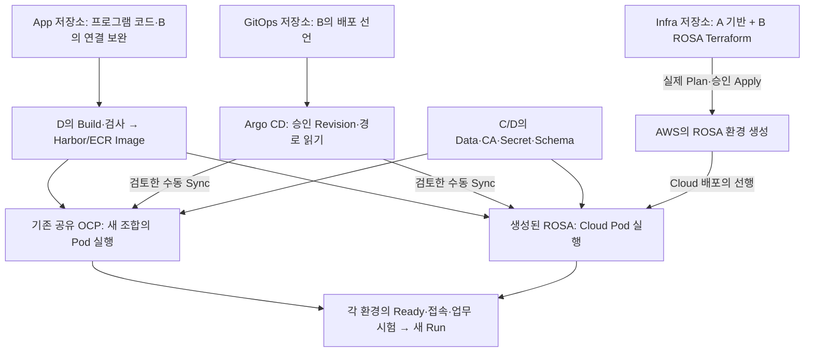

# 정태훈 작업·흐름·학습 안내

**읽는 순서:** [개인 상위 Docs #21](https://github.com/seokpan/seokpan-hybrid-docs/issues/21) → [현재 실행판](TJUNG03_EXECUTION_BOARD.md) → 원 이슈. 첫 안내만 지난 전체 작업을 소개하며 이후에는 **이번 변경·영향·대기·다음 행동**을 설명한다. 완료 체크는 원 이슈를 따른다.

## 1. 지금 무엇을 만드는가

2차 목표는 **정상 서비스는 AWS 안에서 실행하고, Cloud 장애 때는 보존한 자료로 온프레미스에서 복구하는 것**이다. 온프레미스는 CI·이미지·백업 보관도 맡는다. B 정태훈은 App 연결·GitOps 배포 선언·ROSA 구성과 통합을 맡으며 A 이유빈의 기반, C 김상희의 Data/복구, D 최유준의 Image/시험을 연결한다.

- **OCP(OpenShift Container Platform):** 컨테이너를 실행·관리하는 Kubernetes 플랫폼. 현재 공유 실습 환경은 ROSA 이전 사전검증용이다.
- **ROSA:** AWS에서 제공되는 관리형 OpenShift. 정상 서비스의 최종 대상이다.
- **코드 병합:** 팀이 사용할 파일을 Git `main`에 합치는 일. 실제 서버 생성·프로그램 실행은 별도의 실행이다.

공유 OCP의 기존 배포는 [D의 GitOps #5](https://github.com/seokpan/seokpan-hybrid-gitops/issues/5)에 있다. **현재 API 조회는 하지 않았다.** 과거 보고·오늘의 서버 상태·새 hybrid Source/Image 성공은 구분한다. ROSA 코드 병합도 생성 완료가 아니다.

## 2. 저장소의 코드가 실제 프로그램으로 실행되는 경로



그림은 실행 경로이며 오늘 실제 실행을 완료했다는 표시가 아니다. OCP에는 기존 공유 환경을 사용하고, ROSA에는 별도의 생성 단계가 있다.

**Image**는 실행 프로그램/파일 묶음이다. **Manifest**는 Image·실행 수·설정을 적은 YAML, **Render**는 최종 YAML을 만드는 일이다. **Argo CD Sync**가 선언을 클러스터에 적용한다. **Pod**는 컨테이너 실행 단위, **Ready**는 요청을 받을 준비 상태다. 업무 성공은 추가 시험한다.

**Terraform Plan**은 AWS/ROSA 변경 내용을 확인하고 **Apply**는 실제 자원을 변경한다. App Sync와 ROSA 생성은 별개다. Render/PR 작성만으로 서버에 추가되지 않는다.

**Owner**는 관리 책임자, **Secret**은 비밀 설정을 담은 객체, **CA**는 서버 인증서를 검증하는 자료다. **Schema**는 DB 구조, **Migration**은 필요한 구조 변경 절차다. 현재 구조를 확인한 성공만으로 실제 구조 변경까지 검증했다고 판단하지 않는다.

## 3. 실제 Source로 현재 보류 이유 읽기

[GitOps main](https://github.com/seokpan/seokpan-hybrid-gitops/tree/3dc624d4dc9a774a6207708bfd68248101890401)의 다음 구문을 대조했다. 여러 파일의 관련 부분을 발췌한 것이며 그대로 실행하는 명령이 아니다.

```yaml
# apps/base/backend.yaml — frontend.yaml도 같은 보류
replicas: 0
image: seokpan-backend:INPUT_REQUIRED

# clusters/ocp-lab/reuse/application.yaml의 spec.source
targetRevision: GITOPS_REVISION_INPUT_REQUIRED
path: apps/overlays/lab
```

`replicas: 0`은 파일에 적은 원하는 실행 수 0개, `INPUT_REQUIRED`는 승인 입력 미반영이라는 뜻이다. 현재 클러스터의 실제 Pod 수를 조회한 결과는 아니다. `reuse`는 기존 승인 Application 대조용이며 중복 등록하지 않는다. 실제 Owner·Image Digest·Secret/CA·Schema 수락 → 활성화 변경 검토 → 수동 Sync로 진행한다. **파일 존재·Synced·Ready·업무 PASS는 각각 다르다.**

## 4. B의 지난 작업과 아직 하지 않은 실행

아래는 지난 작업의 개요다. 작성·검사 지원은 Codex, 배정 책임은 B이며 실제 팀 서버 수행자를 대신 표시하지 않는다.

| 영역·변경 위치 | 이미 준비·검사한 것 | 연결 담당·아직 남은 것 |
|---|---|---|
| **App** `backend/src/seokpan/connection_settings.py` | DB/Redis·TLS/CA·별도 AUTH 계약, Migration 분리·병합 | C 실제 대상/권한·D Image → 양성/음성·업무 시험 |
| **App** `backend/docs/turn-departure-finalization.md`, [App #4](https://github.com/seokpan/seokpan-hybrid-app/issues/4) | 동시 착수/퇴장·종료·부분 실패 보완과 회귀 검사 | B/C/D 실제 DB/Redis·1→2→3 Pod 전환·업무 수락 |
| **GitOps** `apps/base`, `apps/overlays/{lab,cloud,recovery}`, `clusters/ocp-lab` | 공통/환경별 선언, 입력 보류·수동 배포·Owner/삭제/Migration 경계. #9/#11 병합 | D/C 최소 입력 → OCP 실제 실행. Cloud·Recovery는 각 환경에서 별도 시험 |
| **Infra** `terraform/rosa/{cluster,oidc,bindings}.tf` | ROSA 구성·OIDC issuer 정규화/Trust 조건·단계별 Worker SG 연결, #28 병합 | A/C 실제 출력 → B 실제 Plan·비용·승인 생성 → STS/Pull/Data 통합 |
| **Docs** `tools/recovery_metrics.py`, `evidence/T18` | 시간 계산 도구와 합성 Data/Backend 두 부분 예행 | 실제 운영 Backup·FE/browser/WSS·승인 Image·전체 T18은 미실행. 전체 RTO/RPO 미판정 |
| **Docs** 실행판·Tracker·05·원 이슈 | 역할/인계·TH81·종료 경로·리뷰를 연결 | 원 결과를 먼저 기록하고 최신 연결 유지. Source 병합만으로 미완료 체크를 완료하지 않음 |

근거는 [05 §9](05_IMPLEMENTATION_AND_VALIDATION.md)와 원 이슈/PR에 있다. 과거 SHA·목표·Draft는 당시 이력으로 읽고 현재 실행판을 우선한다.

## 5. 지금 진행하는 두 갈래

| 목적·원본 | B가 지금 준비하는 것 | 누구의 무엇을 기다리며 어디가 막히는가 | 다음 가지 |
|---|---|---|---|
| **OCP 인계** [GitOps #10](https://github.com/seokpan/seokpan-hybrid-gitops/issues/10), `handoff/OCP_FIRST_DEPLOYMENT.md` | Source/Render·입력표·Case 제출, 기존 객체/단일 Owner 대조 | **Sync**: D Image/Digest/Scan/Pull·lab 권한/공유 사용, C/D Data/CA/Secret/Schema 수락 | D #5 배포 → D #6/B/C 시험 → ROSA 조합/차이 인계 |
| **ROSA 병행** [Infra #25](https://github.com/seokpan/seokpan-hybrid-infra/issues/25), `terraform/rosa/INPUT_CONTRACT.md` | 입력 요구·Caller/Backend/목적 권한/지원·Plan/비용/창 준비 | **Plan**: A 필수 기반 출력·C Data SG 2개·B 목적 Caller/Backend/지원·권한 수락. **생성**: 실제 전체 Plan/비용/실행 승인 | 생성 → 실제 Worker SG Binding → Pull/Data/Secret → Window A |

**A 전체 업무·OCP 삭제·완성 Recovery Bundle을 기다리지 않는다.** 두 갈래를 병행하며 입력 수락·실행·결과 수신을 구분한다. 수신 미확인은 자원이 없다고 실측한 뜻이 아니다.

**현재 기준 — 2026-10-06 KST:** [Docs #42](https://github.com/seokpan/seokpan-hybrid-docs/pull/42)는 main `74666daec098974e61e4e58ae84153efd4fbe621`/Tree `2b619092065b3883ac2ade002829bb63005c386f`로 병합됐고 작업 브랜치 삭제를 확인했다. [Docs #45](https://github.com/seokpan/seokpan-hybrid-docs/pull/45)의 C Lock 시험 기록·완료 체크는 최신 main `f3b8e1709612ae836e04b24d7b592e820d71d41c`에서 보존한 뒤 이번 변경을 연결했다. 기존 GitOps #12 main `6ea2d9a90ab7c58803767220abf956d3c1b54a5f`의 39개 Source 검사·진단 Render8·Hash 확인과 **10/13 00:09:31 KST** artifact 만료 기준은 유지한다. 새 실제 Image/lab/Data/Migration 수락·본인 PC/Controller·OCP Sync/ROSA Plan/Apply 결과는 확인되지 않았으며 자원이 없다고 판정한 것이 아니다. [Infra #31](https://github.com/seokpan/seokpan-hybrid-infra/pull/31)은 C가 이전 HEAD `3621335b7bae97bef51d1fb036aa5521554560b0`을 승인한 뒤 비차단 제안인 도구 `MISSING` 후 버전 명령 처리만 같은 PR에서 보완했다. 새 HEAD `4d67d33fca826aeda4db766b56bd5d2fbfad4208`의 [Source CI](https://github.com/seokpan/seokpan-hybrid-infra/actions/runs/37398991364)는 통과했고 [원 답변](https://github.com/seokpan/seokpan-hybrid-infra/pull/31#issuecomment-6007424694)에 적용 범위·실제 실행 한계·병합/삭제 조건을 남겼다. GitHub 규칙 `required_approving_review_count=1`, `dismiss_stale_reviews_on_push=true` 때문에 구 C 승인은 해제됐고 **C 재리뷰 요청 완료·새 HEAD 승인 1개 대기**다. A/D 요청은 유지한다. 현재 내용 보완은 완료지만 `mergeable_state=blocked`이므로 승인/최신 검사·충돌 상태를 확인한 뒤 사용자가 병합하고 그 작업 브랜치를 삭제한다. 새 HEAD 승인·병합·삭제를 완료로 쓰지 않는다. [현재 학습 안내](https://github.com/seokpan/seokpan-hybrid-docs/blob/main/execution/TJUNG03_WORKFLOW_AND_LEARNING_GUIDE.md)·[05 §9.33](05_IMPLEMENTATION_AND_VALIDATION.md#b-latest-team-source-input-cost-followup-20261006)에서 팀 Source/실제 입력/비용을 구분한다. 이전 전체 개요는 충분하므로 현재 실행을 여는 지점만 추가한다.

병합 main [Run 37330480298](https://github.com/seokpan/seokpan-hybrid-gitops/actions/runs/37330480298)의 39개 검사와 실제 Render8 다운로드/Hash·목록 대조를 확인했다. 현재 artifact는 main6ea 개정이며 **10/13 00:09:31 KST**에 만료된다. D/C의 파일 수신/별도 보존·실제 Image/lab/Data/Migration 입력 수락·Runtime의 새 기록은 아직 확인되지 않았다. 실제 클러스터/API를 조회한 자원 부재 판정은 아니다.

<details>
<summary>이전 PR HEAD의 인계·승인·파일 대조 이력</summary>

당시 OCP Source/Render·입력·Case 인계는 [GitOps PR #12](https://github.com/seokpan/seokpan-hybrid-gitops/pull/12)의 [인계 카드](https://github.com/seokpan/seokpan-hybrid-gitops/blob/60bda5a697957506c4b47126ed7c1202b6755470/handoff/OCP_SOURCE_HANDOFF_20261005.md)에 모았다. Source 검사는 승인 Image나 실제 서버 입력을 대신하지 않는다. D/C가 사용할 개정을 읽고 수락했는지는 원 이슈에서 따로 기록한다.

당시 [실제 CI Run](https://github.com/seokpan/seokpan-hybrid-gitops/actions/runs/37326125711)은 정확 HEAD의 39개 검사를 통과했고, 생성된 8개 진단 Render 파일을 내려받아 SHA256·목록·Source 개정을 확인했다. [제출·리뷰 요청 기록](https://github.com/seokpan/seokpan-hybrid-gitops/pull/12#issuecomment-5996770603)의 사람 수신·Image/Data 입력·실제 OCP 실행은 별도 대기다. Run의 Artifacts에서 로그인 후 받을 수 있으며 만료는 **10/12 23:37:14 KST**다.

[D의 당시 승인](https://github.com/seokpan/seokpan-hybrid-gitops/pull/12#pullrequestreview-5416426726)은 인계 문서·CI 보존 범위다. D는 ZIP 직접 다운로드/대조를 하지 않았으며 C 검토·파일 수신/보존·실입력·Runtime 수락은 별도 대기다. [제안 처리](https://github.com/seokpan/seokpan-hybrid-gitops/pull/12#issuecomment-5996985679)에 따라 lab 활성화와 해당 검사 변경은 같은 활성화 PR에서 진행하며, 다른 환경의 보류 검사는 유지한다. 인계서 명령은 별도 Bash 스크립트로 저장해 실행한다. Node 경고는 CI 유지보수에서 공식 요구와 재검증을 확인한다.

</details>

### 5.1 본인 환경에서 지금 확인할 것

**지금 기기는 본인 작업 PC의 Bash 터미널(Git Bash/WSL 등), 위치는 `seokpan-hybrid-gitops` clone이다.** 먼저 상태를 읽고 개인 변경과 사용할 SHA를 기록한다. OCP 관리 명령은 D가 확인한 Context/권한이 있는 관리 기기에서, ROSA Terraform은 승인된 Controller의 Infra clone에서 실행한다. 각 기기가 같을 수도 있지만 Source clone이 있다는 사실만으로 클러스터 접근 권한이 생기지는 않는다.

아래에서 경로를 실제 clone 경로로 바꾼다. `fetch`는 원격 참조를 갱신한다. 기존 작업 파일에 새 main을 반영하는 방식은 개인 변경을 확인한 뒤 정한다.

```bash
B_GITOPS_DIR='/absolute/path/to/seokpan-hybrid-gitops'
git -C "$B_GITOPS_DIR" status --short --branch
git -C "$B_GITOPS_DIR" fetch origin main
git -C "$B_GITOPS_DIR" rev-parse HEAD origin/main
git -C "$B_GITOPS_DIR" diff --stat HEAD origin/main
git -C "$B_GITOPS_DIR" diff --stat
git -C "$B_GITOPS_DIR" diff --cached --stat
```

`rev-parse`의 첫 줄은 본인 HEAD, 둘째 줄은 받아온 main이다. 이번 병합 기준 GitOps main은 `6ea2d9a90ab7c58803767220abf956d3c1b54a5f`다. 두 SHA가 다르면 위 차이와 원 이슈의 최신 개정을 대조한다. 개인 변경은 자동으로 버리거나 덮어쓰지 않고 보존/반영할 것을 나눈다. **Source 환경 확인 결과는 Docs #21의 TH01과 GitOps #10에 `본인 HEAD / main SHA / 개인 변경 유무·보존 방식 / 다음 행동`으로 기록한다.** 실제 상태를 확인하기 전 TH01 전체를 완료 체크하지 않는다.

그다음 `handoff/OCP_SOURCE_HANDOFF_20261005.md`의 입력표를 읽고 D/C 회신에서 **공급 개정·보호 참조·수락/보완**을 연결한다. 단순 승인 댓글과 실제 값 공급은 다르다.

### 5.2 받은 입력은 어디로 들어가는가

아래 경로는 GitOps 기준이며 Infra만 별도 표기한다. **아직 입력이 없는 칸은 그대로 보류한다.** 한 필드를 채웠다는 이유만으로 관련 실행 전체를 허용하지 않는다.

| 받은 입력 | 들어갈 파일·필드 또는 별도 공급 | 관련자·다음 확인 |
|---|---|---|
| FE/BE 승인 Image·전체 Digest/Platform | `apps/overlays/lab/kustomization.yaml`의 `images[].newName`/`digest`; lab 최초 Replica 변경 | D Image/Scan/Pull → B lab 활성화 PR. `newTag: INPUT_REQUIRED` 처리·lab Replica/검사/진단 Guard를 같은 PR에 맞추고 base/Cloud/Recovery 보류는 유지 |
| 기존 Controller·Project/Application·Namespace·Owner | **선택한** Application의 `metadata.namespace`, `spec.project`, `source.targetRevision/path`, `destination.namespace`. `clusters/ocp-lab/reuse/application.yaml`은 기존 객체 대조용 | D/공유 Owner 확인 → B 원본/권한 대조. 같은 App를 관리하는 후보를 중복 등록하지 않음 |
| DB/Redis 대상·Port·DB와 실제 Route Host | `apps/overlays/lab/runtime.env`의 `SEOKPAN_DATABASE_EXPECTED_*`, Redis URL/EXPECTED 값·`SEOKPAN_ALLOWED_ORIGINS`; `routes.yaml`의 같은 Host FE/API/WSS | C 계약 + D 경로 + B 소비. Secret 속 목적 URL·인증서 Host/CA와 일치 확인 |
| Runtime 비밀번호/AUTH·CA | 별도 Owner가 공급하는 `backend-db-runtime`·`backend-redis-runtime` Secret, `backend-database-ca`·`backend-redis-ca` ConfigMap. `apps/base/backend.yaml`은 이 이름/키를 참조 | C/D 보호 공급 → B/D 개정·참조 수락. 비밀값을 YAML/Issue/Render에 넣지 않음 |
| 필요한 Migration action/deadline·목적 자격·Schema 수락 | 별도 `operations/ocp-lab/migration/job.yaml`의 같은 BE Digest·Action·deadline·ConfigMap hash 이름; `backend-db-migration`의 별도 자격 | C 판단/수락 + 지정 실행자. `current=head`는 DDL 성공이 아니며 필요한 단일 실행 결과를 수락한 뒤 App Sync |
| A 기반 출력·C Data SG2·B 지원/비용/창 | **Infra** `terraform/rosa/inputs.tfvars.json.example`을 기준으로 승인 보호 작업 사본의 `foundation.*`, `execution_review.*`, 실제 OpenShift 버전/Worker disk를 채움. Backend도 승인 작업 사본에서 연결 | A 공급 + C 검토 + B 수락 → 실제 Plan. 공개 예제에 실제 입력/자격을 올리지 않음. `worker_sg_binding=null`은 생성 후 실제 Worker SG를 확인해 연결하는 별도 단계 |

**첫 행동은 PC의 Source 상태 확인, 다음은 D/C 입력 개정 수락이다.** 실제 입력이 모이면 활성화 PR/검사를 만들고, 대상·Owner·필요 Schema 수락 후 수동 Sync와 새 Run을 진행한다. ROSA 실제 첫 Plan 입력 준비는 동시에 계속한다.

### 5.3 기존 도구로 실행 승인본을 점검하는 시점

지금 받을 수 있는 진단 파일은 [병합 main Run 37330480298](https://github.com/seokpan/seokpan-hybrid-gitops/actions/runs/37330480298)의 Artifacts에 있다. 별도 폴더에서 `sha256sum -c SHA256SUMS`로 받은 파일을 확인한다. 진단 파일의 0 Replica/미확정 입력/보류 Job은 실행 승인본이 아니다. **현재 점검은 Render8의 Hash/목록 일치와 기존 Migration CLI의 미확정 입력 거부(exit2)이며 Runtime은 미실행이다.**

실제 Image·대상·Data 입력 수락과 활성화 개정 후에는 GitOps Root에서 기존 `make release-manifest ENVIRONMENT=lab`으로 새 별도 출력파일을 만든다. 필요한 Migration이 별도 수락된 경우에만 `make migration-source-check`로 같은 Backend Digest·최종 ConfigMap 이름·DB 대상/CA·목적 자격·C의 action/deadline을 대조한다. 호출 인자와 경계는 [기존 Makefile](https://github.com/seokpan/seokpan-hybrid-gitops/blob/6ea2d9a90ab7c58803767220abf956d3c1b54a5f/Makefile)·[인계 카드](https://github.com/seokpan/seokpan-hybrid-gitops/blob/6ea2d9a90ab7c58803767220abf956d3c1b54a5f/handoff/OCP_SOURCE_HANDOFF_20261005.md)를 따른다. 검사 성공은 실제 Pull/권한·TLS/업무 성공과 다르다.

**이번 공부:** `runtime.env` 내용이 바뀌면 Kustomize가 `backend-config-<hash>`와 Backend의 `envFrom` 참조를 함께 바꾼다. 현재 진단 Render의 이름은 `backend-config-mb7mk6mgt2`다. 활성 상태에서 이 PodTemplate 변경을 승인 Sync하면 새 Pod 실행으로 연결된다. 고정 이름의 외부 Secret/CA를 교체했다고 기존 환경변수·TLS 연결까지 자동 갱신됐다고 판단하지 않고 별도 확인한다. 동작 근거는 [Kustomize의 생성 이름/참조](https://kubernetes.io/docs/tasks/manage-kubernetes-objects/kustomization/)·[ConfigMap 환경변수 갱신](https://kubernetes.io/docs/concepts/configuration/configmap/)을 함께 읽는다.

ROSA의 본인 Source/도구·Lock·보호 입력·Caller/Backend 준비는 [Infra PR #31](https://github.com/seokpan/seokpan-hybrid-infra/pull/31)의 [실행 절차](https://github.com/seokpan/seokpan-hybrid-infra/blob/4d67d33fca826aeda4db766b56bd5d2fbfad4208/terraform/rosa/LOCAL_PREPARATION.md)를 따른다. 지금은 실제 AWS 인증/Plan을 수행한 상태가 아니며 이 준비를 OCP와 병행한다.

### 5.4 이번 변경이 실행을 여는 지점

| 현재 변화·파일 | 동작 원리·B가 소비할 결과 | 직접 다음 행동 |
| --- | --- | --- |
| D [App6](https://github.com/seokpan/seokpan-hybrid-app/pull/6) `Jenkinsfile.image-pipeline`, `scripts/image_registry.py` | 고정 App Commit을 검사·Build해 실행 Image를 Registry에 올리는 절차. 기본 `ENABLE_ECR=false`는 Harbor 경로 | 현재49bf 맨 위 stub `error()` 차단에 대한 기존 A/B 리뷰 후속. helper23 PASS는 실제 Image 아님. 이 Jenkins 경로의 수정/리뷰/병합 후 첫 Run이면 새 main SHA·FE/BE Digest·검사/Pull 수락. 별도 기존 승인 경로의 같은 Source Image 수락도 가능 |
| A [Infra32](https://github.com/seokpan/seokpan-hybrid-infra/pull/32) `terraform/foundation/`의 공통 Provider/Backend/Lock | 같은 foundation 폴더/State에서 Network/Data/Registry를 계산할 실행 기준. `phase2/foundation/terraform.tfstate`와 rosa State는 구분 | 공통 틀 병합과 실제 Backend/Plan/Apply/Output 인계는 별개. A/C 실제 VPC/Subnet/Role/Data SG2를 받아 B 첫 ROSA Plan. C Infra10 probe는 해당 격리 범위 성공 |
| D [Docs43](https://github.com/seokpan/seokpan-hybrid-docs/issues/43) ← B Infra25 | 전체 비용 집계에 ROSA 수량·가동/삭제/재시험 시간과 잔존 범위가 입력됨 | B가 설계 기준 예비 입력 제출 → 실제 Plan/지원·가격/누적 확인 뒤 개정. 이슈 생성·입력 제출·전체 Cost PASS를 구분 |

**Image Digest(이미지 내용 식별값):** 실제 Run의 `commit_sha_full`, `jenkins_build_url`, `components.<frontend/backend>.harbor.final_digest`와 `release_json_images.<frontend/backend>.harbor_digest`를 받으면 정확 Source·Image·검사 개정을 대조한다. Harbor-only에서 ECR Digest `null`은 Cloud Image 승인이 아니다. Health Smoke의 `/health/live`는 기동 확인 범위이고 DB/Redis·TLS/AUTH·Migration·FE/API/WSS 대표 업무는 별도 OCP 시험이다. Pipeline의 `gitops_change: "NONE"`인 동안 Image가 생겨도 GitOps/OCP 선언이 자동으로 바뀌지 않는다.

```yaml
# apps/overlays/lab/kustomization.yaml — 실제 승인 입력을 받은 뒤 연결
images:
  - name: seokpan-backend
    newName: <승인된 Harbor Backend Repository>
    digest: sha256:<승인된 전체 Digest>
```

FE도 같은 방식으로 연결한다. 실제 입력 수락 후 lab 최초 Replica·설정/CA/Secret 참조·필요 Migration 선언과 lab 검사를 같은 활성화 PR에서 맞춘다. 필요한 Migration에는 같은 승인 Backend Digest·최종 ConfigMap Hash·C가 수락한 Action/Deadline·별도 목적 자격을 사용한다. 이 구문은 입력 경로 설명이며 승인 값이 들어간 실행 YAML은 아니다. Cloud/Recovery 보류를 함께 풀지 않는다.

**지금 행동:** 본인 clone/개인 변경 확인 → App6 수정/리뷰와 D 실제 Run 수락 → C 계약+D 공급·단일 Owner의 최소 lab 입력 대조 → B 활성화·수동 Sync·같은 조합 새 Run. 그동안 Infra31의 본인 Tool/Lock·Caller/Backend·A/C 출력/SG2와 D 비용 입력을 준비한다. OCP 삭제·전체 Backup/VPN/Recovery 완료가 첫 Plan의 새 선행조건은 아니다.

## 6. 작업하며 공부하는 고정 형식

이후 작업마다 짧은 카드로 설명한다. 첫 안내의 전체 역사/기본 용어는 반복하지 않는다. 용어는 공식 명칭/한국어 → 실제 동작 원리 → 현재 저장소의 파일/단계로 연결한다. 그림을 쓰면 목적·구성요소·화살표의 주체/행위·동작 순서·선택 이유·프로젝트 위치를 바로 설명한다. 전체 AWS 진도는 별도 학습 공간에서 이어가고 이 안내는 현재 실행을 이해하는 개념만 다룬다. 새 첨부의 10/7·10/8 제안을 새 공식 Gate/마감으로 고정하지 않는다.

| 항목 | 반드시 보여줄 내용 |
|---|---|
| **목적·위치** | 무엇을 풀었는지, 저장소/파일/객체·원 Issue/PR |
| **변경·원리** | 실제 달라진 구문이나 동작, 필요한 용어만 한 문장 정의 |
| **연결·영향** | 관련 A/B/C/D·공유 Owner, 입력 → 내 결과 → 다음 소비 작업 |
| **결과·한계** | Source/Render/로컬 부분/실제 환경을 구분한 근거와 미실행 범위 |
| **대기·다음 행동** | 막힌 실행·최소 입력·공급자·수신 여부, 지금 가능한 일·리뷰 요청 |
| **설명 연습** | “이번 변경은 무엇을 보장하고, 무엇은 실제 환경에서 확인해야 하는가?”에 두 문장으로 답하기 |

작업 카드에는 **실제 수행 기기·Repo/HEAD → 입력 개정 → 바뀌는 파일·필드 → 관련 담당 수락 → 검사/실행 결과·한계 → 다음 행동**도 함께 적는다.

직접 읽을 순서는 **lab Overlay → 기존 Application 대조 → Backend Secret/CA 참조 → Migration 별도 실행 → 수동 Sync → 업무 시험**이다. 비밀값은 Git에 적지 않으며 실행은 D/C/공유 Owner와 조율한다.

## 7. 플랫폼을 끝내는 기준

- **OCP:** 새 조합의 결과·Cloud 차이를 수락하면 사전검증 업무 완료. 자료·인계와 공유 사용 종료 뒤 해당 실습 자원을 정리한다. 공유 클러스터 전체 종료는 별도다.
- **ROSA:** 준비는 지금 병행. 생성은 실행 조건 충족 뒤. Window A 정상 통합 → 중간 보존/정리 → Window B 재생성·정상 Baseline·장애/부하 → 영상/증거 확보 → 최종 삭제·잔존 비용 확인 순서다.
- **Recovery·전체 종료:** A Host·C Backup/Key/새 DB·Redis·D Image·B 복구 선언/업무로 전체 T18(업무 복구 시험)을 별도 검증한다. ROSA 삭제만으로 Recovery·발표·보관 책임까지 끝나지 않는다.

기존 목표는 Window A **10/12~15** → Technical Freeze **10/16** → Window B **10/19~21** → Demo Freeze **10/22** → 발표 준비 **10/23** → 전체 종료 **10/26**이다. 실제 생성/삭제 시각은 미확정이다. 최신 남은 작업·대기는 실행판/Docs #21을 따른다.

동작 원리 확인: [Kubernetes Deployment](https://kubernetes.io/docs/concepts/workloads/controllers/deployment/)는 선언한 Pod 상태를 관리하고, [Argo CD Sync 정책](https://argo-cd.readthedocs.io/en/stable/user-guide/auto_sync/)은 Git의 선언과 클러스터 상태를 맞추는 실행을 설명한다. 이번 프로젝트는 입력 대기 Source의 최초 배포를 수동으로 검토·실행한다.
